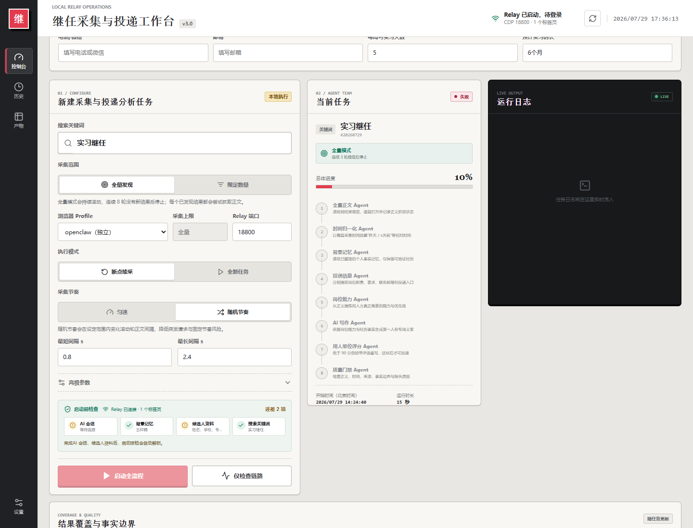
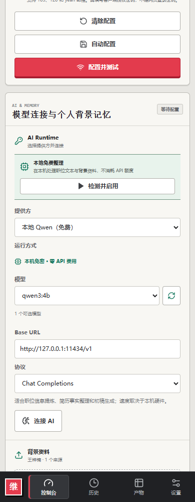
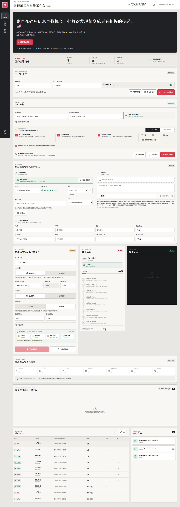

<div align="center">

# 小红书实习岗位 AI 求职助手

<p><strong>把岗位研究、简历匹配和求职信生成，串成一条可复核的投递工作流。</strong></p>

<p>
  <a href="https://github.com/wzn1118/xiaohongshu-relay-scraper-ui/actions/workflows/ci.yml"></a>
  
  
  
</p>

<p>小红书实习岗位采集 · 简历智能导入 · Cover Letter 生成 · Agent 质量评审</p>

</div>

> 这是一个面向实习求职者的 **local-first AI job application workbench**：从小红书公开岗位发现开始，自动整理岗位正文、提炼职责与能力要求、读取候选人简历事实，再生成岗位定制的私信、邮件和 Cover Letter。

**一句话理解：** 不再在岗位卡片、正文、简历和邮件之间反复复制粘贴，而是把“找到岗位”推进到“准备好一份可人工确认的投递材料”。

<p align="center">
  <a href="#产品截图">产品截图</a> ·
  <a href="#核心能力">核心能力</a> ·
  <a href="#工作流">工作流</a> ·
  <a href="#求职信生成">求职信生成</a> ·
  <a href="#快速开始">快速开始</a>
</p>

## 产品截图

下面是本地实际运行的产品界面，展示岗位任务配置、Agent 阶段、质量覆盖率、任务历史和交付物导出。公开展示图已移除候选人个人资料内容。

<table>
  <tr>
    <td width="68%" valign="top">
      <p><strong>桌面端：岗位采集与 Agent 工作台</strong></p>
      
    </td>
    <td width="32%" valign="top">
      <p><strong>移动端：响应式求职工作台</strong></p>
      
    </td>
  </tr>
</table>

<p align="center"><strong>完整任务：从采集状态到质量结果和交付物</strong></p>
<p align="center">
  
</p>

## 这是什么产品

| 传统投递准备 | 这个工作台 | 最终结果 |
| --- | --- | --- |
| 在搜索卡片、正文和收藏夹里来回找岗位信息 | 采集公开岗位并补全正文 | 结构化岗位资料 |
| 同一份简历反复复制、删改和改格式 | 智能导入简历并提取候选人事实 | 可确认的候选人档案 |
| 求职信只是在复述招聘要求 | 用岗位职责匹配简历证据 | 第一人称岗位定制文案 |
| 写完后凭感觉判断是否匹配 | 用独立 Agent 进行质量评审 | 有评分、有证据、有重写记录 |
| 担心工具替自己误投 | 只准备和复制文案，保留人工确认 | 人始终掌握发送权 |

它适合准备 **数据分析实习、产品实习、运营实习、市场实习、内容实习** 等岗位的求职者，也适合希望批量比较岗位、但不想牺牲文案个性化程度的人。

## 核心能力

<table>
  <tr>
    <td width="50%" valign="top">
      <h3>岗位发现</h3>
      <p>通过已登录浏览器和 OpenClaw Browser Relay 采集小红书公开岗位信息，保留岗位来源、采集时间和正文状态。</p>
    </td>
    <td width="50%" valign="top">
      <h3>正文补全</h3>
      <p>从搜索结果卡片进入岗位详情，补齐职责、要求、投递方式和核心能力；未完成正文不会被标记为可投递。</p>
    </td>
  </tr>
  <tr>
    <td width="50%" valign="top">
      <h3>简历智能导入</h3>
      <p>支持 PDF、DOCX、TXT、Markdown、JSON、CSV、RTF 等背景资料，识别信息后回填候选人表单，保留人工核对环节。</p>
    </td>
    <td width="50%" valign="top">
      <h3>候选人档案</h3>
      <p>集中管理姓名、学校、专业、年级、电话 / 微信、邮箱、每周可实习天数和预计实习时长等投递字段。</p>
    </td>
  </tr>
  <tr>
    <td width="50%" valign="top">
      <h3>岗位定制文案</h3>
      <p>针对每条岗位独立生成第一人称私信、邮件和 Cover Letter，不直接复制招聘原文，不把模板套在所有公司上。</p>
    </td>
    <td width="50%" valign="top">
      <h3>质量门禁</h3>
      <p>围绕相关性、证据、表达、可信度和行动就绪度评分；低于阈值时进入重写，并保留评审记录。</p>
    </td>
  </tr>
  <tr>
    <td width="50%" valign="top">
      <h3>任务可追踪</h3>
      <p>任务历史记录采集进度、Agent 阶段、正文覆盖率、质量结果和失败原因，方便复盘一次投递准备到底卡在哪里。</p>
    </td>
    <td width="50%" valign="top">
      <h3>结构化导出</h3>
      <p>输出 JSON、CSV、XLSX、Markdown 报告和 SHA-256 文件清单，既能快速阅读，也方便后续分析和归档。</p>
    </td>
  </tr>
</table>

## 工作流

```text
01 发现岗位
      ↓
02 补全正文与标准化时间
      ↓
03 提炼职责、要求与能力模型
      ↓
04 导入简历，建立候选人证据
      ↓
05 生成私信 / 邮件 / Cover Letter
      ↓
06 用人单位 Agent 评审与质量门禁
      ↓
07 人工确认、复制文案、导出结果
```

### 8 个 Agent 阶段

| 阶段 | 负责什么 | 留下什么证据 |
| --- | --- | --- |
| 正文覆盖 | 检查岗位详情是否补齐 | 正文状态、来源和覆盖率 |
| 时间标准化 | 把相对时间转成可比较日期 | `scraped_at` 与标准日期 |
| 背景记忆 | 读取简历和背景资料 | 明确存在的候选人事实 |
| 岗位信息 | 提炼职责、要求和投递方式 | 结构化岗位字段 |
| 能力模型 | 建立岗位能力与关键词 | 能力标签和匹配依据 |
| 文案写作 | 生成岗位定制投递文案 | 私信、邮件、Cover Letter |
| 用人单位评审 | 模拟招聘方检查匹配度 | 评分、问题和改写建议 |
| 质量门禁 | 判断结果是否达到交付标准 | 通过 / 重写状态和记录 |

## 求职信生成

产品会把岗位、简历事实和候选人可实习信息组合成一封更接近真实投递场景的 Cover Letter。

### 主题格式

```text
应聘{公司}{岗位}｜{姓名}｜每周可实习{天数}天
```

### 正文结构

1. **开头**：说明学校、专业 / 年级和申请岗位。
2. **经历**：只使用简历中存在的实习、项目、工具和业务事实。
3. **匹配**：把岗位职责和候选人的数据分析、产品、运营或市场能力连接起来。
4. **可用性**：明确每周可实习天数、预计持续时间和入职安排。
5. **结尾**：说明已附简历，留下候选人填写并确认过的联系方式。

### 可填写字段

| 基础信息 | 投递信息 |
| --- | --- |
| 姓名、学校、专业、年级 | 每周可实习天数 |
| 电话 / 微信、邮箱 | 预计连续实习时长 |
| 简历、项目和实习经历 | 目标岗位和岗位偏好 |

候选人信息可以手动填写，也可以通过智能导入简历后确认。系统只把简历和背景资料中明确支持的事实带入文案，避免凭空增加成果、数字、公司经历或联系方式。

## 你可以得到什么

### 岗位研究包

- 岗位标题、公司、发布时间 / 采集时间和来源。
- 岗位职责、任职要求、投递方式和核心能力。
- 正文补全状态、安全验证状态和未完成原因。

### 投递准备包

- 候选人信息和简历证据。
- 岗位匹配分析和能力模型。
- 个性化私信、邮件和 Cover Letter。
- 相关性、证据、表达、可信度和行动就绪度评分。

### 可复核产物

```text
data/jobs/<JOB_ID>/artifacts/
├── application_intelligence.json
├── application_intelligence.csv
├── application_intelligence.xlsx
├── workflow-summary.json
├── parallel-body-summary.json
└── artifact-manifest.json
```

## 产品边界与隐私

- 系统只生成、评审和复制文案，**不会自动发送私信、邮件或提交申请**。
- 上传文件、背景记忆、任务数据和个人证据默认写入本地 Git 忽略目录。
- API Key 只保存在服务进程内存中，默认 8 小时过期，不写入任务历史、日志、导出文件或 Git。
- 文案只能使用简历和背景记忆中明确存在的事实，不能把不确定信息写成确定经历。
- 遇到安全验证或采集超时，会保留检查点和失败原因，不把不完整结果标成可投递。

## 快速开始

### 依赖

- Node.js 22+
- Python 3.11+
- Codex CLI 或受支持的 API Key
- 已配置并登录目标网站的 OpenClaw Browser Relay

### Windows 一键启动

从 GitHub [下载 ZIP](https://github.com/wzn1118/xiaohongshu-relay-scraper-ui/archive/refs/heads/master.zip) 并解压，然后双击根目录的 `start-windows.cmd`。

启动器会在首次运行时自动安装依赖、构建应用、创建 `.env`，成功后打开：

```text
http://127.0.0.1:4317
```

后续再次启动会复用已经运行的健康实例，不会重复启动服务。

### Linux / macOS

```bash
git clone https://github.com/wzn1118/xiaohongshu-relay-scraper-ui.git
cd xiaohongshu-relay-scraper-ui
chmod +x start-linux-macos.sh
./start-linux-macos.sh
```

### 只检查环境

```powershell
start-windows.cmd -CheckOnly -NoBrowser
```

```bash
./start-linux-macos.sh --check-only --no-browser
```

输出中的 `ready: true` 表示应用构建、Python 和上游采集脚本均可用。`codexCli` 与 `openClawConfig` 会单独报告，使用 API 模型时 Codex CLI 可缺省。

<details>
<summary><strong>手动安装、配置和验证</strong></summary>

#### Windows 手动安装

```powershell
git clone https://github.com/wzn1118/xiaohongshu-relay-scraper-ui.git
cd xiaohongshu-relay-scraper-ui
powershell -ExecutionPolicy Bypass -File scripts/bootstrap.ps1
powershell -ExecutionPolicy Bypass -File scripts/start.ps1
```

#### Linux / macOS 手动安装

```bash
git clone https://github.com/wzn1118/xiaohongshu-relay-scraper-ui.git
cd xiaohongshu-relay-scraper-ui
sh scripts/bootstrap.sh
sh scripts/start.sh
```

#### 本地配置

从 [`.env.example`](.env.example) 复制 `.env`。常用变量如下：

| 变量 | 默认值 | 用途 |
| --- | --- | --- |
| `HOST` | `127.0.0.1` | 服务监听地址 |
| `PORT` | `4317` | 服务端口 |
| `PYTHON_BIN` | 自动探测 | Python 可执行文件 |
| `XHS_UPSTREAM_RUNNER` | 自动发现 | 上游入口脚本 |
| `XHS_UPSTREAM_SCRAPER` | 自动发现 | 正文采集模块 |
| `XHS_SERVER_DATA_DIR` | `data/jobs` | 私有任务数据 |
| `XHS_PROFILE_DATA_DIR` | `data/profiles` | 私有背景记忆 |
| `OPENCLAW_CONFIG_PATH` | 用户目录自动发现 | 当前 Relay 配置 |
| `XHS_RELAY_CONFIG_PATH` | `data/relay-config.json` | 中转站端口、浏览器 Profile 和开机连接开关 |
| `XHS_AI_TIMEOUT_SECONDS` | `600` | 单次 AI 调用超时秒数 |

上游 `xiaohongshu-relay-scrape` 采集 Skill 可位于 `$CODEX_HOME/skills/xiaohongshu-relay-scrape/scripts/`；若安装在其他目录，在 `.env` 中填写：

```dotenv
XHS_UPSTREAM_RUNNER=/absolute/path/run_xiaohongshu_relay_scrape.py
XHS_UPSTREAM_SCRAPER=/absolute/path/scrape_xiaohongshu_search.py
```

#### 验证命令

```powershell
npm test
python -m unittest discover -s tests -p "test_*.py" -v
npm run build
npm run preflight
```

#### Windows 登录自启动

```powershell
powershell -ExecutionPolicy Bypass -File scripts/register-startup.ps1
powershell -ExecutionPolicy Bypass -File scripts/register-startup.ps1 -Remove
```

</details>

## 项目结构

```text
src/                  React + TypeScript 前端工作台
server/               Node.js API、任务编排和 Relay 连接
scripts/              启动、引导、预检和后台工作流脚本
profiles/             不含个人信息的候选人示例结构
docs/                 架构、产品规格和公开截图
tests/                Python 测试
```

## 许可证与公开数据

本项目用于本地研究和求职准备。采集和处理公开岗位信息时，请遵守目标网站规则、适用法律和个人数据最小化原则；不要上传不应公开的简历、联系方式或其他敏感资料到公共仓库。
