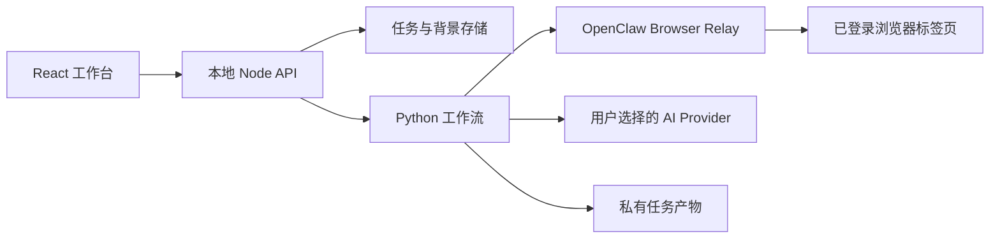
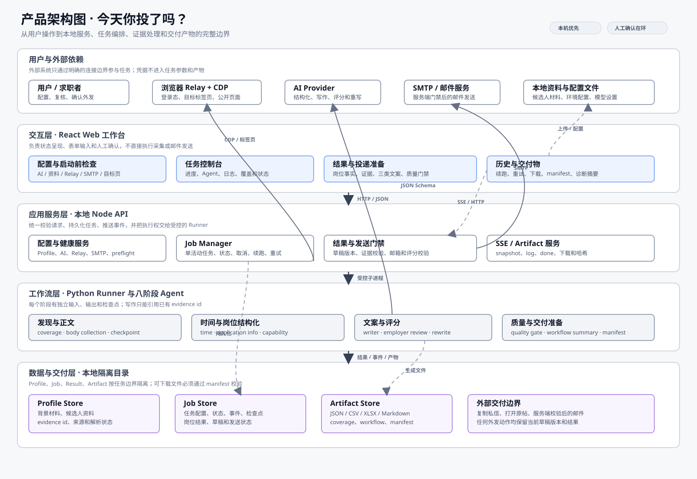
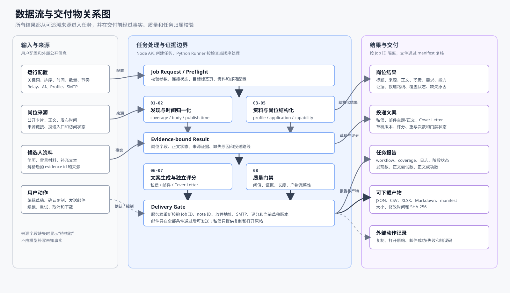
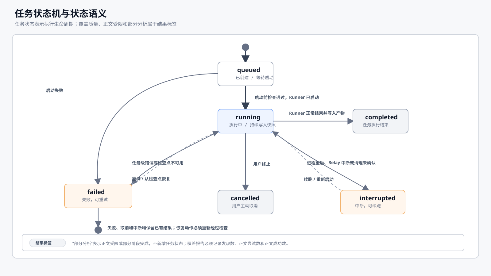

# v3 架构与产品边界

## 运行边界

上图是产品与技术实现共同使用的边界图。React 工作台只负责交互和状态呈现；Node API 是 Job、任务隔离和外部动作门禁的拥有者；Python Runner 负责八阶段业务处理；Profile、Job 和 Artifact 分别落在本地隔离目录。Relay、AI Provider、SMTP 和浏览器标签页都视为可断开的外部依赖。

| 层级 | 责任 | 关键边界 |
| --- | --- | --- |
| React Web 工作台 | 配置、启动前检查、任务控制、结果复核、文案编辑和下载 | 不直接启动 Runner，不直接调用外部页面或 SMTP |
| Node API | 请求校验、Job 生命周期、Runner 管理、SSE、产物访问和发送门禁 | API Key 不进入 Job、日志、历史和产物；状态由服务端迁移 |
| Python Runner/Agent | 发现、正文补全、结构化、事实匹配、文案生成、独立评分和质量检查 | 只引用可验证事实；正文受限时记录原因并保存检查点 |
| 本地数据与产物 | 保存 Profile、Job、结果、事件、草稿、报告和 manifest | 所有读取按 Job ID 和 artifact ID 隔离，禁止路径穿越 |
| 外部依赖 | Relay/CDP、岗位来源、AI Provider、SMTP | 断开、超时和业务层错误必须转成用户可见状态 |

- HTTP 服务默认仅监听 `127.0.0.1`。
- API Key 只保存在 `AiSessionStore` 内存中，不进入任务参数、历史、日志或产物。
- 上传文件及 AI 背景记忆写入 `data/profiles`，任务写入 `data/jobs`；两者均被 Git 忽略。
- 上游采集脚本按 `XHS_UPSTREAM_RUNNER`、项目 `vendor`、`CODEX_HOME` 的顺序发现，不依赖固定盘符。

## 数据流与交付物

| 数据对象 | 入口 | 处理责任 | 交付物/证据 |
| --- | --- | --- | --- |
| `RunConfig` | UI 表单、Relay、AI、SMTP 配置 | Node API 规范化、脱敏、启动前检查 | Job 配置快照、检查项、失败原因 |
| `SourceRecord` | 搜索卡片、正文、来源链接 | coverage/time/application-info agents | note ID、正文状态、岗位事实、覆盖报告 |
| `CandidateProfile` | 简历、背景文件、补充资料 | profile-memory-agent 提取事实 | source file、evidence id、解析状态 |
| `JobEvent/Checkpoint` | Runner 日志、Agent 进度、外部连接状态 | Job Manager 持久化并通过 SSE 推送 | 时间线、最新快照、续跑入口 |
| `Draft` | 岗位事实和候选人事实 | ai-writer、employer-review、quality-gate agents | 三类文案、评分、问题清单、版本记录 |
| `Artifact` | 结果、报告、导出文件 | manifest 生成和 SHA-256 校验 | JSON/CSV/XLSX/Markdown/manifest |

## Job 状态机

Job 状态只允许由服务端 `JobManager` 迁移，并且每次迁移都写入时间、原因、触发来源和进程身份。前端消费 `snapshot`、`status`、`log`、`artifacts`、`done`、`error` 事件，不直接修改枚举。

| 状态 | 进入条件 | 允许动作 | 迁移约束 |
| --- | --- | --- | --- |
| `queued` | 请求通过校验，等待 Runner | 查看、取消、刷新 | 启动失败进入 `failed`，不可伪装为 `running` |
| `running` | Runner 已启动且心跳有效 | 查看日志、终止、刷新 | 正常结束写产物后进入 `completed`；异常进入 `failed` 或 `interrupted` |
| `failed` | 启动失败或任务级错误 | 查看原因、从检查点重试 | 只有 `resumeAvailable` 为真时回到 `running` |
| `interrupted` | 进程重启、Relay 中断或清理未确认 | 清理环境、从检查点续跑 | 续跑前必须重新执行 preflight |
| `completed` | Runner 结束且产物清单可读 | 查看、编辑、下载、准备投递 | 不自动迁移；`partial analysis` 是结果标签 |
| `cancelled` | 用户主动终止 | 查看已有结果、重新创建任务 | 不把取消结果标记为完成，不自动续跑 |

状态机的详细产品需求、用户可见文案和验收用例以 [PRD 第 8.4 节](./PRD.md#84-任务状态机与状态语义) 为准。

## 八阶段工作流

1. `coverage-agent`：无限量发现卡片并逐篇补全正文。
2. `time-agent`：以采集时刻为锚点标准化相对日期。
3. `profile-memory-agent`：从多格式文件中提取有事实依据的个人背景。
4. `application-info-agent`：提炼职责、要求和投递方式。
5. `capability-agent`：把岗位描述转换成有优先级的能力模型。
6. `ai-writer-agent`：按岗位和事实证据生成第一人称专属文案。
7. `employer-review-agent`：独立评分，低于 90 分把问题回传并重写。
8. `quality-gate-agent`：校验正文覆盖、文案阈值和产物清单。

检测到安全验证后，第 1 阶段立即关闭全局访问门：首个触发验证的 worker 负责观察页面，其余 worker 暂停在门外，不再创建新增访问。人工完成验证后访问门统一恢复；持续 10 分钟仍未解除时触发熔断、停止所有新增访问并强制保存检查点，已有完整正文继续进入 2-8 阶段。UI 将“等待人工验证”与“安全限制导致未完成”作为独立状态，并提供打开验证页、检测 Relay 和验证后从检查点续跑的恢复入口。该流程不自动绕过页面验证，也不会在受限状态下循环重试。

## AI 适配

`AIProvider` 统一使用 JSON Schema。本地 Ollama 模型会从 `/models` 自动发现，也可以任意模型 ID 建立会话；OpenAI、DeepSeek、Qwen 与自定义中转站走 OpenAI 兼容 `/chat/completions`；Codex 走本机 `codex exec`，使用临时 schema 和输出文件。所有 Codex 调用都会从 `$CODEX_HOME/config.toml` 转发模型提供方、模型、评审模型、Responses 协议、推理强度、网络、响应存储和 `features.goals` 设置；Provider 凭据通过子进程环境传递，不出现在命令行参数中。

写作与评审相互独立：写作 Agent 只能引用背景记忆中的 evidence id；评审 Agent 按相关性、证据、第一人称、简洁度、可信度和行动就绪度打分。确定性规则会把含元叙述、证据 id 越界、正文复述或长度异常的稿件限制在 89 分以下。

## 可移植性

- `scripts/bootstrap.ps1` / `.sh` 安装锁定依赖、构建并运行测试。
- `scripts/start.ps1` / `.sh` 加载本机 `.env` 后启动。
- `scripts/preflight.mjs` 检查 Python、前端构建、上游入口与正文采集模块。
- GitHub Actions 在 Windows 和 Ubuntu 上执行 Node 测试、Python 测试和前端构建。
