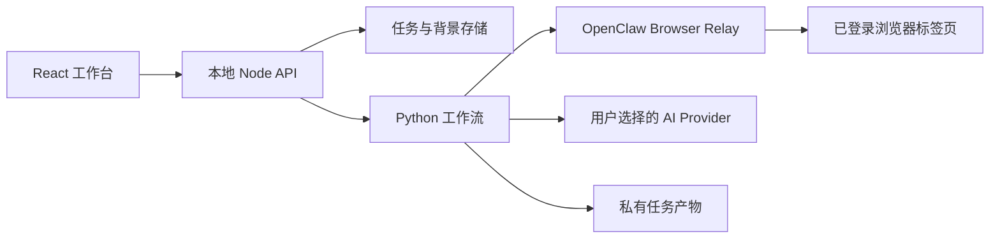

# v3 架构

## 运行边界

- HTTP 服务默认仅监听 `127.0.0.1`。
- API Key 只保存在 `AiSessionStore` 内存中，不进入任务参数、历史、日志或产物。
- 上传文件及 AI 背景记忆写入 `data/profiles`，任务写入 `data/jobs`；两者均被 Git 忽略。
- 上游采集脚本按 `XHS_UPSTREAM_RUNNER`、项目 `vendor`、`CODEX_HOME` 的顺序发现，不依赖固定盘符。

## 八阶段工作流

1. `coverage-agent`：无限量发现卡片并逐篇补全正文。
2. `time-agent`：以采集时刻为锚点标准化相对日期。
3. `profile-memory-agent`：从多格式文件中提取有事实依据的个人背景。
4. `application-info-agent`：提炼职责、要求和投递方式。
5. `capability-agent`：把岗位描述转换成有优先级的能力模型。
6. `ai-writer-agent`：按岗位和事实证据生成第一人称专属文案。
7. `employer-review-agent`：独立评分，低于 90 分把问题回传并重写。
8. `quality-gate-agent`：校验正文覆盖、文案阈值和产物清单。

安全验证持续 10 分钟未解除时，第 1 阶段停止新增访问并保存检查点；已有完整正文继续进入 2-8 阶段。只有已有文案全部达到阈值时，部分分析任务才可正常结束。

## AI 适配

`AIProvider` 统一使用 JSON Schema。OpenAI、DeepSeek、Qwen 与自定义中转站走 OpenAI 兼容 `/chat/completions`；Codex 走本机 `codex exec`，使用临时 schema 和输出文件。Provider 凭据通过子进程环境传递，不出现在命令行参数中。

写作与评审相互独立：写作 Agent 只能引用背景记忆中的 evidence id；评审 Agent 按相关性、证据、第一人称、简洁度、可信度和行动就绪度打分。确定性规则会把含元叙述、证据 id 越界、正文复述或长度异常的稿件限制在 89 分以下。

## 可移植性

- `scripts/bootstrap.ps1` / `.sh` 安装锁定依赖、构建并运行测试。
- `scripts/start.ps1` / `.sh` 加载本机 `.env` 后启动。
- `scripts/preflight.mjs` 检查 Python、前端构建、上游入口与正文采集模块。
- GitHub Actions 在 Windows 和 Ubuntu 上执行 Node 测试、Python 测试和前端构建。
