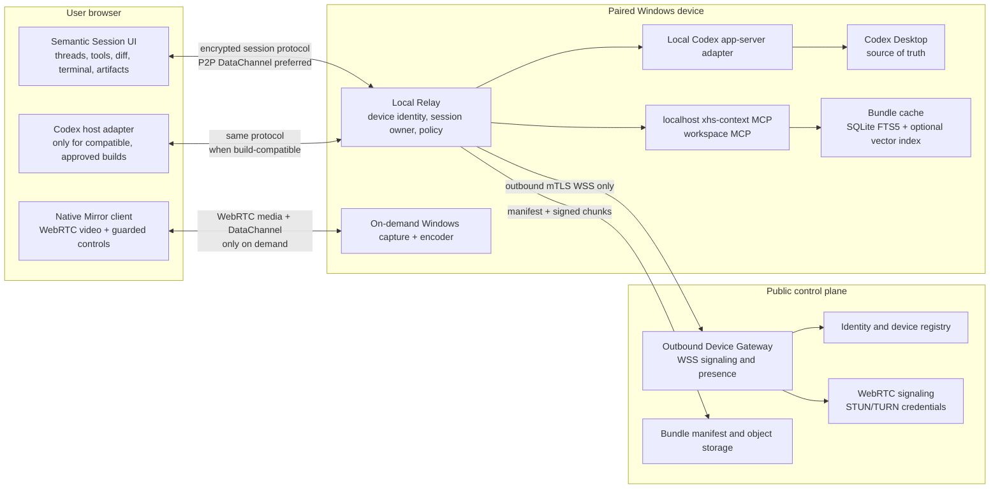

# Codex Local Relay v2

## 中文执行摘要

将原有的“默认远程桌面视频流”调整为“本机执行、语义会话优先、原生窗口镜像按需启用”。Codex Desktop、终端、文件访问和本地 MCP 始终留在用户自己的 Windows 设备；云端只负责账号、设备配对、会话路由、信令、受签名内容包和审计。

1. **默认使用 Semantic Session。** 浏览器直接呈现版本化的会话事件、工具状态、Diff、终端输出和产物，不持续传输窗口视频，因此成本、移动端可用性和可检索性都明显更好。
2. **仅在需要原生 UI 时启用 Native Mirror。** 它通过 WebRTC 显示并控制用户已配对设备上的真实 Codex 窗口，适合原生专属视图、弹窗和逐像素核验；移动端默认只读，开启输入需要明确授权。
3. **将当前浏览器承载原型降为兼容层。** 它必须绑定 Codex 构建版本、能力清单、灰度发布和一键回滚；不把反编译资源或未版本化桥接当成稳定产品契约。
4. **数据同步以轻量、可寻址为先。** 内容包分块、签名、按需拉取，SQLite FTS5 是默认检索层；只有确有语义检索收益时再启用本地向量索引。大媒体不进默认同步路径。
5. **安全边界固定在设备出站连接和短租约。** Relay 主动建立 mTLS 连接，不开放入站端口；控制权采用短时 lease、单写者和撤销机制，原生镜像输入另有策略闸门。

## Decision

Use the user's Windows machine as the execution authority. Do not allocate a persistent cloud Windows VM, GPU, desktop session, or terminal environment per user.

The original Local Relay proposal is directionally correct, but it makes full-window video streaming the default interaction. That preserves native pixels, yet still imposes local GPU work, input-injection complexity, mobile friction, and TURN bandwidth whenever a direct peer connection is unavailable.

The optimized design has two explicit paths:

1. **Semantic Session (default):** the local Relay relays versioned Codex app-server events, tool state, diffs, terminal output, and artifact references to a product-owned browser console. There is no continuous video track.
2. **Native Mirror (on demand):** the browser receives the actual Codex desktop window through WebRTC and controls it through a guarded DataChannel. This is the pixel-perfect path for native-only views, dialogs, or a user who explicitly needs the desktop experience.

The native desktop application remains the source of truth. This distinction matters because OpenAI currently describes Codex as a separate desktop view, not a selectable web or mobile experience. The product must therefore present Native Mirror as remote access to the user's paired desktop, rather than representing it as an official web edition of Codex. See [ChatGPT Work and Codex](https://help.openai.com/en/articles/20001275-chatgpt-work-and-codex).

## Why This Is Better

| Concern | Original video-first Relay | Local Relay v2 |
|---|---|---|
| Normal task traffic | Continuous screen video | Structured requests, events, diffs, terminal chunks, and artifacts |
| TURN exposure | Possible for every remote session | Only Native Mirror uses media TURN; Semantic Session uses a small DataChannel or device tunnel |
| Local hardware requirement | Capture and encode all active sessions | No encoder in default mode; encoder starts only for Native Mirror |
| Mobile experience | Remote desktop gestures and virtual keyboard | Responsive task, diff, approval, and artifact controls; mirror is view-only by default on mobile |
| Accessibility and search | Pixels only | Text, tools, diffs, and output are structured and searchable |
| Codex update risk | Screen path is stable, but no structured integration | Adapter is versioned and capability-gated; mirror remains the compatibility escape hatch |
| Literal native UI | Always | Available when explicitly needed, without paying the cost for every session |

This keeps the key economics of the original design: the user's computer performs Codex execution, local file access, Git, terminal execution, and optional video encoding. The public service retains only control-plane, signaling, bundle, and audit functions.

## Target Topology



### Ownership Boundaries

| Boundary | Owner | Rule |
|---|---|---|
| Codex account, desktop process, terminal, Git, and local files | User device | Never proxy account credentials through the product service. |
| Relay private key, bundle cache, device policy, and control lock | User device | Protect using OS-backed storage and local ACLs. |
| Device identity, session ticket, pairing state, and audit metadata | Public control plane | Store minimal metadata and bounded retention records. |
| WebRTC signaling and TURN allocation | Public control plane | Signal connections only; media and DataChannel payloads remain peer encrypted. |
| Scrape artifacts and bundle manifests | Existing backend/object storage | Publish immutable versions and short-lived download tickets. |

## Interaction Modes

### 1. Same-device use

The user is sitting at the paired Windows machine. The relay starts the desktop app and exposes the Semantic Session through the local browser session. No remote media stream is needed. Native Mirror is unnecessary because the user can switch directly to the desktop app.

### 2. Remote Semantic Session

The user is on another computer, tablet, or phone. The browser opens the product's responsive task UI and attaches to a single paired device. The Relay forwards only the normalized event protocol:

```text
thread lifecycle
turn lifecycle
agent message deltas
tool start/progress/completion
terminal output chunks
diff metadata and file references
approval and user-input requests
artifact manifests and signed download references
```

This is the default remote mode. It should support reading progress, responding to questions, reviewing diffs, accepting or denying approvals, and retrieving artifacts. It should not simulate unrestricted desktop keyboard and mouse input.

### 3. Native Mirror

The user explicitly selects **Open native window**. Only then does the relay start Windows Graphics Capture and a hardware encoder. The browser receives the actual desktop pixels and sends a restricted control DataChannel.

Native Mirror is required for functionality that cannot be represented through the normalized protocol, such as a native setup screen, an app-owned dialog, or a visual workflow whose semantics are not yet covered by the Relay adapter.

Use view-only mode by default on touch devices. Enable remote keyboard and pointer control only after the device owner has granted a control lease.

## Production Protocol

### Device connection

The Relay never listens on a public port. It creates an outbound mutually authenticated WSS connection to the Device Gateway and uses it for presence, signaling, and reconnect control.

```text
Relay boot
  -> load device key from OS-backed store
  -> mTLS WSS /v1/device-tunnel
  -> device.hello { deviceId, relayVersion, codexBuild, adapterVersions, capabilities }
  <- device.accept { heartbeatSeconds, policyRevision }
  -> device.presence { online, codexState, workspaceSummary }
```

The Gateway does not become a general-purpose proxy for local filesystem, terminal, or app-server traffic. It authenticates a remote session, publishes signaling, and routes only session envelopes when direct peer transport cannot be established.

### Browser session ticket

```http
POST /v1/codex/sessions
Content-Type: application/json

{
  "deviceId": "dev_01",
  "mode": "semantic",
  "requestedCapabilities": ["thread.read", "turn.start", "approval.respond"]
}
```

The response contains a one-time session ID, a short-lived connection ticket, a selected adapter version, an ICE configuration, and whether the device requires local confirmation before control is enabled.

Requirements:

- Ticket lifetime: 60 seconds or less.
- One successful peer connection consumes the ticket.
- The ticket binds `userId`, `orgId`, `deviceId`, `sessionId`, requested capabilities, and adapter version.
- A new tab obtains a new ticket. It does not inherit a stale control lease.

### Peer channels

| Channel | Transport | Contents | Backpressure rule |
|---|---|---|---|
| `control` | ordered reliable DataChannel | lease, focus, approval, user-input, clipboard consent | Never drop; reject when lease epoch is stale. |
| `events` | ordered reliable DataChannel | app-server events, tool state, diff metadata | Sequence and resume cursor; compact on reconnect. |
| `terminal` | ordered reliable DataChannel | bounded terminal chunks | Cap retained bytes per session and coalesce high-rate output. |
| `bulk` | reliable DataChannel or signed HTTPS URL | artifact manifests, bundle chunks, screenshots | Prefer signed object-storage downloads above a size threshold. |
| `mirror-video` | WebRTC media track | native Codex pixels | Created only in Native Mirror. |
| `mirror-input` | ordered reliable DataChannel | pointer/keyboard/clipboard commands | Valid only while control lease is held. |

Every non-idempotent message includes `sessionId`, `leaseEpoch`, `requestId`, and monotonically increasing `sequence`. The Relay maintains a bounded ring buffer of events, allowing a reconnecting browser to resume from `afterSequence` instead of recreating a task.

### Versioned app-server adapter

The current browser integration proves that a real Codex renderer and a local `codex.exe app-server` can communicate. Production must isolate that implementation behind an adapter contract:

```text
Codex build fingerprint
  -> capability probe
  -> compatible adapter selected
  -> normalized Relay event protocol
  -> browser Semantic Session
```

The adapter owns all build-specific host shims and request/response transformations. It must never leak arbitrary desktop IPC calls directly to the browser. A Codex update follows this sequence:

1. Relay detects a new build fingerprint.
2. It enters compatibility mode: native desktop remains usable, Semantic Session becomes read-only or unavailable if no adapter is certified.
3. A canary device validates the new adapter against a protocol fixture suite.
4. The adapter is signed, rolled out gradually, and retains a rollback slot for the prior certified build.

Do not make patched minified renderer files the permanent product contract. If a compatible renderer is included, serve only the approved build package and bind it to its matching adapter. If it is not compatible, Native Mirror remains fully functional.

## Context Bundle Optimization

The original design correctly moves scrape context to the user device. Optimize the storage and indexing path before adding vector infrastructure.

```text
Scrape completion
  -> immutable manifest.json
  -> content-addressed chunks (zstd compressed)
  -> private object storage
  -> signed sync ticket
  -> Relay resumable download
  -> local integrity verification
  -> SQLite FTS5 + metadata indexes
  -> localhost xhs-context MCP
```

### Indexing policy

1. Start with SQLite FTS5, structured fields, date ranges, author fields, source IDs, and aggregate tables.
2. Download images and media lazily. Keep only thumbnails or OCR text in the first sync unless the user pins media.
3. Add an optional local vector index only for bundles where lexical retrieval is insufficient. The default must not download a local embedding model or create embeddings for every artifact.
4. Store references as content hashes. A new bundle version downloads only changed chunks.
5. Partition all local data by `orgId/userId/bundleId/version`, then apply an explicit retention quota and eviction policy.

### MCP scope

`xhs-context` must listen only on loopback and require a relay-generated local credential. It exposes read operations by default:

```text
list_bundles
overview
search
open_record
read_artifact
aggregate
cite
```

Workspace operations are a separate capability set. A user must select allowed roots locally; writes, patches, and commands always flow through the same local approval policy used by Codex. The control plane cannot widen filesystem scope.

## Control and Security Model

### Pairing

1. A signed-in browser creates a short-lived pairing intent.
2. The local Relay scans a QR code or receives a one-time code.
3. The Relay displays the account, organization, device name, and requested role locally.
4. The user confirms on the device.
5. The control plane records the public device identity and encrypted capability record, not Codex credentials.

### Control lease

There is one controller per device window:

```text
lease duration: 30 seconds
renew interval: 10 seconds
lease identity: sessionId + browserInstanceId + epoch
release: explicit, inactivity, device lock, relay disconnect, or local revoke
```

The Relay rejects all pointer, keyboard, clipboard, approval, and command messages that do not carry the active lease epoch. A viewer may observe events but cannot send controls.

### Native Mirror input policy

- Capture only the selected Codex window, not the entire desktop.
- Bound pointer coordinates to the captured window and reject synthetic input while the window is not foreground.
- Default clipboard access to disabled. Ask separately for read and write actions and show the affected text size before transfer.
- Disable file drag-and-drop until a separate file-transfer protocol with user-visible confirmation is implemented.
- Keep a local tray action that immediately stops capture, revokes the current lease, and rotates pending session tickets.
- Display a persistent local indicator while remote control is active.

### Data minimization

The service stores device status, session lifecycle metadata, approval decisions, and audit references. Prompt bodies, terminal content, clipboard data, and source bundles are kept on the device or transferred peer-to-peer unless the user explicitly exports them. Audit records should point to immutable local or bundle IDs rather than duplicate raw content.

## Cost Controls

Do not set a monetary target before collecting session telemetry. Use the following engineering budgets and report them by connection mode:

| Metric | Semantic Session target | Native Mirror target |
|---|---:|---:|
| Idle transport | Near-zero heartbeat traffic | Adaptive low frame rate or paused video |
| Routine turn | Structured event burst only | Media only while visible |
| Artifact transfer | Signed chunk download, resumable | Same as Semantic Session |
| TURN use | DataChannel only when direct path fails | 720p / 15fps cap by default, adaptive frame rate |
| Local encoder | Not started | Hardware encoder preferred, software fallback with an explicit warning |

Collect only aggregate operational measurements: direct-vs-TURN ratio, reconnect rate, p50/p95 connection time, event lag, media minutes, bundle cache hit rate, and local Relay CPU/GPU use. Use these measurements to decide regional TURN placement and adapter investment.

## Delivery Sequence

### Phase 0: Harden the current proof of concept

- Keep the existing browser-to-real-Codex integration as a local developer proof of concept.
- Add a runtime build manifest, adapter capability probe, health endpoint, protocol fixture tests, and explicit compatibility state.
- Package the desktop runtime and the Relay separately from the public web server.
- Surface external model-provider failures as task errors with retry state; do not misclassify them as relay transport failures.

### Phase 1: Local Relay and Semantic Session

- Ship a signed Windows Relay installer with tray UI, OS-backed device key storage, auto-update, and startup policy.
- Move `codex.exe app-server`, context caching, and workspace access onto the paired user device.
- Implement device registration, presence, session tickets, control leases, reconnect cursors, and event normalization.
- Build the product-owned remote task console first. It is the low-bandwidth, mobile-capable default.

### Phase 2: Bundle synchronization and local MCP

- Generate content-addressed manifests at scrape completion.
- Implement resumable sync, integrity checks, cache quotas, FTS5 search, and loopback-only `xhs-context` MCP.
- Validate one complete workflow: choose a bundle, search it from Codex, generate a report, and cite source IDs.

### Phase 3: Native Mirror fallback

- Add selected-window capture and WebRTC video only after the protocol path is stable.
- Launch with view-only mode, one desktop controller, no clipboard by default, and local consent on every new remote controller.
- Add TURN media limits, adaptive quality, and session teardown metrics.

### Phase 4: Certified renderer adapter and advanced workspace operations

- Certify browser-host adapters per Codex build when a full compatible renderer is required.
- Enable workspace read tools first, then local approval-gated write, patch, Git, and command capabilities.
- Keep Native Mirror as the fallback for unsupported builds and UI-only flows.

## Acceptance Criteria

### Current implementation status (2026-08-18)

- Implemented: full Codex renderer host, local app-server adapter, one-time 60-second session tickets, per-device 30-second control leases, reconnect cursors and normalized events.
- Implemented: five-minute one-time device pairing, hashed server-side device credentials, Windows DPAPI client storage, revocation, persisted minimal registry/audit metadata, authenticated outbound WebSocket presence and remote Semantic Session routing.
- Implemented: content-addressed local bundles, integrity verification, loopback-only `xhs-context` MCP and local token index.
- Implemented: selected-window browser capture, view-only WebRTC, session teardown and optional time-limited TURN REST credentials.
- Pending native binary: signed installer/tray, Windows Graphics Capture and hardware encoder, foreground-bounded keyboard/pointer injection, clipboard consent channel, auto-update and local emergency revoke indicator.

The controlled beta therefore enables local and remote Semantic Session plus same-device view-only Native Mirror. Remote Native Mirror is intentionally disabled until the pending native binary exists.

The implementation is ready for a controlled beta only when all of the following are true:

- A paired device remains reachable without any public inbound port.
- A browser can reconnect to an active Semantic Session without duplicating a turn or approval.
- A stale tab cannot issue an input after its control lease expires.
- Local Codex account material never appears in the control-plane database, logs, session ticket, browser storage, or support bundle.
- Bundle verification rejects a changed chunk hash and resumes after an interrupted download.
- The local MCP service is unreachable from the LAN and public internet.
- Native Mirror captures only the selected Codex window and stops immediately after local revoke.
- A mismatched Codex build enters explicit compatibility mode instead of silently applying a stale adapter.
- Direct peer, TURN DataChannel, and TURN media modes each have independent metrics and cost caps.

## What Not To Build

- Do not create a permanent cloud VM for every user.
- Do not expose the local Relay, local MCP, Codex app-server, or Windows remote-desktop port to the public internet.
- Do not make screen video the default transport for routine text, tool, diff, and terminal interactions.
- Do not automatically grant remote file-write, shell, clipboard, or full input privileges at pairing time.
- Do not synchronize all media or create a vector index for every bundle by default.
- Do not treat a reverse-engineered renderer shim as an unversioned, forever-stable protocol.

## Recommended Product Position

Describe the feature as **remote access to a user-owned, paired development device**. The local desktop application retains execution authority; the web product coordinates identity, session access, context bundles, and remote presentation. This preserves the core user promise while keeping compute cost proportional to control-plane activity rather than to a fleet of cloud desktops.
