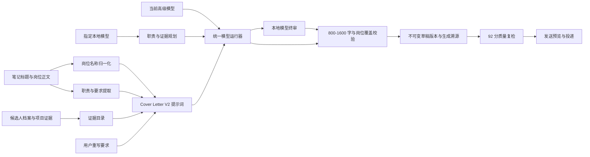

# Cover Letter V2 全量实施方案

## 1. 目标与验收口径

Cover Letter V2 不再把笔记标题直接当作岗位名称，也不再用短模板填充正文。系统必须满足以下硬性标准：

- 从标题和岗位正文中提取真实岗位名称，去除城市、招聘动作、候选人姓名和“招继任”等噪声。
- 每封求职信为对应岗位单独生成，正文包含 800-1600 个非空白字符，目标区间为 900-1200 字。
- 逐项回应主要岗位职责，并把候选人真实经历映射为“证据、行动、结果、岗位价值”。
- 不虚构候选人经历；证据不足时明确写可迁移能力和入职后的补齐方法。
- 每个岗位支持“一键 AI 重写”，允许用户输入本次重写要求。
- 重写请求必须绑定当前高级模型会话或用户指定的本地模型会话，并在结果中记录真实 provider、model、wire API、请求版本、执行策略和证据来源。
- 任何模型失败、长度不达标或版本冲突都不得覆盖当前有效稿件。
- 重写后的稿件必须重新通过 92 分质量门槛，才能进入发送阶段。

## 2. 原问题与根因

### 2.1 标题污染

旧流程直接使用笔记标题作为岗位名，因此 `成都内容运营实习生/剪辑实习生招继任` 会被整段写进主题和正文。根因是缺少独立的岗位名称归一化层。

### 2.2 回退文案主导

旧版在模型输出失败或内容不完整时，会降级为固定段落。固定段落只替换岗位名称，无法体现职责差异，也容易出现 200-300 字的泛化文案。

### 2.3 岗位职责与候选人证据没有建立映射

旧提示词虽然携带部分岗位信息，但没有强制模型逐项覆盖职责，也没有在服务端验证覆盖结果。模型可以输出“我有相关能力”而无需说明哪段经历证明哪项职责。

### 2.4 UI 缺少岗位级重写闭环

用户只能手工编辑文本，无法指定“突出 KOC 协作”“加强剪辑能力”“语气更自然”等要求，也无法确认请求最终发给了哪个模型。

## 3. 已实施架构



核心模块：

- `scripts/job_role_title.py`：岗位名称归一化。
- `scripts/prompts/cover_letter_agent_v4_full_zh.txt`：高级模型使用的附件完整 Prompt，仅压缩空白行，不删减规则。
- `scripts/prompts/cover_letter_agent_v4_zh.txt`：本地 4B 模型使用的语义等价压缩 Prompt，降低上下文负担。
- `scripts/cover_letter_rewriter.py`：按 provider 路由 Prompt，并执行结果解析、长度、事实归属和职责覆盖校验。
- `scripts/rewrite_cover_letter.py`：通过标准输入接收完整请求，并调用指定模型会话。
- `server/lib/cover-letter-rewriter.mjs`：Node 与 Python 模型运行器的边界层。
- `POST /api/jobs/:jobId/draft/rewrite`：岗位级重写、版本检查和持久化接口。
- `src/App.tsx`：岗位旁的 AI 重写交互、要求输入、模型信息和状态反馈。

## 4. 岗位名称归一化

归一化按以下顺序执行：

1. 去除候选人姓名和“应聘”“招聘”“岗位申请”等投递动作词。
2. 去除“招继任”“急招”“招聘中”等招聘状态词。
3. 去除标题开头的城市和无岗位意义的分隔符。
4. 保留斜线连接的复合岗位，不把其中一个岗位错误丢弃。
5. 若标题信息不足，再从职责正文提取岗位线索。

本轮样例归一化结果：

```text
原始标题：成都内容运营实习生/剪辑实习生招继任
岗位名称：内容运营实习生/剪辑实习生
```

## 5. 首次生成策略

首次生成和一键重写使用同一质量契约：

- 正文长度：800-1600 个非空白字符。
- 结构：称呼、申请动机、职责对应、证据展开、入职计划、结尾。
- 职责覆盖：优先处理岗位正文中的前 6 项核心职责。
- 证据选择：从候选人真实档案中选择 2-5 条互补证据。
- 表达要求：第一人称、自然中文、明确岗位名，不写通用空话。
- 真实性：不得编造实习、技能、指标或公司经历。

当首次生成无法调用模型时，确定性生成器也必须满足 800 字和岗位针对性要求；一键重写则采用严格模式，模型失败时直接返回错误并保留旧稿，不生成伪装成 AI 结果的回退文案。

## 6. 一键重写 API

### 请求

```json
{
  "noteId": "NOTE_ID",
  "aiSessionId": "AI_SESSION_ID",
  "instructions": "重点突出 KOC 协作、视频剪辑与数据复盘，语气自然，不要套话。",
  "outreach": {
    "greeting": "...",
    "email_subject": "...",
    "email_body": "...",
    "cover_letter": "当前求职信全文"
  },
  "applicationContext": {
    "channel": "email",
    "contactStage": "first_contact",
    "tone": "natural",
    "resumeAttached": false,
    "coverLetterAttached": false,
    "recipientType": "recruiter"
  },
  "draftId": "DRAFT_ID",
  "baseVersion": 1
}
```

`email_subject` 与 `cover_letter` 是两个独立字段：前者只保存邮件主题，后者只保存求职信正文，正文必须从称呼开始，不能再包含“主题：”或其他标题行。服务端会在写入和读取时兼容旧草稿，自动把历史正文首行标题迁移到 `email_subject`。

### 服务端执行顺序

1. 校验任务、岗位、草稿、版本和 AI 会话。
2. 以请求中实际提交的当前稿件计算输入哈希。
3. 组装岗位标题、正文、职责、要求、候选人证据和用户要求。
4. 将 provider、model、base URL 和 wire API 精确传给模型运行器；本地模式先生成岗位职责与证据规划。
5. 高级模型最多生成 3 次，本地模型至少生成 4 次，逐次反馈具体校验失败原因。
6. 校验长度、岗位名称、第一人称、职责覆盖、证据引用和完整结构。
7. 以新版本持久化，仅更新 Cover Letter，不覆盖邮件和私信内容。
8. 返回真实模型元数据、执行策略、模型调用次数、本地终审分、输入输出哈希、覆盖职责和使用证据。

### 并发与失败保护

- `baseVersion` 与当前版本不一致时返回版本冲突，避免覆盖他人或另一窗口的新稿。
- 运行中发生超时、模型错误、格式错误或长度不足时，旧稿和旧版本保持不变。
- 前端收到不足 800 字的异常响应时再次拦截，不把异常内容写入编辑器。
- 成功重写后质量状态设为 `stale`，发送按钮继续受 90 分门槛约束。

## 7. 生成溯源与持久化

每次成功重写保存以下字段：

- `provider`、`model`、`wireApi`、`promptVersion`。
- `strategy`、`modelCalls`、`reviewScore`，用于证明本地规划、写作和终审确实发生。
- `requestedAt`、`completedAt`、`attempts`。
- `inputHash`、`outputHash`、`requestId`。
- `normalizedRole`、`usedEvidenceIds`、`coveredResponsibilities`。
- 新草稿版本、更新时间和质量状态。

UI 优先显示持久化的 provider/model，因此刷新页面后仍能看到真实生成来源，而不是回退到 `deterministic` 标签。

## 8. 前端交互

每个岗位的 Cover Letter 区域包含：

- `AI 重写求职信` 按钮。
- 可选的“Cover Letter 重写要求”文本框。
- “当前模型 / 本地模型”分段选择，以及已安装本地模型下拉框。
- 当前实际执行的 provider/model 和本地三阶段链路提示。
- `立即重写`、取消、加载和错误状态。
- 非空白字符计数与 800 字达标状态。
- 成功后的版本、模型来源和“需要重新质量检查”提示。
- 原有复制、手工编辑和保存能力。

启动时模型会话恢复采用单次请求保护，避免 React StrictMode 在开发环境中重复提交配置。选择本地模式后，提交前会创建或恢复 `local_qwen` 会话，并把选中的真实模型名随请求发送到后端。

## 9. 本地模型执行链路

本地模型不是确定性回退，而是一等生成路径。当前实现对 `local_qwen` 执行以下闭环：

1. **岗位规划**：本地模型逐项读取岗位职责，只能从候选人事实库选择证据 ID；没有直接证据时，规划为入职后的具体执行方法。
2. **完整成稿**：同一个本地模型接收岗位、候选人证据、当前稿件、用户原始要求和规划结果，生成 800-1600 个非空白字符的岗位专属求职信。
3. **本地终审**：本地模型按岗位专属性、职责覆盖、证据可核验、用户要求和自然表达独立评分；至少 92 分且全部硬条件通过才可保存。
4. **程序硬校验**：服务端独立检查长度、岗位名、第一人称、职责响应句、证据 ID、结构和版本。模型终审不能绕过这些规则。
5. **失败纠正**：任一终审或硬校验失败时，将具体问题和上次完整结果交回同一模型重写；最终仍不达标则保留旧稿。

正常成功路径会产生三次真实本地模型调用，持久化 `strategy=local_plan_write_review`、`modelCalls=3` 和 `reviewScore`；触发质量修订后调用次数会继续累加。自由生成连续失败时，程序会基于本地模型已经选择的证据生成 evidence-locked 正文，再交回同一本地模型终审；该路径记录为 `local_plan_evidence_locked_write_review`，仍不是通用回退文案。

本地请求使用 `http://127.0.0.1:11434/v1`，不需要 API Key；岗位正文、候选人材料和用户要求留在本机模型运行时内。

## 10. 上线与存量迁移

### 已完成

- 新生成任务默认使用岗位名称归一化和 800 字质量契约。
- 所有已有岗位可在详情页逐条点击 AI 重写，生成新草稿版本。
- 重写前后版本、模型和质量状态可追踪。

### 正式上线步骤

1. 在预发布环境配置高级模型并执行连接测试。
2. 用 20 个不同岗位做抽样，覆盖运营、产品、数据、内容、剪辑等类型。
3. 检查岗位名准确率、职责覆盖率、事实准确率和 800 字达标率。
4. 将本轮接口与 UI 自动化测试纳入 CI。
5. 先向内部用户开放一键重写，再逐步把存量岗位批量加入重写队列。
6. 批量迁移必须创建新版本，不原地覆写历史草稿；失败项单独进入重试队列。

当前实现没有自动批量改写所有历史记录。现有记录可逐条重写；若要批量迁移，应另建可暂停、可重试、可审计的后台任务。

## 11. 验收矩阵

| 场景 | 预期结果 |
| --- | --- |
| 标题包含城市、招聘词和候选人名 | 只保留真实岗位名称 |
| 复合岗位标题 | 保留完整复合岗位 |
| 模型输出少于 800 字 | 请求失败，旧稿不变 |
| 用户填写自定义要求 | 要求原样进入高级模型请求 |
| 选择已安装本地模型 | 创建真实 `local_qwen` 会话，按规划、成稿、终审三阶段执行 |
| 本地终审低于 92 分 | 带具体问题再次重写；最终失败时旧稿不变 |
| 本地模式刷新页面 | provider/model、执行策略、调用次数和终审分仍可追踪 |
| 模型会话不可用 | 显示明确错误，不生成回退文案 |
| 两个窗口同时重写 | 后提交的旧版本请求被冲突保护拦截 |
| 重写成功后刷新 | 新版本、真实 provider/model 和正文仍存在 |
| 重写成功但未复检 | 质量状态为 stale，禁止直接发送 |
| 移动端展开重写表单 | 控件不重叠，按钮和长文本不溢出 |

## 12. 本轮真实验证

### 12.1 外部模型基线

隔离验收环境：

- 页面：`http://127.0.0.1:5189/`
- API：`http://127.0.0.1:4329/`
- 任务 ID：`20260805000000-c0ffee12`
- 笔记 ID：`6a7020c00000000005033be5`
- 模型：`relay / gpt-5.6-sol`
- wire API：`chat_completions`
- 提示词版本：`cover-letter-rewrite-v1`
- 原始草稿：465 个非空白字符，版本 1
- 重写结果：1188 个非空白字符，版本 2
- 职责覆盖数：6
- 使用证据：`exp_2026_ast`、`exp_2023_jhdf`
- 输出哈希：`ed0933c472c54c140e01f68c7265250149b8b20f3d7420e31a379b9e838c1f97`
- 重写后质量状态：`stale`，必须重新通过 90 分门槛

证据文件：

- `.runtime/cover-letter-v2-live/live-verification.json`
- `.runtime/cover-letter-v2-live/rewrite-response.json`

这组数据证明高级模型真实接收了岗位上下文、候选人证据、当前稿件和用户要求，并返回了通过长度与覆盖校验的新版本；它不代表全部历史岗位已经批量迁移。

### 12.2 本地模型实时验收

使用本机已安装的 `qwen3.5:4b`，直接运行与 API 相同的 `scripts/cover_letter_rewriter.py` 生产核心，输入内容运营岗位、根级岗位职责、候选人事实库、旧稿和用户重写要求。结果如下：

- provider / model：`local_qwen / qwen3.5:4b`
- wire API：`chat_completions`
- 执行策略：`local_plan_evidence_locked_write_review`
- 真实模型调用：6 次，包含岗位证据规划、4 次受约束成稿和独立终审
- 最终正文：1020 个非空白字符
- 职责覆盖：4 / 4
- 使用简历证据：5 条，其中 4 条工作经历、1 条教育经历
- 本地终审：94 分，禁句 0，质量状态通过
- 提示词版本：`cover-letter-rewrite-v4-signature-evidence`
- profileSnapshotId：`663705390b338bdcb1da341ab0ad1d5dcc1b7c6a3081e219f9524446ac3fc136`
- 结果边界：程序事实门禁和本地模型终审同时通过；终审不能替代事实校验

本地真实模型运行证据：`.runtime/cover-letter-v2-live/prompt-v4-local-verification.json`。该记录验证生产重写核心的真实模型执行；浏览器选择本地会话、API 请求和持久化字段另由 Cover Letter Playwright 与 API 自动化测试覆盖，二者不混作同一类证据。

### 12.3 附件完整 Prompt 高级模型现场验收

使用同一份真实候选人档案快照和岗位职责，走高级模型直连重写路径，结果已保存为可复核的 JSON 与纯文本：

- provider / model：`relay / gpt-5.6-sol`
- 执行策略：`direct_model_rewrite`
- 正文长度：`978` 个非空白字符，位于 900-1200 目标区间
- 生成次数：`3`，前两轮错误进入真实校验反馈，第三轮通过
- 简历证据：`4` 条，覆盖基金会用户研究与直播、非遗 KOL 社群、字节跳动社区、网易有道直播运营
- 岗位职责映射：`4 / 4`，每项都有正文原句和对应证据 ID
- 防御性或对照式禁句：`0`
- prompt 版本：`cover-letter-rewrite-v4-signature-evidence`
- 实际 Prompt：`scripts/prompts/cover_letter_agent_v4_full_zh.txt`
- profileSnapshotId：`663705390b338bdcb1da341ab0ad1d5dcc1b7c6a3081e219f9524446ac3fc136`
- JSON：`.runtime/cover-letter-v2-live/prompt-v4-advanced-verification.json`

该验收证明附件 Prompt、岗位上下文、用户要求、完整候选人简历快照和上传简历元数据都进入了高级模型请求，并在返回结果中被逐条回指；首轮失败稿没有被保存，第二轮合格稿也没有使用无上下文回退文案。
