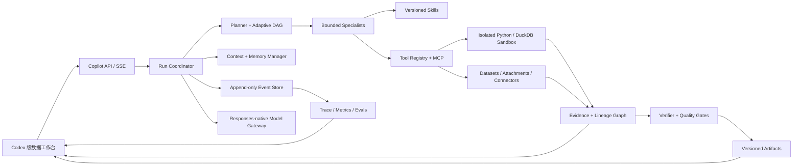

# Data Copilot 能力全量升级补充方案

- **副标题**：从“可用数据工作台”升级为“Codex 级、可验证、可恢复的数据智能体”
- **版本**：v2.0 Supplement
- **日期**：2026-08-04
- **状态**：可执行方案，待按阶段实施
- **关系**：本文件是 `DATA_COPILOT_UPGRADE_PLAN.md` 的增量方案，不重复已经落地的 UI、事件协议、持久化和基础分析能力。

---

## 0. 结论先行

Data Copilot 当前已经越过“聊天框 + 字符串输出”阶段，具备三种工作模式、Answer AST、类型化事件、可回放日志、对话/运行持久化、审批、快照、制品校验、基础任务图、只读分析工具和 30 条确定性 Golden Tasks。下一阶段的主要问题不是再堆一层界面，而是把现有的“轻量能力骨架”升级为真正可长期运行的智能体系统。

本补充方案将目标收敛为一条完整执行闭环：

> 用户目标 -> 可审阅计划 -> 受控上下文 -> 有界工具/专家执行 -> 证据与血缘 -> 可复现制品 -> 自动验证 -> 持久化恢复 -> 质量回归

完整升级分为 15 个能力域，按 `P0/P1/P2/P3` 推进。建议总投入为 **48-60 工程人日**；日历周期取决于并行人数，任何阶段都必须满足发布闸门后才能进入下一阶段。

### 本轮补充的核心变化

1. 将模型网关升级为 Responses-native、有状态、可后台恢复的运行时。
2. 将固定任务图升级为可重规划、可暂停、可节点恢复的执行引擎。
3. 将字符近似和关键词排序升级为真实 token 预算、压缩和分层上下文。
4. 增加会话、项目、用户三层可控记忆，并提供查看、删除、导出和过期机制。
5. 将静态技能和专家清单升级为版本化技能包和真实的专家任务执行。
6. 将内存行运算升级为隔离的 Python/DuckDB 数据沙箱。
7. 将“引用 ID 存在”升级为行级证据、计算血缘、矛盾检测和结论置信度。
8. 将 30 条工具单测型 Golden Tasks 扩展为覆盖端到端行为的质量闭环。
9. 将 SQLite/WAL 基线补齐为可观测、可备份、可恢复、可压测的运行体系。
10. 将现有工作台补齐计划、活动、证据、制品、比较、恢复和质量中心。

---

## 1. 方案边界与设计原则

### 1.1 本方案覆盖

- 模型运行时、会话状态、流式事件和后台任务。
- 计划生成、任务图执行、重试、修复、暂停、恢复和取消。
- 上下文选择、token 计量、压缩、来源锁定和长期记忆。
- 数据工具、隔离计算、技能、专家和连接器。
- 证据图、数据血缘、答案验证和可复现制品。
- 评测、追踪、成本、性能、可靠性、安全与审计。
- 支撑上述能力的前端交互、API、数据模型和迁移。

### 1.2 本方案不做

- 不把完整 Codex CLI 或宿主机 shell 直接嵌入 Data Copilot。
- 不向界面暴露原始隐藏推理；只展示计划、简短进展、工具结果和证据。
- 不默认允许外部写操作、消息发送或任意网络访问。
- 不把 HTTP 200、非空文本或模型“自称完成”当作任务完成。
- 不以更大的提示词代替状态、工具、证据、评测和恢复机制。
- 不在缺少基准数据时承诺固定模型成本或固定外部 API 延迟。

### 1.3 架构原则

1. **事件日志是运行事实源**：UI、SSE 和恢复逻辑都是事件日志的投影。
2. **模型上下文与 UI 对话分离**：界面可保留完整历史，模型只接收受预算控制的工作集。
3. **读操作默认自动，写操作显式授权**：审批必须描述动作、范围、数据和有效期。
4. **任务输出必须可验证**：重要结论绑定证据、计算和制品，而不是只绑定自然语言。
5. **能力按需加载**：工具、技能、数据源和专家不应全部进入每个请求。
6. **每个副作用幂等**：重连、重试和服务重启不得重复写入或重复发送。
7. **升级可回滚**：所有新能力由 feature flag 控制，数据库迁移可前向兼容。

---

## 2. 当前基线与差距审计

以下结论来自 2026-08-04 对当前代码的核对，不等同于主方案中的目标描述。

### 2.1 已落地基线

| 能力 | 当前证据 | 结论 |
|---|---|---|
| Answer AST | `server/copilot/answer-ast.mjs`、`src/copilot/answer-ast.ts` | 已有结构化输出协议 |
| 类型化事件与回放 | `server/copilot/event-log.mjs` | 已有序号、幂等键、游标回放和缺口检测 |
| 对话/运行持久化 | `server/copilot/conversation-repository.mjs`、`server/data-copilot-store.mjs` | 已有对话、消息、运行状态和重启发现 |
| 生产状态库 | `server/copilot/production-store.mjs` | 已有 SQLite/WAL、快照、追踪、用量、评测、outbox、lease |
| 基础任务图 | `server/copilot/orchestrator.mjs` | 已有 DAG、并发、预算、超时、幂等缓存和输出合同 |
| 基础上下文 | `server/copilot/context-manager.mjs` | 已有工作集预算与排序，但仍是字符近似和关键词命中 |
| 基础数据工具 | `server/copilot/sandbox.mjs` | 已有 profile、聚合、有限 SQL、相关性、图表和报告结构 |
| 审批 | `server/copilot-approval-store.mjs`、服务确认接口 | 已有审批状态与继续运行路径 |
| 证据与验证 | `server/copilot/evidence-graph.mjs`、`verifier.mjs` | 已有 claim/source 容器和引用存在性检查 |
| 模型网关 | `server/copilot/model-gateway.mjs` | 已支持 Responses/Chat Completions 基础调用和流式归一化 |
| 技能与专家 | `server/copilot/skills.mjs`、`specialists.mjs` | 已有静态注册表和路由定义 |
| 制品 | `server/copilot-artifact-service.mjs` | 已有 JSON/CSV/Markdown/XLSX 生成、哈希和验证 |
| 质量 | `server/copilot/evaluation-suite.mjs` | 已有 30 条确定性工具任务和持久化评测结果 |
| 工作台 | `src/DataCopilotPanel.tsx`、`DataCopilotContextBrowser.tsx`、`QualityPanel.tsx` | 已有三模式、上下文浏览、富输出和质量面板基础 |

### 2.2 能力成熟度矩阵

评分标准：`0` 不存在，`1` 静态骨架，`2` 单机可用，`3` 可恢复并有测试，`4` 生产级，`5` 可扩展且具备持续优化闭环。

| 能力域 | 当前 | 目标 | 主要缺口 |
|---|---:|---:|---|
| 会话与事件运行时 | 3.0 | 4.5 | 原生模型状态、事件版本演进、后台恢复、长日志压缩 |
| 模型网关 | 2.0 | 4.0 | 能力协商、路由、降级、Responses 状态、后台任务、错误分类 |
| 编排与恢复 | 2.5 | 4.5 | 动态重规划、节点 checkpoint、修复回路、持久化队列 |
| 上下文工程 | 1.5 | 4.5 | 真实 token、工具 schema 预算、压缩、来源锁定、冲突处理 |
| 长期记忆 | 1.0 | 4.0 | 显式记忆模型、权限、TTL、删除/导出、污染防护 |
| 数据沙箱 | 2.0 | 4.5 | Python/DuckDB 隔离、配额、环境快照、文件血缘 |
| 技能系统 | 1.0 | 4.0 | SKILL.md、版本、按需加载、依赖、兼容和技能测试 |
| 专家协作 | 1.0 | 4.0 | 真实子任务执行、上下文隔离、并发上限、冲突聚合 |
| 证据与验证 | 1.5 | 4.5 | 行级证据、计算链、矛盾、时效、覆盖率、数值复算 |
| 制品系统 | 3.0 | 4.5 | 修订图、可复现包、预览、差异、重建和签名策略 |
| 评测与质量 | 2.0 | 4.5 | 端到端数据集、轨迹评分、人工量表、影子评测、门禁 |
| 可靠性与观测 | 2.5 | 4.5 | SLO、指标、备份恢复、保留策略、故障注入和容量基线 |
| 安全与治理 | 2.5 | 4.5 | 数据分类、脱敏、连接器授权、租户隔离和策略引擎 |
| 前端工作台 | 3.0 | 4.5 | 计划/活动/证据/制品联动、比较重跑、后台任务中心 |
| 生态与连接器 | 1.5 | 4.0 | MCP 注册、OAuth scope、工具搜索、出站预览和健康检查 |

### 2.3 根因判断

当前系统的问题不是“没有功能名”，而是以下能力仍停留在薄实现：

- `ContextManager` 用序列化字符数除以 3.5 估算 token，并用字符串包含关系排序。
- `SkillRegistry` 只保存四个内置对象，没有磁盘发现、版本和按需指令加载。
- `SpecialistRouter` 只返回专家描述，没有真正隔离执行、并发管理和汇总合同。
- `EvidenceGraph` 只存 claim/source，`verifyAnswer` 主要验证引用 ID 是否存在。
- `ModelGateway` 只转发基础输入，没有保存 `previous_response_id`、背景状态或能力边界。
- Golden 30 主要验证内存工具函数，没有覆盖模型行为、恢复、证据质量、审批和 UI 工作流。
- SQLite 已有 WAL、outbox 和 lease，但还没有完整 worker、保留、备份恢复与运行指标闭环。

---

## 3. 目标架构



### 3.1 北极星运行合同

每个运行必须持久化以下不可缺失的合同：

```json
{
  "goal": "用户希望完成的业务结果",
  "mode": "ask | analyze | build",
  "inputScope": ["snapshot/job/attachment/source refs"],
  "acceptanceCriteria": ["可机器验证的完成条件"],
  "allowedCapabilities": ["model/tool/skill/connector refs"],
  "evidencePolicy": "none | cited | calculated | strict",
  "permissionMode": "read_only | workspace_build | external_action",
  "budgets": {
    "contextTokens": 0,
    "toolCalls": 0,
    "wallTimeMs": 0,
    "artifactBytes": 0
  },
  "resumePolicy": "node_checkpoint",
  "outputContract": "Answer AST + evidence + artifacts + verification"
}
```

### 3.2 状态分层

- **Conversation**：用户可见任务容器和长期历史。
- **Turn**：一次用户输入及其最终响应。
- **Run**：一次可执行尝试，可暂停、取消、失败、恢复。
- **Plan Revision**：计划的每次生成或重规划版本。
- **Node Attempt**：任务节点的一次执行尝试及 checkpoint。
- **Event**：状态变化的追加事实，不覆盖历史。
- **Artifact Revision**：制品版本及其输入、代码、环境、哈希。

---

## 4. 15 个能力域的完整升级

### A. Responses-native 模型运行时

**建设项**

- 为 provider 建立能力注册：上下文上限、输入模态、工具类型、结构化输出、background、reasoning summary、streaming。
- 保存 provider/model/response ID/previous response ID/status/cursor，不再只保存最后文本。
- 支持同步流式与后台运行两种路径；长任务由 worker 拉取并持续投递类型化事件。
- 将 provider 错误拆成认证、限流、上下文超限、模型不可用、暂时性网络、合同不匹配和不可重试错误。
- 提供按任务模式、数据敏感度、延迟预算和质量档位的路由策略。
- 仅在明确、可观测的暂时性失败上自动降级；降级事件必须显示实际模型和原因。
- 对不支持的参数做能力前置校验，不把 provider 的 400 留到运行中段。

**验收**

- 同一 turn 在刷新、断网和服务重启后可由 response/run ID 继续，不重复创建运行。
- background 运行能从 `queued/in_progress` 进入唯一终态。
- 100% 模型调用产生 provider、model、latency、usage、status 和 trace 记录。
- provider 不支持某能力时，预检返回结构化说明或选择已声明的降级路径。

### B. 自适应计划与运行编排

**建设项**

- Planner 输出目标、节点、依赖、输入范围、允许工具、输出合同、证据要求和预计预算。
- 计划在执行前可审阅；只读低风险运行可自动开始，写入和外部动作等待审批。
- 节点状态扩展为 `pending/ready/running/blocked/paused/completed/failed/skipped/cancelled`。
- 每个节点完成后持久化输出引用和 checkpoint，再解锁下游节点。
- 失败分类后选择重试、缩小输入、替换工具、重规划或终止，最多执行配置化修复次数。
- 仅并行执行无共享可变状态的节点；写节点强制串行或使用显式资源锁。
- 支持运行中 steer：新用户指令生成新的计划修订，不篡改旧事件。

**验收**

- 任一节点后强制杀进程，重启后从最后 checkpoint 恢复。
- 并行读节点不改变最终结果的确定性顺序和制品哈希。
- 重规划保留前后计划 diff、原因和已复用节点。
- 取消在 2 秒内传播到本地节点；不可取消的外部调用被标记为 draining。

### C. Token-aware 上下文工程

**建设项**

- 使用与模型匹配的 token 计数；预算包括系统指令、消息、数据片段、工具 schema、技能和预留输出。
- 先分区再排序：固定约束、当前目标、最近 turns、来源片段、工具、长期记忆。
- 排序从关键词包含升级为字段过滤 + BM25/向量召回 + recency + priority + source quality 的混合策略。
- 支持 pin/unpin；被锁定来源不可被普通压缩静默丢弃。
- 达到阈值时生成结构化压缩项：事实、决策、开放问题、约束、来源引用和失效条件。
- 上下文不足时显式返回 missing context，而不是用模型猜测。
- 前端提供 context meter，展示总预算、各分区占用、被省略项和压缩历史。

**验收**

- 预算误差相对 provider 计量不超过 5%，超限请求在调用前被阻止或压缩。
- 50 轮对话后，已确认约束和锁定来源仍可被回溯。
- 工具目录扩大到 500 项时，单次请求只加载路由命中的 schema。
- 压缩后的关键事实、决策和引用在标准回归集中保持 100% 覆盖。

### D. 可控分层记忆

**建设项**

- **Turn memory**：本轮临时中间状态，运行完成后按策略清理。
- **Session memory**：任务内事实、决策、开放问题和偏好。
- **Project memory**：数据口径、字段语义、常用分析流程和已验证约束。
- **User preference memory**：只保存明确允许的稳定偏好，不保存密钥或敏感原始数据。
- 记忆先以 `proposed` 状态生成，经规则或用户确认后 `committed`。
- 每条记忆包含来源、置信度、作用域、TTL、版本、替代关系和访问策略。
- 提供查看、编辑、遗忘、批量清空、导出和禁用记忆接口。
- 召回前做作用域、时效、冲突和权限过滤，避免跨项目污染。

**验收**

- 删除记忆后，新运行不可召回该记录，审计中保留不可还原的删除事件。
- 冲突记忆不自动覆盖，必须产生 supersedes 关系或请求澄清。
- 任何运行都能列出实际使用过的记忆 ID。
- 未启用项目记忆时，项目数据不得进入用户级记忆。

### E. 版本化技能系统

**建设项**

- 每个技能使用目录包：`SKILL.md`、`manifest.json`、可选 `scripts/`、`examples/`、`tests/`。
- manifest 包含 ID、semver、描述、输入/输出 schema、允许工具、权限、兼容版本和校验和。
- 启动时只加载技能名和简述，路由命中后再读取完整说明，控制上下文污染。
- 支持 workspace、project、built-in 三层发现和覆盖规则。
- 技能升级保留锁定版本；进行中的 run 不自动切换技能版本。
- 技能脚本进入同一沙箱和权限模型，不能绕过工具审计。
- 每个生产技能至少有一条 happy path、一条边界和一条拒绝越权测试。

**首批领域技能**

- `audience-analysis`
- `job-comparison`
- `content-quality`
- `collection-diagnostics`
- `artifact-reporting`
- `evidence-audit`

**验收**

- 100 个已安装技能不导致每轮加载全部正文。
- 技能版本、输入、输出、脚本哈希可在制品 manifest 中追溯。
- 禁用或不兼容技能不会进入 planner 的候选集。

### F. 有界专家协作

**建设项**

- Manager 持有最终目标和答案；专家作为有输出合同的工具，而不是共享整个对话。
- 初始专家：Data Analyst、Content Analyst、Researcher、Builder、Critic/Verifier。
- 每个专家只接收任务合同、必要数据切片、允许工具和预算。
- 读密集型独立任务可并行；写制品、修改共享状态和外部动作不并行。
- 专家只返回结构化摘要、证据、未解决问题和产物引用，不返回冗长原始日志。
- 汇总器检测专家结论冲突，并交由 verifier 复算或标注分歧。
- 并发数、总 token、总工具调用和最长运行时间受根运行预算限制。

**验收**

- 主上下文不包含专家的完整中间日志。
- 专家失败可单独重试，不重跑已完成的独立专家。
- 并发与串行模式对相同确定性数据产生等价最终数值。
- 每个专家结论可追溯到 expert run ID 和证据集。

### G. 隔离 Python/DuckDB 数据沙箱

**建设项**

- 每个 run 创建独立工作目录和数据库，挂载只读输入快照与可写输出目录。
- Python 用于统计、清洗、图表和文件转换；DuckDB 用于大表查询、join 和聚合。
- 限制 CPU、内存、运行时间、文件数、总字节、网络和子进程。
- 默认无网络；特定连接器只能通过代理工具调用，不能由脚本任意出站。
- 记录脚本、SQL、依赖锁、环境版本、输入/输出哈希和标准错误摘要。
- 运行结束后冻结可复现 manifest，临时环境按 TTL 清理。
- 对 CSV/XLSX/JSONL/Parquet 做 schema 推断、编码、公式和恶意内容预检。

**验收**

- 沙箱脚本无法读取 workspace 之外未授权路径。
- 超时、内存和磁盘超限产生明确终态与可诊断事件。
- 100 万行基准表可在既定资源档位内完成 profile、filter、group 和 join；具体阈值由 Phase 0 基准确定。
- 相同输入、脚本和环境锁可重建相同数据输出哈希；图像允许像素容差。

### H. 证据、血缘与验证器

**建设项**

- Claim 结构包含文本、类型、重要级、置信度、来源、计算 ID、时间范围和验证状态。
- Evidence 支持文件、数据行、单元格范围、SQL 结果、网页片段和工具结果。
- Calculation 保存表达式/SQL/脚本、输入哈希、输出值、单位、舍入规则和异常处理。
- 建立 `source -> transform -> dataset column/row -> calculation -> claim -> answer block/artifact` 血缘图。
- 验证器检查引用覆盖、数字复算、单位一致、来源时效、矛盾、样本量和制品存在性。
- 对 strict 模式，未通过验证的关键 claim 阻止 run 进入 completed。
- 前端点击结论可跳到来源、计算步骤和对应制品位置。

**验收**

- 证据要求模式下，关键事实和数字 claim 引用覆盖率为 100%。
- 篡改来源或制品后，哈希与重算验证必须失败。
- 两个来源冲突时，答案必须标注冲突或依据选择，不得静默选边。
- 数值结论在基准数据集上的复算准确率达到 99% 以上。

### I. 可复现制品系统

**建设项**

- 制品从单文件升级为 revision graph：输入、生成代码、环境、来源、父版本和验证结果。
- 支持表格、图表、Markdown、XLSX、JSON、CSV 和分析包；后续按需求增加 PDF/DOCX。
- 每个制品提供预览、下载、重新生成、复制、版本比较和引用位置。
- 可复现包包含 `manifest.json`、输入引用、脚本/SQL、环境锁、输出和验证报告。
- 大制品使用流式写入、大小限制和内容寻址，避免全部载入内存。
- 制品删除使用软删除 + 保留策略，外部导出保留审计事件。

**验收**

- 所有下载链接指向已存在且哈希匹配的文件。
- 相同 idempotency key 不生成重复制品。
- 版本比较能显示数据、结构和渲染差异。
- 任一正式制品能反查生成它的 run、node、skill、model 和 evidence。

### J. MCP、连接器与工具搜索

**建设项**

- 建立统一 Tool Registry：本地工具、沙箱工具、MCP、连接器共享描述和风险模型。
- 工具目录支持关键词/语义搜索和 deferred loading，只把命中的定义交给模型。
- MCP server 采用 allowlist、健康状态、版本、权限、超时、速率限制和审计。
- OAuth token 进入凭据存储，不进入对话、事件 payload、日志或记忆。
- 连接器调用前展示将发送的字段、目的服务、操作、作用域和是否写入。
- 读取与写入权限分离，授权可撤销、过期，并绑定 user/project/connector。
- 对远端返回内容标记不可信，防止其改变系统指令或扩大工具权限。

**验收**

- 未授权 MCP/连接器不会出现在可调用工具集中。
- 写操作和敏感出站数据必须经过对应审批策略。
- 撤销授权后，后续调用立即失败且不泄露 token。
- 工具调用全链路包含 registry version、scope、request hash、result hash 和 trace ID。

### K. 评测与持续质量闭环

**建设项**

- Golden Tasks 从 30 条扩展到至少 150 条，分为工具、上下文、编排、证据、制品、恢复、安全和 UI 八类。
- 建立版本化 eval dataset：输入快照、期望、允许误差、grader、难度、标签和 owner。
- 同时使用确定性 grader、结构 grader、轨迹 grader和人工量表；模型 grader 不单独决定发布。
- 每个 PR 跑快速集，每日跑完整集，候选版本跑故障注入和浏览器 E2E。
- 将 prompt、model、skill、tool 和 router 版本写入 eval run，支持 A/B 和回归定位。
- 生产使用脱敏影子样本和用户反馈，不把真实敏感数据写回公共评测集。
- Quality Center 展示通过率、关键失败、趋势、质量/延迟/成本三角和版本对比。

**发布门槛**

- P0 核心合同集 100% 通过。
- 确定性数值集 >= 99%。
- strict evidence 引用覆盖率 100%。
- 恢复/幂等集 100%，不得出现重复副作用。
- 桌面与移动核心路径 E2E 100%。
- 任何 P0 安全测试失败均阻断发布。

### L. 可靠性、可观测与容量

**建设项**

- 定义 run/event/tool/model/artifact/eval 指标和统一 trace/span 关系。
- outbox 增加 worker、重试、dead-letter、可见性超时和积压告警。
- lease 增加续租、fencing token 和僵尸 worker 防护。
- SQLite 增加 schema migration、备份、WAL checkpoint、完整性检查和恢复演练。
- 事件和制品提供保留、归档和压缩策略；删除不破坏必要审计关系。
- 建立负载、长会话、断连、磁盘满、数据库锁、provider 限流和 worker 崩溃测试。
- 将健康检查从“端口可用”升级为依赖状态、队列积压、数据库可写和恢复能力。

**目标 SLO**

- 本地 API 接收/持久化 run 请求 P95 < 250ms，不含外部模型排队。
- 首个有意义进展事件 P95 < 1.5s，不含 provider 自身排队。
- UI 输入与基本导航响应 P95 < 100ms。
- 10 万事件会话可分页读取；全量恢复性能阈值由 Phase 0 压测确定。
- 已写入事件不丢失；重连回放不产生重复副作用。
- 服务重启后，带 checkpoint 的运行恢复成功率 >= 99%。

### M. 安全、权限与数据治理

**建设项**

- 权限模式明确为 `read_only`、`workspace_build`、`external_action`。
- 策略引擎输入包含用户、项目、数据分类、工具风险、目标、connector scope 和环境。
- 支持 PII/凭据/高敏字段识别、展示遮罩、日志脱敏和出站阻断。
- 附件、制品、事件、记忆和快照都绑定 project/owner，查询强制作用域过滤。
- 审批记录动作摘要、精确参数范围、数据预览、请求者、批准者、TTL 和消费状态。
- secret 只能以引用进入工具执行，禁止序列化到 Answer AST 和事件 payload。
- 对 schema、文件路径、URL、SQL、公式和富文本做输入验证与输出转义。

**验收**

- 跨项目 ID 猜测不能读取任何对话、制品、附件或记忆。
- 日志、trace、eval 结果中不出现测试凭据明文。
- 过期审批不可消费；重复消费返回幂等结果。
- 外部内容中的提示注入不能提升权限或修改系统策略。

### N. Codex 级工作台交互

**建设项**

- 左栏：对话、后台任务、状态、固定/归档、搜索和最近制品。
- 主区：用户输入、最终 Answer AST、内联引用、图表、表格、diff 和制品预览。
- 右栏：Plan、Activity、Sources、Evidence、Artifacts、Quality 六个页签。
- Run bar：目标、阶段、耗时、预算、模型、暂停/继续/取消/重试和审批状态。
- Plan 显示节点依赖、当前节点、失败原因、重规划 diff，不显示原始隐藏推理。
- Evidence Inspector 将 claim、行/单元格、SQL/脚本和最终 block 联动高亮。
- 支持从任一历史 turn 分叉、比较两个运行、复用范围重跑和制品版本比较。
- 移动端采用主区优先 + 抽屉检查器；所有交互满足键盘导航和可读焦点状态。

**验收**

- 刷新后自动恢复对话、运行、滚动位置和检查器选择。
- 运行活动不混入最终答案正文。
- 最长状态文字、来源名和文件名在 360px 宽度不溢出或遮挡。
- Playwright 覆盖桌面、平板、移动、断连、审批、恢复、比较和下载。
- 核心页面无严重可访问性错误，动态区域使用正确 live region。

### O. 协作、审阅与交接

**建设项**

- 对话支持命名、固定、归档、分叉和只读分享快照。
- 支持对 claim、来源和制品添加评论，不直接修改历史输出。
- 运行可生成 handoff 包：目标、范围、状态、开放问题、证据和制品。
- Reviewer 模式只读检查计划、证据和输出，意见形成独立事件。
- 分享前执行数据分类和脱敏预览，默认不包含凭据和用户级记忆。

**验收**

- 分叉保留来源 turn 和版本关系，不影响原任务。
- 只读分享不能触发工具、下载受限制品或访问隐藏作用域。
- handoff 包可被另一运行加载且保留证据链接。

---

## 5. 数据模型与迁移

在现有 SQLite/WAL 基础上增加 schema v2。先保持单机实现，所有仓储接口保留未来切换 PostgreSQL/队列服务的边界。

### 5.1 新增核心表

| 表 | 关键字段 | 用途 |
|---|---|---|
| `turns` | turn_id, conversation_id, parent_turn_id, status | 分离用户轮次与运行尝试 |
| `runs_v2` | run_id, turn_id, plan_revision, status, budgets, provider refs | 运行事实与恢复入口 |
| `plan_revisions` | run_id, revision, graph_json, reason, hash | 可审阅计划与重规划历史 |
| `run_nodes` | node_id, run_id, contract_json, status, resource_lock | 持久化任务节点 |
| `node_attempts` | attempt_id, node_id, checkpoint_json, error_class | 节点重试和恢复 |
| `context_items` | item_id, scope, token_count, relevance, source_ref | 实际模型工作集 |
| `context_compactions` | compaction_id, input_range, compacted_item, hash | 压缩历史与恢复 |
| `memory_records` | memory_id, scope, state, ttl, source_refs, supersedes | 可控长期记忆 |
| `skill_versions` | skill_id, version, manifest, checksum, enabled | 技能发现与锁定 |
| `claims` | claim_id, run_id, type, importance, confidence, status | 结构化结论 |
| `evidence_edges` | from_type/id, to_type/id, relation, metadata | 证据与血缘图 |
| `artifact_revisions` | artifact_id, revision, parent, manifest_hash | 制品版本和复现 |
| `connector_grants` | connector_id, owner, scopes, expires_at, secret_ref | 连接器授权 |
| `approval_events` | approval_id, action_hash, scope, decision, consumed_at | 审批审计 |
| `eval_cases` | case_id, version, dataset_ref, grader, tags | 版本化评测样本 |
| `eval_case_results` | eval_run_id, case_id, metrics, trace_id | 细粒度质量结果 |
| `dead_letters` | event_id, topic, attempts, last_error | outbox 失败处理 |

### 5.2 迁移策略

1. schema v2 只增表和可空列，不立即删除 JSONL 兼容存储。
2. 启动时执行带版本号、事务和校验和的 migration。
3. 双写一周：旧 conversation/run 投影与 v2 运行表同时写入。
4. 后台 backfill 历史记录；每批记录数量、错误和断点。
5. 读路径先对内部用户启用 v2，比较投影差异。
6. 通过一致性门禁后将 v2 设为默认，旧路径保留只读回退一个发布周期。
7. 回滚只切换读写 flag，不逆向删除 v2 数据。

---

## 6. 事件协议补充

沿用现有 envelope：`schemaVersion/eventId/seq/conversationId/runId/occurredAt/type/payload/idempotencyKey`。新增事件必须向前兼容，未知事件由客户端忽略并保留。

### 6.1 计划事件目录

- `turn.created`, `turn.completed`, `turn.failed`
- `run.queued`, `run.started`, `run.paused`, `run.resumed`, `run.steered`, `run.cancelled`
- `plan.generated`, `plan.updated`, `plan.approved`
- `node.ready`, `node.started`, `node.progress`, `node.checkpointed`, `node.retried`, `node.completed`, `node.failed`
- `context.selected`, `context.omitted`, `context.compaction.started`, `context.compacted`
- `memory.proposed`, `memory.committed`, `memory.superseded`, `memory.deleted`
- `agent.started`, `agent.summary`, `agent.completed`, `agent.failed`
- `tool.selected`, `tool.started`, `tool.progress`, `tool.result`, `tool.failed`
- `approval.required`, `approval.resolved`, `approval.expired`
- `claim.created`, `claim.verified`, `claim.disputed`
- `artifact.revision.created`, `artifact.verified`, `artifact.failed`
- `usage.updated`, `quality.updated`, `run.completed`, `run.failed`

### 6.2 事件硬约束

- `seq` 在 conversation 内单调递增。
- 同一副作用的 `idempotencyKey` 稳定且唯一。
- 大结果只存引用和摘要，不直接塞入 event payload。
- 错误 payload 使用稳定 `code/class/retryable`，不依赖人类文本解析。
- 事件 schema 变更必须包含兼容测试和前端未知事件测试。

---

## 7. API 补充设计

所有接口是现有 `/api/copilot` 的增量，不破坏当前 conversation/messages/events 路径。

### 7.1 运行与计划

- `POST /conversations/:id/turns`
- `GET /conversations/:id/turns/:turnId`
- `GET /conversations/:id/runs/:runId`
- `POST /conversations/:id/runs/:runId/pause`
- `POST /conversations/:id/runs/:runId/resume`
- `POST /conversations/:id/runs/:runId/steer`
- `GET /conversations/:id/runs/:runId/plan`
- `POST /conversations/:id/runs/:runId/plan/approve`
- `GET /conversations/:id/runs/:runId/nodes`

### 7.2 上下文与记忆

- `GET /conversations/:id/context/preview`
- `POST /conversations/:id/context/pins`
- `DELETE /conversations/:id/context/pins/:pinId`
- `GET /memories?scope=&projectId=`
- `POST /memories/:id/commit`
- `PATCH /memories/:id`
- `DELETE /memories/:id`
- `POST /memories/export`

### 7.3 证据、制品和质量

- `GET /runs/:runId/claims`
- `GET /claims/:claimId/evidence`
- `POST /claims/:claimId/verify`
- `GET /artifacts/:artifactId/revisions`
- `GET /artifacts/:artifactId/diff?from=&to=`
- `POST /artifacts/:artifactId/rebuild`
- `GET /quality/evals/:evalRunId/cases`
- `POST /quality/evals/compare`

### 7.4 技能、工具与连接器

- `GET /skills?scope=&query=`
- `GET /skills/:skillId/versions`
- `POST /skills/reload`
- `PATCH /skills/:skillId/config`
- `GET /tools/search?q=&risk=&source=`
- `GET /connectors`
- `POST /connectors/:id/authorize`
- `DELETE /connectors/:id/grant`
- `GET /connectors/:id/health`

---

## 8. 文件级实施地图

### 8.1 修改现有文件

| 文件 | 改造 |
|---|---|
| `server/copilot/model-gateway.mjs` | provider capabilities、Responses 状态、background、路由、错误分类 |
| `server/copilot/orchestrator.mjs` | 持久化节点、checkpoint、重规划、修复回路、资源锁 |
| `server/copilot/context-manager.mjs` | token 分区、混合召回、pin、压缩和缺失上下文 |
| `server/copilot/evidence-graph.mjs` | claim/evidence/calculation/lineage 节点与关系 |
| `server/copilot/verifier.mjs` | 引用覆盖、复算、矛盾、时效、严格完成门禁 |
| `server/copilot/skills.mjs` | 磁盘发现、manifest、semver、按需加载和配置 |
| `server/copilot/specialists.mjs` | 专家执行合同、并发与汇总 |
| `server/copilot/sandbox.mjs` | 保留轻量工具，转接隔离 sandbox manager |
| `server/copilot/production-store.mjs` | schema v2、migration、备份、dead-letter、指标 |
| `server/copilot/event-log.mjs` | schema registry、版本兼容、大 payload 引用 |
| `server/data-copilot-runtime.mjs` | 新 coordinator、planner、worker 与恢复路径 |
| `server/data-copilot-service.mjs` | 新服务方法、授权、memory/evidence/artifact 投影 |
| `server/data-copilot-http.mjs` | 增量 API、SSE cursor、分页和错误合同 |
| `src/DataCopilotPanel.tsx` | run bar、六页签检查器、后台任务和响应式布局 |
| `src/DataCopilotMessage.tsx` | claim/evidence/artifact 联动和版本比较 |
| `src/DataCopilotContextBrowser.tsx` | token meter、pin、压缩和 memory 可见性 |
| `src/copilot/QualityPanel.tsx` | eval 趋势、case drill-down、版本对比 |

### 8.2 新增后端模块

- `server/copilot/token-counter.mjs`
- `server/copilot/compaction-service.mjs`
- `server/copilot/memory-store.mjs`
- `server/copilot/planner.mjs`
- `server/copilot/run-coordinator.mjs`
- `server/copilot/checkpoint-store.mjs`
- `server/copilot/skill-loader.mjs`
- `server/copilot/specialist-manager.mjs`
- `server/copilot/sandbox-manager.mjs`
- `server/copilot/connector-registry.mjs`
- `server/copilot/lineage-service.mjs`
- `server/copilot/artifact-graph.mjs`
- `server/copilot/eval-registry.mjs`
- `server/copilot/policy-engine.mjs`
- `server/copilot/metrics.mjs`
- `server/workers/copilot-runner.mjs`
- `server/workers/copilot-outbox.mjs`

### 8.3 新增前端模块

- `src/copilot/RunBar.tsx`
- `src/copilot/PlanView.tsx`
- `src/copilot/ActivityTimeline.tsx`
- `src/copilot/EvidenceInspector.tsx`
- `src/copilot/ArtifactCanvas.tsx`
- `src/copilot/RunCompare.tsx`
- `src/copilot/BackgroundTaskCenter.tsx`
- `src/copilot/MemorySettings.tsx`
- `src/copilot/ConnectorCenter.tsx`
- `src/copilot/useCopilotEventProjection.ts`

---

## 9. 分阶段交付计划

### Phase 0：基准冻结与合同补齐（3-4 人日）

**交付**

- 冻结现有 API/event/schema 快照和性能基线。
- 建立 feature flags、migration runner、event schema registry。
- 将现有 30 条 Golden Tasks 固定为 legacy baseline。
- 新增恢复、幂等、证据和 UI 四类最小门禁样本。
- 输出负载基线：小/中/大数据集、长会话、事件回放和制品生成。

**退出条件**

- 现有功能零回归；新旧投影可比较；所有后续指标有可重复测量方法。

### P0：可信运行内核（12-15 人日）

**范围**

- Responses-native 状态与后台运行。
- run/turn/plan/node schema v2 和 worker。
- token-aware context、pin 与首次 compaction。
- 节点 checkpoint、暂停、恢复、steer 和结构化错误。
- claim/calculation/evidence 基础血缘和 strict verifier。
- 前端 Run bar、Plan、Activity、Evidence 四个核心视图。

**退出条件**

- 长任务刷新/重启可恢复；关键数字可复算；重连无重复副作用。

### P1：数据智能与复现（14-17 人日）

**范围**

- Python/DuckDB 隔离沙箱和资源配额。
- artifact revision graph、rebuild、diff 和 reproducibility pack。
- 分层 memory、控制面板和遗忘流程。
- 版本化 skills、首批 6 个领域技能和按需加载。
- 评测扩展到 80+ cases，加入端到端数据任务。

**退出条件**

- 大表分析不依赖内存手写 SQL；正式制品可复现；记忆可解释可删除。

### P2：专家、生态与质量闭环（11-14 人日）

**范围**

- Specialist manager、并发预算、摘要汇总和冲突验证。
- MCP/connector registry、OAuth scope、出站预览和工具搜索。
- eval dataset/trace grading/版本比较/Quality Center。
- outbox worker、dead-letter、lease fencing、指标与告警。
- 评测扩展到 150+ cases。

**退出条件**

- 专家并行可控；外部工具全链路授权；质量变化可定位到具体版本和轨迹。

### P3：生产化、协作与发布（8-10 人日）

**范围**

- 备份恢复、保留归档、容量与故障注入。
- 数据分类、脱敏、跨项目隔离和安全回归。
- 分叉、比较、review、handoff 和只读分享。
- 桌面/移动/可访问性/性能全面验收。
- 灰度、回滚手册、操作手册和发布报告。

**退出条件**

- 所有发布闸门通过；完成一次真实备份恢复和一次故障演练。

---

## 10. P0/P1/P2 优先级清单

### P0 必须完成

1. schema v2 migration runner 与兼容投影。
2. Run Coordinator 和持久化 node attempts。
3. Responses-native ID/status/cursor 保存。
4. background worker 和 SSE 恢复。
5. 真实 token 计量与上下文分区。
6. compaction、pin 和 missing-context 合同。
7. 节点 checkpoint、resume、cancel、steer。
8. claim/calculation/evidence 基础血缘。
9. strict verifier 完成门禁。
10. Run/Plan/Activity/Evidence UI。
11. 恢复、幂等、断连和重启测试。
12. 基础 metrics 与 trace 关联。

### P1 应完成

1. Python/DuckDB 沙箱和资源隔离。
2. artifact revisions、rebuild、diff、reproducibility pack。
3. session/project/user memory 与控制接口。
4. skill loader、manifest、semver 和领域技能。
5. 混合检索和 tool schema deferred loading。
6. 80+ 端到端评测案例。
7. 质量中心第一版。

### P2 增强完成

1. Specialist manager 和冲突聚合。
2. MCP/connector 授权与工具搜索。
3. trace grading、影子评测、A/B 对比。
4. dead-letter、fencing、备份恢复和保留策略。
5. review、fork、handoff 和分享快照。
6. 150+ 完整评测集及发布自动门禁。

---

## 11. 测试矩阵与命令规划

| 层级 | 覆盖 | 计划命令 |
|---|---|---|
| Unit | token、路由、状态机、血缘、策略、grader | `npm run test:copilot-unit` |
| Contract | event/API/schema/unknown event/向前兼容 | `npm run test:copilot-contract` |
| Integration | provider mock、worker、SQLite、sandbox、artifact | `npm run test:copilot-integration` |
| Recovery | kill/restart、断连、outbox、lease、幂等 | `npm run test:copilot-recovery` |
| Eval | fast/full/strict/security 数据集 | `npm run test:copilot-eval -- --suite full` |
| E2E | Ask/Analyze/Build、审批、恢复、比较、下载 | `npm run test:e2e -- data-copilot.spec.ts` |
| Visual | 1440/1024/768/390/360，无溢出和遮挡 | `npm run test:copilot-visual` |
| Performance | 事件回放、大表、长会话、并发运行 | `npm run test:copilot-load` |
| Security | scope、secret、注入、路径、出站审批 | `npm run test:copilot-security` |
| Migration | v1 -> v2、双写、backfill、read fallback | `npm run test:copilot-migration` |

每个新增脚本在落地时写入 `package.json`；在脚本实际存在前，不把上述命令报告为已通过。

---

## 12. 发布、灰度与回滚

### 12.1 Feature flags

- `COPILOT_RUNTIME_V2`
- `COPILOT_CONTEXT_V2`
- `COPILOT_MEMORY`
- `COPILOT_SANDBOX_V2`
- `COPILOT_SKILLS_V2`
- `COPILOT_SPECIALISTS`
- `COPILOT_CONNECTORS`
- `COPILOT_EVIDENCE_STRICT`
- `COPILOT_WORKBENCH_V2`

### 12.2 灰度顺序

1. 开发环境 + fixture 数据。
2. 内部只读 Ask。
3. 内部 Analyze + 沙箱。
4. 内部 Build + 制品。
5. 10% 新对话，旧对话保持旧运行时。
6. 50% 新对话并监控质量、恢复和资源。
7. 100% 新对话；旧路径保持一个发布周期。

### 12.3 自动回滚条件

- 事件丢失或重复副作用任一出现。
- strict evidence 关键结论漏引或错误复算。
- 数据跨项目泄漏、凭据泄漏或越权工具调用。
- run 恢复成功率低于门槛。
- 核心 E2E、迁移一致性或制品哈希门禁失败。
- P95 延迟或资源占用相对基线持续恶化超过预设阈值。

回滚只关闭对应 flag 并切回 v1 投影，不删除 v2 事件、计划、节点和迁移数据。

---

## 13. 完整 Definition of Done

一项能力只有同时满足以下条件才算完成：

- 功能：真实用户路径可操作，不是静态 UI 或只返回 mock。
- 合同：API、event、schema、错误码和版本规则已记录。
- 正确性：单元、合同、集成和端到端测试通过。
- 证据：关键结论、计算和制品可追溯并通过验证。
- 恢复：刷新、断连、重试和服务重启行为已验证。
- 幂等：重复请求和事件回放不会重复副作用。
- 安全：作用域、权限、secret、出站和注入测试通过。
- 性能：达到 Phase 0 确定的容量和延迟阈值。
- 可观测：trace、metrics、usage、错误分类和告警存在。
- UX：桌面与移动无阻塞、遮挡、溢出和不可恢复状态。
- 迁移：已有对话、快照、附件和制品保持可读。
- 文档：操作、故障、回滚、数据保留和已知限制明确。

---

## 14. 风险、依赖与待决策项

| 风险/决策 | 建议 | 触发点 |
|---|---|---|
| SQLite 单机上限 | P0/P1 保持 SQLite；只有多实例写入或容量基准失败时切 PostgreSQL | 基准与生产负载 |
| 沙箱实现方式 | 优先独立受限子进程/容器；Windows 环境必须验证资源限制真实有效 | P1 技术 spike |
| 向量检索 | 先混合检索接口，数据量达到阈值再选择本地索引或服务 | 召回评测不足 |
| provider 绑定 | Responses-native 优先，但保持 provider adapter 和能力注册 | 模型兼容需求 |
| 长期记忆默认值 | Session 默认开；Project/User 需清晰开关和管理界面 | P1 上线前 |
| 专家数量 | 默认并发 2-3，按独立性和预算动态限制 | 成本/延迟基准 |
| WebSocket | SSE 先行；只有事件量和延迟数据证明必要时引入 | P2 性能评估 |
| PDF/DOCX | 保持制品插件边界，不阻塞核心 JSON/CSV/XLSX/Markdown | 明确业务需求 |

### 关键依赖

- 可用的 Responses API provider 配置和测试额度。
- Windows 上可验证的 Python/DuckDB 运行环境与隔离策略。
- 用于端到端评测的脱敏、固定数据快照。
- 真实桌面/移动浏览器矩阵和至少一次长任务故障演练窗口。

---

## 15. 第一批可立即执行的 10 个任务

1. 新增 schema migration runner 和 `schema_version` 管理。
2. 新增 `turns/runs_v2/plan_revisions/run_nodes/node_attempts` 表与仓储测试。
3. 将 `ModelGateway` 拆为 provider capability、request builder、state adapter、error classifier。
4. 实现 run coordinator 与持久化 checkpoint，先使用 mock provider 验证 kill/restart。
5. 实现真实 token counter 接口和上下文分区报告，保留当前估算器作为 fallback。
6. 实现 compaction record、pin 和 missing-context 合同。
7. 扩展 EvidenceGraph 为 claim/calculation/source/artifact 图，并增加数值复算器。
8. 新增 RunBar、PlanView、ActivityTimeline、EvidenceInspector 的事件投影。
9. 建立 `copilot-contract/recovery/migration` 三组测试脚本和 20 条 P0 新案例。
10. 跑 Phase 0 基准并冻结 P95、容量、恢复和资源门槛。

这 10 项完成后，系统才进入“可信运行内核”的实质升级；技能、专家和连接器不得先于运行状态、上下文和证据基础抢跑。

---

## 16. 官方能力校准与取舍

本方案参考并在 2026-08-04 重新核对了以下官方能力：

- [Codex App Server](https://learn.chatgpt.com/docs/app-server)：持久 thread/turn/item、resume/fork/steer/interrupt、compaction 和类型化通知。
- [Codex Subagents](https://learn.chatgpt.com/docs/agent-configuration/subagents)：将高噪声探索放到有界子任务，主线程接收摘要；并行写任务需要更谨慎。
- [Build skills](https://learn.chatgpt.com/docs/build-skills)：技能包与 progressive disclosure，避免所有技能正文占用上下文。
- [Agent approvals and security](https://learn.chatgpt.com/docs/agent-approvals-security)：sandbox 与 approval 是两个独立控制面。
- [Conversation state](https://developers.openai.com/api/docs/guides/conversation-state) 与 [Compaction](https://developers.openai.com/api/docs/guides/compaction)：模型状态、上下文压缩和恢复不应等同于截断 UI 历史。
- [Background mode](https://developers.openai.com/api/docs/guides/background)：长任务异步执行、状态轮询和终态管理。
- [MCP and Connectors](https://developers.openai.com/api/docs/guides/tools-connectors-mcp)：外部工具需要授权、作用域和审批控制。
- [Agent evals](https://developers.openai.com/api/docs/guides/agent-evals)：用数据集、轨迹和 graders 评估工作流，而不是只看最终文本。

取舍结论：借鉴 Codex 的持久状态、事件、技能、子任务、审批和可恢复体验，但保留 Data Copilot 的数据域边界；分析只在受控工具和沙箱内执行，不复制通用宿主 shell 权限。

---

## 17. 最终验收结果形态

全量升级完成后，一次正式 Analyze/Build 任务应能提供：

1. 可审阅、可版本化的执行计划。
2. 实际使用的上下文、记忆、技能、模型和工具清单。
3. 可暂停、恢复、重规划的节点级运行记录。
4. 每个关键结论的来源、行/单元格、计算和置信度。
5. 可预览、下载、比较和重建的版本化制品。
6. 完整 usage、trace、eval 和验证报告。
7. 明确的完成、部分完成、失败或等待审批状态。
8. 对刷新、断网、服务重启和重复请求的可靠恢复。

只有上述八项同时成立，Data Copilot 才算完成从“展示更好看的 AI 功能”到“Codex 级数据工作台”的能力升级。
