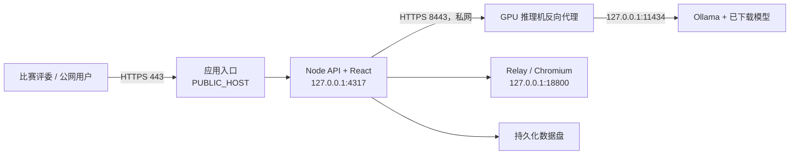

# 本地模型公网部署实施手册

**适用项目：** Relay Scraper UI 当前版本
**目标：** 公网用户通过 HTTPS 登录业务应用后，使用项目内置的本地模型完成 AI 分析、岗位卡、投递文案、简历辅助、Data Copilot 和流式结果；Ollama 推理服务只保留在应用内网或同机回环地址。

## 1. 部署结论

推荐拓扑是“**公网 Web 应用 + 私网模型服务**”，而非把 Ollama 的 `11434` 端口直接开放到互联网。



公网只开放 `443`。Node、Relay/CDP、Ollama 原始 `11434` 和模型机 `8443` 由防火墙限制在服务器本机或私有网络。

## 2. 两种可实施架构

| 方案 | 适用条件 | 模型端点 | 推荐度 |
|---|---|---|---|
| A. 同机模型 | 比赛演示、单账号、GPU 与应用在同一台 Windows VM | `http://127.0.0.1:11434` | 首选，部署最短 |
| B. 独立 GPU 推理机 | 应用与 GPU 分机、需要稳定显存或后续扩容 | `https://MODEL_PRIVATE_HOST:8443` | 正式生产首选 |

两种方案均通过新增环境变量 `XHS_LOCAL_MODEL_ENDPOINT` 接入。未配置时，项目保持同机默认值 `http://127.0.0.1:11434`。

## 3. 当前项目已实现的接入点

| 能力 | 代码位置 | 运行方式 |
|---|---|---|
| 模型运行状态和安装进度 | `server/local-model-manager.mjs` | 调用 Ollama `/api/tags`、`/api/version`、`/api/pull` |
| OpenAI 兼容 AI 会话 | `server/ai-session-store.mjs` | 调用 `XHS_LOCAL_MODEL_ENDPOINT/v1` |
| 公网模型端点配置 | `server/config.mjs` | `XHS_LOCAL_MODEL_ENDPOINT`，仅接受 HTTPS 或本机 HTTP |
| 运行时注入 | `server/index.mjs` | 模型管理器和 AI 会话使用同一端点 |
| 前端模型管理 | `src/App.tsx` | 在已登录应用中发现、安装、选择本地模型 |

本地模型的模型列表、安装动作和推理请求都走应用已认证的 API；浏览器不直接访问模型机。

## 4. 容量和模型选择

| 场景 | 建议模型 | 系统内存 | GPU 显存 | 磁盘预留 |
|---|---|---:|---:|---:|
| 演示与轻量清洗 | `qwen3.5:4b` | 16 GB | 8 GB | 60 GB |
| 岗位正文、文案和 Copilot | `qwen3:8b` 或 `deepseek-r1:7b` | 32 GB | 16 GB | 120 GB |
| 高频并发或长文推理 | 14B 级量化模型 | 64 GB | 24 GB | 200 GB |

本项目的竞赛演示先使用 `qwen3.5:4b`，在应用 UI 中完成 AI 会话配置；需要更高质量时增加 `qwen3:8b` 或 `deepseek-r1:7b`。模型文件保存在 GPU 机数据盘，例如 `D:\ollama-models`，与应用代码和任务数据分盘。

## 5. 方案 A：同机部署

### 5.1 主机要求

- Windows Server 2022 或 Windows 11 Pro，4 vCPU、16 GB RAM、8 GB 以上 NVIDIA GPU 显存。
- 安装匹配显卡的驱动、Node.js 22+、Python 3.11+、Ollama、Chrome 或 Edge。
- 应用数据保留在 `D:\xhs-data`，Ollama 模型保留在 `D:\ollama-models`。

### 5.2 安装和下载模型

在 GPU 主机的管理员 PowerShell 执行：

```powershell
[Environment]::SetEnvironmentVariable('OLLAMA_MODELS', 'D:\ollama-models', 'Machine')
Restart-Service Ollama

ollama pull qwen3.5:4b
ollama list
Invoke-RestMethod http://127.0.0.1:11434/api/version
Invoke-RestMethod http://127.0.0.1:11434/api/tags
```

安装完成后，生产服务环境保留：

```dotenv
XHS_LOCAL_MODEL_ENDPOINT=http://127.0.0.1:11434
```

应用进程以 `npm run start` 启动。登录 Web UI 后，在 AI 配置中选择“本地免费模型库”和 `qwen3.5:4b`，再运行模型发现和一次短文本生成。

### 5.3 同机验收

```powershell
Invoke-RestMethod http://127.0.0.1:4317/api/ai/local-models
```

已登录会话下接口应显示 `runtime.ready=true`、Ollama 版本和已安装模型。公网浏览器经业务域名登录后可在 AI 配置内看到同一模型；`11434` 不在公网端口扫描结果中。

## 6. 方案 B：独立 GPU 推理机

### 6.1 网络和地址规划

示例地址：

| 主机 | 角色 | 可达地址 |
|---|---|---|
| `APP_PRIVATE_HOST` | Node、React、Relay、数据盘 | 仅应用私网 |
| `MODEL_PRIVATE_HOST` | Ollama、GPU、模型盘 | 仅应用私网 |
| `PUBLIC_HOST` | 对外 HTTPS 域名 | 公网 `443` |

防火墙规则：

1. `PUBLIC_HOST:443` 接收互联网 HTTPS。
2. `APP_PRIVATE_HOST -> MODEL_PRIVATE_HOST:8443` 允许 TCP。
3. 其他来源到 `MODEL_PRIVATE_HOST:8443` 拒绝。
4. `MODEL_PRIVATE_HOST:11434` 仅监听 `127.0.0.1`。
5. Relay/CDP `18800` 仅监听应用机回环地址。

### 6.2 GPU 推理机安装

在模型机安装 Ollama 并设置模型数据盘，然后下载模型：

```powershell
[Environment]::SetEnvironmentVariable('OLLAMA_MODELS', 'D:\ollama-models', 'Machine')
Restart-Service Ollama
ollama pull qwen3.5:4b
ollama list
```

Ollama 保持默认的本机监听；以 Caddy 或 IIS ARR 在模型机私网地址上提供 HTTPS，反向代理到 `127.0.0.1:11434`。Caddyfile 示例：

```caddyfile
MODEL_PRIVATE_HOST:8443 {
    tls C:\Secrets\model-internal.crt C:\Secrets\model-internal.key
    bind 10.0.2.20
    reverse_proxy 127.0.0.1:11434
}
```

证书的根证书加入应用机的“本地计算机 -> 受信任的根证书颁发机构”。生产域名或内部 DNS 名称必须与证书 SAN 一致。

### 6.3 应用机配置

在 Node 服务账户的生产环境写入：

```dotenv
XHS_LOCAL_MODEL_ENDPOINT=https://MODEL_PRIVATE_HOST:8443
XHS_AUTH_REQUIRED=true
XHS_AUTH_SECURE_COOKIE=true
XHS_AUTH_ORIGIN=https://PUBLIC_HOST
```

重启应用服务后，应用会将 AI 会话端点自动归一化为：

```text
https://MODEL_PRIVATE_HOST:8443/v1
```

并将模型管理端点使用为：

```text
https://MODEL_PRIVATE_HOST:8443/api/tags
https://MODEL_PRIVATE_HOST:8443/api/pull
```

### 6.4 私网模型机验收

在应用机执行：

```powershell
Invoke-RestMethod https://MODEL_PRIVATE_HOST:8443/api/version
Invoke-RestMethod https://MODEL_PRIVATE_HOST:8443/api/tags
Invoke-RestMethod https://MODEL_PRIVATE_HOST:8443/v1/models
```

然后登录业务应用，进入 AI 设置，选择本地免费模型库，确认模型列表、生成任务、Data Copilot 的流式回答和历史会话恢复。

## 7. 应用服务的持久化配置

建议使用 Windows 服务或受控计划任务运行应用，并把以下变量写入该服务账户环境：

```dotenv
NODE_ENV=production
HOST=127.0.0.1
PORT=4317

XHS_SERVER_DATA_DIR=D:\xhs-data\jobs
XHS_PROFILE_DATA_DIR=D:\xhs-data\profiles
XHS_BROWSER_DATA_DIR=D:\xhs-data\browser
XHS_AI_CONFIG_PATH=D:\xhs-data\ai-config.json
XHS_LOCAL_MODEL_ENDPOINT=https://MODEL_PRIVATE_HOST:8443

XHS_AUTH_REQUIRED=true
XHS_AUTH_USERS_PATH=D:\xhs-data\auth\users.json
XHS_AUTH_SESSION_SECRET_PATH=D:\xhs-data\auth\session-secret
XHS_AUTH_SECURE_COOKIE=true
XHS_AUTH_ORIGIN=https://PUBLIC_HOST
```

认证账号通过 [`scripts/provision-auth.mjs`](../scripts/provision-auth.mjs) 的安全输入流程创建；密码不出现在 `.env`、部署包、日志、截图或 Git 历史中。

## 8. 模型预热、并发和恢复

### 8.1 预热

在服务启动或比赛演示前执行一条短请求，模型加载到显存后再开始用户演示。预热记录写入运行日志，不保存提示词中的敏感内容。

```powershell
$body = @{ model = 'qwen3.5:4b'; messages = @(@{ role = 'user'; content = '回复 READY' }); stream = $false } | ConvertTo-Json -Depth 5
Invoke-RestMethod https://MODEL_PRIVATE_HOST:8443/v1/chat/completions -Method Post -ContentType 'application/json' -Body $body
```

### 8.2 并发控制

- 单张 8 GB GPU：同一时间运行一个长文生成任务，其他任务在应用任务队列等待。
- 16 GB GPU：控制为 2 个交互式生成任务，抓取、Relay 和 OCR 与模型推理错峰执行。
- 24 GB GPU：按实测 token 吞吐量设置并发，保留至少 20% 显存余量。
- AI、Relay 和批量任务发生异常时保留既有 checkpoint 与已生成 artifact，从原任务继续运行。

### 8.3 故障恢复顺序

1. 检查 GPU 驱动、Ollama Windows 服务和 `ollama list`。
2. 检查模型机私网 HTTPS 证书、8443 防火墙规则和应用机 DNS。
3. 检查应用 `/api/ai/local-models` 是否显示 `runtime.ready=true`。
4. 重新创建 AI 会话并在 UI 运行短生成。
5. 从任务历史页面的 checkpoint 继续中断的 AI 或 Relay 任务。

## 9. 上线验收清单

| 项目 | 通过条件 |
|---|---|
| 公网登录 | 访问 `https://PUBLIC_HOST`，登录后可读取历史数据 |
| 历史演示任务 | 展示 `20260804081657-caf8f451`，状态为“部分完成 · 可续跑” |
| 本地模型状态 | `/api/ai/local-models` 显示 `runtime.ready=true` 和已安装模型 |
| AI 推理 | 本地模型完成一条岗位摘要和一条投递文案 |
| Data Copilot | 可读取任务资料并通过 SSE 返回流式答案 |
| Relay | Relay/CDP 保持回环，登录状态正常，能创建小规模抓取任务 |
| 隔离 | 公网扫描只显示 `443`；`11434`、`18800` 和模型私网 `8443` 不对互联网开放 |
| 恢复 | 关闭并恢复模型服务后，应用重新发现模型，历史任务和 checkpoint 保留 |

## 10. 发布顺序

1. 部署并验证 GPU 推理机和 Ollama。
2. 下载、预热并验收目标模型。
3. 配置模型机私网 HTTPS 反向代理和防火墙。
4. 在应用机设置 `XHS_LOCAL_MODEL_ENDPOINT`，重启 Node 服务。
5. 部署应用认证、历史数据、Relay 浏览器 Profile、AI/SMTP 配置。
6. 用竞赛账号登录，完成第 9 节全部验收。
7. 再将 `PUBLIC_HOST` DNS 切到公网 HTTPS 入口。

## 11. 相关文档

- [完整公网部署方案](PUBLIC_DEPLOYMENT_IMPLEMENTATION_PLAN.md)
- [托管浏览器与 Relay](managed-browser.md)
- [用户使用手册](USER_GUIDE.md)
