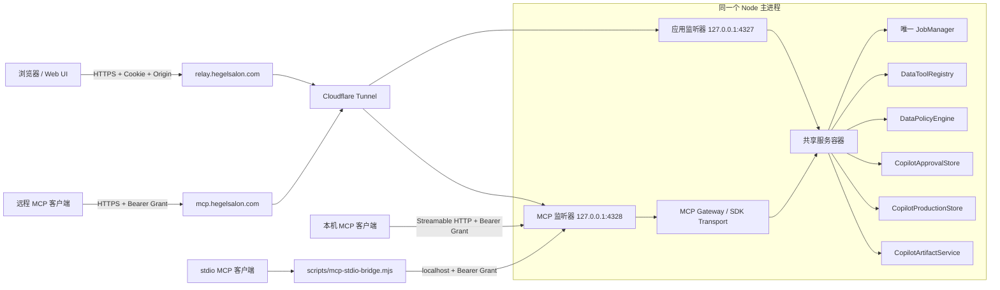
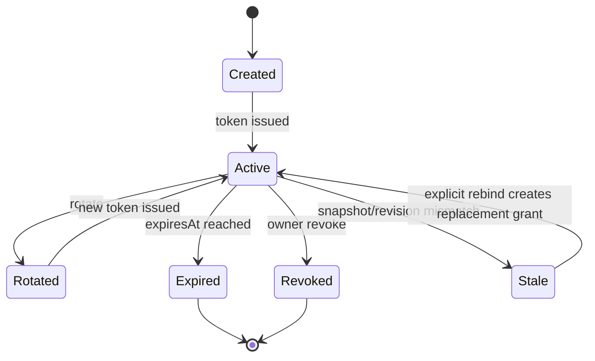

# MCP 全量实施规格书

> - 项目：`xiaohongshu-relay-scraper-ui`
> - 文档版本：`3.2.0`
> - 更新日期：`2026-08-10`
> - 适用代码版本：`package.json` 版本 `3.0.0`，以本文更新时的工作区为准
> - 交付对象：项目维护者、验收人员，以及继续完成发布工作的编码 AI
> - 文档状态：本地与公网 MCP、Cloudflare 双 ingress、全量回归、便携生产 ZIP、官方 SDK 验收和备份恢复撤销链路均已实施

---

## 实施状态总览

### 当前结论

本文原 `2.0.0` 本地方案和 `3.2.0` 公网扩展已落实到当前工作区。标准 MCP 不再只是会话内自定义 JSON-RPC 路由，而是由官方 SDK 驱动、与 Web/API 同进程共享领域状态、通过独立 loopback 监听器提供 Streamable HTTP，并由 Cloudflare Tunnel 的独立 hostname 安全发布到公网；stdio 仍是仅做代理的本地桥接。公网数据面在无认证头时只提供完全隔离的合成只读展示；管理面继续使用浏览器登录，私有数据面使用一次展示、服务端仅存摘要、可撤销且绑定任务快照的 Bearer Grant。

实施完成范围：

- `@modelcontextprotocol/sdk@1.30.0` 已精确锁定；依赖审计为 0 vulnerability。
- `server/index.mjs` 在同一个 Node 进程内创建 Web/API 和 MCP 两个监听器，只初始化一套 `JobManager`、Copilot store、策略引擎、工具注册表和审批服务。
- 标准 Streamable HTTP 已覆盖 initialize、ping、resources/list、resources/read、tools/list、tools/call 和 session close；stdio 使用官方客户端协议代理到该 HTTP 端点。
- production store 已迁移到 schema v4，新增 Grant、session、tool run 和 audit 持久化；快照冲突、manifest hash 和逐文件 SHA-256 会被校验。
- Grant 固定绑定 owner、conversation、job、snapshot、manifest、mode、scopes、resources、tools、risk 和 expiry；令牌只返回一次，存储值为 pepper 后的摘要。
- MCP 管理 API 已支持能力发现、创建、列表、详情、撤销、轮换、重新绑定、审计、会话、工具运行和审批决策。
- Data Copilot 中已加入 MCP Access UI，可配置 scopes/resources/tools/risk/expiry，并管理 Grant、运行、session 和审计。
- 启动、停止、watchdog、Cloudflare 边界、备份、恢复和打包脚本已纳入 MCP；恢复或含数据打包会撤销 active Grant 并关闭 session。
- 默认生产源站为 Web/API `127.0.0.1:4327`、MCP `127.0.0.1:4328/mcp`；Cloudflare 使用独立 hostname 将二者分别发布为 `https://relay.hegelsalon.com` 和 `https://mcp.hegelsalon.com/mcp`。

### 当前公网运行验收

生产进程同时监听 Web/API `127.0.0.1:4327` 和 MCP `127.0.0.1:4328`，Tunnel `hegelsalon-relay` 的独立 ingress 将其分别发布到应用 hostname 和 MCP hostname。匿名公网验证器直接用官方 SDK 检查内置合成展示，不创建 Grant 或持久化 session；私有能力复核在当前生产实例创建 5 分钟只读 Grant，并在调用完成后立即撤销和复验旧 token。

| 项目 | 当前值 |
|---|---|
| 服务版本 / schema | `3.0.0` / `4` |
| 本地 MCP health | `http://127.0.0.1:4328/health`，HTTP 200 |
| 公网 MCP endpoint | `https://mcp.hegelsalon.com/mcp` |
| 公网未认证请求 | 浏览器 GET `/mcp` 返回 200；官方 SDK 仅发现 3 个 `showcase://` 资源和 3 个 `showcase.*` 只读工具 |
| 公网错误认证请求 | `/mcp` 返回 401，且不降级为匿名展示 |
| 公网明文 HTTP | `/health` 返回 403 |
| 此前隔离验收绑定任务 | `20260728001058-f3dc92cb`，只在隔离验证副本中使用 |
| 此前全量 Grant 验收 | 一次性展示；验证完成后撤销；旧 token 再次 initialize 被拒绝 |
| 当前私有能力复核完成时 | active Grant 恢复验证前既有基线 `1`，active session `0` |

此前 `scripts/verify-mcp-public-production.ps1` 通过公网调用 `scripts/verify-mcp-production.mjs` 的历史全量 Grant 结果：

| 断言 | 结果 |
|---|---|
| Streamable HTTP + official SDK client | 通过 |
| 健康检查与 initialize | 通过 |
| protocol | `streamable-http` |
| resources/list | 6 个资源 |
| resources/read | 已实际读取，返回 1 个 content block |
| tools/list | 36 个工具 |
| tools/call | `task.status` 成功，返回 1 个 content block，`isError=false` |
| 撤销后重用 | 被拒绝 |
| 凭证输出 | JSON 报告不含完整 token、Cookie 或资源 URI |
| 报告 | `.runtime/production/public-mcp-verification.json`，`2026-08-10T04:45:20.9415457Z` |

### 测试与发布门禁

| 命令或验证 | 本轮结果 | 判定 |
|---|---:|---|
| `npm run test:mcp` | 9/9 通过 | MCP 专项通过，包含匿名展示和 Grant 双路径 |
| `node --test server/data-copilot-http.test.mjs` | 11/11 通过 | 含外部符号链接不进入快照的真实路径用例 |
| 审批、运行时限制、迁移、恢复撤销相关测试 | 12/12 通过 | 安全状态机通过 |
| `npm run test:api` | 98/98 通过 | Web/API 回归通过 |
| `npm run test:python` | 543 通过，2 跳过 | Python 回归通过 |
| `npm run test:artifacts` | 1/1 通过 | 产物验证通过 |
| `npm run test:credentials` | 通过 | 凭据扫描通过 |
| `npm run lint` / `format:check` / `typecheck` | 全部通过 | 静态门禁通过 |
| `npm run build` | 通过 | 仅有主 bundle 851.93 kB 的既有体积警告 |
| `npm run audit:dependencies` | 0 vulnerability | 依赖门禁通过 |
| `npm test` | 646/646 通过，0 失败 | 仓库全量 Node 回归通过 |
| `npm run test:e2e` | 64 通过，1 按配置跳过，0 失败 | 全量 Playwright 用户流程和多视口回归通过 |
| 便携归档结构审计 | 逐项校验 manifest、必需启动/验证脚本、Node 依赖和 5 个运行时组件；拒绝运行数据、`.env`、`.git`、token、Cookie 与 Tunnel 凭据 | 通过；最终条目数与 SHA-256 见同日验收报告 |
| 便携归档运行 smoke | 包内 Node 启动 Web/API + MCP 双监听器；健康检查 200 | 通过 |
| 备份/恢复 | 备份生成成功；恢复脚本成功执行；恢复后 active Grant 自动撤销 | 通过 |

最终归档：`deliverables/hegelsalon-mcp-public-production-20260810.zip`。归档 SHA-256 由同名 `.sha256` 文件单独记录；生成归档时不写入真实任务输出、token、Cookie、pepper、Tunnel 凭据或生产配置。

公网 Tunnel、双 DNS、HTTPS MCP、匿名只读边界、错误认证拒绝、明文 HTTP 拒绝、官方 SDK 资源读取、工具调用和 Grant 撤销均已实际执行。Cloudflare API token 当前缺少 zone-setting 权限，因此脚本未修改账户级 `Always Use HTTPS`；源站 `X-Forwarded-Proto=https` 强制校验仍使明文 HTTP 请求返回 403。

---

## 0. 给编码 AI 的执行契约

你是本项目 MCP 改造的实施工程师。必须先核对当前工作区，再按本文分阶段修改代码。任务不是“新增一个 `/mcp` 路由”，而是把现有会话内自定义 JSON-RPC 能力升级为可被标准 MCP 客户端使用、受现有任务快照和用户授权约束、可测试、可打包、可运维、可回滚的本地与公网 MCP 服务。

### 0.1 执行规则

1. 先阅读本文列出的现有文件和测试，再修改代码；不得根据 README 或旧方案猜测当前实现。
2. `server/index.mjs` 启动的主 Node 进程仍是唯一状态拥有者。只允许初始化一套 `JobManager`、Copilot store、审批存储、产物服务、工具注册表和策略引擎。
3. 浏览器应用监听器和 MCP 监听器必须在同一个 Node 进程中共享上述实例；不得通过第二个 API 进程直接打开同一批运行时状态。
4. stdio 进程只能做协议桥接，不能初始化 `JobManager`，不能直接遍历 `data`、任务输出目录、浏览器 profile 或 SQLite 文件。
5. 复用现有 `CopilotProductionStore`、`CopilotApprovalStore`、`DataPolicyEngine`、`DataToolRegistry` 和 `McpDataAdapter` 的领域能力；不得另建一套平行快照、审批或工具实现。
6. MCP 管理 API 使用现有浏览器 Cookie 登录和 Origin/CSRF 防护；MCP 数据面使用独立 Bearer Grant，不得拿浏览器 Cookie 充当 MCP 客户端凭证。
7. 所有资源读取和工具执行都必须绑定明确的内部 `owner`、`conversationId`、`jobId`、`snapshotId`、`manifestHash`、scope 和工具 allowlist。
8. 所有副作用工具必须走现有审批状态机扩展，包含规范化参数哈希、审批哈希、幂等键和一次性消费；模型或 MCP 客户端不能自我批准。
9. 未实现的能力必须由 feature flag 隐藏并返回明确错误；不得返回空数据、模拟审批或假成功。
10. 不记录明文 Grant token、Cookie、SMTP 密码、AI key、Relay 凭据、邮件正文、附件正文或完整敏感工具参数。
11. 每个阶段必须提供代码、迁移、测试、文档和当前运行证据。HTTP 200 或端口监听不等于阶段完成。
12. 当前工作区可能包含未提交改动。只修改本阶段要求的文件，保留所有无关改动。

### 0.2 完成判定

只有以下条件同时满足，才能把 MCP 改造标记为完成：

- 标准 MCP 客户端可分别通过 Streamable HTTP 和 stdio 完成初始化、资源枚举/读取、工具枚举/调用、会话关闭。
- 浏览器应用继续通过 `relay.hegelsalon.com` 工作；MCP 只通过独立的 `mcp.hegelsalon.com` hostname 到达回环数据面，两个公网入口不能交叉访问协议路由。
- MCP Grant 的所有绑定字段、过期时间、撤销状态、scope、工具 allowlist、快照 revision/hash 均由服务端验证。
- 36 个现有注册工具的暴露规则来自同一个 `DataToolRegistry`；不存在文档工具、策略工具和运行工具三套名单漂移。
- 6 类现有资源只能读取 Grant 绑定范围内的数据，并满足分页、大小、截断和错误契约。
- 高风险工具走“创建待审批动作 -> 浏览器确认 -> 相同 actionHash 执行 -> 幂等消费”的闭环。
- API/MCP 重启、客户端断线、Grant 过期/撤销、快照过期、重复请求、端口冲突和异常退出均有可预测行为。
- Windows 中文路径、空格路径、便携运行时、后台启动、生产 watchdog、备份恢复和 ZIP 内容均有验证证据。
- 现有 API、Data Copilot、采集、附件、产物、邮件和生产启动回归通过。
- 文档、示例配置、客户端示例、迁移说明、生产 runbook 和回滚步骤与实际代码一致。

---

## 1. 2026-08-09 项目审计与实施后状态

### 1.1 已确认的现状

| 领域 | 当前事实 | 状态 | 对方案的影响 |
|---|---|---:|---|
| 应用版本 | `package.json` 为 `3.0.0` | 已存在 | MCP serverInfo 版本应从包版本读取，不再硬编码 `1.0.0` |
| 主进程 | `server/index.mjs` 初始化唯一 `JobManager` 和全套 Copilot 服务 | 已存在 | MCP HTTP 必须作为同进程第二监听器接入 |
| 领域适配器 | `server/mcp-data-adapter.mjs` 提供资源与工具领域逻辑 | 已复用 | 标准 wire protocol 由官方 SDK 处理 |
| 旧 MCP 路由 | `POST /api/copilot/conversations/:conversationId/mcp` | 兼容保留 | 与标准 MCP 共享适配器、策略和 store，后续可按版本废弃 |
| 协议版本 | 旧兼容适配器仍声明 `2024-11-05`；标准端点由 SDK 协商 | 已完成 | 新客户端只使用标准 `/mcp` 端点 |
| 资源 | `applications`、`content`、`audience`、`expansion`、`attachments`、`artifacts` | 6 类已存在 | 保持 URI 和领域语义，补强快照与分页 |
| 工具注册表 | 26 个直接声明名称的工具 + 8 个动态 `records.*` + 2 个动态受众查询工具 | 精确 36 个 | 本文以运行时 `registry.list()` 的 36 个为基线，不再使用近似数 |
| 工具策略 | `DataPolicyEngine` 校验 registry 声明的所有 required scopes、mode 和任务边界 | 已完成 | registry 是工具暴露事实源 |
| 快照持久化 | `CopilotProductionStore` schema v4 复用 `snapshots` 并加入 MCP 边界表 | 已完成 | manifest 冲突和读时完整性失败均显式返回 |
| 当前快照内容 | manifest 含任务摘要、计数、产物相对路径/大小/更新时间和逐文件 SHA-256 | 已完成 | Grant 同时绑定 snapshot ID、revision 和 manifest hash |
| 审批 | `CopilotApprovalStore` 已有 requestHash、幂等键、过期和状态迁移 | 已存在基础 | 扩展现有审批记录，不新建平行审批系统 |
| 生产存储 | 已有 traces、usage、outbox、worker leases、runs、nodes、evidence 等 | 已存在 | MCP 复用 outbox/lease/trace，不重复造轮子 |
| 浏览器鉴权 | 生产环境 Cookie 登录、Origin/CSRF、安全头已经存在 | 已存在 | Grant 管理 API 复用它；MCP 数据面另用 Bearer |
| 生产入口 | 应用固定 `127.0.0.1:4327`，MCP 固定 `127.0.0.1:4328` | 已完成 | Cloudflare 使用不同 hostname 分别转发，不在应用 listener 增加 `/mcp` |
| 生产打包 | 包含 Node、Python、cloudflared、Chromium、依赖和前端 dist | 已存在 | MCP SDK/桥接脚本需要进入包；token/数据仍排除 |
| 备份恢复 | 私有数据备份含哈希并保留 SQLite WAL/SHM；恢复脚本撤销 Grant | 已完成 | 恢复后必须重新签发 Grant，旧 token 不再可用 |
| 官方 SDK | `@modelcontextprotocol/sdk@1.30.0` 已锁定 | 已完成 | 官方 SDK 负责 HTTP/stdio wire protocol |
| 标准传输 | Streamable HTTP、stdio bridge 与独立公网 hostname 已实现 | 已完成 | listener 保持 loopback；公网只经 Cloudflare MCP ingress 到达 |
| MCP Grant | Grant、session、tool run、audit 已进入 schema v4 | 已完成 | 管理面 Cookie 与数据面 Bearer 分离 |

### 1.2 当前 36 个工具清单

以下是当前 `DataToolRegistry` 的真实基线。编码 AI 必须通过运行时 `registry.list()` 再次断言，不能手工维护另一份执行名单。

| 分类 | 数量 | 工具 |
|---|---:|---|
| 发现 | 2 | `tool.search`、`tool.describe` |
| 任务 | 2 | `task.status`、`task.workflow` |
| 数据集 | 2 | `dataset.list`、`dataset.describe` |
| 记录 | 8 | `records.search`、`records.query`、`records.filter`、`records.sort`、`records.aggregate`、`records.group`、`records.join`、`records.get` |
| 内容 | 2 | `content.inspect`、`content.image_understanding` |
| 岗位 | 2 | `jobs.extract_links`、`jobs.compare` |
| 投递 | 3 | `applications.get_delivery`、`applications.extract_email_requirements`、`applications.compose_email` |
| 受众 | 4 | `audience.segment`、`audience.coverage`、`users.query`、`comments.query` |
| 扩展 | 2 | `expansion.trace`、`expansion.summary` |
| 产物 | 3 | `artifact.create`、`artifact.preview`、`artifact.list` |
| 附件 | 3 | `attachment.parse`、`attachment.join_dataset`、`attachment.list` |
| 邮件 | 3 | `email.prepare`、`email.preview`、`email.send` |

说明：

- `users.query` 和 `comments.query` 由受众工具循环正式注册，scope 均为 `audience:read`，属于当前 36 个工具。
- 如需新增任务启动/暂停/恢复等工具，必须先在 `DataToolRegistry` 中正式注册、测试、分配 scope/risk，再由 MCP 自动发现。
- MCP `tools/list` 只能返回“registry 已注册 + Grant allowlist 允许 + 所有 scope 通过 + 当前模式允许”的交集。

### 1.3 旧版方案需要修正的关键点

1. 旧版把标准 `/mcp` 计划放在现有应用监听器。当前生产监听器已经通过 Cloudflare 公开，因此新版改为同进程独立的本地监听器 `127.0.0.1:4328`。
2. 旧版使用“约 36 个工具”的近似描述。当前运行时准确数量是 36，其中 `records.*`、`users.query` 和 `comments.query` 由循环动态注册。
3. 旧版计划新增完整快照表。当前 SQLite 已有 `snapshots` 和 `manifest_hash`，新版只做兼容迁移和内容级增强。
4. 旧版计划新增独立审批表。当前文件型 `CopilotApprovalStore` 已有成熟状态机，新版扩展它，不复制审批职责。
5. 旧版没有覆盖现有生产 Cookie 鉴权、固定端口、Cloudflare、watchdog、便携包和备份恢复；新版把这些纳入发布门禁。
6. 当前 `authorizeTool()` 只实际校验一个 required scope；新版要求所有声明 scope 全部满足。
7. 当前快照 manifest 只有文件元数据，没有文件内容 hash；新版不能把现状描述成“物理不可变快照”。

### 1.4 本次更新的基线证据

以下结果是 `2.0.0` 方案编写时的改造前基线，保留用于说明实施起点；当前验收以文首“实施状态总览”为准：

| 验证 | 结果 |
|---|---|
| 运行时实例化 `DataToolRegistry` 并执行 `registry.list()` | 36 个工具，其中 8 个 `records.*` |
| `npm run test:copilot-contract` | 23/23 通过，0 失败、0 跳过 |
| `node --test server/app-security.test.mjs` | 5/5 通过，0 失败、0 跳过 |
| `npm view @modelcontextprotocol/sdk version dist-tags --json` | `latest = 1.30.0` |

实施后已经运行 MCP、API、Python、Playwright UI、构建、依赖审计、全量 `npm test` 和官方 SDK 真实客户端验收；便携归档已实际解压启动并通过备份/恢复撤销验证。公网 Cloudflare ingress、DNS、边界拒绝、SDK read/call、撤销与生产恢复也已执行。

---

## 2. 产品目标、范围与非目标

### 2.1 产品目标

把现有 Data Copilot 的任务、数据集、内容、受众、扩展、附件、产物和受控动作能力，通过标准 MCP 暴露给本机 AI 客户端。每个 MCP 连接只访问用户在 Web UI 中明确创建的 Grant 所绑定的会话、任务、快照和工具集合。

### 2.2 R1 必须交付

- 本地 Streamable HTTP：`http://127.0.0.1:4328/mcp`；公网 Streamable HTTP：`https://mcp.hegelsalon.com/mcp`。
- stdio 桥接：`node scripts/mcp-stdio-bridge.mjs`，内部连接本地 Streamable HTTP。
- Web UI 创建、查看、复制一次性 token、撤销、轮换和重新绑定 Grant。
- 标准资源和工具枚举/调用。
- 内容级快照校验、所有 scope 校验、工具 allowlist、风险等级、审批、幂等和审计。
- Windows 生产启动、停止、watchdog、打包、备份、恢复和回滚集成。
- 旧会话内 MCP 路由的一版兼容期。

### 2.3 R1 明确不做

- 不把标准 MCP 挂到应用 hostname 或 `4327`，也不让 `4328` 监听非回环网卡；公网只允许独立 MCP hostname 通过 Cloudflare Tunnel 转发。
- 不提供任意 shell、任意 HTTP、任意浏览器控制、任意 SQL 或任意文件系统工具。
- 不列出所有本地任务、所有会话、所有 profile、所有配置或所有凭据。
- 不让 MCP token 代替浏览器用户登录，也不让浏览器 Cookie 代替 MCP Grant。
- 不在 stdio 进程中读取业务数据或启动第二套 API。
- 不自动把旧 Grant 绑定到最新任务 revision。
- 不支持多节点共享 MCP session；当前部署仍是单机单进程。
- 不承诺跨版本恢复正在进行的 MCP transport session；重启后客户端重新 initialize。

### 2.4 R2 可选范围

- 标准 OAuth 2.1/Protected Resource Metadata，再叠加应用层 Grant。
- 历史不可变快照读取，而不是 R1 的 revision 变化即失效。
- 多用户稳定 `userId`、组织空间、细粒度角色和管理员审计。
- MCP prompts、resource subscriptions 和 server notifications。

---

## 3. 更新后的目标架构



### 3.1 为什么必须双监听器

现有生产启动器固定把 `127.0.0.1:4327` 暴露为浏览器应用。即使 `/mcp` 自身有 token，把 MCP 路由放在同一个 listener 或 hostname 仍会扩大攻击面并增加 CORS、Cookie 和 MCP Bearer 混用风险。公网 MCP 因此使用独立 hostname 和独立最小 listener。

因此 R1 采用以下边界：

| 监听器 | 地址 | 可用路由 | 认证 | 公网 hostname |
|---|---|---|---|---|
| 浏览器应用 | `127.0.0.1:4327` | 现有 UI、`/api/*`、MCP Grant 管理 API | Cookie + Origin/CSRF | `relay.hegelsalon.com` |
| MCP 数据面 | `127.0.0.1:4328` | `/health`、`GET/POST/DELETE /mcp` | Bearer Grant | `mcp.hegelsalon.com` |

MCP 监听器必须使用独立、最小化 handler，不能复用会提供静态前端和全部 `/api/*` 的 `createApp()`。

### 3.2 六条不可破坏的不变量

#### 不变量 A：唯一状态拥有者

只有 `server/index.mjs` 初始化状态服务。两个 HTTP server 共享同一批实例并在同一个 shutdown 流程关闭。

#### 不变量 B：管理面与数据面分离

Grant 创建/撤销走 `4327` 的 Cookie 管理 API；MCP 协议只走 `4328` 的 Bearer 数据面。两者不能相互降级。

#### 不变量 C：授权先于读取和执行

每次请求必须按以下顺序执行：

`transport validation -> Bearer parsing -> token hash lookup -> Grant status/expiry -> owner/reference validation -> MCP session -> snapshot revision/hash -> resource/tool allowlist -> all scopes -> schema -> execution`

任一步失败都不能调用 registry handler。

#### 不变量 D：快照变化显式失败

R1 保持当前保守语义：任务 revision 变化、manifest hash 不一致、对象 hash 不一致时返回 `409 COPILOT_SNAPSHOT_STALE` 或 `409 COPILOT_SNAPSHOT_INTEGRITY_FAILED`，不得自动切换最新数据。

#### 不变量 E：副作用可证明且幂等

副作用请求必须先规范化参数并生成 `actionHash`，审批记录必须绑定 Grant、快照和相同 hash。执行使用持久幂等键；相同键不同 hash 返回冲突。

#### 不变量 F：公网 hostname 与源站 listener 精确隔离

`relay.hegelsalon.com` 只能指向 `4327`，`mcp.hegelsalon.com` 只能指向 `4328`。MCP 公网分支必须同时校验精确 Host、`X-Forwarded-Proto: https`、`CF-Ray`、`CF-Connecting-IP` 和空 Origin；不得把 `/mcp` 挂到应用 listener，也不得把 MCP listener 绑定到公网网卡。

---

## 4. 模块职责与复用设计

### 4.1 现有模块保留职责

| 文件 | 保留职责 | 本次修改 |
|---|---|---|
| `server/index.mjs` | 依赖组装、唯一状态初始化、生命周期 | 创建 MCP listener，共享服务，统一 shutdown |
| `server/mcp-data-adapter.mjs` | 资源/工具领域适配 | 去除手写 transport 分发，拆成可被 SDK 调用的 core |
| `server/data-policy-engine.mjs` | 引用、模式、快照、scope 约束 | 接入 Grant、manifest hash、全 scope 和 tool allowlist |
| `server/data-tool-registry.mjs` | 工具定义、schema、risk、scope、执行 | 保持唯一工具事实源；补一致性断言 |
| `server/data-copilot-service.mjs` | 会话、快照捕获、Copilot 编排 | 暴露共享 reference/snapshot 查询，不复制 MCP 逻辑 |
| `server/copilot/production-store.mjs` | SQLite、迁移、trace、outbox、lease | 增加 Grant/session/tool-run/audit 表和方法 |
| `server/copilot-approval-store.mjs` | 审批状态机和文件锁 | 增加 MCP 绑定字段和 actionHash 校验 |
| `server/auth-store.mjs` | 浏览器用户和 Cookie session | 向管理 API 提供 actor，访问服务规范化为内部 owner；不校验 MCP Bearer |
| `server/app.mjs` | 浏览器和业务 API、安全头、Cookie/Origin | 挂载 Grant 管理 API；不挂标准 MCP 数据面 |

### 4.2 已新增模块

```text
server/
  mcp-http-server.mjs          # SDK Server、Streamable HTTP、session 和 /health
  mcp-access-service.mjs       # Grant、token、授权、限流、幂等、审批和审计
  mcp-management-http.mjs      # 浏览器 Cookie 管理面 /api/mcp/*
  mcp-data-adapter.mjs         # 标准端点和旧路由共享的资源/工具领域层
scripts/
  mcp-stdio-bridge.mjs         # stdio -> localhost Streamable HTTP 桥接
  verify-mcp-production.mjs    # 生产 smoke，不输出 token
  revoke-mcp-grants-after-restore.mjs # 恢复/含数据打包后的授权失效
src/
  McpAccessPanel.tsx           # Grant 管理 UI
```

本项目按现有代码规模把 session registry、错误映射、限制和审计集中在上述三个 MCP 服务模块中，没有为了匹配旧方案树而拆分空壳文件。模块边界仍保持 transport、访问控制、管理 API 和领域适配四类职责分离。

### 4.3 SDK 版本策略

- 新增 `@modelcontextprotocol/sdk`，实施时锁定精确版本并提交 lockfile。
- 本文更新时 npm registry `latest` 为 `1.30.0`；首批实现使用 `1.30.0`，升级必须单独通过兼容测试。
- 不复制 SDK 的 JSON-RPC parser、session header 或 Streamable HTTP framing。
- 业务错误码、Grant、scope、快照和审批仍由本项目实现，不能交给 transport 猜测。
- 官方参考：<https://modelcontextprotocol.io/specification/2025-11-25/basic/transports>、<https://github.com/modelcontextprotocol/typescript-sdk>。

---

## 5. Grant、用户、Session 与凭证模型

### 5.1 owner

当前 `auth-store.mjs` 的公开用户没有稳定 userId。`McpAccessService.actorIdentity()` 使用以下 owner 值：

- 生产登录用户：规范化的 `actor.email`。
- 未启用 auth 的本地开发：应用传入的本地 actor id，当前为 `local-owner`。
- owner 只用于服务端关联和审计；公开 Grant 响应会移除 `owner` 和 `tokenHash`。
- 如果后续 auth schema 增加稳定 `userId`，需要显式迁移 Grant，不能静默改变 owner 语义。

### 5.2 Grant 数据结构

```json
{
  "grantId": "6e4c51dd-5f4d-45a0-9388-d470cfd91e36",
  "owner": "owner@example.com",
  "name": "Local Data Copilot",
  "conversationId": "conversation-123",
  "jobId": "20260809120000-abcd1234",
  "snapshotId": "job-r12",
  "manifestHash": "sha256:...",
  "mode": "application",
  "scopes": ["dataset:read", "content:read", "artifact:read"],
  "allowedTools": ["dataset.list", "records.query", "content.inspect", "artifact.list"],
  "allowedResources": ["content", "artifacts"],
  "maxRisk": "read",
  "status": "active",
  "tokenPrefix": "xhs_mcp_6e4c51dd",
  "tokenHash": "...",
  "createdAt": "2026-08-09T00:00:00.000Z",
  "expiresAt": "2026-08-10T00:00:00.000Z",
  "lastUsedAt": "",
  "revokedAt": ""
}
```

约束：

- `conversationId/jobId/snapshotId/mode` 必须与服务端现有会话 reference 完全一致。
- `manifestHash` 必须来自生产 store，不接受客户端上传自定义 hash。
- `scopes` 必须是会话模式允许 scope 的子集。
- `allowedTools` 必须是 registry 当前工具、scope 允许工具和 `maxRisk` 允许工具的子集。
- `allowedResources` 必须是适配器当前 6 类资源的子集。
- 默认 TTL 24 小时，最大 TTL 30 天；当前实现不签发无限期 Grant。
- 撤销后立即拒绝新请求；已有 session 下一次请求也必须重新查 Grant 状态，不能只在 initialize 时缓存。

### 5.3 Token 格式与存储

- 明文格式：`xhs_mcp_<UUID>.<32-byte-base64url-secret>`。
- 只在创建或轮换响应中返回一次明文。
- SQLite 只保存 `tokenPrefix` 和带服务端 pepper 的 HMAC-SHA256，比较使用 timing-safe 方法。
- pepper 存放在私有 auth 目录，文件权限与 `session-secret` 同级，不进入公共 ZIP 或 Git。
- token 只允许放在 `Authorization: Bearer ...` 或本机受限 token 文件中，禁止 query string。
- stdio 生产配置首选 `XHS_MCP_TOKEN_FILE`；`XHS_MCP_TOKEN` 仅供开发，禁止写入示例真实值。
- 日志只显示 `grantId` 和短 prefix，不显示 token/hash。

### 5.4 MCP Session

MCP transport session 与 Grant 不同：

- Grant 是认证授权，可跨多个 transport session 使用。
- `Mcp-Session-Id` 由 SDK/服务端生成，只标识协议会话，不是凭证。
- 每次 session 都绑定一个 Grant ID；请求时仍重新验证 Grant active/expiry。
- session 默认空闲 30 分钟关闭，单 Grant 最多 4 个并发 session，全局默认 20 个。
- 主进程重启不恢复 transport 对象；持久化记录只用于审计，客户端必须重新 initialize。
- DELETE `/mcp`、过期、断线、服务关闭都必须清理 transport、listener 和计时器。

### 5.5 状态机



`rebind` 不修改旧 Grant 的安全边界。正确行为是撤销旧 Grant 并创建新 Grant，返回新的明文 token 一次。

---

## 6. 持久化与迁移方案

### 6.1 原则

1. 继续使用 `data/copilot/copilot-state.sqlite` 和 `CopilotProductionStore` 的迁移机制。
2. 不新建第二个 MCP SQLite 文件，不让多个连接竞争相同状态。
3. `CopilotApprovalStore` 继续使用当前 JSON 文件、原子写和文件锁。
4. `outbox`、`worker_leases`、`traces`、`usage_records` 继续复用。
5. migration 必须可重复执行，启动失败不得留下半迁移状态。

### 6.2 schema v4 MCP 表

```sql
CREATE TABLE mcp_grants (
  grant_id TEXT PRIMARY KEY,
  token_hash TEXT NOT NULL UNIQUE,
  token_prefix TEXT NOT NULL DEFAULT '',
  name TEXT NOT NULL DEFAULT 'Local MCP access',
  owner TEXT NOT NULL,
  conversation_id TEXT NOT NULL,
  job_id TEXT NOT NULL,
  snapshot_id TEXT NOT NULL,
  manifest_hash TEXT NOT NULL DEFAULT '',
  mode TEXT NOT NULL,
  scopes_json TEXT NOT NULL DEFAULT '[]',
  allowed_tools_json TEXT NOT NULL DEFAULT '[]',
  allowed_resources_json TEXT NOT NULL DEFAULT '[]',
  max_risk TEXT NOT NULL DEFAULT 'approval_required',
  status TEXT NOT NULL DEFAULT 'active',
  created_at TEXT NOT NULL,
  expires_at TEXT NOT NULL,
  revoked_at TEXT NOT NULL DEFAULT '',
  last_used_at TEXT NOT NULL DEFAULT '',
  metadata_json TEXT NOT NULL DEFAULT '{}'
);

CREATE INDEX mcp_grants_owner_created ON mcp_grants(owner, created_at DESC);
CREATE INDEX mcp_grants_conversation_status ON mcp_grants(conversation_id, status);

CREATE TABLE mcp_sessions (
  session_id TEXT PRIMARY KEY, grant_id TEXT NOT NULL,
  transport TEXT NOT NULL DEFAULT 'streamable-http',
  status TEXT NOT NULL DEFAULT 'active',
  client_json TEXT NOT NULL DEFAULT '{}',
  created_at TEXT NOT NULL,
  last_seen_at TEXT NOT NULL,
  closed_at TEXT NOT NULL DEFAULT ''
);

CREATE TABLE mcp_tool_runs (
  call_id TEXT PRIMARY KEY,
  grant_id TEXT NOT NULL,
  session_id TEXT NOT NULL DEFAULT '',
  idempotency_key TEXT NOT NULL,
  request_hash TEXT NOT NULL,
  action_hash TEXT NOT NULL DEFAULT '',
  tool_name TEXT NOT NULL,
  status TEXT NOT NULL,
  result_json TEXT NOT NULL DEFAULT 'null',
  error_json TEXT NOT NULL DEFAULT '{}',
  approval_id TEXT NOT NULL DEFAULT '',
  started_at TEXT NOT NULL,
  completed_at TEXT NOT NULL DEFAULT '',
  UNIQUE(grant_id, idempotency_key)
);

CREATE TABLE mcp_audit (
  audit_id TEXT PRIMARY KEY,
  grant_id TEXT NOT NULL DEFAULT '',
  session_id TEXT NOT NULL DEFAULT '',
  owner TEXT NOT NULL DEFAULT '',
  action TEXT NOT NULL,
  status TEXT NOT NULL,
  detail_json TEXT NOT NULL DEFAULT '{}',
  occurred_at TEXT NOT NULL
);
```

### 6.3 快照表增强，不重建

当前 `snapshots` 表已经包含 `job_id`、`snapshot_id`、`revision`、`manifest_json` 和 `manifest_hash`。本次要求：

1. 把 `upsertSnapshot()` 改为语义明确的不可变创建：
   - 相同 key + 相同 manifest hash：返回已有记录。
   - 相同 key + 不同 manifest hash：返回 `COPILOT_SNAPSHOT_COLLISION`，不能静默 `DO NOTHING`。
2. 当前 manifest 为每个枚举到的常规文件记录 `relativePath`、`size`、`updatedAt` 和 `sha256`；`contentType`、`logicalDataset` 尚未作为持久字段引入。
3. 文件只能由任务 output root 内的目录枚举产生，并依次经过 lexical containment、`realpath` containment、符号链接跳过、稳定文件句柄和 hash 前后元数据校验；路径变化时以 `COPILOT_ARTIFACT_CHANGED` 失败。
4. Grant 创建前必须确保目标 snapshot 已存在并完成 hash；不能边创建 Grant 边异步补 hash。
5. R1 读取前校验当前 revision 和 manifest hash；关键资源可按配置校验对象 hash。
6. 单个文件过大时使用流式 SHA-256，不能把整个 JSONL 一次读入内存。
7. snapshot manifest 不保存 token、Cookie、SMTP、AI 配置或浏览器 profile 路径。

如果必须支持任务变化后继续读取历史快照，再在 R2 增加内容寻址对象：

```text
data/copilot/snapshot-objects/sha256/<first-two>/<full-hash>
```

R1 不应在没有物理对象的情况下声称支持历史不可变读取。

### 6.4 审批存储扩展

在现有审批 JSON schema 上增加可选字段，并保持旧记录可读：

```json
{
  "source": "mcp",
  "grantId": "6e4c51dd-5f4d-45a0-9388-d470cfd91e36",
  "snapshotId": "job-r12",
  "manifestHash": "sha256:...",
  "actionHash": "sha256:...",
  "toolVersion": "1.0.0"
}
```

要求：

- `actionHash = SHA256(stableJson({grantId, snapshotId, manifestHash, toolName, toolVersion, arguments}))`。
- approve/consume 时必须匹配 `requestHash` 和 `actionHash`。
- Grant 被撤销、过期或 stale 后，尚未消费的审批不能继续执行。
- 同一审批只能成功消费一次；失败重试由 `mcp_tool_runs` 的幂等记录决定。

### 6.5 备份恢复

- `copilot-state.sqlite`、WAL/SHM、审批 JSON 和 MCP pepper 都属于私有数据，进入私有备份，不进入公共 release ZIP。
- 恢复脚本校验备份 manifest 后恢复 MCP 数据。
- 恢复后默认把 active Grant 标记为 `revoked` 并关闭 active session，旧明文 token 不再可用。
- 同机灾难恢复如需保留 token，必须同时恢复 pepper 且由显式参数允许。
- 恢复验收要验证：Grant 列表可读、旧 token 按策略失效或保留、审计完整、应用数据无丢失。

---

## 7. 授权与策略引擎改造

### 7.1 修复所有 scope 校验

当前实现实际选择 `TOOL_SCOPES[toolName] || declared[0]`，会忽略声明中的后续 scope。改造为：

```text
requiredScopes = registryDefinition.scopes
assert requiredScopes is not empty for externally exposed tools
assert every requiredScope is allowed by mode
assert every requiredScope is granted by conversation scope
assert every requiredScope is granted by MCP Grant
assert toolName is in Grant allowedTools
assert tool.risk <= Grant maxRisk
```

返回值改为 `{ job, requiredScopes, grant, snapshot }`，不得只返回一个 `requiredScope`。

### 7.2 Registry 是唯一工具事实源

- scope、risk、inputSchema、version、idempotent、parallelSafe 从 registry definition 读取。
- `TOOL_SCOPES` 只允许作为显式覆盖或迁移校验，不能成为另一套完整工具目录。
- 启动时执行一致性检查：registry 36 个工具都有有效 scope/risk/schema；静态覆盖不能包含不存在工具。
- `applications.extract_email_requirements` 必须按 registry 声明正确授权。
- 静态 scope 覆盖如果包含不存在于 registry 的工具，应在启动或测试时失败；当前 `users.query`、`comments.query` 必须保持与 registry 的 `audience:read` 声明一致。

### 7.3 风险等级

统一风险枚举：

| risk | 含义 | 默认行为 |
|---|---|---|
| `read` | 只读、无外部副作用 | Grant 允许即可执行 |
| `write_local` | 创建/修改本地 Copilot 产物 | 要求 `maxRisk >= write_local`，持久幂等 |
| `approval_required` | 邮件发送或不可自动撤销的外部动作 | 必须审批和 actionHash |

现有 `email.send` 保持 `approval_required`。产物创建是否为 `write_local` 由 registry 明确定义，不能靠工具名前缀推断。

### 7.4 输出边界

- 记录工具默认 `limit=50`，最大 200，沿用当前 `MAX_TOOL_ROWS=200`。
- `resources/read` 单响应默认最大 2 MiB；超限返回截断摘要和 continuation cursor。
- 附件/产物资源默认只返回元数据；正文或二进制读取必须有独立、受限资源 URI。
- 禁止返回任务 outputDir 绝对路径、浏览器 profile 路径和服务器本地凭据路径。
- 工具错误正文不得包含完整参数或数据行。

---

## 8. MCP 协议契约

### 8.1 Transport

MCP listener 在本地和 Cloudflare 公网 hostname 上支持：

- `POST /mcp`：客户端消息。
- `GET /mcp`：普通匿名浏览器请求返回展示说明；带 Bearer session 的 SDK 请求按规范建立服务端事件流。
- `DELETE /mcp`：关闭带 Bearer 的当前 session；匿名展示不创建 session。
- `GET /health`：最小健康状态，不返回 Grant token、Grant ID、任务或用户信息。

要求：

- listener 本身只 bind `127.0.0.1`。本机分支要求 loopback Host；公网分支要求精确 MCP hostname、HTTPS forwarded proto 和 Cloudflare 标识头。
- 带 Bearer 的私有数据面请求体上限默认 1 MiB；匿名展示请求体上限默认 64 KiB。
- 公网匿名展示启用且 Bearer 缺失时进入隔离的合成只读能力面；展示关闭时返回 401。只要认证头存在但无效、过期或格式错误，始终返回 401，绝不降级为匿名展示。
- MCP 客户端不得发送浏览器 Origin；公网和本机数据面均不接受 Cookie。
- 不启用通配 CORS，不接受 Cookie，不接受 query token。
- 私有数据面的 `Mcp-Session-Id` 由 SDK 管理，服务端校验 session 与 Grant 一致；匿名展示显式拒绝该头并保持无状态。

### 8.2 initialize

serverInfo：

```json
{
  "name": "xiaohongshu-relay-scraper-mcp",
  "version": "3.0.0"
}
```

- version 从 `package.json` 读取。
- protocolVersion 由 SDK 协商，不再硬编码单一旧版本。
- capabilities 只声明真实实现的 `resources` 和 `tools`。
- 未实现 listChanged、subscribe、prompts、logging 时不声明。
- instructions 只说明当前连接已绑定授权快照，不回显 jobId、email 或 token。

### 8.3 resources/list

只返回 Grant `allowedResources` 与当前模式可用资源的交集：

| 资源 | URI | 绑定 |
|---|---|---|
| applications | `xhs-data://jobs/{jobId}/applications` | job snapshot |
| content | `xhs-data://jobs/{jobId}/content` | job snapshot |
| audience | `xhs-data://jobs/{jobId}/audience` | job snapshot |
| expansion | `xhs-data://jobs/{jobId}/expansion` | job snapshot |
| attachments | `xhs-data://conversations/{conversationId}/attachments` | conversation |
| artifacts | `xhs-data://conversations/{conversationId}/artifacts` | conversation |

客户端提供的 URI 必须与服务端为当前 Grant 生成的 URI 完全相等。不能仅检查 URI 前缀。

### 8.4 resources/read

执行顺序：

1. 验证 token、Grant 和 session。
2. 验证 exact URI allowlist。
3. 验证 owner/reference。
4. 验证 revision、snapshot ID、manifest hash 和必要的对象 hash。
5. 从领域 adapter 读取。
6. 执行大小限制、分页/截断和字段脱敏。
7. 记录审计，不记录正文。

### 8.5 tools/list

每个工具定义来自 registry，输出：

- `name`、`description`、`inputSchema`。
- `annotations.readOnlyHint` 来自 risk。
- `annotations.destructiveHint` 仅对真正副作用工具为 true。
- `annotations.idempotentHint` 来自 registry，而不是按 risk 猜测。
- `_meta.scopes`、`_meta.risk`、`_meta.version` 可供调试，但服务端仍独立校验。

### 8.6 tools/call

只读工具：

1. 验证全部授权条件。
2. 用 schema 校验 input。
3. 生成 requestHash 和 tool-run 记录。
4. 执行 registry handler。
5. 规范化为 MCP content 和 structuredContent。
6. 限制输出并更新审计。

高风险工具第一次调用：

1. 生成 actionHash。
2. 在现有 approval store 创建 pending 记录。
3. 返回 `isError: true` 或明确的结构化 `COPILOT_APPROVAL_REQUIRED`，包含 approvalId、actionHash 短摘要和管理 UI deep link。
4. 不执行 handler。

批准后重试：

1. 客户端携带 `approvalId` 和相同业务参数。
2. 服务端重算 actionHash。
3. 验证审批 approved、未过期、未消费、Grant active、快照仍有效。
4. 以幂等键执行一次并 consume 审批。

### 8.7 旧路由兼容

`POST /api/copilot/conversations/:conversationId/mcp`：

- 当前保留到 `2026-12-01`，响应包含 `Deprecation`、`Sunset` 和 successor `Link` 头；当前没有单独 feature flag。
- 继续受浏览器 Cookie/Origin 保护。
- 只负责把旧 request 包装为共享 domain core 调用，不保留第二套工具逻辑。
- 响应增加 deprecation metadata 和迁移提示。
- 新测试必须证明旧路由与标准 route 的资源/工具结果一致。

### 8.8 错误契约

| 应用错误码 | HTTP | 典型场景 |
|---|---:|---|
| `MCP_AUTH_REQUIRED` | 401 | 匿名展示关闭时无 Bearer，或私有客户端未配置 Bearer |
| `MCP_GRANT_INVALID` | 401 | token 不匹配；不区分不存在/错误 |
| `MCP_GRANT_EXPIRED` | 401 | Grant 过期 |
| `MCP_GRANT_REVOKED` | 403 | Grant 已撤销 |
| `MCP_SESSION_INVALID` | 404/400 | session 不存在或与 Grant 不匹配 |
| `COPILOT_CONTEXT_MISMATCH` | 409 | 会话、任务、模式不一致 |
| `COPILOT_SNAPSHOT_STALE` | 409 | revision 已变化 |
| `COPILOT_SNAPSHOT_INTEGRITY_FAILED` | 409 | manifest/object hash 不匹配 |
| `COPILOT_RESOURCE_DENIED` | 403 | URI 不在 allowlist |
| `COPILOT_TOOL_NOT_ALLOWED` | 403 | 工具不在 allowlist |
| `COPILOT_SCOPE_DENIED` | 403 | 任一 scope 缺失 |
| `COPILOT_APPROVAL_REQUIRED` | 409 | 需要审批 |
| `COPILOT_APPROVAL_MISMATCH` | 409 | actionHash/requestHash 不一致 |
| `MCP_IDEMPOTENCY_CONFLICT` | 409 | 相同幂等键不同请求 |
| `MCP_RATE_LIMITED` | 429 | 频率或并发超限 |
| `MCP_OUTPUT_LIMIT_EXCEEDED` | 413/结构化错误 | 无法安全截断的输出过大 |

MCP JSON-RPC error 和工具 `isError` 的选择遵循 SDK 规范：transport/protocol 错误使用协议错误；业务工具失败返回工具结果错误。测试必须固定映射。

---

## 9. 浏览器 Grant 管理 API

所有 API 挂在现有应用 listener `4327`，复用 Cookie 登录、Origin 校验和安全头。

### 9.1 路由

| 方法 | 路由 | 作用 |
|---|---|---|
| `POST` | `/api/mcp/grants` | 创建 Grant，明文 token 只返回一次 |
| `GET` | `/api/mcp/grants` | 列出当前 owner 的脱敏 Grant |
| `GET` | `/api/mcp/grants/:grantId` | 查看一个 Grant 和使用状态 |
| `POST` | `/api/mcp/grants/:grantId/revoke` | 立即撤销 |
| `POST` | `/api/mcp/grants/:grantId/rotate` | 轮换 token，旧 token 失效 |
| `POST` | `/api/mcp/grants/:grantId/rebind` | 撤销旧 Grant 并为新快照创建新 Grant |
| `GET` | `/api/mcp/grants/:grantId/audit` | 查看脱敏审计摘要 |
| `GET` | `/api/mcp/status` | 本地 listener 配置/健康摘要，不返回 token |

### 9.2 创建请求

```json
{
  "name": "Local MCP access",
  "conversationId": "conversation-123",
  "allowedScopes": ["dataset:read", "content:read"],
  "allowedTools": ["dataset.list", "records.query", "content.inspect"],
  "allowedResources": ["content"],
  "maxRisk": "read",
  "ttlSeconds": 86400
}
```

服务端必须拒绝客户端传入的 `owner`、`jobId`、`snapshotId`、`revision`、`manifestHash`、`tokenHash` 和 `tokenPrefix`；这些值只能从当前登录用户、conversation reference 和服务端随机源派生。

### 9.3 创建响应

```json
{
  "grant": {
    "grantId": "6e4c51dd-5f4d-45a0-9388-d470cfd91e36",
    "name": "Local MCP access",
    "tokenPrefix": "xhs_mcp_6e4c51dd",
    "status": "active",
    "expiresAt": "2026-08-10T00:00:00.000Z",
    "endpoint": "http://127.0.0.1:4328/mcp"
  },
  "token": "xhs_mcp_<UUID>.<secret>",
  "tokenReturnedOnce": true
}
```

### 9.4 管理 API 防护

- 只能操作当前 owner 的 Grant；未知和他人 Grant 都返回一致的 404。
- 创建/轮换/撤销/rebind 必须有 Origin 校验。
- 创建频率默认每用户每分钟 5 次；active Grant 默认最多 20 个。
- 列表不返回 `tokenHash`、完整 token 或 owner。
- audit API 支持最多 500 条的 limit 分页式读取，并按 owner 过滤；当前尚未实现 90 天自动清理任务。审计 detail 不写正文或完整参数，只记录 hash、计数、标识和错误码等摘要。

---

## 10. stdio 桥接设计

### 10.1 职责

`scripts/mcp-stdio-bridge.mjs` 只完成：

1. 从环境或受限文件读取 endpoint 和 Grant token。
2. 连接 `http://127.0.0.1:4328/mcp`。
3. 在 stdio framing 与 SDK Streamable HTTP client transport 之间转发。
4. 处理 SIGINT/SIGTERM、stdin EOF、HTTP session 关闭和退出码。
5. stdout 只输出 MCP 协议帧；诊断全部写 stderr。

### 10.2 禁止行为

- 不 import `JobManager`、`DataToolRegistry` 或任何业务 store。
- 不读取 `data/jobs`、SQLite、审批 JSON、附件或产物。
- 不自动启动另一个 `server/index.mjs`。
- 不在 stdout 输出 banner、日志、路径、健康检查或错误堆栈。
- 不把 token 放在命令行参数或 URL。

### 10.3 配置

```text
XHS_MCP_URL=http://127.0.0.1:4328/mcp
XHS_MCP_TOKEN_FILE=C:\ProgramData\HegelSalon\mcp\grant-token
```

开发环境可使用 `XHS_MCP_TOKEN`，生产配置优先 token file。当前脚本使用 Node 文件 API 读取中文/空格路径并 trim；尚未自动检查 Windows ACL，因此生产运维必须把 token file 限制为服务账户可读。

### 10.4 客户端示例

文档提供通用 JSON 示例，但不写入真实 token：

```json
{
  "mcpServers": {
    "xiaohongshu-relay-scraper-mcp": {
      "command": "C:\\path\\to\\node.exe",
      "args": ["C:\\path\\to\\scripts\\mcp-stdio-bridge.mjs"],
      "env": {
        "XHS_MCP_URL": "http://127.0.0.1:4328/mcp",
        "XHS_MCP_TOKEN_FILE": "C:\\ProgramData\\HegelSalon\\mcp\\grant-token"
      }
    }
  }
}
```

---

## 11. 前端交互规格

### 11.1 入口

在当前 `DataCopilotPanel` 的会话上下文区域增加“MCP 访问”入口，打开独立面板或对话框。不要把 MCP 设置做成新的营销页面，也不要把卡片嵌套在卡片里。

### 11.2 必备功能

- 显示当前绑定任务、snapshot revision、模式和资源范围。
- scope 使用复选框，工具 allowlist 使用可搜索列表，风险等级使用分段控制。
- TTL 使用预设菜单加自定义数字输入。
- 创建按钮在 scope/tool/resource 为空或快照未就绪时禁用并给出字段级错误。
- token 只展示一次，提供复制按钮和“我已保存”确认；离开后不再展示。
- 显示本地 endpoint、stdio 配置片段和监听器健康状态。
- Grant 列表显示名称、prefix、状态、创建/过期/最后使用时间和撤销/轮换/rebind 动作。
- 高风险审批仍进入现有 Copilot 审批 UI，不创建第二套审批界面。
- 所有危险动作使用确认对话框；撤销按钮与复制按钮不能位置混淆。

### 11.3 状态

必须覆盖：加载、空状态、创建中、创建成功一次性 token、复制成功、监听器关闭、Grant 过期、已撤销、快照 stale、轮换成功、API 失败和离线重试。

### 11.4 可访问性与响应式

- 全键盘操作，焦点进入/退出对话框正确。
- token 容器允许换行或横向滚动，不溢出移动端。
- 图标按钮使用现有图标库并有 tooltip/aria-label。
- 360px、768px、1440px 视口无文本遮挡。

---

## 12. 配置项

在 `server/config.mjs` 增加并验证：

| 环境变量 | 默认值 | 说明 |
|---|---:|---|
| `XHS_MCP_ENABLED` | `true` | 总开关；测试子进程可显式设为 `false` |
| `XHS_MCP_HOST` | `127.0.0.1` | R1 只允许 loopback |
| `XHS_MCP_PORT` | `4328` | 独立 listener，不能等于应用端口 |
| `XHS_MCP_PUBLIC_URL` | 空 | 生产设为 `https://mcp.hegelsalon.com`；必须是 HTTPS 且无 path/query |
| 公网 Host | 从 `XHS_MCP_PUBLIC_URL` 派生 | 不单独配置，源站做精确匹配 |
| `XHS_MCP_REQUIRE_CLOUDFLARE_HEADERS` | `true`（配置公网 origin 时） | 要求 HTTPS forwarded proto、`CF-Ray` 和 `CF-Connecting-IP` |
| `XHS_MCP_SESSION_IDLE_SECONDS` | `1800` | session 空闲关闭 |
| `XHS_MCP_MAX_SESSIONS` | `20` | 全局并发 session |
| `XHS_MCP_MAX_SESSIONS_PER_GRANT` | `4` | 单 Grant 并发 |
| `XHS_MCP_MAX_BODY_BYTES` | `1048576` | MCP 请求体上限 |
| `XHS_MCP_MAX_OUTPUT_BYTES` | `2097152` | 单结果上限 |
| `XHS_MCP_TOOL_TIMEOUT_MS` | `120000` | 工具默认超时 |
| `XHS_MCP_MAX_CONCURRENT_TOOLS_PER_GRANT` | `4` | 单 Grant 同时执行的工具数 |
| `XHS_MCP_MAX_CALLS_PER_MINUTE` | `120` | 单 Grant 资源/工具调用频率 |
| `XHS_MCP_TOKEN_PEPPER_PATH` | auth 目录下 | HMAC pepper 私有路径 |

Grant TTL 由创建请求的 `ttlSeconds` 控制，服务端常量默认 86400 秒、最大 2592000 秒。旧路由下线日期和 audit retention 当前不是环境变量；如需可配置，必须先补配置、清理任务和测试，不能仅在文档中声明变量。

启动校验：

- `XHS_MCP_HOST` 非 loopback 时配置解析立即失败。
- `XHS_MCP_PUBLIC_URL` 非 HTTPS、带 path/query/fragment 时配置解析立即失败。
- MCP port 监听冲突时主进程启动失败；生产启动脚本还会检查两个健康端点。
- 生产启用 MCP 时 pepper 必须存在或可安全创建。
- MCP listener 启动失败时，若 `XHS_MCP_ENABLED=true`，整个主进程应失败退出，避免 UI 显示假健康。

`.env.production.example` 只提供注释模板，不能包含 token、pepper 或本机真实路径。

---

## 13. 分阶段实施任务

### P0：基线锁定与 ADR，0.5-1 天

目标：冻结事实，防止 AI 按旧文档实现不存在的结构。

任务：

1. 新增 `docs/adr/ADR-MCP-LOCAL-DUAL-LISTENER.md`。
2. 记录双监听器、唯一状态拥有者、管理面/数据面分离，以及后续独立公网 hostname 的边界决策。
3. 增加 registry 基线测试：精确 36 个工具，其中 8 个 `records.*` 和 2 个受众查询工具由循环动态注册。
4. 记录当前 6 个资源和旧 MCP route 合约。
5. 运行现有 Copilot contract、安全和生产配置测试。

退出条件：ADR 合入；基线测试能在工具增删时明确失败；没有业务代码变化。

### P1：策略和快照加固，2-3 天

目标：先修正共享安全核心，再引入新 transport。

任务：

1. 改造 `authorizeTool()` 为全部 scope 校验。
2. registry 成为 scope/risk/schema/version 的唯一事实源。
3. 断言静态 scope 覆盖与 registry 一致，包括 `users.query`、`comments.query` 的 `audience:read`。
4. 增强 snapshot manifest 为逐文件 SHA-256。
5. 把 snapshot 冲突从静默忽略改为严格冲突。
6. 增加路径 containment、符号链接和大文件流式 hash；符号链接外逸有自动化用例，恶意并发替换的确定性 TOCTOU 压测仍作为发布加固项。

退出条件：多 scope 任一缺失都被拒绝；相同 snapshot ID 不同内容被拒绝；现有 Data Copilot 回归通过。

### P2：Grant、迁移和管理 API，3-4 天

目标：建立可撤销、可轮换、可审计的授权层。

任务：

1. 升级 production store schema v4。
2. 实现 Grant create/list/get/revoke/rotate/rebind。
3. 实现 token HMAC、pepper、timing-safe 验证。
4. 从 auth actor 派生内部 owner，落实所有权过滤。
5. 挂载 `/api/mcp/*` 管理 API，复用 Cookie/Origin。
6. 增加限流、active Grant 上限和审计。
7. 更新备份/恢复 schema 和测试。

退出条件：明文 token 只返回一次；数据库无明文；撤销立即生效；跨 owner 不可见；迁移可重复执行。

### P3：标准 Streamable HTTP 与独立监听器，3-4 天

目标：标准 MCP 客户端可在本机通过 `4328` 工作。

任务：

1. 安装并锁定官方 SDK。
2. 复用 `McpDataAdapter` 作为标准端点和旧路由的共享领域层。
3. 在 `mcp-http-server.mjs` 中实现 SDK Server、session registry 和错误映射。
4. 仅在独立监听器暴露 `/health` 和 `/mcp`。
5. 在 `server/index.mjs` 创建第二个 HTTP server，共享全部服务实例。
6. 统一 shutdown，清理 transport/session/timers。
7. 旧 route 委托共享 core。

退出条件：官方/标准兼容客户端完成 initialize、resources/list/read、tools/list/call、DELETE session；`4327/mcp` 不存在；只有精确 MCP 公网 Host 和 Cloudflare HTTPS 边界头能从 Tunnel 到达 `4328`。

### P4：stdio、审批和持久幂等，3-4 天

目标：桌面 MCP 客户端可用，副作用安全闭环。

任务：

1. 实现 `scripts/mcp-stdio-bridge.mjs`。
2. 实现 token file 和 stdout 污染测试。
3. 扩展现有 Approval schema 的 MCP 字段。
4. 新增 `mcp_tool_runs` 幂等记录。
5. 完成 pending -> approve -> retry -> consume 流程。
6. 验证 Grant revoke/stale 会使待审批动作失效。

退出条件：stdio 全协议 smoke 通过；stdout 逐字节只有 MCP 帧；`email.send` 无审批绝不执行；重复调用不重复发送。

### P5：前端和运维集成，2-3 天

目标：用户无需手改数据库即可创建和管理本地连接。

任务：

1. 实现 `McpAccessPanel`，并通过项目现有 API 请求封装连接管理路由。
2. 加入 Data Copilot 会话入口和审批 deep link。
3. 更新 `.env.production.example`。
4. 更新 start/stop/watchdog/state 文件，记录 MCP listener PID 同主进程、端口和健康。
5. 更新生产验证脚本，检查 `4328` 只在 loopback、`4327` 无标准 MCP route，并验证独立公网 hostname。
6. 更新 package 脚本，包含 SDK、stdio 和文档，排除 token/pepper/Grant 数据。
7. 更新备份/恢复和生产 runbook。

退出条件：UI 全流程可用；生产脚本能够启动/检测/停止；公共 ZIP 无敏感数据；私有备份可恢复。

### P6：全量验收、兼容和发布，2-3 天

目标：证明功能、边界和生产交付均成立。

任务：

1. 完成单元、集成、协议、浏览器、生产、打包和恢复测试。
2. 在干净 staging 目录和隔离端口运行便携包。
3. 用真实标准 MCP 客户端执行 read-only smoke。
4. 在 Mailpit/测试 sender 完成审批和幂等 smoke，不向真实地址发送。
5. 验证旧 route 兼容和 deprecation。
6. 输出验收报告、已知限制、回滚结果。

退出条件：本文第 15 节所有门禁通过；发布物可重复构建；回滚演练通过。

### P7：远程 MCP，已实施

实现使用独立 `mcp.hegelsalon.com` hostname、回环 listener、Cloudflare TLS、转发头边界校验和现有 snapshot-bound Grant。公网验证器已覆盖 SDK read/call、撤销后拒绝和正式生产恢复。标准 OAuth 2.1/Protected Resource Metadata 仍属于后续可选增强，不影响当前 Bearer Grant 数据面。

---

## 14. 文件级实施清单

### 14.1 新增文件

| 文件 | 阶段 | 验收重点 |
|---|---:|---|
| `docs/adr/ADR-MCP-LOCAL-DUAL-LISTENER.md` | P0 | 架构边界明确 |
| `server/mcp-http-server.mjs` | P3 | SDK、`/health`、`/mcp`、session 生命周期 |
| `server/mcp-access-service.mjs` | P2-P4 | Grant、token、owner、limits、审批和审计 |
| `server/mcp-management-http.mjs` | P2 | Cookie 管理面路由与错误契约 |
| `scripts/mcp-stdio-bridge.mjs` | P4 | stdout 纯协议 |
| `scripts/verify-mcp-production.mjs` | P5 | 生产边界 smoke |
| `scripts/revoke-mcp-grants-after-restore.mjs` | P5 | 恢复边界撤销 Grant 和 session |
| `src/McpAccessPanel.tsx` | P5 | Grant UI |

每个新模块应有相邻测试或纳入明确测试文件，不允许只创建实现文件。

### 14.2 修改文件

| 文件 | 修改 |
|---|---|
| `package.json` / lockfile | SDK 依赖，`test:mcp`、`verify:mcp` 脚本 |
| `server/index.mjs` | 共享依赖容器、MCP listener、统一 shutdown |
| `server/config.mjs` | MCP 配置、端口和 loopback 校验 |
| `server/app.mjs` | Grant 管理 API 注入和挂载 |
| `server/mcp-data-adapter.mjs` | 作为旧路由与标准 SDK 注册共享的领域适配层 |
| `server/data-copilot-http.mjs` | 旧 route 委托、deprecation |
| `server/data-copilot-service.mjs` | 可复用 reference/snapshot 获取和严格捕获 |
| `server/data-policy-engine.mjs` | Grant、全 scope、hash、allowlist |
| `server/data-tool-registry.mjs` | 完整 metadata 和启动一致性检查 |
| `server/copilot/production-store.mjs` | schema v4 和 MCP CRUD |
| `server/copilot-approval-store.mjs` | MCP actionHash/Grant 绑定 |
| `src/DataCopilotPanel.tsx` | MCP 管理入口 |
| `.env.production.example` | MCP 非敏感模板 |
| `scripts/start-production-windows.ps1` | 校验 MCP 端口和健康 |
| `scripts/stop-production-windows.ps1` | 同主进程停止和状态清理 |
| `scripts/production-watchdog.ps1` | 可选 MCP health 检查 |
| `scripts/package-windows-production.ps1` | 包含代码/依赖，排除私有状态 |
| `scripts/backup-hegelsalon.ps1` | MCP 私有数据备份 |
| `scripts/restore-hegelsalon.ps1` | schema/pepper/rotation 策略 |
| `scripts/provision-hegelsalon-relay-tunnel.ps1` | 双 ingress、双 DNS 与外部 token 文件 |
| `scripts/verify-mcp-public-production.ps1` | 公网 SDK、撤销与生产恢复验收 |
| `docs/HEGELSALON_PRODUCTION_RUNBOOK.md` | 启停、健康、备份、轮换 |
| `docs/HEGELSALON_PUBLIC_DEPLOYMENT.md` | 双 hostname、客户端配置与公网验收 |
| `docs/adr/ADR-MCP-CLOUDFLARE-PUBLIC-DATA-PLANE.md` | 公网数据面决策与边界 |

---

## 15. 测试与验收矩阵

### 15.1 已落地的 MCP 测试文件

```text
server/data-policy-engine.test.mjs
server/mcp-access-service.test.mjs
server/mcp-http-server.test.mjs
server/mcp-management-http.test.mjs
server/mcp-stdio-bridge.test.mjs
tests/mcp-restore-revocation.test.mjs
```

真实 UI 流程通过 Playwright CLI 在隔离实例上验收并产出截图；当前没有独立的 `McpAccessPanel.test.tsx` 组件测试。

### 15.2 必测安全用例

1. 缺 token、错误 token、过期 token、撤销 token。
2. token 放在 query string 被拒绝。
3. Cookie 不能访问 MCP listener；Bearer 不能访问管理 API。
4. Grant A 访问 Grant B 的 conversation/job/resource/tool 被拒绝。
5. exact URI 被篡改 jobId、conversationId 或资源名时被拒绝。
6. 多 scope 工具缺任一个 scope 时被拒绝。
7. 工具不在 allowlist、风险超过 maxRisk 时被拒绝。
8. revision 变化、manifest hash 变化、文件 hash 变化时失败。
9. 路径穿越、绝对路径、符号链接逃逸被拒绝。
10. actionHash 参数变化、审批过期、审批已消费、Grant 撤销时禁止副作用。
11. 审计和日志中不存在 token、Cookie、SMTP、AI key 和工具正文。
12. `4327/mcp` 不可用；应用 hostname 不能到达 MCP；只有精确 MCP hostname、HTTPS forwarded proto 和 Cloudflare 标识头能进入公网数据面。

### 15.3 必测协议用例

1. initialize 协议协商和 serverInfo 版本。
2. initialized notification 无响应。
3. ping。
4. resources/list、resources/read、未知 URI。
5. tools/list 与 36 工具基线/Grant 过滤。
6. tools/call 成功、schema 错误、业务错误和超时。
7. session header 缺失、错误、跨 Grant 重用。
8. GET event stream 和 DELETE session。
9. 客户端断线、空闲过期、主进程 shutdown。
10. 旧 route 与新 core 的结果一致性。

### 15.4 必测幂等和恢复用例

1. 相同 Grant + 幂等键 + 相同 hash 返回原结果或同一运行。
2. 相同幂等键 + 不同 hash 返回 409。
3. 执行中进程退出，重启后状态是可判断的 `unknown/failed/pending-reconcile`，不能假成功。
4. approved 未消费记录在重启后仍可验证。
5. consumed 审批重放不能再次执行。
6. SQLite WAL/SHM 备份恢复后记录一致。
7. 跨机恢复默认要求 Grant 轮换。

### 15.5 必测 Windows/生产用例

1. 工作区路径含中文和空格。
2. 使用包内 Node 启动 stdio bridge。
3. `4328` 被占用时启动器明确失败，不随机换端口。
4. watchdog 只操作自身拥有的主进程，不杀其他 Node。
5. MCP enabled/disabled 两种生产启动。
6. 公共 ZIP 不含 `data`、profiles、logs、`.env`、token、pepper、SQLite、审批记录。
7. 解压到干净目录后使用隔离端口完成标准 client smoke。
8. 前端 360/768/1440 截图和交互无重叠。

### 15.6 性能门槛

在本机参考环境记录 P50/P95，不凭空承诺绝对性能。最低门禁：

- Grant token 验证不扫描全表，使用唯一索引。
- `tools/list` 不触发任务数据读取。
- 200 行 `records.query` 不突破 2 MiB 输出上限。
- 20 个 session 并发时无 listener 泄漏和重复 JobManager。
- 大文件 hash 采用流式读取，峰值内存不随文件大小线性增长。
- 审计写入失败按配置 fail-closed；副作用不得在审计/幂等状态未落盘时执行。

### 15.7 命令

实施后 `package.json` 至少提供：

```powershell
npm run test:mcp
npm run test:copilot-contract
npm run test:api
npm run test
npm run typecheck
npm run build:frontend
npm run test:credentials
npm run verify:mcp
```

生产验收另运行：

```powershell
npm run package:production
powershell.exe -NoLogo -NoProfile -ExecutionPolicy Bypass -File scripts/start-production-windows.ps1 -CheckOnly -NoBrowser
node scripts/verify-mcp-production.mjs
powershell.exe -NoLogo -NoProfile -ExecutionPolicy Bypass -File scripts/verify-mcp-public-production.ps1
```

报告必须记录命令、时间、commit/工作树标识、退出码、通过/失败/跳过数量、输出 artifact 路径和未验证项。

---

## 16. 生产启动、监控与打包

### 16.1 启动

1. 启动器读取生产 env 并验证现有 `XHS_AUTH_REQUIRED=true`、`XHS_AUTH_ORIGIN`。
2. 验证 app port 4327 和 MCP port 4328 均可用。
3. 启动一个 Node 主进程；该进程内部创建两个 listener。
4. 等待 `/api/health` 和本地 `/health`。
5. Cloudflare 将应用 hostname 交给 4327，将独立 MCP hostname 交给 4328；两个源站仍只 bind loopback。
6. state 文件记录 appOrigin、mcpOrigin、mcpPublicUrl、serverPid 和 listener readiness；不记录 token。

### 16.2 健康检查

`4328/health` 只返回：

```json
{
  "ok": true,
  "service": "xiaohongshu-relay-scraper-mcp",
  "version": "3.0.0",
  "protocol": "streamable-http",
  "schemaVersion": 4,
  "grants": { "active": 0, "total": 1 },
  "sessions": { "active": 0, "total": 1 },
  "timestamp": "..."
}
```

该端点只返回服务类型、schema 和 Grant/session 聚合计数；不返回 Grant 标识、owner、jobId、snapshot、工具参数、token 或数据路径。

### 16.3 Watchdog

- 复用现有 owned-process 判断。
- MCP health 失败且 app health 正常时，因为两个 listener 同进程，先记录诊断并按阈值重启主进程，不能另启第二个 MCP 进程。
- 连续失败阈值、冷却和最大重启次数沿用生产 watchdog 设计。
- 重启后验证两个 listener 和 tunnel，不以进程存在作为完成证据。

### 16.4 公共包内容

必须包含：SDK 依赖、MCP server 代码、stdio bridge、示例 env、客户端配置文档、验证脚本。

必须排除：Grant token file、pepper、auth users/session secret、`copilot-state.sqlite*`、审批 JSON、审计、任务数据、profiles、logs、Cloudflare token、AI/SMTP/Relay 配置。

### 16.5 凭据扫描

扩展 `test:credentials` 检查：

- `xhs_mcp_` token 格式。
- `XHS_MCP_TOKEN=` 非空值。
- pepper、token file 和 MCP 私有路径误入包。
- 文档和 fixture 只允许显式 fake placeholder。

---

## 17. 发布、兼容与回滚

### 17.1 发布顺序

1. 合入 P0/P1，保持 MCP feature flag off。
2. 合入 schema v4 和管理 API，仍不启动 listener。
3. 合入本地 listener 和 stdio，在开发/测试环境开启。
4. 完成前端和生产脚本，在 staging 便携包开启。
5. 完成全量验收后，把生产模板 `XHS_MCP_ENABLED` 设为明确选项。
6. 保留旧会话 route 一个发布周期并记录调用量。
7. 下一主版本默认关闭旧 route，再后续删除。

### 17.2 回滚策略

- feature flag 回滚：关闭 `XHS_MCP_ENABLED`，不影响 app listener。
- transport 回滚：停止创建 4328 listener，保留 schema v4 数据和旧 route。
- UI 回滚：隐藏入口，不删除 Grant 数据。
- migration 回滚：优先前向兼容，不自动降级 SQLite；发布前保存经过哈希验证的私有备份。
- token 事件回滚：批量 revoke active Grant，轮换 pepper，重新签发。
- 生产包回滚：恢复上一发布目录，恢复前先验证数据 schema 兼容；不覆盖当前私有数据。

### 17.3 回滚演练

验收必须实际执行一次：

1. 创建测试 Grant 并完成读取。
2. 关闭 MCP flag，确认 4328 不监听且 Web 应用正常。
3. 重新开启，确认旧 session 不恢复、同一 active Grant 按策略可重新 initialize。
4. 撤销 Grant，确认新旧 session 都拒绝。
5. 恢复测试备份，确认 rotation 策略生效。

---

## 18. AI 实施任务包

下面任务包应顺序执行。每个任务只在前一任务退出条件满足后开始。

### 任务包 A：基线与策略

输入文件：

- `server/data-tool-registry.mjs`
- `server/data-policy-engine.mjs`
- `server/data-copilot-service.mjs`
- `server/copilot/production-store.mjs`

输出：

- ADR。
- 36 工具/6 资源基线测试。
- 全 scope 校验。
- snapshot 文件 hash 和严格冲突。

禁止：添加 SDK、改前端、改生产 Tunnel。

### 任务包 B：Grant 和迁移

输入：任务包 A 的测试结果、auth store、production store。

输出：

- schema v4。
- Grant service 和管理 API。
- token pepper/HMAC。
- owner 隔离、审计、轮换、撤销、rebind。
- 备份恢复单元测试。

禁止：返回第二次明文 token；把 token 放日志/URL；新建平行 SQLite。

### 任务包 C：标准 HTTP

输入：任务包 B 的 Grant API 和 SDK `1.30.0`。

输出：

- 同进程 `4328` listener。
- SDK server/transport/session。
- 共享 domain adapter。
- 旧 route wrapper。
- 标准 client 集成测试。

禁止：在 `4327` 新增标准 `/mcp`；让应用 hostname 到达 4328；让 4328 监听公网网卡；初始化第二个 JobManager。

### 任务包 D：stdio 与审批

输出：

- stdio bridge。
- stdout 污染/中文路径/退出测试。
- approval schema 扩展。
- tool-run 幂等表和闭环测试。

禁止：stdio 直读业务数据；无审批执行 `email.send`。

### 任务包 E：UI 与生产交付

输出：

- MCP Access UI。
- start/stop/watchdog/package/backup/restore 改造。
- 客户端设置文档。
- staging 包和生产验证报告。

禁止：把私有数据或 token 打进 ZIP；只用 HTTP 200 证明交付。

### 每个任务包的完成回复模板

```markdown
## 完成范围
- 实际完成：...
- 未完成/延期：...

## 修改文件
- `absolute/path`: ...

## 迁移
- schema from/to: ...
- backup/rollback: ...

## 验证
- command: ...
- exit code: ...
- passed/failed/skipped: ...
- artifact: ...

## 风险和已知限制
- ...
```

---

## 19. 最终 Definition of Done

### 协议

- [x] SDK 版本锁定且无手写第二套标准 wire parser。
- [x] Streamable HTTP initialize/resources/tools/session lifecycle 通过。
- [x] stdio 端到端通过且 stdout 无污染。
- [x] 旧 route 委托共享 core，并在 ADR 中限定为兼容路径。

### 安全

- [x] 4328 强制 bind loopback，只通过独立 `mcp.hegelsalon.com` Cloudflare ingress 发布。
- [x] Cookie 管理面与 Bearer 数据面分离。
- [x] token 只返回一次，数据库和日志无明文。
- [x] owner/reference/快照/所有 scope/tool/resource/risk 每次请求校验。
- [x] 路径 containment、符号链接外逸、hash 变化、重放和审批篡改测试通过。
- [x] 文件扫描已使用真实路径、稳定文件句柄和前后元数据校验；已加入确定性 TOCTOU 并发替换测试。

### 数据一致性

- [x] 复用现有 snapshots 表，无平行快照库。
- [x] manifest 有逐文件内容 hash。
- [x] snapshot ID 冲突不再静默忽略。
- [x] revision/hash 变化显式失败，不自动读最新数据。

### 工具与审批

- [x] registry 精确基线和官方客户端发现均为 36。
- [x] 6 类资源和 Grant 过滤正确。
- [x] 高风险工具审批、actionHash、幂等、消费闭环通过。
- [x] Grant 撤销/过期/stale 能阻止待执行副作用。

### 产品与运维

- [x] UI 可创建、复制一次 token、撤销、轮换、rebind。
- [x] Windows 中文/空格路径 stdio MCP 自动化用例通过。
- [x] 启停、watchdog、打包、凭据扫描、备份恢复代码已集成；最终便携包及完整 smoke、恢复撤销链已实跑。
- [x] 干净 staging 包已生成、解压，并由标准 MCP 客户端验证。
- [x] Web/API 隔离实例和 API 回归通过；公网双 ingress、DNS、HTTPS/HTTP 边界和官方 SDK 均已实测。

### 证据

- [x] 本文列出关键命令、测试数、真实端点、进程和客户端发现结果。
- [x] 已生成新的发布 ZIP 并完成归档条目、排除项、manifest、SHA-256 和包内运行时审计；私有 smoke 备份已生成并验证恢复撤销。
- [x] 未运行、失败或受外部前置项阻塞的门禁均明确标记。
- [x] Grant 恢复撤销已有真实 SQLite 自动化输出；完整安装包回滚已在独立 staging 目录演练。

---

## 20. 本版变更记录

### `3.2.0` 相对 `3.1.0`

1. 新增独立 `mcp.hegelsalon.com` Cloudflare ingress 和 DNS，MCP 源站仍只绑定 `127.0.0.1:4328`。
2. 新增精确 Host、HTTPS forwarded proto、Cloudflare 标识头与 Origin 拒绝边界。
3. 生产启动、watchdog、state 和部署脚本纳入公网 MCP 健康检查。
4. 新增公网官方 SDK 验证器，覆盖资源读取、`task.status` 调用、Grant 撤销后拒绝和正式生产恢复。
5. 新增公网 ADR、客户端配置、生产运维和验收文档。

### `3.0.0` 相对 `2.0.0`

1. 完成官方 SDK、双监听器、Streamable HTTP、stdio、Grant/session/audit 和 schema v4 实现。
2. 完成 Data Copilot MCP Access UI、管理 API、审批闭环、运行限制和恢复撤销。
3. 完成 MCP 专项、API、Python、构建、依赖审计、真实 UI 和官方 SDK 客户端验收。
4. 新增本轮隔离运行地址、测试矩阵、截图证据和唯一剩余 Node 回归失败说明。
5. 明确便携生产 ZIP 的运行时前置项，保留未完成门禁，不以脚本存在代替发布包验证。
6. 快照文件改用 realpath containment、稳定句柄与流式 hash，并新增外部 junction 排除用例。

### `2.0.0` 相对 `1.0.0`

1. 根据当前生产公网部署，将标准 MCP 从共享 `4327` 改为同进程独立 `127.0.0.1:4328`。
2. 把工具基线从“约 36 个”修正为运行时精确 36 个，并区分 26 个直接声明名称、8 个动态 `records.*` 和 2 个动态受众查询工具。
3. 明确复用 schema v2 已有 snapshots/manifest/hash、outbox、worker lease、trace 和 usage。
4. 明确复用 `CopilotApprovalStore` 的 requestHash、幂等和状态机，不创建平行审批系统。
5. 新增现有 Cookie/Origin 与 MCP Bearer 分离方案。
6. 新增逐文件 hash、snapshot ID 冲突、恢复后 Grant 轮换要求。
7. 新增生产启动、Cloudflare 边界、watchdog、公共 ZIP、私有备份和凭据扫描要求。
8. 新增前端 Grant 管理完整状态、stdio token file 和 Windows 路径要求。
9. 重排实施阶段，先修策略/快照，再上 Grant 和 transport，降低改造风险。

本文是编码 AI 的当前默认实施依据。代码事实与本文冲突时，先记录差异、更新 ADR 和本文，再继续实现；不得静默按旧假设施工。
