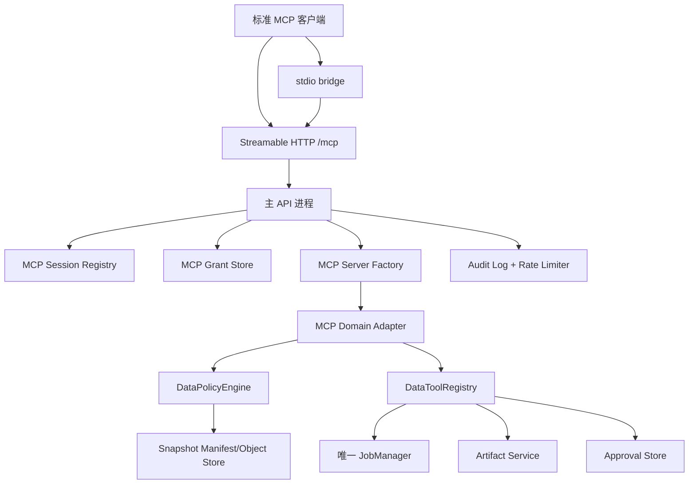

# MCP 全量实施规格书

> 项目：`xiaohongshu-relay-scraper-ui`
> 文档版本：`1.0.0`
> 编写日期：`2026-08-05`
> 交付对象：可直接交给编码 AI 执行的工程实施任务书
> 当前状态：方案已冻结；本文件只描述目标实现，不代表代码已经完成

## 0. 给编码 AI 的执行契约

你是本项目的实施工程师。必须按本文档执行，不得把任务缩减成“增加一个 `/mcp` 路由”或“把现有 JSON-RPC 接口换成 SDK”。最终交付必须包含代码、迁移、测试、启动脚本、文档和可验证的运行证据。

### 0.1 执行规则

1. 先阅读本文件和现有实现，再修改代码；不要先创建平行的 `JobManager`、平行数据目录或第二套授权逻辑。
2. 主 API 进程是唯一状态拥有者。所有 MCP 传输最终都必须调用同一套 `JobManager`、Copilot store、artifact service 和 policy engine。
3. 保留现有会话 MCP POST 接口至少一个版本周期，内部委托到新的 MCP 核心；不能复制两份工具实现。
4. 所有外部副作用都必须通过审批状态机和幂等键；模型不能自我批准。
5. 所有读取都绑定到显式 Grant 和快照；不能增加默认的“列出本地全部任务”能力。
6. 未完成的功能使用明确的 feature flag 隐藏，不用返回假成功、空数据或模拟审批。
7. 每个阶段结束都运行对应测试并记录命令、退出码、测试数量和已知失败；不能只报告“服务启动成功”。
8. 不得把 token、SMTP 密码、AI key、Relay 凭据、邮件正文或完整工具参数写入日志、示例配置或 Git。

### 0.2 完成判定

实现只有在以下条件同时满足时才算完成：

- 标准 MCP 客户端可以分别通过 stdio 和 Streamable HTTP 完成初始化、资源读取、工具调用和会话关闭。
- Grant、session、scope、tool allowlist、快照 revision/hash、风险等级和审批状态均经过服务端校验。
- 现有 Copilot、采集、附件、产物和邮件功能回归通过。
- API 重启、断线、过期 Grant、过期快照、重复请求和异常退出均有可预测行为。
- Windows 中文路径、空格路径、后台启动、端口冲突和 stdio 标准输出污染都有测试证据。
- 文档、示例配置、启动脚本和回滚步骤与实际代码一致。

## 1. 目标与边界

### 1.1 产品目标

把当前项目已有的会话内 MCP 能力升级成可被标准 MCP 客户端直接配置的本地数据服务，同时保留现有 Data Copilot 工作流。MCP 客户端只能访问用户明确授权的任务、对话、快照和工具集合。

### 1.2 交付传输

| 传输 | 用途 | 默认状态 | 说明 |
|---|---|---:|---|
| Streamable HTTP | API 已运行时的本地集成和未来远程反向代理 | 开启 | 主 API 内直接挂载 `POST/GET/DELETE /mcp`。 |
| stdio | 桌面客户端、脚本和本机单命令配置 | 开启 | `scripts/mcp-stdio.mjs` 是桥接器，不直接打开共享数据。 |
| 旧 HTTP+SSE | 兼容历史客户端 | 关闭 | 不作为新实现；只有明确需要时才增加单独兼容层。 |

官方 MCP 传输规范将 stdio 和 Streamable HTTP 作为标准传输，并定义了 HTTP 会话生命周期：[MCP Transport Specification](https://modelcontextprotocol.io/specification/2025-11-25/basic/transports)。SDK 使用 `@modelcontextprotocol/sdk@1.30.0`，将业务工具和资源接入标准协议层；不要手写第二套协议解析器。官方 SDK 的 v1.x 生产用法见：[TypeScript SDK](https://github.com/modelcontextprotocol/typescript-sdk)。

### 1.3 明确不做

- 不提供任意 shell、任意 HTTP、任意浏览器控制、任意文件系统读写工具。
- 不允许 MCP 模型自行登录 Relay、绕过邮件确认、绕过任务权限或修改原始任务快照。
- 不把本地所有任务、所有对话、AI 配置、SMTP 配置和浏览器 profile 暴露成资源。
- 不在 stdio 进程中再次初始化 `JobManager`。
- 不使用 `sessionId` 代替认证，不把 Bearer token 放入 URL、日志或提交到仓库。

## 2. 现有实现基线

编码 AI 必须先核对以下文件，不得根据 README 猜测接口：

| 文件 | 当前职责 | 实施影响 |
|---|---|---|
| [`server/index.mjs`](../server/index.mjs) | 初始化唯一 `JobManager`、Copilot store、policy、registry、MCP adapter 并创建 HTTP server | 新 transport、session、grant 必须在同一进程注入。 |
| [`server/mcp-data-adapter.mjs`](../server/mcp-data-adapter.mjs) | 自定义 JSON-RPC 的 `initialize`、`resources/*`、`tools/*` | 保留领域适配逻辑，将 wire protocol 移交 SDK。 |
| [`server/data-copilot-http.mjs`](../server/data-copilot-http.mjs) | 现有 `POST /api/copilot/conversations/:conversationId/mcp` | 作为兼容层，委托共享 MCP core。 |
| [`server/data-policy-engine.mjs`](../server/data-policy-engine.mjs) | conversation、job、snapshot、mode、scope 校验 | 修复多 scope 漏校验，新增 Grant、tool allowlist、风险限制和 hash 校验。 |
| [`server/data-tool-registry.mjs`](../server/data-tool-registry.mjs) | 约 36 个任务、数据集、内容、岗位、受众、扩展、附件、产物和邮件工具 | Registry 继续作为工具 schema 的唯一来源。 |
| [`server/copilot/production-store.mjs`](../server/copilot/production-store.mjs) | Copilot 持久化层和迁移入口 | 增加 MCP Grant、session、审计、审批和幂等记录。 |
| [`server/config.mjs`](../server/config.mjs) | API host、port、数据目录、请求上限和 Relay 配置 | 增加 MCP feature flags、session TTL、Grant TTL、限流和输出上限。 |
| [`server/data-copilot-http.test.mjs`](../server/data-copilot-http.test.mjs) | 现有 MCP HTTP 合约覆盖 | 作为回归基线；当前本轮 `npm run test:copilot-contract` 为 `23/23`。 |

当前已知缺口必须显式处理：

1. `mcp-data-adapter.mjs` 硬编码单一协议版本，不能协商。
2. 当前接口没有标准 HTTP session、`Mcp-Session-Id`、认证、Origin 防护、断连清理和会话恢复模型。
3. 当前快照主要依赖 job revision 相等检查，不是可回放的物理内容快照。
4. `authorizeTool()` 对声明的多 scope 只选择一个 required scope，必须改成所有声明 scope 都通过。
5. 当前 MCP 工具调用统一使用 `approved: false`，需要独立的“待审批 -> UI 批准 -> 同 action hash 执行”闭环。

## 3. 目标架构



### 3.1 四条不可破坏的不变量

#### 不变量 A：唯一状态拥有者

`server/index.mjs` 仍然是唯一启动 `JobManager` 的位置。stdio 启动时：

1. 读取本地 MCP 配置中的 API URL 和 Grant 引用。
2. 访问 `/api/mcp/health`。
3. API 不存在时，根据配置选择“返回清晰错误”或调用现有启动脚本；默认不自动启动第二个 Node API。
4. 将 stdio 请求转发到主 API 的内部 MCP session。
5. stdout 只输出 MCP 协议帧；所有诊断写 stderr。

#### 不变量 B：授权先于数据访问

每个请求必须经过：`transport authentication -> session lookup -> grant lookup -> conversation ownership -> reference validation -> snapshot validation -> scope/tool allowlist -> tool schema -> execution`。任何一步失败都不得执行 handler。

#### 不变量 C：快照失效即失败

任务 revision、快照 manifest hash 或对象 hash 不匹配时返回 `409 COPILOT_SNAPSHOT_STALE`，不得自动切换到最新任务数据。用户必须显式创建新 Grant 或执行 rebind。

#### 不变量 D：副作用可证明、可重复、可撤销

副作用请求先生成规范化 action payload 和 `actionHash`，进入待审批状态；批准时必须匹配同一个 `actionHash`，执行时使用幂等键，成功后消费审批记录。

## 4. Grant、Session 和快照模型

### 4.1 Grant 字段

```json
{
  "grantId": "mcpg_01J...",
  "conversationId": "conversation-123",
  "jobId": "job-456",
  "snapshotId": "snapshot-789",
  "snapshotRevision": 3,
  "snapshotManifestHash": "sha256:...",
  "mode": "application",
  "allowedScopes": ["dataset:read", "content:read", "artifact:read"],
  "toolAllowlist": ["task.status", "records.query", "artifact.list"],
  "riskCeiling": "read",
  "expiresAt": "2026-08-12T00:00:00.000Z",
  "status": "active",
  "createdBy": "local-user",
  "createdAt": "2026-08-05T00:00:00.000Z",
  "lastUsedAt": null,
  "tokenVersion": 1
}
```

规则：

- `grantId`、`conversationId`、`jobId`、`snapshotId` 不可为空。
- `mode` 只能是现有 `application` 或 `research`。
- `allowedScopes` 必须是模式允许集合的子集。
- `toolAllowlist` 为空表示“不允许任何工具”，不表示全量开放；需要全量时由服务端生成显式列表。
- `riskCeiling=read` 只允许 `read`；`draft` 允许草稿和预览；`approval` 只表示可以创建审批，不代表已批准；禁止配置 `execute` 作为客户端权限。
- token 明文只在创建响应中出现一次；数据库保存 `tokenHash`、`tokenVersion` 和 `lastUsedAt`。
- revoke、rotate、expire 后所有新请求失败；已有 session 不得继续执行工具。

### 4.2 Session 状态机

```text
new -> initialized -> active -> stale -> closed
                    |          |
                    +----------+
```

- `new`：只允许 `initialize`。
- `initialized`：已绑定 Grant，但尚未收到 `notifications/initialized`。
- `active`：可以读取资源和调用工具。
- `stale`：API 重启、Grant revoke、快照失效或 session TTL 超时；任何工具调用返回 409/401。
- `closed`：收到 DELETE、客户端关闭或服务清理；不能复用 session ID。

### 4.3 快照实现

增加 `SnapshotStore`，目录结构建议：

```text
data/copilot/snapshots/<snapshotId>/manifest.json
data/copilot/snapshots/<snapshotId>/objects/<sha256>
```

`manifest.json` 至少包含 `jobId`、`revision`、创建时间、数据集列表、相对路径、字节数、SHA-256、schema version。建立快照时复制或内容寻址去重原始数据；读取时只允许读取 manifest 中的对象。清理任务按 Grant 保留期限和 artifact 引用计数删除孤儿对象。

## 5. MCP 协议契约

### 5.1 initialize

客户端发送的 `protocolVersion` 由 SDK 进行协商；服务端不要在业务 adapter 中写死版本。响应必须包含：

```json
{
  "protocolVersion": "<negotiated>",
  "capabilities": {
    "resources": {"listChanged": true, "subscribe": false},
    "tools": {"listChanged": true},
    "logging": {}
  },
  "serverInfo": {
    "name": "xiaohongshu-data-copilot",
    "version": "<package.version>"
  },
  "instructions": "Access is limited to the explicitly bound Grant and immutable snapshot."
}
```

初始化前必须完成 Bearer token、Origin/Host、Grant、session 和绑定上下文校验；未认证请求只允许返回标准错误，不返回资源列表。

### 5.2 resources/list 与 resources/read

资源名称固定为：

| 资源 | URI | 数据来源 | 默认权限 |
|---|---|---|---|
| `applications` | `xhs-data://jobs/{jobId}/applications` | 快照数据集 | `applications:read` |
| `content` | `xhs-data://jobs/{jobId}/content` | 快照数据集 | `content:read` |
| `audience` | `xhs-data://jobs/{jobId}/audience` | comments/users/posts | `audience:read` |
| `expansion` | `xhs-data://jobs/{jobId}/expansion` | expansion snapshot | `expansion:read` |
| `attachments` | `xhs-data://conversations/{conversationId}/attachments` | conversation store | `attachment:read` |
| `artifacts` | `xhs-data://conversations/{conversationId}/artifacts` | artifact store | `artifact:read` |

资源读取要求：

- 支持 `limit`、`cursor`、`fields`，默认只返回摘要和第一页。
- 响应包含 `snapshotId`、`snapshotRevision`、`manifestHash`、`nextCursor`。
- 禁止把 1000 条以上数据一次性塞入 `contents[].text`。
- `attachments` 和 `artifacts` 只返回元数据；文件内容必须通过已有 artifact/attachment 服务按授权读取。
- URI 必须使用 `URL` 解析和严格 allowlist，拒绝 `..`、`file://`、绝对本地路径和未绑定的 job/conversation。

### 5.3 tools/list 与 tools/call

工具 schema 继续由 `DataToolRegistry.list()` 产生，MCP adapter 不重复维护第二份 JSON Schema。每个工具向 MCP 暴露以下元数据：

```json
{
  "name": "records.query",
  "description": "Query records in the bound immutable snapshot.",
  "inputSchema": {"type": "object", "properties": {}, "additionalProperties": false},
  "annotations": {
    "readOnlyHint": true,
    "destructiveHint": false,
    "idempotentHint": true,
    "openWorldHint": false
  },
  "_meta": {
    "version": "1.0.0",
    "scopes": ["dataset:read"],
    "risk": "read"
  }
}
```

工具分级：

| 等级 | 工具 | MCP 默认策略 |
|---|---|---|
| R0 read | `task.*`、`dataset.*`、`records.*`、`content.*`、`jobs.compare`、`audience.*`、`users.query`、`comments.query`、`expansion.*`、`artifact.list/preview` | 默认开放，但仍受 Grant allowlist 和 scope 控制。 |
| R1 draft | `applications.compose_email`、`email.prepare`、`email.preview`、`artifact.create` | 默认可选；只写草稿/本地 artifact，不产生外部副作用。 |
| R2 approval | `email.send`、任务 start/resume/cancel、Relay connect/recover/login | 默认不列入工具列表；启用后只能创建待审批动作。 |

工具执行上下文必须包含：

```js
{
  reference,
  grant,
  session,
  conversation,
  snapshot,
  signal,
  requestId,
  toolName,
  idempotencyKey,
  approvalContext
}
```

所有 handler 必须支持 `AbortSignal`、超时、最大行数和最大输出字节数。工具不得直接使用未经 policy 处理的 `input.jobId`、`input.path` 或 `input.conversationId` 覆盖绑定上下文。

### 5.4 错误契约

应用错误同时映射为 JSON-RPC/MCP 错误和稳定的 `data.code`：

| code | HTTP | 场景 |
|---|---:|---|
| `MCP_AUTH_REQUIRED` | 401 | 缺 token、token 无效或已过期。 |
| `MCP_SESSION_INVALID` | 404 | session 不存在、已关闭或不属于当前 Grant。 |
| `MCP_GRANT_REVOKED` | 403 | Grant 被撤销。 |
| `COPILOT_CONTEXT_MISMATCH` | 409 | 对话、任务、快照绑定不一致。 |
| `COPILOT_SNAPSHOT_STALE` | 409 | revision/hash 已变化。 |
| `COPILOT_SCOPE_DENIED` | 403 | scope 或工具 allowlist 不允许。 |
| `COPILOT_APPROVAL_REQUIRED` | 409 | 已生成待审批动作，尚未执行。 |
| `MCP_LIMIT_EXCEEDED` | 413/429 | body、响应、行数、并发或速率超限。 |
| `MCP_TOOL_TIMEOUT` | 504 | 工具超时且已取消。 |
| `MCP_IDEMPOTENCY_CONFLICT` | 409 | 相同幂等键对应不同 action hash。 |

错误消息不能包含 token、路径中的敏感目录、SMTP/AI 配置或完整邮件正文。

## 6. Grant 管理 API

### 6.1 创建 Grant

`POST /api/mcp/grants`

请求：

```json
{
  "conversationId": "conversation-123",
  "jobId": "job-456",
  "snapshotId": "snapshot-789",
  "mode": "research",
  "scopes": ["dataset:read", "content:read"],
  "toolAllowlist": ["task.status", "records.query", "content.inspect"],
  "riskCeiling": "read",
  "ttlSeconds": 604800
}
```

响应只返回一次明文 token：

```json
{
  "grant": {"grantId": "mcpg_01J...", "status": "active", "expiresAt": "..."},
  "token": "mcp_grant_...",
  "tokenShownOnce": true,
  "stdioConfig": {"command": "node", "args": ["scripts/mcp-stdio.mjs", "--grant-id", "mcpg_01J..."]}
}
```

### 6.2 管理动作

| 路由 | 行为 | 约束 |
|---|---|---|
| `GET /api/mcp/grants` | 列出当前用户的 Grant | 永不返回 token。 |
| `GET /api/mcp/grants/:id` | 查看状态和绑定 | 不返回敏感参数。 |
| `DELETE /api/mcp/grants/:id` | 撤销 Grant | 立即关闭关联 session。 |
| `POST /api/mcp/grants/:id/rotate` | 生成新 token | 旧 token 立即失效。 |
| `POST /api/mcp/grants/:id/rebind` | 绑定新 snapshot | 必须指定新的 conversation/job/snapshot，不能静默 rebind。 |
| `GET /api/mcp/health` | 查看 MCP 传输和版本 | 不泄漏 token、任务内容或凭据。 |

所有管理 API 复用现有 conversation ownership 和本地用户边界，不允许仅凭 `grantId` 访问别人的 Grant。

## 7. 审批与幂等流程

### 7.1 创建待审批动作

1. MCP 客户端调用 R2 工具。
2. 服务端校验 Grant 的 `riskCeiling`、scope 和 tool allowlist。
3. 规范化输入：排序对象键、去除无意义空白、固定默认值。
4. 计算 `actionHash = SHA256(toolName + normalizedInput + grantId + snapshotId)`。
5. 保存 `pending` 审批记录并返回 `COPILOT_APPROVAL_REQUIRED`、`approvalId`、`actionHash`、摘要和过期时间。
6. Data Copilot UI 显示摘要，由用户显式批准或拒绝。
7. 客户端重试同一工具调用；服务端要求相同 `approvalId`、`actionHash`、Grant 和幂等键。
8. 执行一次后状态变为 `consumed`；同一幂等键再次调用返回历史结果，不重复产生副作用。

### 7.2 禁止实现

- 不增加可被 MCP 客户端直接调用的 `approval.confirm` 工具。
- 不把现有 Copilot 的普通 continue/run 请求当成 MCP 审批状态机。
- 不根据工具名猜测批准状态；必须使用持久化 action hash。
- 不允许审批跨 Grant、跨 snapshot 或跨用户复用。

## 8. 文件级实施清单

### 8.1 新增文件

```text
server/mcp/server-factory.mjs
server/mcp/sdk-adapter.mjs
server/mcp/streamable-http-transport.mjs
server/mcp/context-resolver.mjs
server/mcp/grant-store.mjs
server/mcp/session-registry.mjs
server/mcp/snapshot-store.mjs
server/mcp/approval-coordinator.mjs
server/mcp/audit-log.mjs
server/mcp/rate-limiter.mjs
scripts/mcp-stdio.mjs
scripts/mcp-smoke.mjs
scripts/setup-mcp.ps1
config/mcp-client.example.json
docs/MCP_SERVER.md
src/McpConnectionPanel.tsx
server/mcp/*.test.mjs
tests/mcp-stdio.integration.test.mjs
tests/mcp-security.test.mjs
```

### 8.2 修改文件

```text
package.json
package-lock.json
.env.example
.gitignore
server/config.mjs
server/index.mjs
server/app.mjs
server/data-copilot-http.mjs
server/mcp-data-adapter.mjs
server/data-policy-engine.mjs
server/data-tool-registry.mjs
server/copilot/production-store.mjs
server/data-copilot-service.mjs
src/api.ts
src/types.ts
src/styles.css
scripts/one-click.ps1
```

### 8.3 不得重复的职责

| 职责 | 唯一实现位置 |
|---|---|
| 工具定义和 schema | `DataToolRegistry` |
| conversation/job/snapshot/scope 规则 | `DataPolicyEngine` + `McpContextResolver` |
| 资源业务读取 | `McpDataAdapter` |
| MCP 协议协商和 transport | 官方 SDK + `server/mcp/*transport*` |
| Grant 生命周期 | `GrantStore` |
| session 生命周期 | `SessionRegistry` |
| 审批和幂等 | `ApprovalCoordinator` + production store |
| 审计和限流 | `AuditLog` + `RateLimiter` |

## 9. 分阶段实施任务

### P0：基线和 ADR，1 天

- [ ] 记录现有 MCP 请求/响应和 23 项合约测试。
- [ ] 加入 `docs/ADR-MCP-SINGLE-STATE-OWNER.md`，写明禁止第二个 `JobManager`。
- [ ] 确定 SDK 版本、Node 版本、HTTP endpoint、stdio 配置格式和 feature flags。
- [ ] 建立兼容矩阵：至少标准 HTTP 客户端、stdio 客户端和现有 Copilot endpoint。
- [ ] 产出：ADR、协议矩阵、基线测试报告。

### P1：标准 SDK 核心，2–3 天

- [ ] 安装并锁定 `@modelcontextprotocol/sdk@1.30.0`。
- [ ] 实现 `McpServerFactory`，从现有 registry 动态生成 tools/resources。
- [ ] 将 `initialize`、`ping`、list/read/call、notifications 交给 SDK。
- [ ] 保留 `McpDataAdapter` 的业务读取和调用逻辑。
- [ ] 增加标准错误映射、结构化输出、文本输出和 `AbortSignal`。
- [ ] 为资源添加 cursor、limit、snapshot metadata。
- [ ] 产出：共享 MCP core，旧 endpoint 仍通过 core 工作。

### P2：Grant、安全、快照，3–4 天

- [ ] 完成 `mcp_grants` schema、token hash、创建/列表/撤销/轮换/过期。
- [ ] 修复 `authorizeTool()`：每个 declared scope 必须存在于注册策略，并全部经过 mode/configured Grant 验证。
- [ ] 增加 tool allowlist、risk ceiling 和 grant expiration 检查。
- [ ] 增加 SnapshotStore、manifest/hash、对象读取和清理策略。
- [ ] 增加 Origin/Host allowlist、Bearer 校验、请求/响应上限和审计脱敏。
- [ ] 产出：攻击性测试通过，过期数据 fail-closed。

### P3：双传输，3–4 天

- [ ] 在主 API 挂载 `POST/GET/DELETE /mcp`。
- [ ] 实现 `Mcp-Session-Id` registry、TTL、断连清理和重启后的重新初始化。
- [ ] 实现 stdio bridge，stdout 只输出协议，stderr 输出诊断。
- [ ] 处理 API 已运行、API 未运行、端口冲突、Grant 失效和 API 重启。
- [ ] 编写 `scripts/setup-mcp.ps1`，使用用户级凭据存储或 ACL 保护的 token 文件。
- [ ] 产出：真实客户端双传输冒烟测试。

### P4：完整工具和审批，3–5 天

- [ ] 将现有约 36 个工具按 R0/R1/R2 分类并写入 registry metadata。
- [ ] 加入 task start/resume/cancel/status/progress，但长任务必须立即返回 job/attempt ID。
- [ ] 实现 `mcp_action_approvals`、action hash、UI 批准、消费和结果复用。
- [ ] 绑定统一幂等键，拒绝同 key 不同 payload。
- [ ] 实现工具取消、超时、并发限制、最大行数和最大字节数。
- [ ] 产出：审批、重复调用、断线重试和任务进度测试。

### P5：产品 UI 和文档，2–3 天

- [ ] 新增 MCP Connection Panel：选择 conversation/job/snapshot、scope、工具和 TTL。
- [ ] token 只显示一次，并提供 stdio/HTTP 配置复制按钮。
- [ ] 显示 active/revoked/expired/stale 状态、最后使用时间和 session 数量。
- [ ] 提供 rotate、revoke、rebind 和健康检查。
- [ ] 更新 README、`docs/MCP_SERVER.md`、环境变量说明和示例配置。
- [ ] 产出：可由非开发用户完成本地连接配置。

### P6：验收、打包、发布，2–3 天

- [ ] 运行全部单元、API、MCP、E2E、Python、build 和凭据扫描。
- [ ] 在隔离端口和隔离数据目录进行真实任务/对话/产物验收。
- [ ] 验证 Windows 中文路径、空格路径、双击 launcher、隐藏后台进程和 stdout 零杂音。
- [ ] 生成不含 Git、历史、token、browser profile、缓存和本地运行数据的干净 ZIP。
- [ ] 记录发布版本、迁移版本、测试报告、已知限制和回滚演练结果。

## 10. 配置项

在 `server/config.mjs` 和 `.env.example` 增加以下配置，所有值都必须有安全默认值：

```dotenv
MCP_ENABLED=true
MCP_HTTP_ENABLED=true
MCP_STDIO_ENABLED=true
MCP_REMOTE_ENABLED=false
MCP_PATH=/mcp
MCP_SESSION_TTL_SECONDS=3600
MCP_GRANT_TTL_SECONDS=604800
MCP_MAX_REQUEST_BYTES=1048576
MCP_MAX_RESPONSE_BYTES=2097152
MCP_MAX_RESOURCE_ROWS=50
MCP_MAX_TOOL_ROWS=200
MCP_TOOL_TIMEOUT_MS=30000
MCP_LONG_TASK_TIMEOUT_MS=5000
MCP_MAX_CONCURRENT_PER_GRANT=4
MCP_RATE_LIMIT_PER_MINUTE=120
MCP_ALLOWED_ORIGINS=http://127.0.0.1:5173
MCP_STDIO_API_URL=http://127.0.0.1:4317
MCP_TOKEN_STORE=windows-credential-manager
```

约束：

- `MCP_REMOTE_ENABLED=false` 时只允许 loopback host；不能通过环境变量把监听地址无意中暴露到公网。
- `MCP_ALLOWED_ORIGINS` 不允许 `*`。
- 所有数字配置在代码中再次做 min/max 校验。
- `MCP_LONG_TASK_TIMEOUT_MS` 只限制创建任务请求，不限制后台任务本身。

## 11. 安全与性能验收

### 11.1 安全用例

- 缺失 token、错误 token、过期 token、撤销 token、轮换后的旧 token。
- 伪造或跨用户 `Mcp-Session-Id`。
- Grant 绑定的 conversation/job/snapshot 任一字段不匹配。
- declared scopes 少于工具要求、包含额外 scope、scope 不属于 mode。
- tool allowlist 不包含工具、risk ceiling 不足、R2 工具无审批。
- `xhs-data://` URI 中的 `..`、编码斜杠、绝对路径、`file://`、其他 jobId。
- 恶意 Origin、Host/DNS rebinding、超大 JSON、超大响应、并发轰炸。
- 日志、错误、审计、artifact metadata 中搜索 token、密钥和完整邮件正文。

### 11.2 稳定性用例

- API 重启后旧 session 失效，Grant 可以重新 initialize。
- Grant TTL、session TTL、审批 TTL 和 snapshot stale 的边界时间。
- 工具 AbortSignal 在 handler 前、handler 中和 handler 后触发。
- 同一幂等键重试、同一 key 不同 payload、网络断开后的重连。
- API 启动期间 stdio 请求、端口已占用、主 API 非正常退出。

### 11.3 性能基线

- 资源首屏不超过 50 行；工具查询默认不超过 200 行。
- 普通读取 p95 小于 2 秒；超出 30 秒必须取消或转成长任务。
- 单 Grant 默认最多 4 个并发工具调用。
- 单请求 1 MB、单响应 2 MB；大结果写 artifact 并返回 artifact 引用。
- 审计写入不能阻塞主数据读取；失败时保留最小错误事件并触发诊断。

## 12. 测试命令和报告格式

新增脚本：

```json
{
  "start:mcp": "node scripts/mcp-stdio.mjs",
  "test:mcp": "node --test server/mcp/*.test.mjs tests/mcp-stdio.integration.test.mjs tests/mcp-security.test.mjs",
  "smoke:mcp": "node scripts/mcp-smoke.mjs"
}
```

实施完成时至少执行：

```powershell
npm run lint
npm run typecheck
npm run test:mcp
npm run test:copilot-contract
npm run test:api
npm run test:e2e
npm run test:python
npm run build
npm run test:credentials
```

每份报告使用以下格式：

```text
command: npm run test:mcp
exit_code: 0
tests: 00 passed, 00 failed
environment: isolated port / isolated data dir
evidence: <absolute report path>
known_gaps: none
```

禁止用以下内容代替验收：单一 HTTP 200、只检查 `/health`、只检查 `tools/list`、只运行 fixture、只确认端口监听、只确认前端页面打开。

## 13. 发布、兼容和回滚

### 13.1 发布顺序

1. 先发布只读 R0，`MCP_REMOTE_ENABLED=false`。
2. 运行真实任务、快照、附件和 artifact 验收。
3. 开启 R1 草稿和本地 artifact。
4. 审批 UI、action hash、幂等和审计全部通过后，逐项开启 R2。
5. 保留旧 Copilot MCP endpoint 一个版本周期，再移除其重复协议代码。

### 13.2 回滚策略

- 协议问题：关闭 `MCP_HTTP_ENABLED` 或 `MCP_STDIO_ENABLED`，保留现有 Copilot API。
- 授权问题：全局将 Grant 风险降为 `read`，不删除 Grant 数据。
- 快照问题：停止新建 Grant，保留旧 snapshot 对象，待修复后重新绑定。
- 数据库问题：仅执行向前兼容迁移；不得删除旧列、覆盖 Copilot store 或回滚现有任务文件。
- 包发布问题：恢复上一个 package lock 和代码版本，保留新增 MCP 表以便再次迁移。

## 14. 最终交付物清单

- [ ] 标准 Streamable HTTP MCP 服务。
- [ ] stdio bridge 和 Windows 配置脚本。
- [ ] Grant/session/snapshot/audit/approval/idempotency 持久化。
- [ ] 6 类资源和 R0/R1/R2 工具暴露策略。
- [ ] 全 scope 授权修复和 snapshot fail-closed。
- [ ] 连接管理 UI、撤销、轮换、rebind、健康检查。
- [ ] MCP 协议、集成、安全、回归、E2E 和 Windows 测试。
- [ ] `.env.example`、客户端配置示例、README、运行手册、故障排查和回滚文档。
- [ ] 干净 ZIP、manifest、测试报告和实际运行证据。

## 15. 推荐的首个编码任务批次

按以下顺序开始，不要同时修改所有模块：

1. 添加 SDK 依赖、创建 `server/mcp/` 目录和 P0 ADR。
2. 从 `McpDataAdapter` 抽取 `McpServerFactory`，让现有 endpoint 通过共享 core 运行。
3. 先实现 GrantStore 和全 scope policy 修复，再接 HTTP session。
4. 加入只读 R0 的 Streamable HTTP，使用真实任务/快照跑集成测试。
5. 实现 stdio bridge，确认 stdout 只有协议帧。
6. 最后加入 UI、审批、R1/R2 和发布打包。

每个任务提交前都必须更新本文档中对应的复选框、测试报告和已知限制；当代码行为与本文档不一致时，先修改实现或提交明确的 ADR，不得默默偏离。
