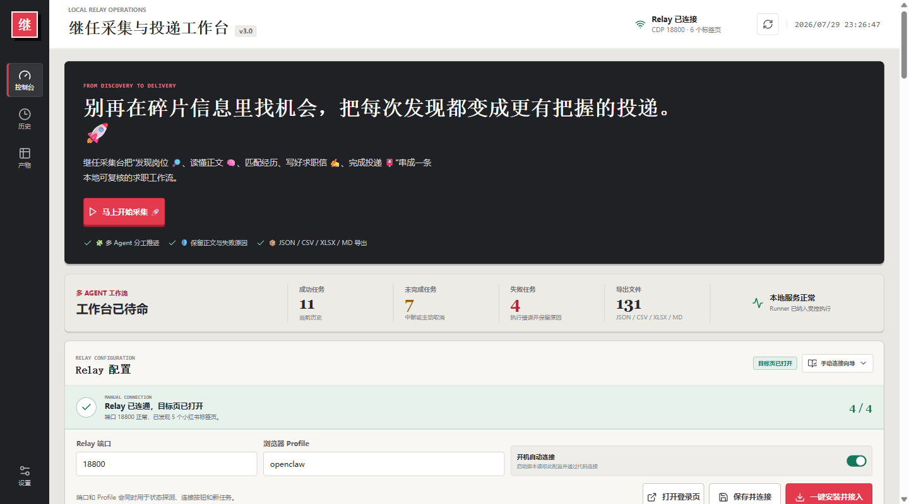
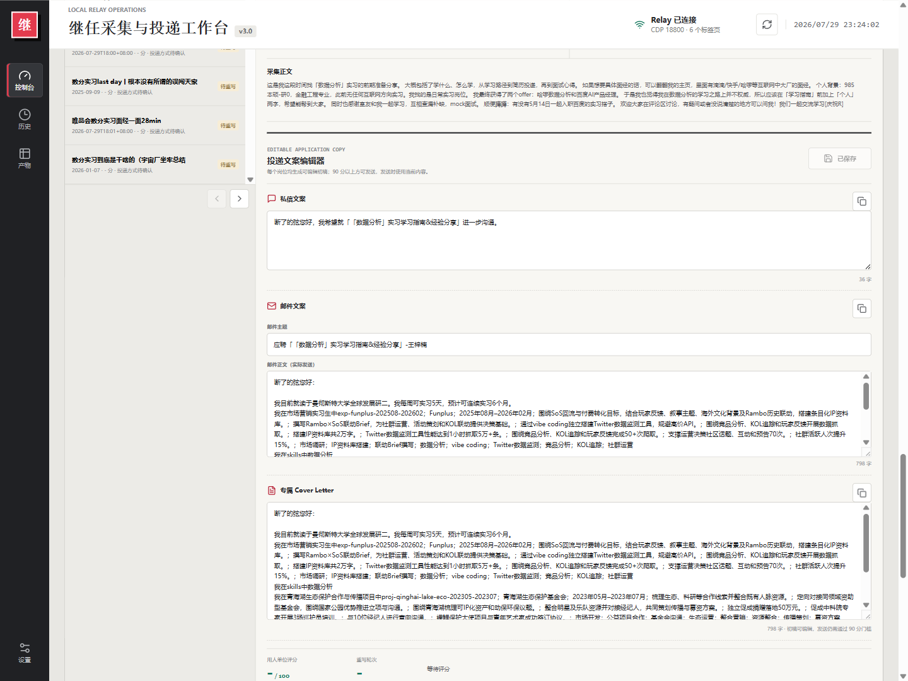
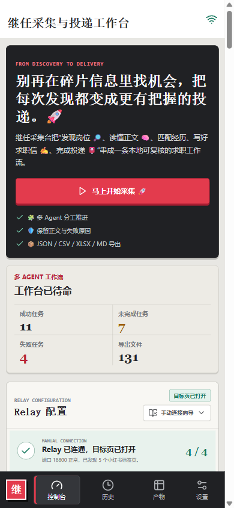
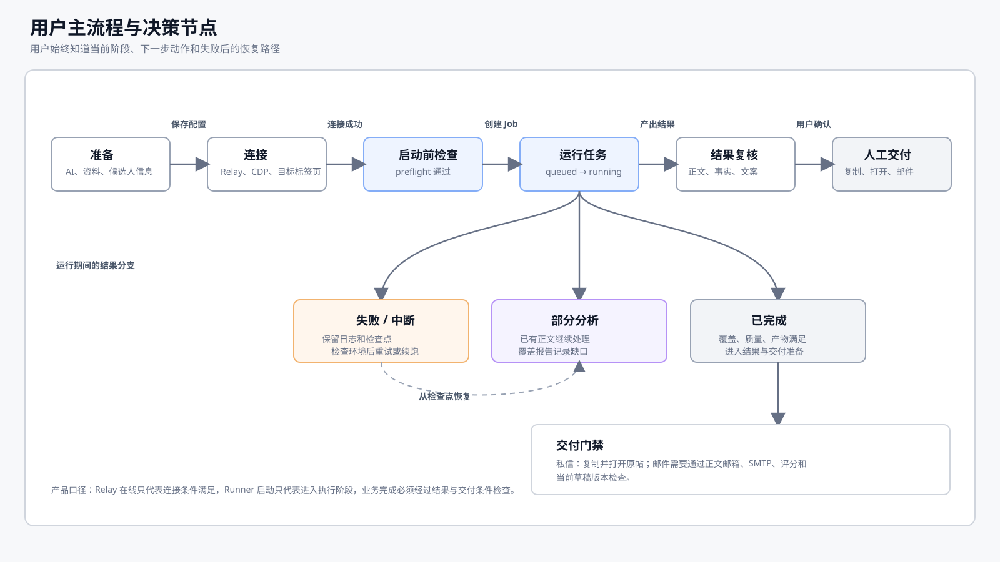
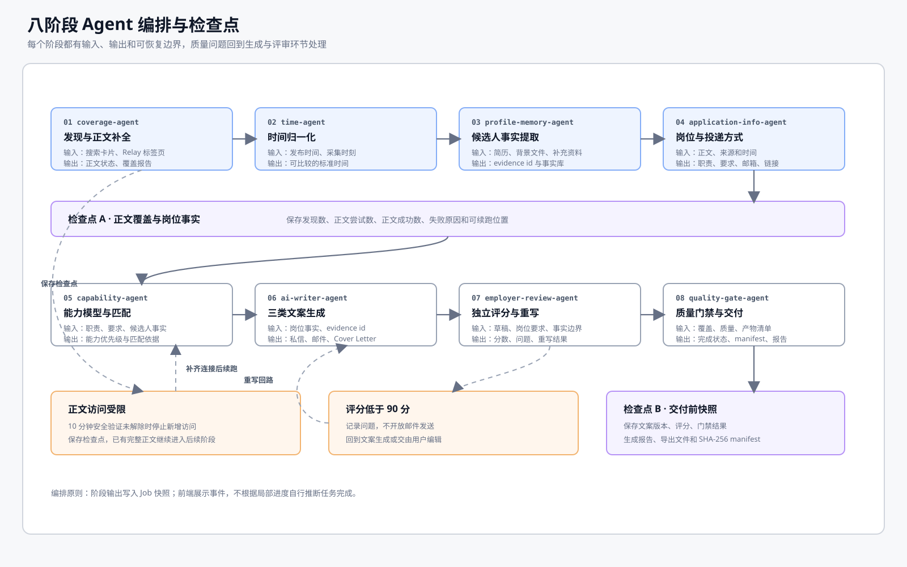
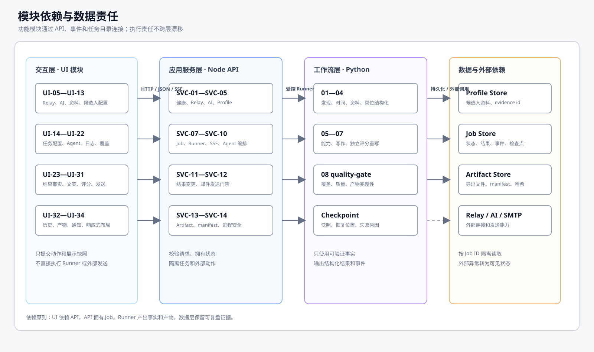
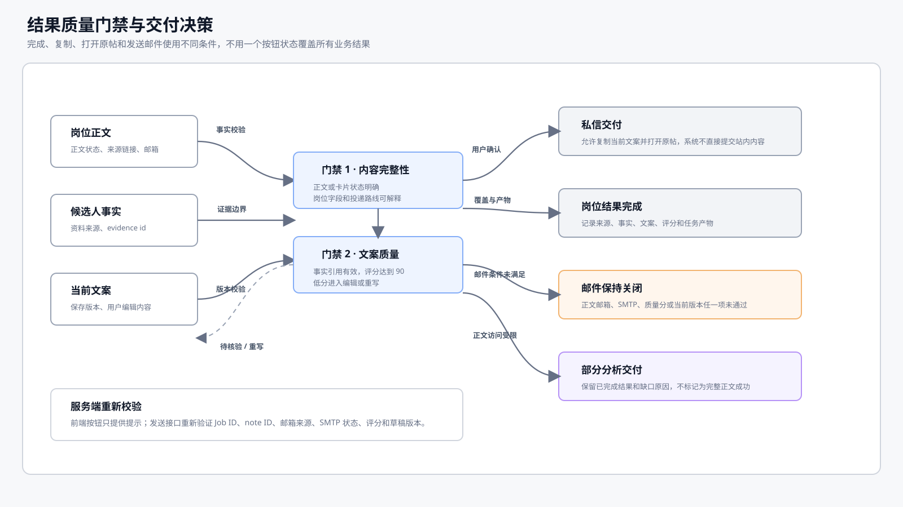
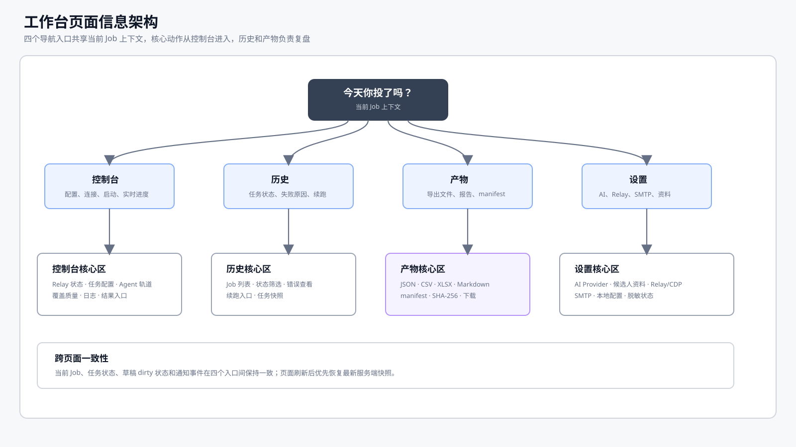
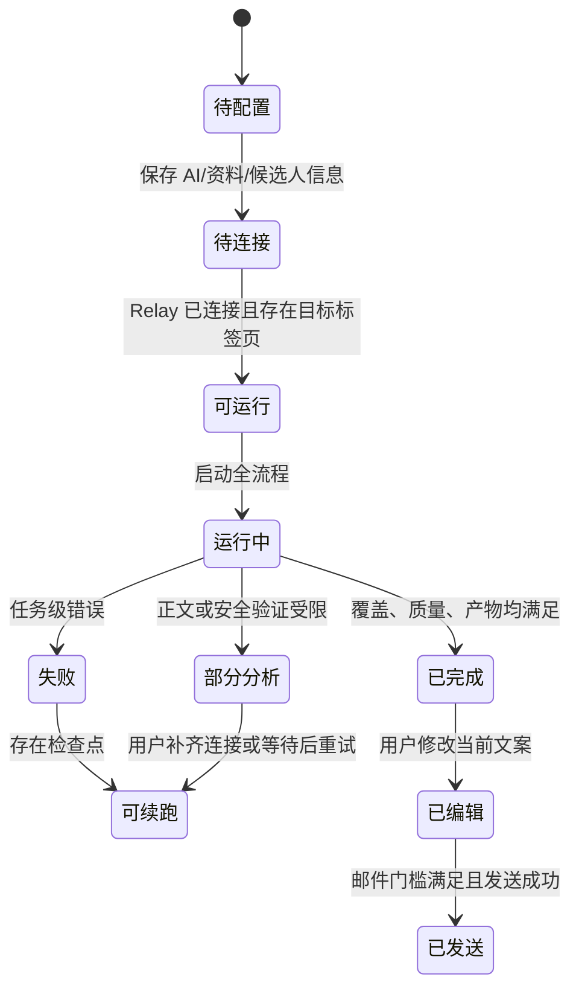
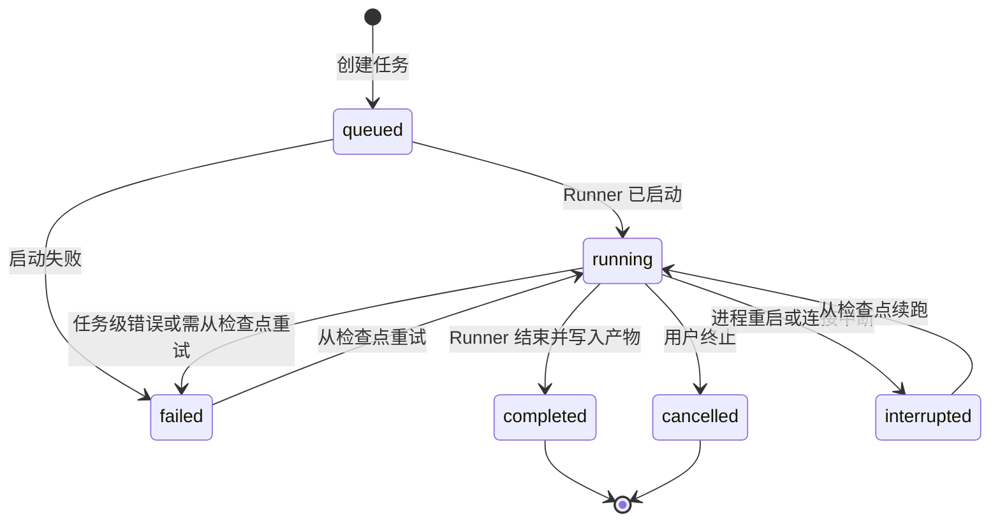

# 继任采集与投递工作台 PRD

**版本**：1.6
**状态**：当前版本产品定义，已补齐完整功能模块、逐模块详细规格、产品架构图、流程图、模块依赖图、质量门禁图和页面截图，可直接作为个人开发与自测基线
**日期**：2026-07-30
**产品形态**：本地优先的 Web 工作台

## 文档控制

| 项目 | 内容 |
| --- | --- |
| 自检状态 | 功能清单已与当前 UI、API、工作流和产物目录对齐 |
| 需求基线 | 本文为 v1.6 的产品基线；任何新增功能必须补充模块编号、需求编号、验收标准和埋点 |
| 变更原则 | 先更新 PRD，再修改代码；涉及数据结构、发送门禁和任务状态的改动必须同步更新架构、数据契约和自测清单 |
| 当前结论 | P0 闭环为“配置 -> 检查 -> 采集 -> 结构化 -> 生成 -> 质量门禁 -> 人工确认 -> 交付”；默认流程采用人工确认发送 |

### 一页产品摘要

| 维度 | 决策 |
| --- | --- |
| 要解决的问题 | 求职者从公开岗位发现到人工投递准备的链路长、信息分散、文案容易失真、任务失败难以复盘 |
| 核心用户 | 持续寻找实习/初级岗位的个人求职者；次级用户为职业顾问和求职运营人员 |
| 核心体验 | 用户始终知道“系统正在处理什么、依据是什么、哪里失败、下一步做什么” |
| 核心结果 | 每条岗位结果具备来源、正文状态、结构化字段、事实依据、可编辑文案、质量状态和可下载产物 |
| 关键约束 | 本地优先；不绕过平台安全机制；私信由用户确认；邮件必须经过正文邮箱、SMTP 和质量门禁三重校验 |
| P0 成功条件 | 任务可启动、可恢复、可解释、可导出；结果不把卡片摘要冒充完整正文；低质量或无证据文案不可发送 |
| 本版本不做 | 自动发布私信/评论、绕过验证码或限制、跨账号运营、复杂 CRM、自动批量投递 |

### 版本记录

| 版本 | 日期 | 变更摘要 |
| --- | --- | --- |
| 1.6 | 2026-07-30 | 为 34 个 UI 模块和 14 个服务模块补充逐项业务目标、主流程、状态、数据边界、异常和验收标准 |
| 1.5 | 2026-07-30 | 增加用户主流程、八阶段 Agent 编排、模块依赖、质量门禁和页面信息架构五类图表，并补充图表与需求的对应关系 |
| 1.4 | 2026-07-30 | 补充完整产品架构图、数据流与交付物关系、任务状态机图、分层职责和架构验收要求 |
| 1.3 | 2026-07-30 | 收敛视觉版表达，补充页面与功能对应关系，统一截图、正文和阅读入口 |
| 1.2 | 2026-07-29 | 升级为完整规格文档，补充目标/范围、用户旅程、业务规则、FR、状态机、数据契约、NFR、指标埋点、发布门禁和待确定设置 |
| 1.1 | 2026-07-29 | 补充 34 个 UI/工作台模块、14 个后端服务模块、依赖关系和截图 |
| 1.0 | 2026-07-29 | 初版产品定义、核心流程、Agent、结果、历史和产物范围 |

## 0. 阅读说明

这份 PRD 分为视觉版和规格正文两部分：

1. **视觉版**：打开 [PRD.html](./PRD.html)，查看当前页面、一次任务的使用路径、功能范围和版本要求。
2. **规格正文**：从第 1 章开始阅读目标、规则、全量模块、需求编号、验收标准和发布门禁。

### 页面概览



**产品定位**：这是一个本地优先的岗位采集与投递准备工作台，覆盖公开岗位发现、正文补全、岗位理解、候选人事实匹配、投递文案和人工确认。

| 用户看到的产品信号 | 对应产品承诺 |
| --- | --- |
| 顶部 Relay 状态和连接步骤 | 先告诉用户系统是否真的待命，再允许启动任务 |
| 中部 Agent 进度与覆盖统计 | 让用户知道任务处理到哪一步，区分发现、正文尝试和正文成功 |
| 结果区的来源、证据、评分和编辑器 | 让每次投递准备都可核对、可修改、可追溯 |
| JSON/CSV/XLSX/Markdown/manifest 产物 | 让一次运行结果能复盘、下载和继续使用 |

### 页面与功能对应关系

| ① 工作台待命 | ② 岗位事实与文案 | ③ 移动端状态 |
| --- | --- | --- |
|  |  |  |
| 配置 Relay、查看服务状态、启动采集 | 先看正文和证据，再编辑私信/邮件/Cover Letter | 随时查看任务、失败和导出状态 |

> 这三张图是当前版本真实运行态截图；截图中的任务数量、时间和岗位文字仅用于说明界面，不作为业务指标。

## 1. 产品概述

继任采集与投递工作台面向需要持续寻找实习或初级岗位的求职者，把小红书公开岗位/求职信息的发现、正文采集、岗位结构化、候选人经历匹配、投递文案生成和人工确认投递串成一条可复核流程。

产品的核心承诺是：**让每条岗位机会都留下来源、正文状态、事实依据、文案版本和可下载交付物**。涉及私信或外部页面的动作始终由用户确认；邮件仅在满足质量门槛、收件地址来自岗位正文且本机发件配置可用时开放发送。

## 2. 用户与问题

### 2.1 目标用户

| 用户 | 典型场景 | 主要诉求 |
| --- | --- | --- |
| 实习求职者 | 每天从社交平台发现岗位、经验帖和内推信息 | 减少复制粘贴，快速判断岗位是否值得投 |
| 应届生/转行者 | 岗位要求分散在卡片、正文和评论中 | 把岗位要求和个人经历放到同一张可核对的岗位卡 |
| 求职运营/职业顾问 | 需要批量整理岗位并保留过程记录 | 可续跑、可导出、可追溯，避免结果只存在聊天窗口 |

### 2.2 用户痛点

1. 岗位卡片常常不包含完整职责、要求、联系方式和投递入口。
2. 用户需要在岗位正文、简历、个人背景和文案编辑器之间反复切换。
3. 生成式文案容易加入简历中不存在的经历、数字或联系方式。
4. 浏览器登录、Relay、AI、正文访问限制等任一环节失败后，用户难以判断任务到底完成到哪一步。
5. 批量采集的原始数据、结构化结果和最终文案缺少统一的导出与复盘入口。

## 3. 产品目标与非目标

### 3.1 产品目标

- 用一个本地工作台完成“发现岗位 -> 补全正文 -> 结构化分析 -> 生成文案 -> 人工投递准备”。
- 用八阶段 Agent 轨道展示阶段进度、阶段产出和失败原因。
- 以岗位正文、候选人材料和 evidence id 作为文案事实边界，禁止把未知信息写成已知事实。
- 支持全量发现、限定数量、最新/综合排序、时间范围、随机节奏和检查点续跑。
- 输出 JSON、CSV、XLSX、Markdown 和 manifest，方便复盘、二次分析与归档。
- 将“任务是否完成”定义为覆盖、质量和交付物同时满足；仅启动进程不计入完成。

### 3.2 非目标

- 不替用户自动发布小红书私信、评论或其他站内内容。
- 不绕过登录、验证码、访问限制或平台安全机制。
- 不把卡片摘要直接当作完整正文成功结果。
- 不在没有岗位正文证据时猜测邮箱、公司、职位要求、业绩数字或候选人经历。
- 不把一次运行截图中的任务数量、导出数量当作长期业务指标。

### 3.3 产品原则与成功定义

#### 产品原则

1. **证据优先**：岗位事实、候选人经历和投递目标都必须能回溯到来源；无法确认的内容显示待核验，不用模型猜测补齐。
2. **状态可解释**：任何失败、部分分析、等待登录、等待安全验证和发送失败都必须显示状态、原因和下一步动作。
3. **人工确认在环**：系统负责发现、整理、生成和校验，用户负责最终编辑、复制、打开原帖和确认外发。
4. **任务可恢复**：长任务必须产生检查点；刷新页面、进程重启或 Relay 暂时断开不应让用户失去已完成结果。
5. **本地最小暴露**：默认只监听本机，敏感凭据不进入日志、任务参数、截图和导出文件。
6. **结果定义成功**：Relay 在线、进程启动、AI 返回草稿均不足以单独定义任务成功。

#### 成功定义（Definition of Success）

一次正式任务只有同时满足以下条件才可标记为 `completed`：

- 所有发现的可访问文章均保存完整正文，或在安全验证超时后明确标记为部分分析并保存原因。
- 每条可分析记录均具备来源、发布时间或缺失原因、职责/要求、投递方式和核心能力字段。
- 每条可生成记录均具备独立的私信、邮件和 Cover Letter 草稿，且个人事实来自候选人材料。
- 用人单位评分达到用户阈值；默认阈值为 90 分，低于阈值只能进入重写或待人工处理。
- 工作流摘要、结构化导出文件、覆盖报告和 SHA-256 manifest 均存在且可解析。

以下状态均不等于成功：仅启动服务、Relay 在线、仅拿到搜索卡片、仅生成固定数量结果、AI 仅返回未校验草稿。

### 3.4 版本范围与优先级

| 优先级 | 本版本范围 | 交付判定 |
| --- | --- | --- |
| P0 | Relay/AI/资料配置、启动前检查、全量正文采集、八阶段 Agent、实时状态、结果详情、文案编辑、质量门禁、历史续跑、标准产物、邮件门禁发送 | 端到端闭环可运行，核心验收 AC-01 至 AC-12 全部通过 |
| P1 | 结果筛选、只看可投递岗位、任务对比、批量导出、阶段耗时、失败类型统计、发送记录与重试 | 不改变 P0 数据契约；可在 P0 任务上增量使用 |
| P2 | 多账号工作空间、团队协作、岗位 CRM、自动跟进、跨平台来源、权限中心和运营看板 | 保留为后续扩展，不纳入当前版本 |

本版本任何需求降级时，必须优先保留来源、状态、证据、检查点和产物完整性；不得为了提高“成功数量”而删除失败原因或放宽发送门禁。

## 4. 产品架构与核心价值链

### 4.1 完整产品架构图

产品由交互层、应用服务层、工作流层、数据与交付层组成；Relay、AI Provider、SMTP 和浏览器标签页属于外部依赖，必须通过受控接口接入。架构图表达模块职责和数据边界，不代表必须拆成独立部署节点。


| 层级 | 核心职责 | 明确不负责的事情 | 主要接口与证据 |
| --- | --- | --- | --- |
| 用户与外部依赖 | 用户配置、浏览器登录态、公开岗位来源、AI 推理和邮件投递 | 不由系统代替用户确认站内私信；外部服务不直接写入本地任务状态 | Relay/CDP、AI Provider、SMTP、来源链接、发送结果 |
| 交互层 React Web 工作台 | 展示健康状态、创建任务、查看 Agent、编辑结果、下载产物 | 不直接启动 Python、调用外部页面或绕过服务端门禁 | HTTP JSON、SSE、页面状态、草稿 dirty 状态 |
| 应用服务层本地 Node API | 校验请求、持久化 Job、管理 Runner、推送事件、校验下载和发送条件 | 不把 API Key 写入 Job、日志或导出；不让前端直接改状态 | `/api/*`、Job Manager、Artifact API、邮件门禁 |
| 工作流层 Python Runner 与八阶段 Agent | 发现正文、归一化时间、提取岗位和候选人事实、生成与检查文案、形成检查点 | 不把卡片摘要伪装为完整正文；不超出 evidence id 生成候选人经历 | JSON Schema、checkpoint、coverage、workflow summary |
| 数据与交付层本地隔离目录 | 保存 Profile、Job、事件、结果、草稿、产物和 manifest | 不允许跨 Job 读取产物；不把敏感凭据混入历史和交付文件 | `data/profiles`、`data/jobs`、artifact manifest、SHA-256 |

### 4.2 数据流与交付物

数据流要求每一步都有来源、处理动作和可检查产物。配置和候选人资料进入任务前要完成校验；岗位事实进入文案生成前要完成正文/卡片状态标记；外发动作只读取当前已保存草稿，不读取模型临时响应。


| 数据对象 | 输入 | 处理 | 输出 | 可验证证据 |
| --- | --- | --- | --- | --- |
| `RunConfig` | 关键词、排序、数量、时间范围、Relay 和模型配置 | 启动前检查、脱敏和版本化 | `Job.config`、preflight 结果 | 配置快照、检查项和错误原因 |
| `SourceRecord` | 搜索卡片、正文、来源链接和采集时间 | 去重、正文补全、时间归一化 | 岗位事实和覆盖报告 | note ID、body status、访问失败原因 |
| `CandidateProfile` | 简历、背景文件、用户补充资料 | 提取事实、生成 evidence id | 文案可引用的候选人事实 | source file、evidence id、解析状态 |
| `JobEvent/Checkpoint` | Runner 日志、Agent 进度、连接状态 | 持久化、SSE 推送、恢复判断 | 历史时间线和续跑入口 | Job ID、事件时间、触发来源、检查点 |
| `Draft` | 岗位事实、候选人事实、用户编辑 | 生成、独立评分、保存版本 | 私信、邮件、Cover Letter | draft version、评分、问题清单、保存时间 |
| `Artifact` | 结果、报告、导出文件和 manifest | 按 Job 隔离、哈希校验、下载 | JSON/CSV/XLSX/Markdown/manifest | 文件大小、SHA-256、artifact ID |

### 4.3 架构约束与验收要求

| 编号 | 架构需求 | 验收标准 |
| --- | --- | --- |
| AR-01 | 前端与执行解耦 | 页面只能通过本地 API 创建/取消/续跑任务；Python Runner 不由浏览器直接拉起 |
| AR-02 | Job 是唯一状态拥有者 | `queued/running/completed/failed/cancelled/interrupted` 由服务端 Job Manager 迁移并落盘，前端只消费快照和事件 |
| AR-03 | 数据按任务隔离 | 结果、草稿、日志和产物请求必须携带 Job ID；跨 Job artifact ID 和路径穿越均被拒绝 |
| AR-04 | 事实边界可追溯 | 岗位字段、候选人事实和文案引用都能追溯到来源或 evidence id；未知值保留待核验状态 |
| AR-05 | 外部动作有门禁 | Relay 断开、目标标签页缺失、邮件配置未验证或质量分不足时，不开放对应动作 |
| AR-06 | 交付物可复盘 | 完成、失败、取消和中断均保留已有结果；manifest 与实际文件大小、哈希和任务目录一致 |

### 4.4 核心价值链


一次任务的“成功”需要同时满足：可访问结果已处理或明确记录为部分分析、岗位字段可解析、文案具备事实依据、质量门禁通过、工作流摘要和结构化产物可下载。

### 4.5 端到端用户旅程

| 阶段 | 用户目标 | 用户动作 | 系统反馈 | 关键失败兜底 |
| --- | --- | --- | --- | --- |
| 1. 准备 | 确认今天可以开始工作 | 配置 AI、上传资料、填写候选人信息 | 配置状态、模型状态、资料来源数量 | 缺少配置时给出阻断项和修复入口 |
| 2. 连接 | 确认浏览器处于可采集状态 | 配置 Relay、打开目标页、完成登录 | running/CDP/authenticated/tabs 四类状态 | 允许重新打开登录页、检测连接或自动准备环境 |
| 3. 试跑 | 在正式运行前验证链路 | 点击“仅检查链路” | 只生成检查结果，不进入正式采集 | 检查失败不创建虚假成功任务，保留日志 |
| 4. 采集 | 获取尽可能完整的公开岗位信息 | 输入关键词和策略并启动 | Agent 轨道、进度、日志、覆盖数实时更新 | 安全验证/正文失败进入部分分析并生成检查点 |
| 5. 理解 | 判断岗位是否值得投递 | 查看职责、要求、能力和投递路线 | 证据、来源状态、置信度和缺失原因 | 卡片兜底与完整正文明确区分 |
| 6. 准备 | 形成可信、可编辑的投递内容 | 检查并修改三类文案 | 分数、问题、重写次数和保存状态可见 | 低于门槛只允许编辑/复制，不允许发邮件 |
| 7. 执行 | 由用户完成最终沟通 | 复制私信、打开原帖或发送邮件 | 发送结果、Message-ID/错误原因、处理状态 | 邮件失败可复盘；私信不由系统自动提交 |
| 8. 复盘 | 保留可复用结果 | 查看历史、下载产物、续跑或重试 | 任务快照、manifest、覆盖报告 | 进程重启后从检查点恢复，不覆盖原始结果 |

### 4.6 关键业务规则

| 规则编号 | 规则 | 产品表现 |
| --- | --- | --- |
| BR-01 | 任务只能有一个活动实例 | `queued`/`running` 期间禁止创建第二个活动任务，并保留当前任务入口 |
| BR-02 | 发现数、正文尝试数、正文成功数必须独立统计 | 概览与覆盖报告分列展示，不用单一“成功数”掩盖缺口 |
| BR-03 | 正文失败必须保存原因 | 结果中显示访问状态、失败原因和卡片/正文依据 |
| BR-04 | 发送地址必须来自当前岗位正文提取结果 | 服务端重新校验 note ID、route evidence 和收件地址，不能只依赖前端按钮状态 |
| BR-05 | 发送内容以当前编辑器内容为准 | 保存和发送请求携带当前草稿；发送后记录发送时版本 |
| BR-06 | 质量门禁默认 90 分且受服务端约束 | 前端可展示和编辑阈值，但服务端不允许低于产品最低值 |
| BR-07 | 事实缺失不可由模型补写 | 使用“待核验/未识别/访问受限”等状态，禁止伪造公司、数字、技能或联系方式 |
| BR-08 | 产物必须绑定任务目录 | 下载接口校验 Job ID 和 artifact ID，禁止跨任务读取或路径穿越 |

### 4.7 产品流程与实现图谱

本节用五张图说明产品流程、Agent 编排、模块依赖、质量门禁和页面信息架构。图表用于索引功能模块、状态、数据和自测口径。

#### 4.7.1 用户主流程与决策节点



该图对应 `UI-03`、`UI-05—UI-22`、`SVC-01—SVC-10` 和 `FR-001—FR-009`。检查重点是：准备、连接、启动前检查、运行、结果复核和人工交付必须有明确入口；失败、中断和部分分析必须保留下一步动作。

#### 4.7.2 八阶段 Agent 编排与检查点



该图对应八阶段工作流和 `SVC-10`。阶段输出要写入 Job 快照；正文受限进入检查点路径，评分低于 90 分进入重写或人工编辑，不能只在页面上显示一个模糊的“处理中”。

#### 4.7.3 模块依赖与数据边界



该图用于说明模块边界和实现顺序：UI 承担交互，Node API 管理状态与门禁，Python 处理事实和产物，数据目录支持隔离与复盘。任何跨层调用都要落到 API、事件或任务目录契约上。

#### 4.7.4 结果质量门禁与交付决策



该图对应 `BR-04`、`BR-05`、`BR-06`、`UI-27—UI-31` 和 `SVC-11—SVC-12`。私信复制、打开原帖、岗位结果完成和邮件发送分别使用独立条件，前端按钮状态不替代服务端复核。

#### 4.7.5 工作台页面信息架构



该图对应 `UI-01`、`UI-19—UI-34`。控制台负责启动和观察，历史负责状态与续跑，产物负责导出与校验，设置负责配置；四个入口共享 Job 上下文和最新服务端快照。

| 图表 | 自测关注点 | 必须回答的问题 |
| --- | --- | --- |
| 用户主流程 | 页面状态、错误恢复 | 用户在每个状态下看见什么，失败后从哪里继续 |
| Agent 编排 | 阶段输入输出、检查点 | 阶段输入输出是什么，检查点在哪里，重写如何回路 |
| 模块依赖 | 调用边界、状态归属 | 哪一层拥有状态，哪些调用必须经过 API |
| 质量门禁 | 复制、完成、发送条件 | 哪些条件允许复制、打开原帖、完成和发送 |
| 页面信息架构 | 入口、刷新、上下文恢复 | 四个入口如何共享 Job 上下文，刷新后如何恢复 |

## 5. 页面与产品截图

> 截图采集自本地运行中的当前版本，时间为 2026-07-29。图中的任务数量、关键词、状态和数据仅用于说明界面，不作为产品指标或验收数据。

### 5.1 工作台首页：从发现到 Relay 就绪


**截图说明**：

- 左侧导航提供控制台、历史、产物和设置四个入口。
- 顶部状态区显示 Relay 是否连接、CDP 端口和当前标签页数量。
- 首屏展示产品定位、开始采集入口和运行概览，帮助用户先判断系统是否待命。
- Relay 配置区集中处理端口、浏览器 Profile、目标页和自动连接。

### 5.2 结果与投递文案：岗位事实到可编辑草稿


**截图说明**：

- 左侧是任务内岗位列表，可在多条结果间切换。
- 详情区展示岗位职责、岗位要求、关键能力、AI 提取的投递方式和采集正文。
- 文案编辑器提供私信、邮件主题、邮件正文和 Cover Letter 的独立编辑区。
- 评分与重写轮次单独展示；未达到质量门槛时，发送动作保持关闭。

### 5.3 移动端：快速查看状态


**截图说明**：

- 页面在窄屏下切换为单列布局，运行概览保留成功、未完成、失败和导出四类核心信息。
- 底部导航固定显示控制台、历史、产物和设置，适合移动端快速检查任务状态。
- Relay 配置仍保留连接状态和手动连接入口，不因屏幕变窄而隐藏关键状态。

## 6. 完整功能模块清单

本节是本项目的功能目录。每个功能模块均给出用户入口或服务入口、主要能力、关键输入、输出/状态和验收重点；后续“功能范围”章节对这些模块做详细规则说明。模块编号用于任务拆分、实现记录和自测追踪。

### 6.1 用户界面与工作台模块

| 编号 | 功能模块 | 入口/触发 | 主要功能 | 输入 | 输出/状态 | 验收重点 |
| --- | --- | --- | --- | --- | --- | --- |
| UI-01 | 全局工作台与导航 | 左侧导航、页面滚动 | 提供控制台、历史、产物、设置四个定位入口；保持当前任务上下文 | 用户点击导航 | 页面滚动到对应功能区 | 四个入口均可到达，窄屏不遮挡主要内容 |
| UI-02 | 顶部运行状态栏 | 页面顶部、刷新按钮 | 展示 Relay 连接、CDP 端口、标签页数量和刷新状态 | Relay 状态、健康检查结果 | 已连接、待连接、错误、检测时间 | 状态与 `/api/health`、Relay 探测结果一致 |
| UI-03 | 产品首屏与启动入口 | 首屏 Hero、“马上开始采集” | 说明产品主价值，快速跳转到任务配置 | 当前运行态 | 任务配置区获得焦点 | 首屏能看见产品定位、运行概览和主操作 |
| UI-04 | 运行概览统计 | 控制台概览区 | 汇总成功任务、未完成任务、失败任务和导出文件 | 历史任务与产物统计 | 四类计数、服务状态 | 计数不把仅启动进程当作成功任务 |
| UI-05 | Relay 配置 | Relay 配置区 | 配置端口、浏览器 Profile、自动连接；保存、检测、启动 Relay | `port`、`profile`、`autoConnect` | 配置已保存、连接中、已就绪、失败 | 同一端口/Profile 用于探测、登录和任务启动 |
| UI-06 | Relay 手动连接向导 | 展开“手动连接” | 分步骤解释启动服务、打开目标页、登录和检测标签页 | Relay 配置、当前连接状态 | 当前步骤、失败原因、下一步动作 | 未登录或无目标标签页时明确显示待处理状态 |
| UI-07 | Relay 自动准备与登录页 | “自动准备本机环境”“打开登录页” | 准备本机 Relay 依赖，打开目标站点登录页或新目标页 | Profile、目标站点 URL | 安装/启动/登录/就绪状态 | 操作失败保留错误信息，不伪造已连接 |
| UI-08 | 发件邮箱配置 | 设置入口、发件邮箱区 | 配置发件人、服务商、SMTP/OAuth 参数，清除配置和测试连接 | 邮箱、密码或 OAuth 参数、服务商 | 已配置、已验证、认证方式、脱敏发件人 | 页面不展示已保存密码，测试结果可追溯 |
| UI-09 | 邮箱服务商指引 | 邮箱区服务商切换 | 提供 163、QQ、Gmail、Outlook、自定义服务的配置提示和官方入口 | 当前服务商 | 主机、端口、安全方式、帮助说明 | 手动高级配置与自动配置状态一致 |
| UI-10 | AI Provider 与协议配置 | AI 与背景记忆区 | 选择本地模型、Relay、OpenAI、Codex、DeepSeek、Qwen 或自定义服务；选择 Responses/Chat Completions | Provider、API Base URL、API Key、协议 | Provider 已选、连接检测结果、会话 | 必填字段缺失时不能创建 AI 会话 |
| UI-11 | 模型发现与本地模型管理 | “检测模型”“安装/启用模型” | 拉取远端模型列表，读取本机模型，显示目录、安装进度和运行时状态 | Provider、Base URL、模型 ID | 模型列表、安装排队/运行/完成/失败 | 安装进度和失败状态可见，完成后可启用模型 |
| UI-12 | 背景材料与记忆导入 | 文件上传、背景文本、“解析并写入记忆” | 上传多格式背景材料，补充文本，选择已保存记忆，解析并写入可验证事实 | PDF/DOCX/TXT/Markdown/JSON/CSV/RTF、补充文本、AI 会话 | 记忆档案、来源文件、解析状态、错误信息 | 未连接 AI 或无材料时按钮不可用 |
| UI-13 | 候选人应用资料 | 背景记忆区表单 | 维护姓名、学校、专业、年级/学历、电话/微信、邮箱、每周可实习天数、实习时长 | 候选人资料字段 | 当前任务使用的候选人 Profile | 字段能随任务保存并进入文案事实边界 |
| UI-14 | 任务基础配置 | “新建采集与投递分析任务” | 输入关键词，选择全量发现或限定数量、浏览器 Profile 和 Relay 端口 | 关键词、数量、Profile、端口 | `JobRequest` 基础配置 | 关键词为空或配置不完整时不能启动全流程 |
| UI-15 | 搜索策略配置 | 任务配置区 | 选择最新发布/综合推荐，设置近 7/30/90 天或不限时间 | `searchSort`、`maxAgeDays` | 搜索策略写入任务快照 | 历史任务能显示创建时使用的策略 |
| UI-16 | 采集节奏与高级参数 | 任务配置区高级设置 | 设置匀速/随机节奏、最短/最长间隔、滚动稳定轮数、超时、安全验证等待等 | 采集和安全验证参数 | 参数校验结果、任务配置快照 | 参数有范围校验，默认值可解释 |
| UI-17 | 启动前检查与链路试跑 | “仅检查链路”“启动全流程” | 检查 AI 会话、背景记忆、候选人资料、关键词、Relay 和目标标签页；支持只检查不采集 | 当前配置、健康状态 | 通过/阻断项、检查日志、检查任务状态 | 必要条件未满足时启动按钮不可用或明确阻断原因 |
| UI-18 | 任务启动、终止、续跑与重试 | 启动、终止、历史行按钮 | 创建新任务，取消运行中任务，从检查点续跑中断任务，重试失败任务 | `JobRequest`、任务 ID、检查点 | queued/running/completed/failed/cancelled/interrupted | 任务状态和按钮状态一致，已存在产物可追踪 |
| UI-19 | 当前任务状态面板 | 当前任务区 | 展示任务编号、关键词、进度阶段、当前/总数、状态、完成摘要和续跑入口 | 当前任务快照 | 实时进度、状态标签、错误信息 | 页面刷新后能恢复已持久化任务快照 |
| UI-20 | 八阶段 Agent 看板 | “当前任务 / Agent Team” | 展示正文、时间、背景、投递、能力、写作、评分、质量八个阶段的处理内容与进度 | Job 事件、工作流摘要 | queued/running/completed/failed 等阶段状态 | 阶段失败显示阶段名、原因和可恢复性 |
| UI-21 | 实时运行日志 | “运行日志”区 | 订阅任务事件，展示 info/warn/error/success 日志和断线重连状态 | SSE `snapshot/status/log/error/done` 事件 | 实时日志、断线提示、最终状态 | 断线不丢失已持久化状态，错误可定位到任务 |
| UI-22 | 覆盖与质量概览 | “结果覆盖与事实边界”区 | 展示发现数、正文尝试数、正文成功数、时间归一化数、结构化数、文案生成数、质量通过数 | `CoverageSummary` | 覆盖率、问题数、质量门禁状态 | 发现、尝试、成功三类数量明确区分 |
| UI-23 | 岗位结果列表与分页 | “逐链接岗位与投递文案”左侧列表 | 查看任务内岗位结果，按页加载，切换当前岗位，防止未保存文案时翻页 | Job ID、offset、limit、query | 结果总数、当前页、选中岗位 | 草稿未保存时阻止翻页并提示 |
| UI-24 | 岗位事实详情 | 结果详情区 | 展示标题、来源链接、采集/发布时间、时间精度、正文解析或卡片兜底依据 | `ApplicationResult`、`job_card` | 岗位事实与来源状态 | 事实缺失显示“待核验/缺失原因”，不静默补全 |
| UI-25 | 岗位职责、要求与能力 | 结果详情区 | 展示职责、要求、关键能力、优先级及为什么重要 | 带 evidence 的结构化字段、能力数组 | 可核验岗位卡 | 每项内容可区分正文解析、卡片兜底和缺失 |
| UI-26 | 投递方式与收件目标 | “AI 提取的投递方式”区 | 展示邮箱、私信、链接等投递路线、目标、置信度和证据 | `application_routes`、`contacts` | 可用/不可用路线、发送门槛 | 邮箱必须来自岗位正文并保留证据；无邮箱时发送关闭 |
| UI-27 | 三类投递文案编辑器 | 文案编辑区 | 编辑私信、邮件主题/正文和 Cover Letter，显示字数，支持按区复制 | `OutreachDraft` | 草稿 dirty/saved、当前文案 | 保存后刷新结果仍保留最新内容，发送使用当前内容 |
| UI-28 | 文案保存与复制 | 编辑器保存/复制图标 | 保存草稿，复制私信、邮件、Cover Letter 到剪贴板 | 当前编辑器内容 | 保存成功/失败、剪贴板结果 | 保存失败不丢失本地编辑内容，复制有反馈 |
| UI-29 | 用人方评分与质量门禁 | 评分卡、发送区域 | 展示分数、阈值、强项、问题、量规和重写次数；低于阈值阻止邮件发送 | `cover_letter_evaluation`、阈值 | passed/failed、重写次数、发送可用性 | 默认 90 分门槛生效，最多重写次数受控 |
| UI-30 | 邮件发送 | 结果区“发送邮件” | 校验邮箱路线、SMTP/OAuth、质量门禁后发送当前邮件正文 | Job ID、note ID、岗位邮箱、当前草稿 | sent/failed、时间、Message-ID 或失败原因 | 收件人不可由前端替换；发送失败显示并持久化失败状态 |
| UI-31 | 私信复制与原帖打开 | “复制私信”“打开岗位链接” | 复制人工确认用私信并打开原始岗位页面 | 私信草稿、`note_url` | 剪贴板内容、外部页面 | 不自动提交站内消息，用户可在原页面复核 |
| UI-32 | 任务历史 | “历史”入口 | 展示任务状态、关键词、创建时间、范围、产物数量、续跑/重试入口；支持刷新和选中 | Job 列表 | 历史表格、当前任务选择 | 状态、配置摘要和产物计数来自任务持久化数据 |
| UI-33 | 交付产物 | “产物”入口、任务详情 | 列出 JSON、CSV、XLSX、Markdown、workflow、coverage、manifest 等文件并提供下载 | Job ID、Artifact 列表 | 文件名、大小、类型、下载链接 | 下载链接只指向当前任务目录，manifest 可解析 |
| UI-34 | 通知、错误与响应式布局 | Toast、错误提示、移动端布局 | 统一展示成功/警告/错误反馈；支持桌面、窄屏和底部导航 | API 错误、任务事件、视口尺寸 | 可读反馈、无重叠布局 | 关键操作不可因布局变化而隐藏或误触 |

### 6.2 后端 API 与本地服务模块

| 编号 | 服务模块 | 主要职责 | 关键接口/入口 | 输入与输出 | 验收重点 |
| --- | --- | --- | --- | --- | --- |
| SVC-01 | API 应用与健康检查 | 提供统一 JSON API、错误格式和服务健康状态 | `/api/health`、`server/app.mjs` | 返回服务版本、Runner、邮件配置和活动任务状态 | HTTP 状态、错误信息和运行态一致 |
| SVC-02 | Relay 配置存储 | 保存端口、Profile、自动连接设置 | `/api/relay/config` | `RelayConfig` 的读取/更新 | 配置持久化且不泄露 Relay Token |
| SVC-03 | Relay 连接与环境准备 | 探测 CDP、连接已有 Relay、准备依赖、打开登录页 | `/api/relay/status`、`/connect`、`/setup`、`/login` | 端口、Profile、目标 URL；返回 ready、tabs、setupStep | 运行、CDP、认证、目标标签页四类状态可区分 |
| SVC-04 | AI 会话与模型目录 | 管理 Provider、模型发现、会话过期和本地模型安装 | `/api/ai/providers`、`/models`、`/sessions`、`/local-models`、`/install` | Provider、Key、Base URL、模型、协议；返回会话和安装进度 | Key 不进入任务产物，过期会话不能继续启动任务 |
| SVC-05 | Profile 与背景记忆存储 | 读取候选人 Profile，解析文件与文本并保存记忆 | `/api/profiles`、`/profiles/import` | AI session、文件 Base64、背景文本；返回 Profile 和来源 | 事实有来源，资料缺失有明确状态 |
| SVC-06 | SMTP 配置与邮件发送 | 管理 SMTP/OAuth 配置、服务商默认值、测试连接和发信 | `/api/email/config`、`/api/email/test`、邮件发送流程 | 邮箱配置、草稿、岗位收件目标；返回验证/发送状态 | 凭据脱敏，发信失败有持久化状态 |
| SVC-07 | 任务管理与生命周期 | 创建、查询、取消、续跑、重试任务；保存检查点 | `/api/jobs`、`/api/jobs/:id`、`/cancel` | `JobRequest`、Job ID；返回 Job 状态和恢复信息 | 状态只能按合法生命周期转换，取消可重复调用 |
| SVC-08 | 采集 Runner 与 Relay 编排 | 驱动搜索、滚动发现、正文访问、节奏控制和安全验证等待 | `scripts/run_project_workflow.py`、Runner 子进程 | 关键词、策略、Relay、Profile、高级参数 | 每个发现结果都有正文尝试和结果状态 |
| SVC-09 | SSE 事件与日志流 | 将任务快照、状态、日志、产物、完成和错误推送到前端 | `/api/jobs/:id/events` | `snapshot/status/log/artifacts/done/error` | 前端断线后可重连，最终状态以持久化快照为准 |
| SVC-10 | 八阶段 Agent 编排 | 执行时间归一化、背景事实、投递信息、能力、写作、评分和质量门禁 | `application_intelligence_agents.py`、`run_application_intelligence.py` | 原始结果、Profile、AI session、阈值 | 每阶段有输入、输出、状态、错误和 workflow summary |
| SVC-11 | 结果与投递状态服务 | 分页查询岗位结果，保存文案，更新 ready/applied/messaged 等状态 | `/results`、`/draft`、`/delivery` | Job ID、note ID、草稿、动作；返回 mutation response | 更新按 note ID 隔离，结果可刷新恢复 |
| SVC-12 | 邮件发送门禁服务 | 在服务端重新校验岗位邮箱、SMTP、质量评分和当前草稿 | `/send-email` | Job ID、note ID、收件地址、草稿 | 前端绕过按钮也不能越过门禁 |
| SVC-13 | 产物与 manifest 服务 | 生成、索引、校验和下载任务交付物 | `/api/jobs/:id/artifacts`、artifact download | Job ID、产物文件；返回文件清单与 SHA-256 | 路径安全、文件归属正确、manifest 可复核 |
| SVC-14 | 本地配置与进程安全 | 管理服务配置、进程边界、超时、日志脱敏和本地数据目录 | `server/config.mjs`、启动脚本、数据目录 | 环境变量、任务配置、运行时状态 | Secret 不写日志/Git；任务和产物按 Job ID 隔离 |

### 6.3 功能模块之间的依赖关系

| 前置模块 | 依赖模块 | 依赖规则 |
| --- | --- | --- |
| UI-05/UI-06/UI-07、SVC-03 | UI-17、UI-18、SVC-08 | Relay 运行、CDP 就绪并有目标标签页后才允许完整采集 |
| UI-10/UI-11、SVC-04 | UI-12、UI-17、SVC-10 | AI 会话有效后才能解析背景记忆和执行 AI 阶段 |
| UI-12/UI-13、SVC-05 | UI-17、SVC-10 | 背景事实和候选人资料是文案生成的事实边界 |
| UI-14/UI-15/UI-16 | UI-18、SVC-07/SVC-08 | 任务配置必须完整写入 Job 快照，续跑读取快照值 |
| UI-19/UI-20/UI-21、SVC-09 | UI-22/UI-23 | 进度和日志来自事件流，结果与覆盖摘要来自持久化结果 |
| UI-24/UI-25/UI-26 | UI-27/UI-29/UI-30、SVC-11/SVC-12 | 岗位事实、投递路线和证据先完成，才生成并开放投递动作 |
| UI-32/UI-33、SVC-07/SVC-13 | UI-18、后续复盘 | 历史和 manifest 必须能定位任务、检查点、结果和产物 |

### 6.4 模块优先级与个人开发交付关系

| 模块群 | P0 工作项 | 交付物 | 自测重点 | 必须保留的能力 |
| --- | --- | --- | --- | --- |
| 配置与就绪 | Relay、AI、Profile、SMTP 配置和启动前检查 | 配置面板、健康接口、启动前检查 | 配置持久化、脱敏、阻断原因 | 阻断原因、脱敏、配置持久化 |
| 采集与任务 | Job、Runner、检查点、SSE、取消/续跑/重试 | 生命周期、事件流、日志 | 状态机、进程清理、断线恢复 | 可恢复、状态准确、正文尝试可追踪 |
| Agent 分析 | 事实记忆、结构化、写作、评分、质量门禁 | 结构化字段、文案、评分、覆盖报告 | evidence 边界、阈值、重写轮次 | 事实边界、阶段产出、失败可解释 |
| 结果与投递 | 结果分页、草稿编辑、复制、邮件门禁 | 结果详情、草稿、发送记录 | 收件人校验、失败回滚、当前版本发送 | 人工确认、邮箱来源、服务端门禁 |
| 历史与产物 | 历史、续跑、下载、manifest、覆盖报告 | 可复盘任务目录和导出文件 | 文件哈希、跨任务访问、下载恢复 | 任务隔离、产物可解析、SHA-256 |

任何 P0 模块都要覆盖主流程、错误态、恢复路径和数据变更方案；只有视觉层或 happy path 的实现，不进入当前版本。

### 6.5 逐模块详细规格

本节是从功能目录到实现和自测的第二层规格。第 6.1 和 6.2 说明模块有哪些；本节说明每个模块在什么情况下出现、用户如何操作、系统保存什么、失败后如何处理以及自测需要证明什么。模块描述以当前 `src/`、`server/`、`scripts/` 和 `src/types.ts` 中已有的页面状态、接口和数据对象为基线。

#### 6.5.1 UI 模块逐项规格

| 编号 | 业务目标与触发 | 主流程与关键交互 | 状态、异常与恢复 | 数据边界与依赖 | 模块验收标准 |
| --- | --- | --- | --- | --- | --- |
| UI-01 | 用户进入工作台后快速定位控制台、历史、产物、设置；点击导航或底部入口触发 | 导航项高亮当前区域；点击后滚动到目标区；切换前检查当前结果是否有未保存草稿 | 首次加载显示骨架；目标区不存在时回到控制台并提示；移动端固定入口不遮挡表单 | 只消费当前页面状态和当前 Job ID；依赖 UI-19、UI-32、UI-33 | 桌面与 390px 窄屏四个入口均可达；刷新后当前 Job 上下文仍保留；未保存草稿切换有明确提示 |
| UI-02 | 用户需要判断系统能否开始工作；页面加载、手动刷新和定时探测触发 | 同时展示 API、Relay 运行、CDP、目标标签页、检查时间；点击刷新只更新状态，不改变任务 | 探测中显示上次结果和加载态；Relay 运行但无目标标签页显示“等待连接”；接口失败显示重试 | 来源为 `/api/health` 和 Relay status；依赖 SVC-01、SVC-03 | 展示值与服务端快照一致；`tabs=0` 不显示可运行；最近检测时间和错误原因可见 |
| UI-03 | 新用户需要知道先做什么；点击首屏主按钮触发 | 主按钮跳转任务配置并聚焦关键词；首屏同时保留运行概览和就绪提示 | 配置不完整时按钮进入配置并提示缺失项；已有运行任务时显示查看当前任务 | 不创建 Job；依赖 UI-04、UI-14、UI-17 | 首屏 1 屏内看见产品定位、系统状态、主操作；主按钮动作可追踪 |
| UI-04 | 用户需要判断历史产出和当前积压；控制台加载时计算 | 汇总成功、进行中/未完成、失败、产物文件四类计数；点击数字定位历史或产物 | 空数据展示 0 和下一步；统计加载失败显示“暂时不可用”，不使用旧数字冒充新结果 | 只读 Job 列表和 artifact 统计；依赖 SVC-01、SVC-07、SVC-13 | 进程启动、Relay 在线和正式完成分开计数；刷新后计数可复现 |
| UI-05 | 用户需要配置 Relay 端口、浏览器 Profile 和自动连接；保存按钮触发 | 编辑端口/Profile；保存后写入配置并立即探测；自动连接开关影响加载后的连接动作 | 端口非法、保存失败、连接失败分别反馈；保存成功但未连接时保留配置且显示待连接 | 字段为 `RelayConfig`；依赖 SVC-02、SVC-03 | 配置保存后刷新仍存在；探测、登录和任务使用同一端口/Profile；敏感信息不展示 |
| UI-06 | Relay 未就绪或用户点击手动连接时触发 | 按“服务运行 -> CDP -> 登录 -> 目标标签页 -> 可运行”顺序显示步骤；每步给出动作按钮 | 每步都可重试；无登录态显示打开登录页；无目标页显示打开目标页；等待态不被误标记为成功 | 消费 `setupStep`、`authenticated`、`xiaohongshuTabs`；依赖 UI-05、UI-07、SVC-03 | 任一步失败都保留失败原因和下一动作；目标标签页数量为 0 时启动入口保持阻断 |
| UI-07 | 用户需要准备浏览器环境或登录目标站点；点击自动准备/打开登录页触发 | 保存配置后调用准备接口；必要时打开登录页；用户完成登录后重新探测 | 安装、启动、登录、就绪各阶段独立显示；辅助进程超时显示可重试，不伪造 ready | 只传 Profile/端口/目标 URL；依赖 SVC-03、native browser | 自动准备成功、部分成功、失败三种结果可区分；用户可回到手动向导继续 |
| UI-08 | 用户希望启用邮件准备；进入设置或点击配置触发 | 填写发件人、Provider、主机、端口、认证模式；保存后测试；支持清除 | 密码已保存只显示掩码；认证失败、连接超时、配置缺失分别提示；清除后发送入口关闭 | 对应 `SmtpConfig`，密码/OAuth 只由服务端持有；依赖 SVC-06、UI-09 | `/api/email/config` 返回脱敏配置；测试成功有时间；失败不改变 verified 状态 |
| UI-09 | 用户切换 163、QQ、Gmail、Outlook、自定义服务；Provider 变化触发 | 显示主机、端口、安全方式和服务商步骤；邮箱域名可带出默认值，用户可改为高级配置 | 域名无法识别时保持自定义；OAuth 字段不完整时阻止测试；帮助链接打不开不影响手动配置 | 只管理配置提示，不保存第三方页面内容；依赖 UI-08、SVC-06 | 预设值可覆盖；帮助步骤与实际字段一致；自动配置和手动字段最终生成同一份服务端配置 |
| UI-10 | 用户要选择可用 AI Provider、模型和协议；进入 AI 区或切换 Provider 触发 | 选择 Provider；填写 Base URL/Key；选择 Responses 或 Chat Completions；创建会话 | 缺字段、模型不存在、连接失败、会话过期分别显示；切换 Provider 清理旧会话引用 | 字段对应 `AiSession` 和 `JobRequest.aiSessionId`；依赖 SVC-04 | 会话创建成功后显示模型、协议、过期时间；无有效会话无法进入正式任务 |
| UI-11 | 用户需要发现模型或启用本地模型；点击检测/安装触发 | 读取远端或本机目录；展示模型能力、大小、安装状态；安装完成后可直接启用 | queued/running/completed/failed 都有进度和消息；安装失败可重试；本地服务在线但目录为空时明确提示 | 对应 `LocalModelStatus`、`LocalModelInstall`；依赖 SVC-04 | 安装进度可刷新恢复；完成后模型进入可选列表；失败不会清空已有可用模型 |
| UI-12 | 用户上传简历、背景材料或补充文本；选择文件并点击解析触发 | 校验文件类型/大小；发送 Base64 与补充文本；显示解析出的候选人字段和事实来源；用户确认后写入记忆 | 没有 AI、没有文件、解析失败、部分字段识别分别处理；原文件读取失败不影响手动资料填写 | 文件只用于本地导入请求；依赖 UI-10、UI-13、SVC-05 | 支持 PDF/DOCX/TXT/Markdown/JSON/CSV/RTF；每个已识别事实能追溯 source file；缺失字段可手填 |
| UI-13 | 用户维护用于投递的候选人资料；编辑字段并保存时触发 | 填姓名、学校、专业、学历/年级、联系方式、邮箱、每周可实习天数、实习时长；保存时形成当前 Profile | 空字段显示待补充；邮箱格式错误、联系方式冲突给出字段级提示；资料更新不修改旧 Job 快照 | 对应 `CandidateApplicationProfile` 和 `profileId`；依赖 SVC-05 | 新 Job 使用最新确认资料；旧 Job 仍显示创建时快照；生成文案只读取已保存字段 |
| UI-14 | 用户要新建一次采集任务；填写关键词、数量、Profile、端口触发 | 创建任务表单；关键词和范围先于高级参数；提交前展示配置摘要 | 关键词为空、数量非法、Relay/AI 未就绪时阻断；提交超时保留表单，不重复创建 | 对应 `JobRequest`；依赖 UI-05、UI-10、UI-13、SVC-07 | 同一点击不会产生重复 Job；创建成功返回 Job ID 并进入 UI-19；配置快照可在历史查看 |
| UI-15 | 用户控制发现范围和排序；选择排序/时间范围触发 | 最新/综合二选一；时间范围为 7/30/90/不限；页面即时展示将写入任务的摘要 | 选项冲突时自动修正并提示；历史任务不可用当前表单值覆盖旧配置 | 字段为 `searchSort`、`maxAgeDays`；依赖 UI-14、SVC-07 | 新旧任务的策略可区分；实际 Runner 使用快照值，不读取页面当前值 |
| UI-16 | 用户需要控制节奏和访问等待；展开高级设置触发 | 编辑速度模式、间隔、稳定轮数、跳转超时、安全验证等待、批量大小和超时；保存时做范围校验 | 超出范围回填边界并提示；随机最小值大于最大值阻止提交；高级参数缺失使用可解释默认值 | 对应 `JobRequest` 高级字段；依赖 UI-14、SVC-08 | 参数值和单位明确；任务开始后不能修改本次快照；重试/续跑复用原参数 |
| UI-17 | 用户在正式启动前验证整条链路；点击仅检查/启动前自动触发 | 按 API、AI、Profile、候选人资料、关键词、Relay、目标标签页和邮箱列出检查项；允许只检查不采集 | 阻断项标红并给修复入口；邮箱只影响邮件能力，不阻断无邮件采集；检查任务不计入正式成功 | 对应 preflight 结果和 `checkOnly`；依赖 UI-02、UI-06、UI-08、SVC-01/03/04/05 | 所有必需项通过才开放全流程；只检查结果有独立状态，不产生虚假产物 |
| UI-18 | 用户启动、取消、续跑或重试任务；按钮点击触发 | 新任务创建 queued；Runner 启动后 running；历史任务按状态显示可用动作；续跑传递 Job ID/检查点 | queued 可取消；running 终止后为 cancelled；进程重启后为 interrupted；失败支持重试或续跑；重复点击幂等 | 对应 Job 生命周期；依赖 UI-17、SVC-07、SVC-08 | 状态迁移合法且可落盘；动作完成后按钮即时更新；已有结果和检查点不被覆盖 |
| UI-19 | 用户查看当前任务进度；创建 Job、刷新或 SSE 快照触发 | 显示 Job ID、关键词、阶段、当前/总数、进度、开始/结束时间、完成摘要和恢复入口 | queued 显示等待 Runner；running 显示阶段；failed/interrupted 显示错误与恢复；无任务显示创建入口 | 消费 `Job` 快照；依赖 SVC-07、SVC-09 | 刷新页面可恢复；未知进度显示“未知”；最终状态与服务端一致 |
| UI-20 | 用户要看八阶段 Agent 各自做了什么；任务运行或查看摘要触发 | 按阶段展示 queued/running/completed/failed、阶段说明、输入/输出摘要和耗时；支持定位日志 | 某阶段失败显示可重试性；正文受限标记部分分析；低分显示重写轮次 | 对应 workflow summary 和 Agent events；依赖 SVC-10、SVC-09 | 八阶段均有状态；阶段失败不吞掉前序结果；阶段顺序与 Runner 输出一致 |
| UI-21 | 用户需要查看实时过程和问题；任务事件到达触发 | SSE 建立后先接收 snapshot，再接收 status/log/artifacts/done/error；日志支持级别和时间排序 | 断线显示重连；重连后以持久化快照补齐；解析失败事件显示原始错误而不崩溃 | 对应 `JobEvent`；依赖 SVC-09 | 断线期间页面不把任务重置为失败；done/error 后关闭流；日志可定位 Job ID |
| UI-22 | 用户要判断采集和后处理是否完整；任务完成/阶段更新触发 | 展示 discovered、body attempted、body succeeded、times normalized、application info、drafts、quality passed 和 issue count | 发现数大于正文成功数时显示覆盖缺口；门禁未通过显示原因；空任务不显示虚假 100% | 对应 `CoverageSummary`；依赖 SVC-10、SVC-13 | 分子分母口径明确；正文尝试/成功分开；质量通过数不等于发现数时有解释 |
| UI-23 | 用户浏览任务内岗位；进入结果区、翻页或筛选触发 | 分页加载结果；选择岗位后加载详情；翻页前检查 dirty 草稿；支持最新/最早和时间范围筛选 | 加载空态、接口失败、岗位不存在分别处理；未保存草稿阻止切换并提供保存/放弃选择 | 对应 results query 和 `ApplicationResultsResponse`；依赖 SVC-11、UI-27 | offset/limit 可复现；选中项在刷新后恢复；筛选状态不丢失 |
| UI-24 | 用户核对岗位是否可信；选中结果触发 | 展示标题、来源链接、采集时间、发布时间原文/标准值/精度、正文状态和解析依据 | 正文受限、时间未知、卡片兜底、来源缺失均显示原因；不把卡片状态显示为 full body | 对应 `ApplicationResult`、`job_card.parse_basis`；依赖 SVC-11 | 每条事实都有来源状态；时间估算有标识；打开来源使用 `note_url` |
| UI-25 | 用户判断匹配度；查看职责、要求和能力触发 | 分组显示 responsibilities、requirements、job capabilities；能力显示优先级和为什么重要；点击证据查看原文片段 | 解析为空显示待核验；字段来自卡片时标注来源级别；能力缺失不阻塞复制但影响质量门禁 | 对应 `ProvenanceText`、`job_capabilities`；依赖 SVC-10/11 | 每项结构化内容可定位 evidence；职责/要求不混为同一字段；优先级可排序 |
| UI-26 | 用户确认如何投递；打开投递方式区触发 | 展示 email/direct message/link/other 渠道、目标、证据和 confidence；按路线显示可执行动作 | 无路线、低置信度、邮箱非正文来源时只读；多个邮箱要求用户选择但不允许自由改写 | 对应 `ApplicationRoute`；依赖 SVC-10/11/12 | 邮箱发送按钮只绑定已验证岗位邮箱；路线状态与质量门禁联动 |
| UI-27 | 用户编辑岗位专属文案；选中岗位或切换文案标签触发 | 分为 greeting、email_subject/body、cover_letter；显示字数、来源状态、当前版本和 dirty 标记 | 初稿生成失败显示空态；内容为空提示；切换岗位前要求保存/放弃；历史结果加载已保存草稿 | 对应 `OutreachDraft`；依赖 UI-25/26、SVC-10/11 | 三类文案独立保存；发送读取当前编辑内容；保存后刷新内容不回退 |
| UI-28 | 用户保存或带走文案；点击保存/复制图标触发 | 保存当前 noteId 草稿；复制指定字段到剪贴板并显示成功 toast；复制失败提供手动选择 | 保存失败保留编辑区内容；复制权限被拒绝不清空；重复保存保持幂等 | 对应 draft mutation 和浏览器剪贴板；依赖 SVC-11 | 保存响应包含 noteId 和 delivery 状态；复制内容与编辑器完全一致 |
| UI-29 | 用户判断文案是否可交付；生成评分或点击质量卡触发 | 展示 score、threshold、passed、strengths、problems、rubric、attempts；低于阈值允许重写或人工处理 | 评分缺失显示待评分；重写达到上限后转人工；正文/事实缺失时说明门禁原因 | 对应 `cover_letter_evaluation`、quality；依赖 SVC-10、UI-25、UI-27 | 默认阈值 90；attempts 和上限一致；评分未通过时邮件按钮不可用 |
| UI-30 | 用户确认后发送邮件；点击发送触发服务端校验 | 再次展示收件人、主题、正文摘要；确认后调用 send-email；成功显示 sentAt/Message-ID | SMTP 失效、邮箱证据缺失、评分未过、草稿过期、发送超时分别反馈；失败可重试但不重复伪报成功 | 对应 `DeliveryState.email`；依赖 UI-08、26-29、SVC-12 | 服务端不接受前端替换收件人；成功/失败状态可在历史和结果刷新后看到 |
| UI-31 | 用户人工完成站内沟通；点击复制私信/打开原帖触发 | 复制 greeting；打开 note_url；用户在原站复核并发送；页面记录“已准备”动作 | 无 URL 时禁用打开；剪贴板失败提供文本选中；不展示“已发送”状态 | 只使用当前 draft 和来源 URL；依赖 UI-24、UI-27、SVC-11 | 不自动提交站内消息；打开的是当前岗位原始链接；复制反馈清晰 |
| UI-32 | 用户复盘旧任务；点击历史入口触发 | 表格展示状态、关键词、创建/结束时间、范围、产物数量、覆盖摘要和可用动作；点击行选中 Job | 无任务空态提供新建；状态未知显示原始值；中断任务显示续跑入口；删除/清理不在本版本提供 | 消费 `Job[]`；依赖 SVC-07、SVC-09 | 历史排序稳定；配置摘要来自 Job 快照；动作与状态矩阵一致 |
| UI-33 | 用户下载或核对产物；打开产物入口触发 | 按文件名、类型、大小、修改时间列出 artifact；点击下载；展示 manifest/coverage/workflow 摘要 | 文件缺失、哈希不一致、越权 Job ID、下载中断分别提示；列表保留可复核信息 | 对应 `Artifact` 和 SVC-13；依赖 UI-32 | 每个链接只访问当前 Job；manifest 可解析并与文件大小/哈希一致 |
| UI-34 | 所有异步操作需要统一反馈；API/SSE/窗口变化触发 | Toast 只呈现动作结果；字段错误就地显示；移动端调整为单列、固定底部导航和可滚动日志 | 网络失败可重试；错误文案保留服务端 code/message；窄屏不遮挡启动、保存、发送和下载按钮 | 消费 API 错误、JobEvent、视口；依赖全部 UI 模块 | 1440px 和 390px 无横向溢出；错误、成功、警告有区分；关键按钮可触达 |

#### 6.5.2 服务模块逐项规格

| 编号 | 服务目标与触发 | 主流程与关键接口 | 状态、异常与恢复 | 数据边界与依赖 | 模块验收标准 |
| --- | --- | --- | --- | --- | --- |
| SVC-01 | 为前端提供统一本地 API 和就绪判断；请求 `/api/health` 触发 | 聚合 service version、runnerAvailable、timestamp、emailDelivery 和活动任务摘要；统一返回 JSON 错误 | 依赖服务不可用返回明确 code；健康接口本身不把外部 Relay/SMTP 失败伪装成 API 失败 | 只返回脱敏状态；依赖 config、JobManager、SMTP store | health HTTP 200 只代表 API 存活；字段与实际进程/配置一致；错误格式稳定 |
| SVC-02 | 保存 Relay 端口/Profile/autoConnect；GET/PUT config 触发 | 读取默认值；PUT 做端口和字符串校验；成功后原子写入配置文件 | 文件不存在使用默认；写入失败返回错误且保留旧配置；无 Token 字段 | 对应 `RelayConfig`；依赖本地配置目录 | 重启后配置可恢复；非法端口不落盘；响应不含环境中其他 Secret |
| SVC-03 | 连接、探测、准备和登录 Relay；status/connect/setup/login 触发 | 先探测 runtime/CDP/tabs/authenticated，再决定 connect/setup/open login；返回 setupStep 和 message | running/CDP/auth/tab 四层分开；helper 超时、退出码、无目标标签页可分别恢复 | 只连接指定 port/profile；依赖 Browser Relay、native-browser、SVC-02 | 无标签页时 `ready=false`；连接失败不污染 Job；打开登录页后可再次探测 |
| SVC-04 | 管理 AI Provider、模型目录、会话和本地模型安装；providers/models/sessions/local-models/install 触发 | Provider 规范化；发现模型；创建带 expiresAt 的 session；本地安装以独立 install 状态运行 | Key 缺失/模型不存在/接口失败/安装失败有稳定错误；会话过期阻止 Runner 使用 | Key 只在内存和子进程环境；Job 只保存 sessionId；依赖 AI Provider/本地模型服务 | session 不含明文 Key；安装可查询；模型发现结果有 fetchedAt；过期会话不会进入正式 Job |
| SVC-05 | 保存 CandidateProfile 并将文件/文本解析为事实；profiles/import 触发 | 校验文件格式；调用 AI session 解析；保存 summary、skills、sourceFiles 和 candidate_application | 文件解析部分成功保留可用字段；AI 失败不覆盖旧 Profile；重复导入生成可识别更新时间 | profile 与 Job 分目录；原文和事实来源可追溯；依赖 SVC-04、本地 data/profiles | 事实都有 sourceFiles；旧 Job 快照不随 Profile 更新；敏感字段不进入日志 |
| SVC-06 | 管理 SMTP/OAuth 配置和测试/发送底层能力；email config/test 或 send-email 触发 | 域名预设和手动参数归一化；凭据写入受控存储；测试成功写 verified/lastVerifiedAt | 认证失败和网络错误不写 verified；清除配置后发送能力关闭；重复测试幂等 | 密码、client secret、refresh token 不进 API 响应/Job/artifact；依赖 SMTP provider | config 响应始终脱敏；test 结果可追踪；邮件底层只接受服务端生成的收件人与正文 |
| SVC-07 | 管理 Job 创建、查询、取消、续跑、重试和检查点；`/api/jobs` 及 Job action 触发 | 校验 JobRequest；持久化 queued；启动/终止后更新状态；进程重启扫描 queued/running 并转 interrupted | 合法迁移为 queued/running/completed/failed/cancelled/interrupted；取消可重复；恢复使用已有 checkpoint | Job 是状态唯一拥有者；每个 Job 隔离 outputDir；依赖 SVC-08、SVC-09 | 状态迁移和原因落盘；单活跃任务约束生效；刷新/重启后历史可恢复 |
| SVC-08 | 启动 Python Runner，执行发现、正文访问、节奏控制和安全验证等待；Job 进入 running 触发 | 按 Job 快照拼装参数；通过 Relay 执行搜索/滚动/打开；读取 stdout/stderr 并写事件/检查点 | Runner 启动失败、退出码非 0、Relay 断开、访问受限分别归类；已有结果保留 | Runner 不能读取前端临时表单；Secret 通过进程环境；依赖 SVC-03、脚本工作流 | 每个发现结果记录正文尝试；进程退出与业务完成分开；resume 使用 checkpoint |
| SVC-09 | 把持久化 Job 事件推送给前端；EventSource `/events` 触发 | 连接时先发 snapshot；之后推送 status/log/artifacts/done/error；连接关闭后清理订阅 | SSE 断开不影响 Runner；客户端重连拿最新快照；发送异常记录日志并结束连接 | 事件不携带 Secret/完整原始凭据；依赖 SVC-07、Job event store | 事件类型和字段契约稳定；done/error 只在终态发送；重连不产生重复 Job |
| SVC-10 | 执行八阶段 Agent、写出结构化结果、文案和质量摘要；Runner 后处理触发 | 按阶段读取上一步产物；每阶段写状态/输出；评分低于阈值进入受限重写；最后生成 workflow summary/coverage | 阶段失败保留阶段名和输入状态；缺正文进入 partial；AI 超时可重试且不重复覆盖 | 只引用 source/evidence；阈值与 maxAttempts 来自 Job 快照；依赖 SVC-04/05/08 | 八阶段输出可解析；文案不超出候选人事实；coverage 分母一致；失败可定位 |
| SVC-11 | 查询岗位结果、保存草稿、更新 delivery 状态；results/draft/delivery 触发 | 按 Job ID 分页；按 noteId 合并持久化草稿；记录 copied/opened/sent 等公开状态 | note 不存在、字段缺失、草稿非法、重复动作分别返回错误/幂等结果；旧版本不会覆盖新版本 | `application_intelligence.json` 与 mutation state 分开，读取时合并；依赖 SVC-10、SVC-07 | 分页结果与总数稳定；保存后刷新可恢复；跨 Job/noteId 访问被拒绝 |
| SVC-12 | 在真正发送边界重新执行邮件门禁；POST send-email 触发 | 校验 Job/noteId、正文邮箱证据、SMTP verified、评分 passed、草稿字段和收件人一致性，然后发送 | 任一条件失败拒绝并返回 code；超时保留 failed；成功写 sentAt/messageId；重复发送按当前状态处理 | 收件人来自岗位正文记录，前端 `to` 仅作一致性校验；依赖 SVC-06、SVC-11 | 绕过前端按钮也无法跳过门禁；失败不写 sent；成功状态可复盘 |
| SVC-13 | 生成、索引、下载和校验 Job 交付物；任务结束或 artifacts 请求触发 | 枚举 artifacts；计算大小/type/SHA-256；生成 manifest；下载前解析 Job ID 和 artifact ID | 文件不存在、路径穿越、归属错误、哈希不一致拒绝；部分产物仍列出缺失原因 | 仅允许 Job outputDir 内文件；依赖 SVC-07、workflow 输出、verify-artifacts | 目录隔离；manifest 与实际文件一致；JSON/CSV/XLSX/Markdown 均可被对应工具读取 |
| SVC-14 | 固化本地配置、启动脚本、日志脱敏、超时和数据目录策略；服务启动及每次任务触发 | 读取环境变量；解析默认值；创建 data/jobs、data/profiles；给子进程设置超时和最小环境 | 缺配置使用安全默认；目录权限/磁盘错误暴露；子进程超时终止并记录原因 | Secret 不进入 Git、日志、Job config 和 artifact；依赖 Node runtime、Python runtime | 新任务使用独立目录；日志扫描无 Key/Token；超时和退出码可在历史定位 |

#### 6.5.3 统一交互与数据契约

| 契约主题 | 页面必须呈现 | 服务必须保证 | 测试关注点 |
| --- | --- | --- | --- |
| 加载 | 当前动作、目标区域和上一次有效状态 | 请求未完成期间不重复创建 Job，不覆盖已保存内容 | 慢响应、重复点击、页面刷新 |
| 空数据 | 为什么为空、下一步动作、是否可重新加载 | 返回空数组/空对象和稳定字段，不用 404 代替合法空态 | 首次使用、无结果、无产物、无 Profile |
| 错误 | 错误类型、影响范围、恢复动作和 Job ID | 返回稳定 code/message；敏感信息只记脱敏原因 | API 错误、Runner 错误、SSE 错误、第三方超时 |
| 部分完成 | 已完成数量、未完成数量、缺口原因和可交付范围 | 保留已有结果、检查点和 coverage，不把 partial 写成 completed | 正文受限、AI 阶段失败、部分产物缺失 |
| 版本与并发 | 当前 Job、当前草稿版本和保存时间 | Job/note/artifact 以 ID 隔离；变更覆盖有明确顺序 | 多标签页编辑、重复保存、旧草稿覆盖新草稿 |
| 凭据 | 仅显示已配置/未配置、掩码和验证时间 | Secret 不进任务历史、日志、SSE 和 manifest | API 响应扫描、日志扫描、导出扫描 |

#### 6.5.4 模块级实现与自测证据

每个模块进入“已完成”前，当前实现记录需要保留以下 6 类证据：

1. **页面证据**：主流程截图或可复现的浏览器步骤，包含空态、加载态和失败态中的至少一种。
2. **接口证据**：请求方法、路径、请求体/响应体示例，或明确说明模块只消费已有事件。
3. **状态证据**：状态迁移、按钮可用条件、错误恢复动作和刷新后的持久化结果。
4. **数据证据**：使用的 TypeScript 类型、Job 文件、Profile 文件、结果字段或 artifact 名称。
5. **自测证据**：单元/接口/Runner/浏览器验证中的至少一项，P0 模块需覆盖主流程和失败态。
6. **恢复证据**：配置写入、草稿保存、任务重试和产物生成均说明失败时保留什么、如何恢复。

模块验收不能只看“页面出现”或“接口返回 200”。只有用户动作、服务端状态、持久化数据和错误恢复四者可以相互对上，模块才算完成。

## 7. 功能范围

### 7.1 AI 与个人资料

| 功能 | 说明 | 当前优先级 |
| --- | --- | --- |
| Provider 配置 | 支持本地模型库、OpenAI 兼容服务、OpenAI、Codex、DeepSeek、Qwen 和自定义服务 | P0 |
| 模型连接 | 配置 Base URL、模型、协议并进行连接测试；支持读取本机已安装模型 | P0 |
| 多格式资料导入 | 支持 PDF、DOCX、TXT、Markdown、JSON、CSV、RTF 等格式 | P0 |
| 背景记忆 | 从资料与补充文本中整理可验证事实，并保留来源数量 | P0 |
| 候选人资料 | 姓名、学校、专业、年级/学历、联系方式、每周可实习天数、预计实习时长 | P0 |
| 本地优先 | API Key 仅驻留服务进程内存；上传资料、任务和产物默认保存在本机数据目录 | P0 |

### 7.2 Relay 连接与启动前检查

| 功能 | 说明 | 验收要点 |
| --- | --- | --- |
| 状态探测 | 展示 Relay 运行、CDP 就绪、标签页数量和最近检测时间 | 无目标标签页时显示等待连接，并阻止任务启动 |
| 手动连接 | 用户可填写端口和 Profile，检测连接或打开登录页 | 端口/Profile 同时用于探测、连接和新任务 |
| 自动准备 | 支持保存配置并通过脚本准备本机环境 | 失败时保留错误原因和下一步动作 |
| 启动前检查 | 检查 AI 会话、背景记忆、候选人资料、搜索关键词和 Relay | 未满足必要条件时禁用“启动全流程” |

### 7.3 采集任务

任务配置包含：

- 搜索关键词。
- 全量发现或限定数量。
- 浏览器 Profile 与 Relay 端口。
- 最新发布或综合推荐排序。
- 近 7 天、近 30 天、近 90 天或不限时间。
- 匀速或随机节奏，以及最短/最长间隔。
- 正文访问尝试、安全验证等待、稳定轮数等高级参数。
- 全新任务、检查链路、从检查点续跑或失败任务重试。

采集规则：每个发现结果均尝试打开正文；正文失败、访问受限、缺少时间或缺少投递方式时保存状态和原因，不把不完整记录静默标记为成功。

### 7.4 八阶段 Agent 工作流

| 阶段 | 处理内容 | 主要产出 |
| --- | --- | --- |
| 1. 全量正文 Agent | 滚动到结果稳定，逐篇打开并记录正文抓取状态 | 原始卡片、正文和抓取状态 |
| 2. 时间归一化 Agent | 将“昨天”“x 天前”等相对时间换算为可比较日期 | 原始时间、标准时间、依据 |
| 3. 背景记忆 Agent | 读取个人资料，只保留材料支持的事实 | 候选人事实与 evidence id |
| 4. 投递信息 Agent | 提取职责、要求、邮箱和投递入口 | 岗位卡与投递路线 |
| 5. 岗位能力 Agent | 从正文抽取能力、优先级和重要性解释 | 能力标签与匹配依据 |
| 6. AI 写作 Agent | 根据岗位能力和个人事实生成三类投递文案 | 私信、邮件、Cover Letter 初稿 |
| 7. 用人单位评分 Agent | 模拟用人方评分，低于阈值则带评语重写 | 分数、评语、重写轮次 |
| 8. 质量门禁 Agent | 检查正文、时间、来源、事实边界和缺失原因 | 通过/重写/部分分析状态 |

默认质量阈值为 90 分；低于阈值时默认最多重写 4 次，产品允许通过高级参数调整上限，但最高不超过 6 次。

### 7.5 结果与投递准备

每条岗位结果至少展示：

- 标题、来源链接、采集时间和原始发布时间。
- 岗位职责、岗位要求、关键能力。
- 正文解析或卡片兜底标识。
- AI 提取的投递路线、收件目标、置信度和证据。
- 私信、邮件和 Cover Letter 三类可编辑文案。
- 用人单位评分、质量状态、重写轮次和生成方式。

投递动作规则：

1. 私信：复制当前文案并打开原帖，由用户在原平台完成发送。
2. 邮件：只有 AI 提取到岗位正文中的可验证邮箱、本机 SMTP/OAuth 配置已就绪且质量评分达到 90 分时开放发送。
3. 发送邮件时使用当前编辑器内容；收件地址不允许被前端自由替换为岗位正文之外的地址。
4. 发送失败需要在任务中保存失败状态和错误原因，不能显示为成功。

### 7.6 历史与交付产物

历史任务至少记录：任务状态、关键词、创建时间、采集范围、产物数量、可续跑/可重试状态和错误原因。

交付产物包括：

```text
data/jobs/<JOB_ID>/artifacts/
├── xiaohongshu_cards_latest.json
├── xiaohongshu_notes_latest.json
├── xiaohongshu_notes_latest.csv
├── application_intelligence.json
├── application_intelligence.csv
├── application_intelligence.xlsx
├── application_intelligence_report.md
├── workflow-summary.json
├── coverage_report.json
└── artifact-manifest.json
```

manifest 需要列出文件名、大小、类型和 SHA-256，所有下载链接必须指向当前任务的产物目录。

### 7.7 需求编号与用户故事

下表是本版本实现拆分与自测追踪的最小需求集。功能模块编号见第 6 章；需求编号应出现在实现记录、自测用例或问题记录中。

| 编号 | 优先级 | 用户故事 | 需求规则 | 主要验收 |
| --- | --- | --- | --- | --- |
| FR-001 | P0 | 作为用户，我希望知道系统是否已经可以运行 | 首屏必须展示 API、AI、Relay、目标标签页和邮箱配置状态；阻断项必须可操作 | AC-01、AC-02 |
| FR-002 | P0 | 作为用户，我希望不手动拼装 Relay 环境 | 支持保存配置、检测连接、打开登录页、自动准备和重新连接 | AC-01 |
| FR-003 | P0 | 作为用户，我希望选择适合自己的模型 | Provider、Base URL、协议、模型和连接测试结果可见；本地模型可安装/启用 | AI 会话创建成功或显示明确错误 |
| FR-004 | P0 | 作为求职者，我希望上传经历后只使用真实背景 | 支持多格式文件和补充文本；背景记忆保留来源；无法解析的材料单独提示 | AC-07 |
| FR-005 | P0 | 作为用户，我希望按关键词和策略采集 | 支持全量/限定数量、排序、时间范围、节奏、Profile、端口和高级参数 | AC-03 |
| FR-006 | P0 | 作为用户，我希望正式采集前先验证链路 | “仅检查链路”不创建正式成功任务；检查结果列出通过项和阻断项 | AC-01、AC-02 |
| FR-007 | P0 | 作为用户，我希望长任务可以恢复 | 任务保存阶段、进度、已完成结果和检查点；中断/失败任务支持续跑/重试 | AC-10 |
| FR-008 | P0 | 作为用户，我希望看到任务正在做什么 | 前端订阅 snapshot/status/log/artifacts/done/error，并在断线后刷新持久化快照 | AC-03 |
| FR-009 | P0 | 作为用户，我希望判断岗位是否值得投递 | 结果必须展示标题、来源、发布时间、正文状态、职责、要求和缺失原因 | AC-04、AC-05、AC-06 |
| FR-010 | P0 | 作为用户，我希望快速理解岗位需要什么能力 | 系统输出能力、优先级和重要性解释，且保留正文证据 | AC-06、AC-07 |
| FR-011 | P0 | 作为用户，我希望每个岗位都有专属文案 | 按岗位和候选人事实生成私信、邮件主题/正文、Cover Letter，禁止固定模板冒充专属内容 | AC-07 |
| FR-012 | P0 | 作为用户，我希望知道文案是否值得发送 | 展示评分、阈值、强项、问题、量规和重写次数；低于门槛进入重写或待处理 | AC-08 |
| FR-013 | P0 | 作为用户，我希望在发送前修改内容 | 三类文案独立编辑、保存、复制，未保存时阻止切换结果或翻页 | 变更可恢复且发送使用当前版本 |
| FR-014 | P0 | 作为用户，我希望看到岗位提供的投递方式 | 展示渠道、目标、置信度和证据；无可验证路线时保持发送动作关闭 | AC-06、AC-09 |
| FR-015 | P0 | 作为用户，我希望邮件发送不会误发 | 服务端同时校验岗位邮箱、Job/note ID、SMTP 状态、质量门禁和当前正文 | AC-09 |
| FR-016 | P0 | 作为用户，我希望站内私信由我最终确认 | 复制当前私信并打开原帖，不自动提交站内消息 | AC-09 的私信路径 |
| FR-017 | P0 | 作为用户，我希望历史任务能复盘 | 历史表展示状态、关键词、配置摘要、产物数、错误原因和续跑/重试入口 | AC-10 |
| FR-018 | P0 | 作为用户，我希望结果可以带出系统 | 生成 JSON、CSV、XLSX、Markdown、workflow、coverage、manifest，下载接口做任务隔离 | AC-11 |
| FR-019 | P0 | 作为用户，我希望敏感信息不会出现在结果中 | Key、Relay Token、SMTP 密码、上传原件和个人事实按本地权限与脱敏规则处理 | 第 10 章安全要求 |
| FR-020 | P0 | 作为移动端用户，我希望能快速检查状态 | 390px 窄屏下状态、任务入口、历史和产物入口可用；关键按钮不重叠 | AC-12 |

#### 用户故事完成标准

每条 FR 在关闭前必须同时具备：主流程、空状态、加载态、失败态、重试/恢复动作、日志或错误定位、自动化测试、文档/接口变更和截图/验收证据。仅“接口返回 200”或“页面能展示”不满足完成标准。

## 8. 关键用户流程

### 8.1 首次使用

1. 打开工作台，查看顶部 Relay 状态。
2. 配置 AI Provider、模型和协议并连接。
3. 上传简历/背景文件，补充可验证背景，生成背景记忆。
4. 完成候选人资料和求职信署名信息。
5. 配置 Relay 端口、浏览器 Profile，打开并登录目标页面。
6. 确认启动前检查全部通过。
7. 输入关键词和采集策略，启动全流程。

### 8.2 日常续跑

1. 从历史任务中选择中断或失败任务。
2. 查看上次任务的检查点、失败原因和已产生的产物。
3. 点击续跑或重试，不重复处理已确认完成的记录。
4. 在结果区完成文案复核与编辑。
5. 复制私信、打开岗位，或在满足门槛后发送邮件。
6. 下载结构化文件和 manifest，进入后续分析或归档。

### 8.3 异常处理



### 8.4 任务状态机与状态语义

状态图同时展示正常完成、失败、取消和中断四条路径；虚线表示只有满足检查点或清理条件时才允许的续跑/重试路径。`partial analysis` 仅作为结果标签，Job 状态仍由状态机维护。




| 状态 | 含义 | 用户操作 | 允许的下一状态 |
| --- | --- | --- | --- |
| `queued` | 已创建但 Runner 尚未开始 | 查看配置、等待或取消 | `running`、`failed`、`cancelled` |
| `running` | Runner 和 Agent 正在工作 | 查看日志、查看进度、终止 | `completed`、`failed`、`cancelled`、`interrupted` |
| `failed` | 任务级错误导致当前运行结束 | 查看原因、从检查点重试 | `running` |
| `interrupted` | 服务或进程异常停止，结果已持久化 | 从检查点续跑 | `running` |
| `completed` | Runner 正常结束并写入产物；是否满足完整成功定义由覆盖/质量/manifest 再判定 | 查看、编辑、下载 | 无自动迁移；编辑属于结果状态 |
| `cancelled` | 用户主动终止，保留当前结果 | 查看、重新创建或从检查点处理 | 由用户发起新任务，不直接伪装为完成 |

规则：`partial analysis` 是覆盖/工作流结果标签，不新增 Job 状态枚举；它必须同时出现在 coverage、workflow summary 和用户可见原因中。状态迁移由服务端 Job Manager 负责；前端只发起动作，不直接修改状态。所有迁移必须写入时间、原因、触发来源和进程身份，避免页面显示与磁盘快照不一致。

### 8.5 核心数据实体

| 实体 | 主键 | 关键字段 | 数据来源 | 生命周期/隔离 |
| --- | --- | --- | --- | --- |
| `Job` | `job.id` | keyword、config、status、progress、coverage、workflowSummary、resumeAvailable | 用户配置、Runner、Agent | 按 Job ID 持久化，支持续跑和历史查询 |
| `ApplicationResult` | `note_id` + `job.id` | source、body、publish_time、application_info、capabilities、outreach、quality、delivery | Relay 正文、Agent、用户编辑 | 只能在所属 Job 内读取和变更 |
| `CandidateProfile` | `profile.id` | display_name、summary、skills、sourceFiles、candidate_application | 文件解析、补充文本、用户表单 | 本地 profile 目录；文案只引用有效事实 |
| `AiSession` | `session.id` | provider、model、baseUrl、wireApi、expiresAt | AI 配置与服务端内存 | 临时会话；Key 不进入 Job、日志和产物 |
| `RelayConfig` | 单例配置 | port、profile、autoConnect | 用户配置 | 本地配置；Token 不返回前端 |
| `SmtpConfig` | 单例配置 | provider、host、port、secure、auth、from、verified | 用户配置、测试连接 | 页面只展示脱敏状态；发送前重新校验 |
| `Artifact` | `artifact.id` | name、size、type、modifiedAt、sha256/url | Runner、manifest 生成器 | 绑定 Job 目录，禁止跨目录读取 |
| `JobEvent` | Job + 时间序列 | type、level、line、message、job snapshot | Job Manager/SSE | 可重放最新快照；前端断线自动刷新 |

### 8.6 接口与事件契约

| 契约 | 要求 |
| --- | --- |
| JSON API | 成功返回稳定字段；失败返回 HTTP 状态码、用户可读 message 和可定位的 error 信息；不把密钥写入响应 |
| Job SSE | 支持 `snapshot`、`status`、`log`、`artifacts`、`done`、`error`；每种事件都能关联 Job ID |
| 分页结果 | `offset`、`limit`、`total` 必须一致；结果切换前检查当前草稿是否 dirty |
| 变更接口 | 草稿、投递状态和发送邮件必须携带 Job ID + note ID；服务端按任务隔离校验 |
| 产物接口 | 先校验 Job 归属和 artifact ID，再返回下载流；manifest 与实际文件大小/哈希一致 |
| 兼容原则 | 新增字段向后兼容；删除或改变状态语义必须先更新 PRD、类型、测试和迁移方案 |

## 9. 功能验收标准

| 编号 | 场景 | 验收标准 |
| --- | --- | --- |
| AC-01 | Relay 未连接 | 页面明确显示未连接/待登录，启动按钮不可用；不创建虚假成功任务 |
| AC-02 | AI 未连接 | 启动前检查标记 AI 会话缺失，启动全流程不可用 |
| AC-03 | 新建任务 | 输入关键词和策略后可创建任务，页面进入实时进度和日志状态 |
| AC-04 | 全量采集 | 连续稳定轮数满足停止条件后结束；每个发现结果都有正文尝试记录 |
| AC-05 | 正文失败 | 保存访问状态和失败原因；覆盖摘要区分发现数、正文尝试数和正文成功数 |
| AC-06 | 结构化分析 | 岗位职责、要求、时间、投递方式和能力字段可在结果区查看或明确显示缺失原因 |
| AC-07 | 事实边界 | 生成文案中的个人经历、数字、联系方式均能回溯到已存在的材料证据 |
| AC-08 | 质量门禁 | 低于 90 分时进入重写，不开放邮件发送；达标后显示通过状态和分数 |
| AC-09 | 邮件发送 | 仅向岗位正文提取并验证的邮箱发送；发送失败保留失败原因 |
| AC-10 | 续跑与重试 | 历史任务可从检查点续跑；失败任务可重试；已有产物不被静默覆盖为不可追踪状态 |
| AC-11 | 导出 | JSON、CSV、XLSX、Markdown、manifest 可下载；manifest 可解析并含 SHA-256 |
| AC-12 | 响应式布局 | 桌面端和窄屏端均能查看关键状态、任务入口、历史和产物入口；关键操作不重叠 |

### 9.1 验收分层

| 层级 | 验收内容 | 必须通过的环境/证据 |
| --- | --- | --- |
| L0 静态契约 | TypeScript 类型、接口字段、状态枚举、产物命名和文档链接 | `npm run build`、类型检查、契约测试 |
| L1 单模块 | Relay、AI、SMTP、Profile、Job Manager、Artifact、Agent 各自主流程和失败分支 | Node/Python 自动化测试、固定夹具 |
| L2 端到端 | 配置 -> 检查 -> 采集 -> Agent -> 结果 -> 编辑 -> 产物完整链路 | 本地 API、Runner、浏览器 Relay 和可复现测试数据 |
| L3 真实运行态 | 页面刷新、断线、进程重启、超时、续跑、邮件失败和窄屏布局 | 浏览器实际操作、SSE 日志、磁盘快照、截图/录屏 |
| L4 发布门禁 | 安全、隐私、性能、回滚和数据完整性 | 发布检查单、构建产物、测试报告、回滚演练记录 |

### 9.2 Definition of Done

一个模块只有同时满足以下条件才能标记为“完成”：

- PRD 中存在对应模块编号、FR 编号、输入/输出和验收标准。
- UI 具备默认、加载、空、错误、禁用、重试和完成状态；长文本和窄屏有验证证据。
- API 具备成功/失败契约、参数校验、鉴权或本机边界说明、日志脱敏和自动化测试。
- 任务或产物类变更具备刷新、进程重启、断线和重复操作验证。
- 涉及外发、个人资料、AI Key、SMTP 或 Relay 的变更完成本地安全检查。
- 构建、全量测试、产物校验和真实运行态检查均有当前版本结果记录。

## 10. 非功能要求

### 10.1 性能与体验指标

| 编号 | 指标 | 目标 | 测量方式 |
| --- | --- | --- | --- |
| NFR-P01 | 首屏可交互 | 本地服务可用时 P95 <= 2 秒 | 从页面加载到控制台主操作可用的浏览器测量 |
| NFR-P02 | 健康检查 | P95 <= 300ms；超时 <= 3 秒 | `/api/health` 连续 100 次请求 |
| NFR-P03 | 状态刷新 | 任务事件到 UI 可见 P95 <= 1 秒 | SSE 事件时间戳与浏览器渲染时间差 |
| NFR-P04 | 结果分页 | 50 条结果首屏 P95 <= 1.5 秒 | 真实任务产物和冷/热缓存各测一次 |
| NFR-P05 | 配置反馈 | 用户点击保存/测试后 500ms 内展示 loading，最终结果不超过接口超时 | 浏览器操作录制和 API 日志 |
| NFR-P06 | 长任务可用性 | 采集期间页面可查看日志、切换历史并不阻塞主线程 | 长任务运行 30 分钟浏览器检查 |

### 10.2 可靠性、恢复与一致性

| 编号 | 要求 | 验收标准 |
| --- | --- | --- |
| NFR-R01 | 单活动任务 | 同一实例同时只能有一个活动任务；重复提交返回当前任务并避免创建副本 |
| NFR-R02 | 检查点 | 正文、阶段输出、进度、错误、进程身份和产物索引按阶段持久化 |
| NFR-R03 | 页面刷新 | 刷新后恢复当前任务、最近日志、覆盖摘要、结果选中项和草稿保存状态 |
| NFR-R04 | 进程重启 | 服务重启后识别遗留进程，无法确认清理时阻止新任务并给出修复动作 |
| NFR-R05 | 幂等操作 | 取消、保存草稿、更新投递状态和测试配置重复调用不会产生重复副作用 |
| NFR-R06 | 数据一致性 | Job、Result、Artifact、manifest 和导出文件的 Job ID 一致；禁止部分写入后显示成功 |
| NFR-R07 | 降级策略 | AI、Relay、SMTP 或正文访问失败时保留已完成结果，明确显示受影响阶段，不清空任务 |

### 10.3 安全与隐私

| 编号 | 要求 | 验收标准 |
| --- | --- | --- |
| NFR-S01 | 本机边界 | API 默认仅监听 `127.0.0.1`；启动日志和健康接口不暴露凭据 |
| NFR-S02 | 凭据保护 | API Key、SMTP 密码、OAuth Secret、Relay Token 不进入任务参数、日志、截图、manifest 或 Git |
| NFR-S03 | 发送校验 | 服务端按 Job/note 重新校验收件人、来源证据、SMTP 状态、质量门禁和当前草稿 |
| NFR-S04 | 路径安全 | artifact ID、Job ID 和下载路径拒绝绝对路径、`..`、跨任务目录和符号链接绕过 |
| NFR-S05 | 输入校验 | 关键词、Profile、端口、时间、节奏、文件类型、文件大小、模型 ID 和高级参数均有白名单/范围校验 |
| NFR-S06 | 内容安全 | AI 输出中出现证据越界、元叙述、正文复述、虚构数字或异常长度时不得通过质量门禁 |
| NFR-S07 | 数据最小化 | 仅保存完成任务所需的原始内容、结构化结果、草稿、状态和产物；敏感内容不进入诊断日志 |
| NFR-S08 | 清理能力 | 提供按 Profile、Job、Artifact 的本地清理边界；清理前显示范围，清理后不可从下载接口读取 |

### 10.4 兼容性、可访问性与国际化

| 编号 | 要求 | 验收标准 |
| --- | --- | --- |
| NFR-C01 | 运行环境 | Node.js 22+、Python 3.11+；Windows 为主要 Relay 环境，Linux/macOS 支持构建、AI 和历史查看 |
| NFR-C02 | 浏览器 | Chromium/Edge 最新稳定版支持；页面关键操作不依赖 hover 才能发现 |
| NFR-C03 | 响应式 | 至少验证 1440x900、1280x800、390x844；无横向溢出、遮挡和不可点击按钮 |
| NFR-C04 | 可访问性 | 表单有 label，图标按钮有 title/aria-label，键盘焦点可见，错误提示与控件关联 |
| NFR-C05 | 文本与格式 | 中文为主；日期、时间、文件大小、数量、错误信息使用统一格式；长文本可折行 |

### 10.5 可观测性与运维

| 编号 | 要求 | 验收标准 |
| --- | --- | --- |
| NFR-O01 | 关联 ID | 每次任务、Runner、Agent 阶段、邮件发送和产物生成均能通过 Job ID/note ID 关联 |
| NFR-O02 | 日志等级 | info/warn/error/success 语义统一；错误包含阶段、原因、是否可恢复和建议动作 |
| NFR-O03 | 关键计数 | 记录发现、正文尝试、正文成功、结构化、文案生成、质量通过、发送成功/失败和产物数量 |
| NFR-O04 | 健康检查 | 健康接口能区分 API、Runner、AI、Relay、目标标签页和邮箱配置，不以单一布尔值掩盖异常 |
| NFR-O05 | 诊断导出 | 用户可在不包含 Secret 的前提下导出任务摘要、覆盖报告和错误上下文用于排障 |

## 11. 数据与隐私要求

- 上传文件、背景记忆、候选人资料、任务数据、日志和产物默认保存在本机，并从 Git 中排除。
- API Key 仅存于服务进程内存，默认 8 小时过期，不写入任务历史、日志、导出文件或 Git。
- Relay Token 不进入页面响应、截图或导出文件。
- SMTP 凭据仅通过本机配置使用；页面只展示脱敏状态，不展示已保存授权密码。
- 所有 AI 输出必须引用实际存在的 evidence id；无法确认的字段使用待核验或缺失原因。
- 任务产物必须与任务 ID 绑定，不能通过任意路径参数访问其他目录。
- 产品截图和记录材料应使用脱敏数据；当前截图中的运行数量只表示采集时状态。

## 12. 指标建议

以下为后续迭代建议指标，不等同于当前运行结果：

| 指标 | 定义 | 建议目标 |
| --- | --- | --- |
| 首次可运行率 | 完成 AI、资料、候选人信息和 Relay 配置后成功启动任务的用户占比 | >= 80% |
| 正文覆盖率 | 正文成功记录数 / 发现结果数 | >= 85%，受限结果有原因 |
| 结构化完整率 | 同时具备标题、职责/要求、时间、来源和投递状态的记录占比 | >= 90% |
| 质量门禁通过率 | 达到阈值且无事实边界问题的文案占比 | >= 80% |
| 任务可恢复率 | 中断后可从检查点恢复的任务占比 | >= 95% |
| 产物可解析率 | manifest 和主要导出文件能被重新读取的任务占比 | 100% |
| 用户人工确认率 | 发送前由用户查看或编辑过的投递文案占比 | 100% |

### 12.1 北极星指标与指标口径

**北极星指标：可复核投递机会数。** 定义为在一个成功任务中，同时具备可访问来源、正文状态、岗位结构化字段、至少一个可验证投递路线、事实边界合格文案和可追溯产物的岗位结果数。它不等于发现数、卡片数或发送数。

| 指标层级 | 指标 | 口径 | 反作弊/误读保护 |
| --- | --- | --- | --- |
| 北极星 | 可复核投递机会数 | 满足完整结果条件的 note 数 | 不把仅有卡片、无正文或无来源结果计入 |
| 结果质量 | 正文覆盖率 | `bodySucceeded / bodyAttempted`，另报 `bodyAttempted / discovered` | 必须同时展示分母和受限原因 |
| 结果质量 | 结构化完整率 | 具备标题、来源、时间状态、职责/要求、投递状态的结果 / 可分析结果 | 缺字段不允许静默补默认值 |
| 文案质量 | 质量门禁通过率 | `qualityPassed / draftsGenerated` | 通过不等于发送；需同时满足邮箱和 SMTP 条件 |
| 可靠性 | 任务恢复率 | 可从检查点恢复的中断/失败任务 / 中断/失败任务 | 清晰区分“可续跑”与“已续跑成功” |
| 交付质量 | 产物可解析率 | manifest、主数据文件、报告均可读取的任务 / 已完成任务 | 以文件内容和哈希校验为准，不以文件存在为准 |
| 用户安全 | 人工确认率 | 外发前查看或编辑过文案的发送动作 / 全部外发动作 | 私信复制不计为已发送，邮件发送需有当前版本记录 |

### 12.2 事件埋点字典

当前为本地优先产品，埋点默认写入本地结构化日志或任务摘要，不默认上传第三方。事件命名采用 `对象_动作_结果`，必须携带 `job_id`、`source` 和时间戳；禁止携带 Key、Token、密码、原始文件内容和完整个人联系方式。

| 事件 | 触发时机 | 必填属性 | 业务用途 |
| --- | --- | --- | --- |
| `preflight_check_completed` | 启动前检查结束 | passed、blockers、relay_ready、ai_ready | 定位首次可运行率损失 |
| `job_created` | 正式任务创建 | job_id、keyword、scope、sort、age_days | 统计任务入口和配置分布 |
| `job_phase_changed` | Agent 阶段变化 | job_id、phase、status、elapsed_ms | 分析阶段耗时和失败集中点 |
| `job_checkpoint_saved` | 检查点落盘 | job_id、phase、discovered、scraped、artifact_count | 验证可恢复性 |
| `job_finished` | 任务结束 | job_id、status、coverage、quality_gate、artifact_count | 计算成功定义和失败原因 |
| `result_opened` | 用户打开岗位结果 | job_id、note_id、source_status | 计算结果复核深度 |
| `draft_saved` | 用户保存草稿 | job_id、note_id、draft_version、channels | 计算编辑参与度 |
| `delivery_attempted` | 复制私信或发送邮件 | job_id、note_id、channel、gate_passed | 观察人工确认和门禁拦截 |
| `delivery_finished` | 邮件成功/失败 | job_id、note_id、channel、status、error_code | 统计真实投递结果 |
| `artifact_downloaded` | 下载产物 | job_id、artifact_type、size | 判断交付物使用情况 |

## 13. 风险与后续规划

### 13.1 当前风险

- 小红书页面结构、登录状态和安全验证会影响正文覆盖率。
- 本地模型能力和硬件差异会影响岗位结构化、写作耗时和评分稳定性。
- 全量模式的任务耗时、标签页状态和 Relay 连通性需要更清晰的中断提示。
- 结果列表与长文案在窄屏设备上的阅读效率仍需持续优化。

### 13.2 P1 规划

1. 在结果列表增加覆盖状态筛选：正文成功、部分分析、缺少联系方式、质量未通过。
2. 增加“只看可投递岗位”和“只看待人工确认文案”视图。
3. 增加任务对比：关键词、时间范围、正文覆盖率、质量通过率和导出差异。
4. 提供批量导出筛选条件和按岗位状态归档能力。
5. 为 Agent 日志增加阶段耗时、重试次数和失败类型统计。
6. 为邮件发送增加发送记录、Message-ID 和可追踪的失败重试入口。

### 13.3 依赖与外部约束

| 依赖 | 影响 | 监控/应对 |
| --- | --- | --- |
| 目标站点页面结构 | 搜索卡片、正文、时间和投递方式解析可能失效 | 保留原文、卡片兜底和失败原因；对解析字段做契约测试 |
| 登录与安全验证 | 正文覆盖率和任务耗时波动 | 状态显式化；安全验证等待超时后保存检查点，不绕过验证 |
| Browser Relay/CDP | 无法打开目标页或读取标签页 | 启动前检查、连接向导、断线重连、进程身份清理 |
| AI Provider/本地模型 | 延迟、配额、JSON 输出和模型质量不稳定 | Provider 适配层、超时、重试、Schema 校验和质量门禁 |
| 用户本机资源 | 本地模型、批量正文和导出消耗 CPU/内存/磁盘 | 显示进度和产物大小；长任务可暂停/续跑；运行 preflight |
| SMTP/OAuth 服务 | 邮件认证、TLS、收件人拒收或服务商策略变化 | 配置测试、服务商指引、发送失败落盘和禁用状态 |

### 13.4 发布策略与回滚

| 阶段 | 进入条件 | 退出条件 | 回滚动作 |
| --- | --- | --- | --- |
| 开发自测 | 单模块代码完成，接口和类型同步 | L0/L1 通过 | 回退当前变更，不迁移用户数据 |
| 集成验证 | 前后端、Runner、Relay 和产物链路可运行 | L2 通过，关键任务 fixture 可重复 | 固定到上一构建产物，保留失败任务目录 |
| 小范围试用 | 脱敏数据、可回滚配置、日志无 Secret | 至少完成一轮新建、失败、续跑、导出和人工投递准备 | 停止新任务，保留已有 Job，恢复上一版本服务 |
| 正式发布 | L0-L4、隐私和安全检查单通过 | 关键指标无回归，错误可定位 | 关闭新建任务入口，继续允许历史查看和产物下载，切换上一版本 |

发布禁止项：未验证的状态枚举变更、未迁移的任务目录结构、只有页面门禁而无服务端校验、缺少产物完整性证据的“成功”以及包含 Secret 的截图/日志。

### 13.5 待确定设置

以下事项不阻塞当前产品结构，但需要在正式发布前完成本地确认并回填本文：

| 设置项 | 当前建议 | 需要在本地确认的内容 | 影响 |
| --- | --- | --- | --- |
| 本地数据保留周期 | 默认保留任务和产物 30 天，用户可手动提前清理 | 是否保留 30 天、何时手动清理 | 磁盘占用、隐私和恢复能力 |
| SMTP 凭据存储 | 优先使用本机安全存储或环境变量；页面只保存非敏感配置 | 使用本机安全存储还是环境变量 | 邮件功能可用性和凭据风险 |
| 正式运行的部分分析语义 | 保持 Job 状态枚举稳定，用 coverage/workflow summary 表达结果完整度 | 保持状态枚举和覆盖摘要的展示口径 | 历史筛选、指标和兼容性 |
| 本地模型最低硬件 | 发布前给出 CPU、内存、磁盘和预计耗时基线 | 记录本机 CPU、内存、磁盘和耗时基线 | 首次可运行率和用户预期 |
| 埋点落盘方式 | P0 只写本地结构化日志，P1 再评估可选遥测 | 是否启用本地日志以及保留周期 | 指标可用性与隐私边界 |
| 多账号/团队化 | 当前版本不启用多账号和团队能力 | 保持现有 Job 数据模型的单用户边界 | 范围和权限复杂度 |

## 14. 实现与发布边界

- 页面实现：`src/App.tsx`、`src/api.ts`、`src/types.ts`、`src/styles.css`。
- 本地 API 与任务编排：`server/`。
- 采集、结构化、写作和质量流程：`scripts/` 与 `vendor/xiaohongshu-relay-scrape/`。
- 任务产物：`data/jobs/<JOB_ID>/artifacts/`。
- 产品截图：`docs/prd-assets/`。
- 验证命令：`npm run check`、`npm run test:agents`、`npm run verify:artifacts`；运行态还需单独检查 `/api/health`、Relay 标签页和浏览器行为。

### 14.1 实现拆分建议

| 工作流 | 实现范围 | 完成证据 |
| --- | --- | --- |
| 配置与就绪 | Relay、AI、Profile、SMTP 配置存储和启动前检查 | 配置持久化测试、健康检查、错误态截图 |
| 任务基础设施 | Job Manager、Runner 进程、检查点、SSE、取消/续跑/重试 | 状态机测试、进程清理测试、断线恢复记录 |
| 采集与结构化 | 搜索发现、正文补全、时间归一化、职责/要求/路线/能力提取 | fixture 结果、覆盖报告、失败原因 |
| AI 文案与质量 | 事实记忆、写作、评分、重写、质量门禁 | evidence 越界测试、阈值测试、重写轮次测试 |
| 结果与投递 | 结果分页、草稿编辑、复制、邮件门禁和发送记录 | 当前版本草稿发送、失败回滚、收件人校验 |
| 交付与复盘 | 历史、产物、manifest、SHA-256、下载和清理 | artifact verifier、文件哈希、跨任务访问测试 |

### 14.2 发布前检查清单

- [ ] PRD、接口类型、状态枚举和测试用例编号一致。
- [ ] `npm run build` 通过，Node 测试和 Agent 测试通过。
- [ ] 运行态 `/api/health`、Relay CDP、目标标签页和 AI 会话均完成实际检查。
- [ ] 新建、失败、取消、刷新、进程重启、续跑、重试、草稿保存和翻页场景通过。
- [ ] 邮件仅能发到岗位正文提取邮箱；低于阈值、无 SMTP 或无路线均不可发送。
- [ ] JSON、CSV、XLSX、Markdown、workflow、coverage 和 manifest 均能下载并校验。
- [ ] 路径穿越、跨任务读取、重复发送、重复取消、Secret 脱敏测试通过。
- [ ] 1440x900、1280x800、390x844 截图无重叠、截断和不可点击控件。
- [ ] 小范围试用数据已脱敏；回滚版本、回滚命令和恢复步骤已记录。

---

**当前版本结论**：当前版本已经形成“采集 -> 结构化 -> 生成 -> 质量门禁 -> 人工投递”的可运行闭环，下一阶段优先提升异常可解释性、结果筛选和任务对比能力；自动投递范围维持当前版本边界。
