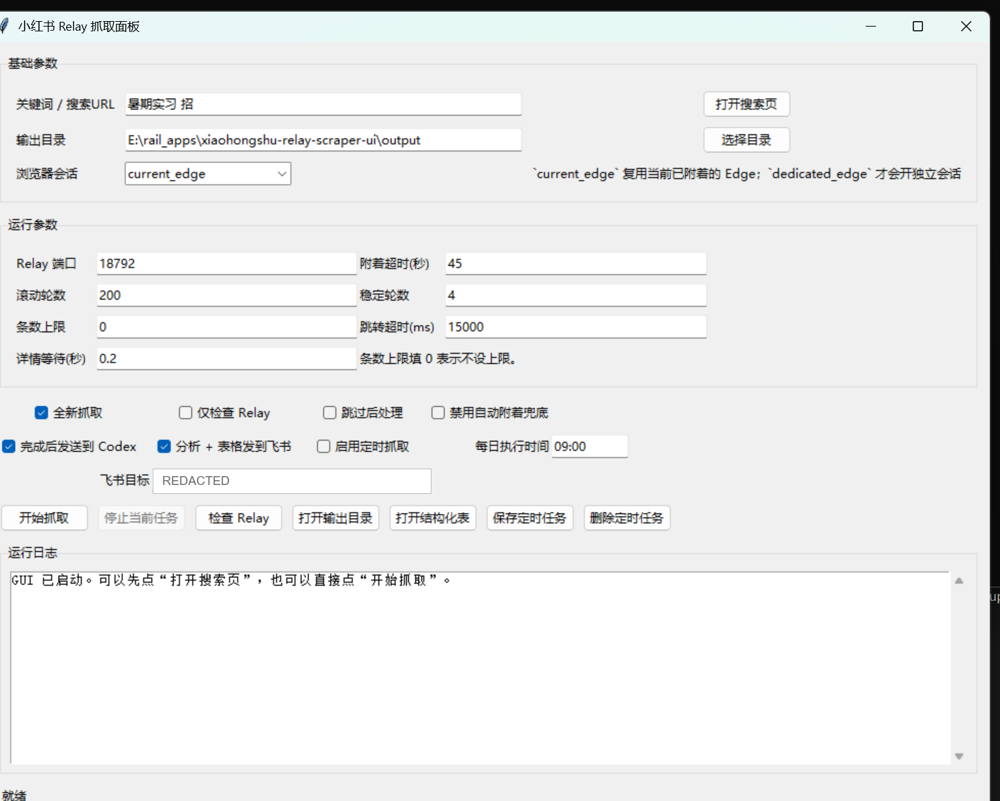
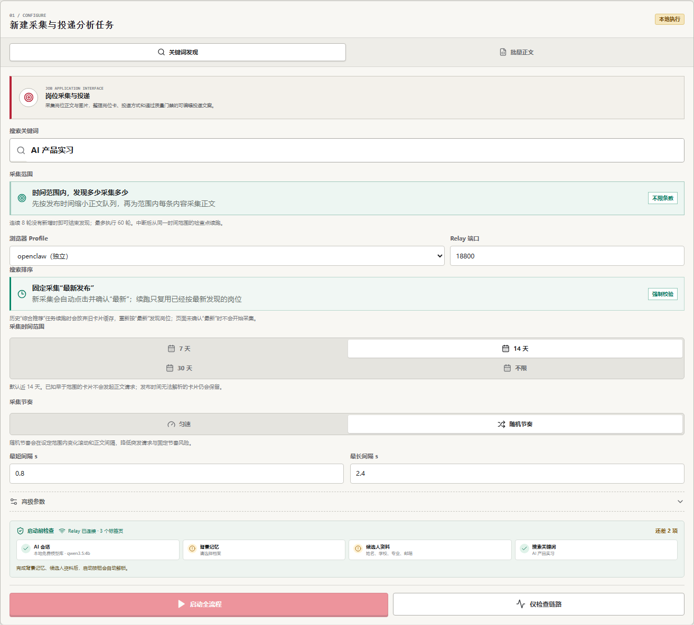
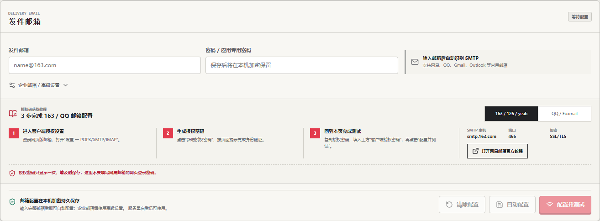
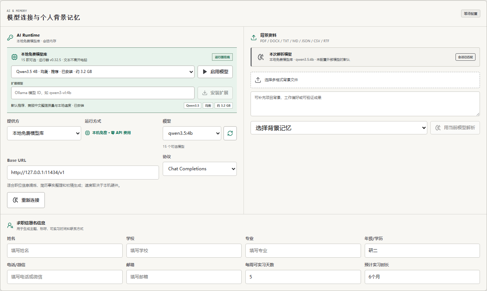
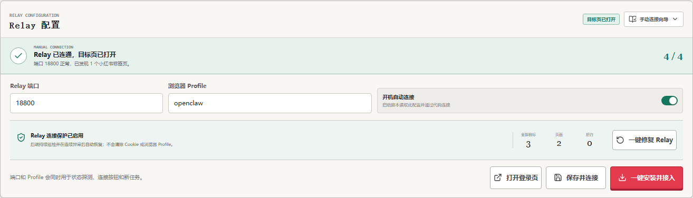
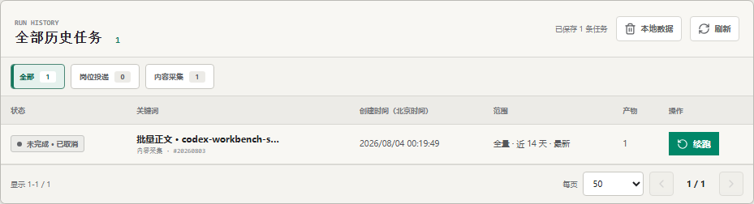
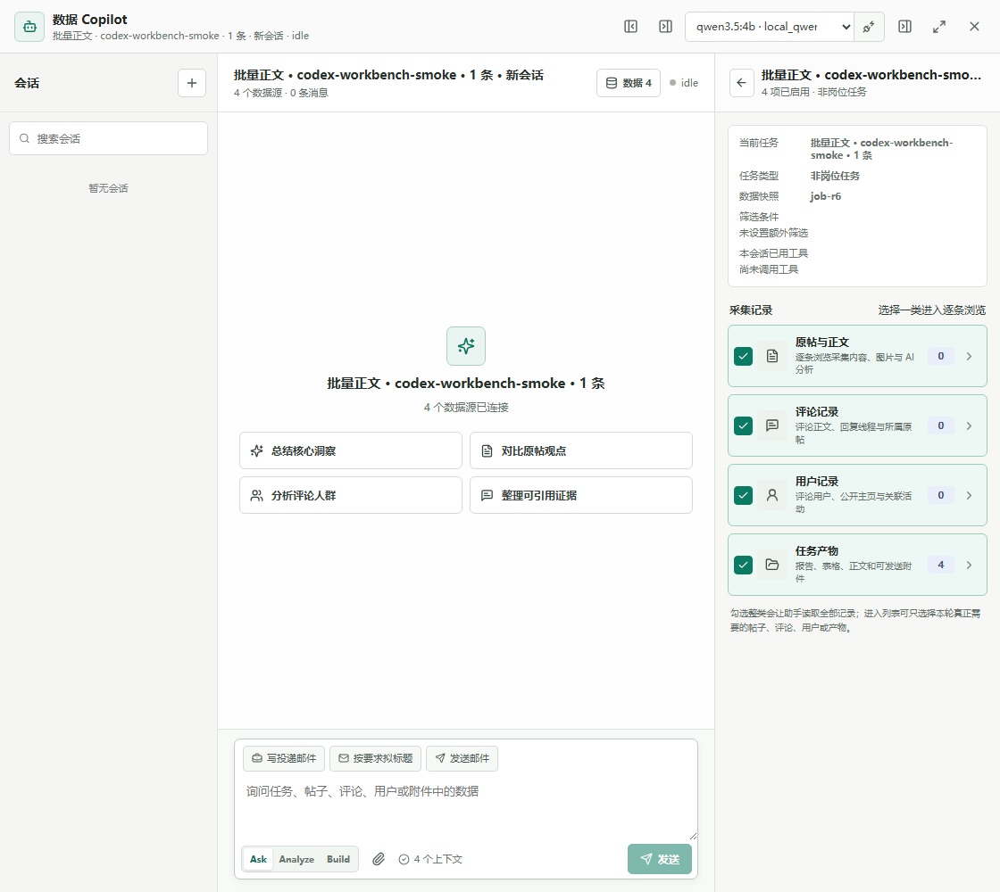
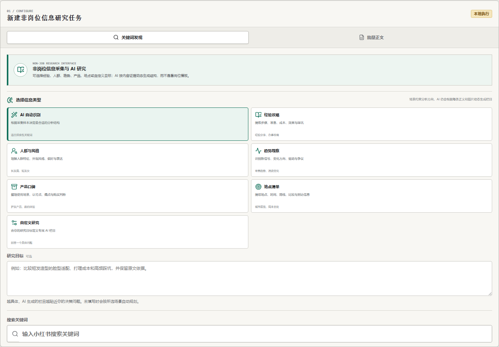

# 今天你投了吗？PRD

版本：2.9
日期：2026-08-04

“今天你投了吗？”面向从小红书寻找实习和校招机会的学生，完成岗位发现、信息核对、简历匹配、文案准备和发送确认，并在用户收到面试通知后继续整理面经、准备面试。

## 1. 需求起点人物及目标用户说明

产品最早来自创作者自己的求职经历。当时它只是一个非常简陋的 UI，用来处理每天重复搜索岗位、核对信息和准备投递材料的问题。真正推动产品持续改变的人，是创作者的一位朋友，更准确一点，是他的前任。她和创作者一样，会在小红书寻找实习机会、浏览经验帖、了解公司评价。创作者把自用版本交给她以后，逐渐发现许多自己早已习惯的操作，对第一次接触产品的人并不自然。她每次在哪个环节遇到困难，下一版就会围绕那个问题继续改进。

*产品最初的抓取面板。搜索参数、Relay、定时任务和运行日志都摊在同一个窗口里，第一次使用的人要先弄懂一整套技术配置。*

目标用户是从小红书寻找实习、校招补录或团队直招机会的在校生与应届生。他们会根据岗位调整投递内容，也会在投递后继续搜索面经和公司评价，需要连续完成多次投递与面试准备，同时为课程、实习和休息保留时间。每位用户可以导入自己的简历和搜索词，使用同一套处理流程。

## 2. 真实需要与具体使用场景说明

小红书上的招聘信息分散在一篇篇帖子中。在创作者实际看过的岗位里，大部分在 BOSS直聘和猎聘上没有对应信息；不少帖子由业务负责人、团队成员或招聘人员直接发布，简历可以通过邮箱或站内信直达用人团队。这种直接性提高了岗位价值，也让分散信息更值得被认真处理。

一次投递需要经过搜索关键词、打开帖子、读取正文和图片、寻找邮箱、核对发布时间、修改简历标题、选择相关经历、撰写求职信等步骤。帖子没有公开邮箱时，用户还要准备站内信。按照创作者的实际经历，一天投递五六个岗位需要一到两个小时；应届生平均要经历八十到一百次投递，才可能得到一次面试机会。

最典型的挫败发生在材料准备到一半时。用户已经找到邮箱、修改简历并开始撰写求职信，随后才发现帖子发布于半年前，招聘早已结束，发布者也长期没有登录。创作者曾用一句话描述这种感受：“忙活到一半才发现帖子是半年前发的，连发布者的 IP 属地都已经消失了。”

招聘平台没有收录这批团队直招信息，收藏工具只能保留链接，通用写作工具缺少原帖、图片和个人简历之间的联系。用户仍需手工完成时效判断、信息提取、经历匹配和文案准备，现有工具因此没有覆盖完整使用过程。

投递完成后，求职者的注意力会转向面试准备。用户重新打开小红书，组合公司名、岗位名和“面经”等关键词搜索，随后逐条阅读不同年份、岗位和轮次的经验帖。面试问题可能出现在正文、图片或评论中，同一道问题也可能被几位分享者用不同说法记录。用户需要在十几篇帖子之间来回翻找，才能判断哪些问题反复出现、哪些经验与当前岗位相关。整理好的内容仍散落在收藏、截图和临时笔记里，到了复习时还要再找一遍。

## 3. Agent 的核心能力与使用流程

### 3.1 搜索与岗位判断

用户输入岗位方向、城市或其他关键词后，Agent 批量爬取岗位卡片，继续打开帖子正文，并通过 OCR 读取图片中的招聘信息。系统整理发布时间、正文完整度、岗位职责、任职要求、工作地点和联系方式，帮助用户在准备文案前判断岗位是否值得继续处理。

*当前岗位任务把关键词、时间范围、搜索排序和启动检查放在同一条流程里，采集开始前先确认帖子时效与运行条件。*

### 3.2 简历匹配与文案准备

用户上传简历后，Agent 从教育经历、项目、技能和成果中提取个人背景，再将岗位要求与简历事实逐项对应。匹配结果说明岗位提出了什么要求、哪段经历可以回应、哪些信息仍待补充。随后，Agent 按照 Prompt 和 Spec 起草邮件、站内信或 Cover Letter，并检查模板化表达、无依据数字、经历错配、称呼和岗位名称。

### 3.3 用户确认与实际发送

用户可以继续修改主题、称呼、语气和经历重点。发送页完整展示原帖、发布时间、收件人、主题、正文和附件。邮件由用户确认后通过自己的 SMTP 发出；站内信场景提供可复制内容和原帖入口。一次处理最终进入继续准备、等待补充、保存草稿、确认发送或放弃岗位中的一种结果。

### 3.4 保存进度与持续使用

正文、岗位字段、匹配依据、草稿版本和处理状态会随任务保存在本机。采集暂停或遇到访问限制时，已有卡片与检查点继续保留；任务恢复后处理剩余帖子。用户再次打开页面时，可以看到每个岗位停在哪一步。

### 3.5 面经与非岗位内容整理

非岗位内容模块来自目标用户投递之后的自然行动。发现感兴趣的岗位以后，她会继续搜索这家公司怎么样、面试一般会问什么、有没有人分享过相同岗位的经历。用户输入公司、岗位、业务方向或面试轮次，Agent 批量取得相关帖子，读取正文、图片和评论，整理发布时间、面试轮次、出现过的问题、答题线索和原帖入口。相同或相近的问题会被放在一起，用户可以回到原文核对分享者的完整表述。岗位任务中已经保存的公司与岗位信息可以继续用于面经搜索，让投递后的面试准备接在原有进度后面。

### 3.6 围绕当前资料继续追问

随着岗位、面经和评论逐渐积累，她开始问：“这里面哪些更适合我？”“哪些公司值得优先了解？”“今天我应该先申请哪几个？”逐张翻阅卡片会再次消耗准备时间，因此产品加入 Data Copilot。用户可以选择当前任务里的岗位正文、面经、评论和分析产物作为上下文，也可以附上自己的简历，再进行提问、比较、归纳和排序；回答保留引用与原帖入口，后续追问沿用同一批资料。每次会话与所选数据快照一同保存，用户再次准备同一家公司或岗位时，可以接着已有问题继续处理。

## 4. 目标用户的实际体验反馈

产品最早只有一个非常简陋的 UI。大部分功能改进来自创作者的一位朋友，更准确一点，是他的前任。她和创作者一样，会在小红书寻找实习机会、浏览经验帖、了解公司评价。最开始，创作者把自己平时使用的版本交给她体验，后来逐渐发现，很多自己已经习惯的操作，对第一次接触产品的人并不自然。她每次在哪个环节遇到困难，下一版往往就会围绕那个问题继续改。

### 4.1 SMTP 配置：她想直接完成邮件投递，却完全不知道怎样配置

最早的邮件投递需要用户自行填写 SMTP 服务器、端口和授权码。她第一次看到这些配置时完全不知道应该从哪里开始，甚至不知道授权码应该在哪里获取。后来，SMTP 配置被完整整合进前端，页面会针对不同邮箱给出对应的服务器、端口和授权码提示，用户可以跟随页面说明完成邮箱连接。

### 4.2 本地模型：她想使用 AI，却不知道中转站是什么

早期版本需要用户自行填写 API、中转地址和模型名称。她既不清楚这些参数应该从哪里获取，也觉得为了偶尔寻找实习持续购买中转服务成本偏高。后来，产品加入本地模型支持，可以自动识别已经安装的模型。用户完成选择后便能直接调用，也不用再理解 Base URL 和接口协议这些技术参数。

### 4.3 Relay：她想开始搜索岗位，却先卡在浏览器连接这一关

最初使用产品之前，用户需要手动准备 Relay，并完成浏览器连接配置。对创作者来说，这是一套早已习惯的操作；她第一次接触端口和连接地址时，却完全不知道下一步应该怎样处理。后来，Relay 的准备、安装和连接被整合进启动流程，能够自动完成的步骤都交给系统处理，让用户打开产品后尽快进入岗位搜索。

### 4.4 一键爬取和一键续跑：她最关心“刚才搜到的内容还在不在”

实际使用过程中，采集任务可能因为网络波动、页面验证或状态异常发生中断。早期版本重新运行时很容易创建一个新任务。她遇到这种情况时根本不关心 checkpoint 或任务状态，开口问的就是：“那刚才已经跑出来的那些全白跑了吗？”后来，任务状态管理被重新设计，已经完成的进度会持续保存，页面也增加了一键续跑。现在任务中断以后，用户选择继续运行，系统会识别此前进度，并从对应位置接着处理。

### 4.5 Data Copilot：结果越来越多以后，她开始问“我应该先看哪个”

采集能力逐渐完善以后，一次任务可以获得几十条甚至更多结果，新的问题很快出现了：结果虽然已经集中到一起，她仍然需要逐条查看和判断。她经常会问：“这里面哪些更适合我？”“哪些公司值得优先了解？”“今天我应该先申请哪几个？”基于这些反馈，产品加入 Data Copilot，让用户直接围绕已经采集的数据提问，由 AI 根据当前资料完成筛选、比较、总结和排序。采集结束后，用户可以继续进入判断环节，决定下一步优先处理什么。

### 4.6 非岗位模块：她找实习时，也会顺手了解公司、面试和各种经验信息

使用一段时间以后，她开始通过产品查询面试经验、公司评价、求职攻略和其他用户分享。发现一个感兴趣的岗位后，她经常继续搜索“这家公司怎么样”“面试一般会问什么”“有没有人分享过这个岗位的经历”。后来，这些非岗位内容逐步进入产品，让岗位发现、经验查询和公司了解留在同一套使用流程里。她偶尔也会拿这个功能搜索自己感兴趣的内容，比如她喜欢的长发男。这个小插曲让创作者意识到，当一个工具足够顺手时，用户会很自然地把自己的其他需求也带进来。

这些改动没有沿着一张提前规划的功能清单展开。很多功能最早都来自她使用过程中一句很普通的话：“这个应该怎么配置？”“刚才断了还能继续吗？”“这么多结果我应该先看哪个？”“我还想了解一下这家公司怎么样。”她遇到配置门槛，下一版就继续降低配置难度；她担心任务中断后丢失结果，产品就补上状态保存和续跑；她面对大量内容难以判断优先级，Data Copilot 就开始承担分析和筛选；她希望继续了解岗位之外的信息，内容研究范围也随之扩展。产品在这样一轮轮真实使用和反馈里，慢慢形成了现在的样子。

## 5. 根据用户反馈完成的验证或优化说明

上述反馈已经形成可操作的产品改动：邮箱连接从手动填写技术参数变成前端引导，本地模型可以被自动发现，Relay 进入统一启动流程，采集进度与任务状态持续保存，Data Copilot 可以读取当前任务数据，非岗位研究也沿用正文读取、OCR、任务恢复和结果追溯能力。用户从搜索岗位走到整理面经时，可以继续使用已经保存的公司、岗位和个人背景。

另一轮可复核运行发生在 2026 年 8 月 2 日。创作者使用自己的真实简历和 20 条真实招聘帖子完成测试，系统取得 20 条完整正文，整理出 20 张岗位卡和 20 套投递草稿；17 条帖子取得精确发布时间，3 条使用估算时间，同时识别出 6 个明确联系人和 9 条投递路径，共提取 38 项岗位职责和 73 项任职要求。这轮运行覆盖到草稿和投递路径准备，在线模型写作和招聘方视角复核没有开启，真实邮件发送、总耗时变化和面试结果尚未进入记录。

这轮真实数据测试进一步推动了岗位时效、正文缺失、文案事实和发送确认的调整。当前版本把发布时间、时间置信度、正文完整度和联系方式提前到岗位列表与详情页；生成流程先对照岗位要求与简历，再选择相关经历并检查无依据数字和事实错配；发送页完整展示收件人、主题、正文和附件。20 条帖子的正文补全、时间整理、岗位字段提取和投递路径识别已经完成验证，在线模型启用后的文案口吻、修改次数、用户采纳情况和真实发送记录将在下一轮使用中继续记录。

## 6. 下一轮验证与验收标准

下一轮将邀请一名具有相似求职习惯的在校生或应届生独立处理五到六个岗位，记录从搜索到最终决定的总耗时、旧帖淘汰时点、每份草稿的修改次数和最终行动，并与原先一到两个小时的人工流程对照。同时记录对方卡住的位置、完成与放弃原因以及直接反馈。

下一轮重点确认四件事：用户能否在撰写文案前发现旧帖或缺失信息；生成内容能否保持个人经历真实且语气自然；任务中断后能否从已有进度继续；用户能否完成发送、复制站内信、暂存或放弃中的明确行动。提交材料会区分已经发生的结果和下一轮验证目标。

## 7. 页面、实现与隐私

主页面包含岗位投递台和非岗位研究台。岗位投递台负责时效判断、原帖核对、经历匹配、草稿修改与发送确认；非岗位研究台负责面经的采集、整理和回溯。Data Copilot 从当前任务打开，用户可以选择正文、评论和产物作为本轮对话资料。任务使用 `pending`、`partial`、`complete`、`waiting_user` 和 `blocked` 五类状态，每个状态同时显示当前原因和下一步动作。

主界面和岗位流程位于 `src/App.tsx`，岗位文案与问答面板位于 `src/DataCopilotPanel.tsx`，任务状态和持久化位于 `server`，岗位解析与投递文案处理位于 `scripts`。任务输入、结果、状态和错误保存在 `data` 下对应任务目录。

简历、背景资料、岗位任务和导出文件默认保存在本机。API Key 进入运行时配置，日志和导出内容会过滤凭据。真实人物参与体验前取得本人同意，邮件发送使用用户自己的 SMTP 配置，并在发送前展示完整内容和附件。
