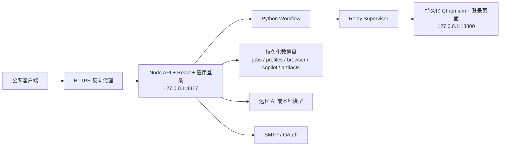

# Relay 全功能公网部署实施方案

**文档状态：** 实施方案

**适用版本：** 当前仓库版本

**目标：** 在公网提供完整 Web 入口，同时保留 Relay 浏览器爬取、任务恢复、AI、简历与附件、SMTP、Data Copilot、实时进度、导出和数据生命周期能力。

## 1. 交付结论

第一阶段采用**单实例、单工作区、持久浏览器会话**部署。Node API、Python 工作流、Relay Supervisor、Chromium 浏览器和数据目录运行在同一台专用 Windows VM 上，公网仅进入 HTTPS 入口。

这个模式覆盖当前仓库的全部功能，并匹配现有的文件持久化、内存任务状态、单活动 Relay 任务和本地浏览器登录态。多用户独立数据与并发任务作为第二阶段的隔离 Worker 架构实施。

当前方案的发布条件不是“网页能打开”，而是完成真实 Relay 抓取、任务中断恢复、AI、邮件、Data Copilot、artifact 下载、备份恢复和公网安全验收。

## 2. 现有实现边界

| 现有能力 | 代码或数据证据 | 部署含义 |
|---|---|---|
| Node API 与静态前端同进程 | [server/index.mjs](../server/index.mjs)、[package.json](../package.json) | 先运行单个 Node 实例 |
| 默认回环监听 | [server/config.mjs](../server/config.mjs) | Node 只监听 `127.0.0.1:4317` |
| Relay + 登录浏览器 + CDP | [docs/managed-browser.md](managed-browser.md)、[server/lib/relay-supervisor.mjs](../server/lib/relay-supervisor.mjs) | Relay 与浏览器必须在服务器上常驻 |
| Python 抓取与分析流程 | `scripts/run_project_workflow.py`、`scripts/run_audience_ai.py` | 服务器安装 Python 依赖和浏览器依赖 |
| 单活动任务与文件 checkpoint | [server/job-manager.mjs](../server/job-manager.mjs) | 单实例、单 Relay；支持中断后恢复 |
| 原生 EventSource/SSE | [src/api.ts](../src/api.ts) | 反向代理需要长连接、关闭缓冲 |
| 文件、JSONL 和 SQLite WAL 持久化 | `data/jobs`、`data/profiles`、`data/copilot` | 使用持久数据盘；备份包含 `-wal/-shm` |
| AI、SMTP、资料和附件 | `server/ai-session-store.mjs`、`server/smtp-config-store.mjs`、`data/profiles` | 密钥只放服务端密钥存储，附件和配置纳入备份 |

## 3. 目标拓扑



### 网络边界

| 端口 | 监听位置 | 公网状态 |
|---|---|---|
| `443` | HTTPS 反向代理 | 唯一公网入口 |
| `4317` | Node API | 仅回环地址 |
| `18800` | Relay/CDP | 仅回环地址 |
| RDP/VPN | 运维入口 | 仅管理员网络和账号 |

### 推荐主机

- Windows Server 2022 或同等 Windows VM。
- 4 vCPU、16 GB RAM、100 GB 系统盘、200 GB 起步数据盘。
- 启用自动重启服务、时间同步、磁盘告警和 Windows Defender 排除规则（仅针对受控数据目录）。
- 本地模型运行时建议 32 GB RAM，并为模型目录单独预留空间。

## 4. 全功能保留矩阵

| 功能 | 必须保留的运行链路 | 验收结果 |
|---|---|---|
| Relay 登录、连接、恢复 | 浏览器进程 + Relay Supervisor + 持久 Profile | 状态为 `running`、`cdpReady=true`，存在登录目标页 |
| 搜索、抓取、正文、OCR | Relay 页面 + Python workflow | 产生发现、正文、图片 OCR 和来源链接 |
| 分析、受众、扩展 | JobManager checkpoint + AI/脚本 runner | 每个阶段有状态、日志和 artifact |
| 中断与恢复 | `data/jobs`、checkpoint、启动 reconcile | 停止 Node/Relay 后继续原任务，不重建旧结果 |
| 简历与候选人资料 | `data/profiles`、profile memory | 支持导入、编辑、匹配和跨任务引用 |
| AI 邮件、私信、Cover Letter | AI session store + AI provider | 草稿可编辑、可追溯、可重新生成 |
| 附件和批量投递 | 上传存储 + application batch | 附件限制、批次状态、失败重试均可见 |
| SMTP/OAuth 发送 | SMTP sender + delivery/reconcile | 测试邮箱收到邮件，附件和发送审计完整 |
| 非职位研究 | 同一 Relay 和工作流 | 保留正文、评论、OCR、分析和来源 |
| Data Copilot | Copilot SQLite/JSONL/artifacts + AI | 引用来源、追问、会话恢复和 SSE 全部可用 |
| 实时进度 | `EventSource` + SSE 反代 | 页面实时更新，断线后自动重连 |
| 导出下载 | artifact manifest + 下载接口 | JSON/CSV/XLSX/Markdown 可下载且权限正确 |
| 保留、删除、诊断 | lifecycle service + audit log | 删除令牌、审计记录和诊断包可核验 |

## 5. 生产目录与环境变量

建议将代码放在 `C:\Apps\relay-scraper`，数据放在 `D:\xhs-data`。代码发布包排除运行数据、登录态、密钥和历史诊断文件。

```dotenv
HOST=127.0.0.1
PORT=4317
NODE_ENV=production

XHS_SERVER_DATA_DIR=D:\xhs-data\jobs
XHS_PROFILE_DATA_DIR=D:\xhs-data\profiles
XHS_BROWSER_DATA_DIR=D:\xhs-data\browser
XHS_RELAY_CONFIG_PATH=D:\xhs-data\relay-config.json
XHS_AI_CONFIG_PATH=D:\xhs-data\ai-config.json
XHS_SMTP_CONFIG_PATH=D:\xhs-data\smtp-config.json
XHS_DATA_RETENTION_PATH=D:\xhs-data\data-retention.json
XHS_DELETION_AUDIT_PATH=D:\xhs-data\deletion-audit.jsonl
XHS_DIAGNOSTICS_PATH=D:\xhs-data\diagnostics.jsonl

# 本地模型：同机默认值；独立 GPU 推理机使用其私网 HTTPS 地址
XHS_LOCAL_MODEL_ENDPOINT=http://127.0.0.1:11434

# 应用层登录（公网必须开启）
XHS_AUTH_REQUIRED=true
XHS_AUTH_USERS_PATH=D:\xhs-data\auth\users.json
XHS_AUTH_SESSION_SECRET_PATH=D:\xhs-data\auth\session-secret
XHS_AUTH_SECURE_COOKIE=true
XHS_AUTH_ORIGIN=https://PUBLIC_HOST

XHS_MAX_BODY_BYTES=33554432
XHS_ATTACHMENT_MAX_FILES=5
XHS_ATTACHMENT_MAX_FILE_BYTES=10485760
XHS_ATTACHMENT_MAX_TOTAL_BYTES=20971520
```

还要持久化以下内容：

```text
D:\xhs-data\copilot\
D:\xhs-data\artifacts\
D:\xhs-data\data-retention.json
D:\xhs-data\deletion-audit.jsonl
D:\xhs-data\diagnostics.jsonl
D:\xhs-data\smtp-config.json.key
```

密钥通过服务器环境变量或密钥存储注入。`.env`、SMTP 密码、AI Key、浏览器 Cookie 和 Relay 登录态不进入 Git 或发布 ZIP。

## 6. 实施步骤

### 6.1 准备服务器

1. 创建专用 Windows VM 和数据盘。
2. 配置 DNS、HTTPS 证书；外部 OIDC 作为可选的二次入口，应用账号仍保留给比赛演示。
3. 安装 Node.js 22+、Python 3.11+、Git、Chromium 和 Playwright 系统依赖。
4. 创建专用运行账号，并为该账号保留浏览器 Profile 和数据目录权限。
5. 防火墙只开放 `443`；RDP 仅允许管理员网络。

### 6.2 部署代码和依赖

```powershell
Set-Location C:\Apps\relay-scraper
npm ci
python -m pip install -r requirements.txt
npm run build
npm run check
```

设置生产环境变量后，使用 Windows 服务或受控计划任务启动：

```powershell
npm run start
```

服务启动后检查 `/api/health`，同时确认进程命令行、工作目录和环境变量均指向生产目录。

### 6.3 启动 Relay 浏览器

启动 [scripts/start-managed-browser.mjs](../scripts/start-managed-browser.mjs)，使用固定的浏览器 Profile 和 `D:\xhs-data\browser`。然后通过受控 RDP/VPN 完成首次登录和安全验证。

启动完成的硬条件：

- Relay 进程为运行状态。
- CDP 端口为 `127.0.0.1:18800`。
- `cdpReady=true`。
- 至少存在一个登录目标页面。
- Node 可以通过 Relay Supervisor 完成连接检查。

### 6.4 配置反向代理

反向代理指向 `http://127.0.0.1:4317`，并满足：

```text
proxy buffering: off
read timeout: 1h
write timeout: 1h
request body limit: 与 XHS_MAX_BODY_BYTES 一致
forwarded headers: 保留 Host、Proto、Request-ID
```

SSE 路由必须返回 `text/event-stream`，长连接不能被代理超时或缓存截断。

### 6.5 增加身份与应用安全层

公网入口上线前完成：

- 当前版本使用仓库内置的应用层账号认证：`server/auth-store.mjs` 以 `scrypt` 保存密码哈希，以签名 `HttpOnly` Cookie 保存会话。
- `/api/auth/me`、`/api/auth/login`、`/api/auth/logout` 为公开认证入口；其余 `/api/*`、SSE、上传、artifact、Relay 控制和邮件接口均要求有效会话。
- 生产环境设置 `XHS_AUTH_REQUIRED=true`、`XHS_AUTH_SECURE_COOKIE=true` 和准确的 `XHS_AUTH_ORIGIN`；写请求执行 Origin 校验。
- 当前账号角色为 `owner`，单工作区交付按一个竞赛演示账号运行；多角色和 OIDC 放到多租户阶段。
- 登录尝试按邮箱执行 15 分钟窗口限流，连续 5 次失败进入冷却；密码、Cookie、AI Key、SMTP 密码和浏览器登录态不写入仓库。

### 6.6 竞赛演示账号初始化

账号标识固定为：`wang17326946305@163.com`。密码只在部署主机上通过安全输入注入，不写入本文档、Git、ZIP、PowerShell 历史或截图。

首次部署或换密使用以下 PowerShell 流程。`provision:auth` 只落盘随机盐、scrypt 哈希和创建时间，不输出密码；`XHS_AUTH_REPLACE=true` 仅在维护窗口换密时使用。

```powershell
Set-Location C:\Apps\relay-scraper
$env:NODE_ENV = 'production'
$env:XHS_SERVER_DATA_DIR = 'D:\xhs-data\jobs'
$env:XHS_AUTH_USERS_PATH = 'D:\xhs-data\auth\users.json'
$env:XHS_AUTH_SESSION_SECRET_PATH = 'D:\xhs-data\auth\session-secret'
$env:XHS_AUTH_EMAIL = 'wang17326946305@163.com'
$secret = Read-Host '输入公网账号密码' -AsSecureString
$env:XHS_AUTH_PASSWORD = [System.Net.NetworkCredential]::new('', $secret).Password
$env:XHS_AUTH_REPLACE = 'false'
npm run provision:auth
Remove-Item Env:XHS_AUTH_PASSWORD
Remove-Item Env:XHS_AUTH_REPLACE
$env:XHS_AUTH_REQUIRED = 'true'
$env:XHS_AUTH_SECURE_COOKIE = 'true'
$env:XHS_AUTH_ORIGIN = 'https://PUBLIC_HOST'
```

验收：`D:\xhs-data\auth\users.json` 存在且只含邮箱、盐、哈希和时间；`session-secret` 长度至少 32 字符；服务重启后 `GET /api/auth/me` 返回 `required=true` 且未登录为 `authenticated=false`。登录成功后 Cookie 带 `HttpOnly; Secure; SameSite=Lax`，浏览器刷新仍可访问历史数据。换密时备份认证目录、设置 `XHS_AUTH_REPLACE=true` 重新执行命令，再删除旧会话 Cookie。

### 6.7 迁移现有本地历史数据

代码包和运行数据分开复制。以下命令保留现有任务、产物、候选人资料和 Copilot 会话，不复制 Git、依赖缓存或浏览器临时文件：

```powershell
$source = 'C:\Users\10847\Documents\xiaohongshu-relay-scraper-ui'
$code = 'C:\Apps\relay-scraper'
$data = 'D:\xhs-data'
robocopy $source $code /E /XD .git node_modules dist data
robocopy "$source\data\jobs" "$data\jobs" /E
robocopy "$source\data\profiles" "$data\profiles" /E
robocopy "$source\data\copilot" "$data\copilot" /E
robocopy "$source\data\artifacts" "$data\artifacts" /E
```

浏览器 Profile 不通过发布包迁移。登录运维账号后在目标机启动托管浏览器，完成 Relay 登录和安全验证，并确认 `127.0.0.1:18800`、`cdpReady=true`、至少一个目标页，再开始公网演示。

### 6.8 首屏历史任务与真实数据边界

前端历史页已固定竞赛演示入口，任务 ID 为 `20260804081657-caf8f451`，标题为“AI 产品经理招聘 · 最新 Relay 抓取”。迁移成功后登录首页会展示该任务并可直接打开、查看结果、下载 artifact 或从检查点续跑。

当前本地数据的真实状态如下，公网演示必须沿用这些状态标签：

| 指标 | 当前值 | 对外说明 |
|---|---:|---|
| 关键词 | `ai产品 实习 继任` | 最近一次 Relay 岗位任务 |
| 发现/抓取记录 | 715 / 715 | 搜索卡片已保存 |
| 正文 | 692 | 覆盖率 96.78% |
| 岗位卡、投递文案 | 692 / 692 | 生成覆盖率 100% |
| 申请路线 | 236 | 已抽取可行动路线 |
| 待补全 | 23 | 受平台限流影响，保留检查点 |
| 任务状态 | `incomplete` / `completed_partial` | 显示“部分完成，可续跑” |

演示话术和页面不得把这条任务标成“全部完成”。要展示完整闭环，登录 Relay 后点击“续跑”，等待质量门禁通过，再重新读取 `/api/jobs` 和结果页，确认待补全为 0 后再形成最终比赛截图。
- 请求限流、body 限制、上传文件类型校验和超时。
- 生产域名允许来源配置，避免保留本地开发来源。

## 7. Relay 爬取运行手册

### 正常任务链路

1. 操作员登录公网 Web UI。
2. Node 检查 Relay 和登录目标页面。
3. JobManager 创建任务和 checkpoint。
4. Python workflow 通过 Relay 驱动页面完成发现、正文、OCR、分析和扩展。
5. Node 持续写入任务状态、来源、artifact 和 SSE 事件。
6. 用户在公网 UI 监控进度并下载结果。

### Relay 故障恢复

1. 健康监控发现 Relay/CDP 不可用。
2. 当前任务标记为 `partial` 或 `pending`，保留已有结果。
3. 自动尝试 Relay 恢复；需要人工登录时生成运维告警。
4. 操作员在服务器浏览器完成验证。
5. 重新运行连接检查。
6. 通过 resume API 从最近 checkpoint 继续任务。

### Relay 安全边界

- CDP 和 Relay 端口永远保持回环访问。
- 公网 API 只暴露业务操作，不转发任意 CDP 命令。
- Relay 配置、浏览器 Cookie、会话文件进入加密备份。
- 每次 Relay 重连和登录状态变更写入审计日志。

## 8. 备份与恢复

### 备份范围

```text
D:\xhs-data\jobs\
D:\xhs-data\profiles\
D:\xhs-data\browser\
D:\xhs-data\copilot\
D:\xhs-data\artifacts\
D:\xhs-data\relay-config.json
D:\xhs-data\ai-config.json
D:\xhs-data\smtp-config.json
D:\xhs-data\smtp-config.json.key
D:\xhs-data\data-retention.json
D:\xhs-data\deletion-audit.jsonl
```

SQLite 备份必须包含同目录的 `-wal` 和 `-shm` 文件。推荐流程：暂停新任务、等待活动写入完成、执行加密快照、恢复服务、记录备份版本号。

### 恢复验收

1. 使用全新 VM 恢复代码和数据盘。
2. 恢复浏览器 Profile 和 Relay 配置。
3. 启动 Relay、Node、Python runner。
4. 验证 Copilot 会话、任务 checkpoint、附件、SMTP 配置和删除审计。
5. 从一个 `partial` 任务继续执行并生成完整 artifact。

## 9. 全功能验收清单

### 自动化检查

```powershell
npm run build
npm run check
npm run test:api
npm run test:e2e
python -m pytest
```

### 真实 Relay 场景

- 登录 Relay 后执行小规模发现和正文抓取。
- 验证 OCR、发布时间、联系人、要求和来源链接。
- 验证分析、受众、扩展和结果导出。
- 在正文阶段、分析阶段和 artifact 阶段分别中断任务并恢复。
- 验证安全验证超时后的状态保留和继续执行。

### AI、简历和邮件

- 导入 PDF/DOCX/TXT/MD 等资料。
- 生成并编辑邮件、私信、Cover Letter。
- 上传附件并验证大小、类型和下载权限。
- 使用受控邮箱验证 SMTP 发送、附件、失败状态和 reconcile。

### Data Copilot 与研究

- 选取职位正文、评论、分析 artifact 和简历作为上下文。
- 验证回答引用来源、追问、会话恢复和 SSE。
- 执行非职位研究并验证结果链路和导出文件。

### 公网安全

- 未认证 API 返回 `401/403`。
- 任务、上传、邮件、删除、诊断和 Relay 控制均执行角色校验。
- 公网扫描只发现 `443`。
- 日志、备份和发布包中没有明文密钥或浏览器 Cookie。

## 10. 运维与监控

监控以下指标：

- Node、Python、Relay、浏览器进程存活。
- `cdpReady`、目标页面数量和最近 Relay 心跳。
- 活动任务、卡住任务、恢复次数和失败原因。
- 数据盘容量、Copilot WAL 增长和 `diagnostics.jsonl` 文件大小。
- SMTP 发送成功率、超时和 reconcile backlog。
- 备份成功、备份版本和最近恢复演练时间。

## 11. 多用户扩展方案

当前版本先交付单工作区全功能版。需要独立用户数据和并发时，增加控制面：

```text
公网入口 -> 身份与租户服务 -> 数据库/任务队列
                         -> Worker A: Node + Python + Browser + Relay + data
                         -> Worker B: Node + Python + Browser + Relay + data
```

每个 Worker 独立：

- 浏览器 Profile。
- Relay/CDP 端口。
- `jobs/profiles/copilot/artifacts` 数据卷。
- AI、SMTP 和审计上下文。
- 单写入锁和任务队列消费者。

数据库、对象存储、分布式锁和队列完成后，再实施高可用和自动扩缩。

## 12. 发布判定

| 模式 | 判定 |
|---|---|
| 单团队、单工作区、Relay 登录态固定 | 完成本文档验收后可发布公网 |
| 多人共享同一 Relay 登录态 | 可运行，任务和数据按共享工作区管理 |
| 多租户独立数据、并发抓取 | 进入隔离 Worker 阶段 |
| 多副本、高可用、自动扩缩 | 完成数据库、队列、对象存储迁移后实施 |

**上线门槛：** Relay 真实抓取、任务恢复、AI、SMTP、Data Copilot、artifact、备份恢复和公网安全测试全部通过后，环境从 staging 切换 production。

## 13. 可执行验收脚本

### 13.1 服务与登录

```powershell
Invoke-WebRequest https://PUBLIC_HOST/api/health
Invoke-WebRequest https://PUBLIC_HOST/api/auth/me
```

预期：健康接口仅返回最小公开状态；未登录 `auth/me` 返回 `required=true, authenticated=false`。浏览器登录后刷新页面，任务历史和交付产物可读。

### 13.2 全功能回归顺序

1. 登录 Relay 并验证目标页。
2. 创建小规模岗位任务，验证发现、正文、OCR、岗位卡、Cover Letter、私信和邮件草稿。
3. 创建非职位研究任务，验证评论、受众、关系扩展、图片和 AI 动态栏目。
4. 在正文、分析、受众和 artifact 阶段各中断一次，点击“续跑”并核对原任务 ID、checkpoint 和旧结果保留。
5. 上传 PDF/DOCX/TXT 资料，选择附件，预览并在受控测试邮箱发送；验证审计和 reconcile。
6. 打开 Data Copilot，确认引用任务、结果、artifact，断开 SSE 后自动重连。
7. 下载 JSON、CSV、XLSX、Markdown，执行删除预览、确认令牌和审计核对。
8. 用未登录浏览器、过期 Cookie、错误 Origin 和超大上传分别验证 `401`、会话失效、`403` 和大小限制。

### 13.3 发布证据包

发布目录保留以下证据：`npm run build`、`npm run test:api`、认证单测、Relay 连接截图、最新任务续跑前后两份 `workflow-state.json`、artifact manifest、邮件测试结果、备份校验和公网安全测试结果。证据中只出现脱敏邮箱和任务 ID，不出现密码、Cookie、AI Key、SMTP 密码或浏览器 Profile 内容。

## 14. 当前可行性结论

代码、应用层登录、历史任务固定入口、Relay/SSE 凭据传递和认证测试已经落地；生产构建及现有 80 个 API 测试通过。方案适合单团队、单 Relay、单工作区的比赛演示公网部署。

仍需在目标服务器执行的现场步骤是：迁移数据、输入账号密码、启动 Relay 浏览器并登录、配置 DNS/HTTPS、完成真实续跑和 SMTP/AI 的密钥注入。完成第 13 节验收后再公开域名；当前公网地址仍处于待开通状态。
