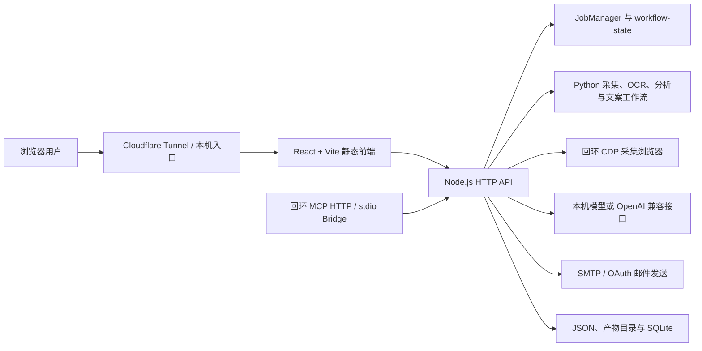

# 公共发布版技术架构

## 1. 系统目标

本项目把“发现机会、采集证据、恢复任务、整理事实、生成材料、人工审核、发送投递、复盘历史”放到同一工作台中。系统不是单纯的爬虫，也不是只有提示词的文案工具，而是带持久状态、证据追溯和发送门禁的本地优先工作流。

## 2. 组件分层



### 前端

- React 19 + TypeScript；
- 工作流导航按用户操作顺序排列；
- 右侧主屏只渲染当前步骤，避免多模块纵向堆叠；
- 批量投递支持筛选、分页、正文和标题编辑、草稿版本、预演、冻结、审核和发送；
- Data Copilot 支持数据选择、带引用回答和后续追问；
- MCP 管理界面展示 Grant、工具运行、审批、会话和审计信息。

### Node.js 服务端

- 提供静态页面、REST API、认证、CORS/CSRF 边界和错误映射；
- 管理采集浏览器、AI Session、SMTP 配置、任务状态和文件下载；
- `JobManager` 管理任务创建、恢复、取消、事件流和产物索引；
- 投递服务把收件人、标题、正文、附件、质量门和审批状态组合为不可跳步的发送流程；
- Data Copilot 运行时把对话、引用、审批和执行状态持久化；
- MCP 服务只绑定回环地址，并使用带 Scope、风险等级、资源快照和过期时间的 Grant。

### Python 工作流

- 搜索结果采集与断点续跑；
- 帖子正文、图片、评论和岗位事实提取；
- OCR 与联系方式解析；
- 简历事实匹配、邮件正文与 Cover Letter 生成；
- 证据声明检查、招聘方视角复核和质量门；
- `workflow-state.json` 使用 Revision 约束状态演进，避免拿错误任务目录续跑。

## 3. 关键数据流

### 采集与恢复

1. 用户创建任务，服务端生成 Task ID 和初始状态；
2. Python Runner 持续写入检查点、任务状态和产物；
3. 前端通过任务 API 和事件流查看进度；
4. 中断后使用原 Task ID 和状态 Revision 续跑；
5. 新产物追加到任务目录，历史结果不被无条件覆盖。

### AI 会话

1. 前端读取可用 Provider；
2. 用户选择本机模型或自有 OpenAI 兼容接口；
3. 服务端创建短期 AI Session，并将敏感凭据留在服务端；
4. 创建后执行真实推理探针，记录实际模型与延迟；
5. 网络瞬断属于可重试传输错误，确定性 HTTP 错误直接返回；
6. 任务保存 Session 引用，不把 API Key 写入任务产物。

### 投递正文与标题

1. 系统从岗位正文、附件命名规则和已保存草稿推导发送标题；
2. 用户在同一编辑器中修改邮件标题、邮件正文和 Cover Letter；
3. 保存时生成新的草稿版本并回写发送预览；
4. 任何正文或标题变化都会使旧预演/冻结结果失效；
5. 发送前重新检查邮箱、标题规则、正文、附件和质量门；
6. 只有最终“开始发送”动作会触发真实发送。

### MCP 接入

1. 管理员在 UI 中为特定上下文创建 Grant；
2. Grant 绑定工具、资源、Scope、最大风险、资源快照和过期时间；
3. 客户端通过回环 HTTP 或 stdio Bridge 连接；
4. 高风险动作进入审批队列；
5. Idempotency Key 防止同一调用重复执行；
6. 运行、审批、会话和审计记录持久化；
7. 备份恢复或私有迁移后，旧 Grant 会被撤销并重新签发。

## 4. 进程和端口

| 组件 | 默认地址 | 暴露原则 |
| --- | --- | --- |
| 本地开发/一键启动 Web | `127.0.0.1:4317` | 仅本机 |
| 生产 Web 源站 | `127.0.0.1:4327` | 仅由 Tunnel 访问 |
| MCP HTTP | `127.0.0.1:4328` | 仅本机，禁止公网代理 |
| 采集浏览器 CDP | `127.0.0.1:18800` | 仅本机，禁止公网代理 |
| Cloudflare Metrics | `127.0.0.1:20242` | 仅本机运维 |
| 本机模型 | 由本机运行时决定 | 只允许 HTTPS 或回环 HTTP |

端口均可通过环境变量覆盖。生产配置必须明确 `XHS_AUTH_ORIGIN`，非回环 Origin 必须使用 HTTPS。

## 5. 持久化布局

默认数据位于 `data`，公共包中不预置真实数据：

```text
data/
  auth/                 账号和服务端 Secret
  browser/              托管浏览器 Profile 与 Cookie
  copilot/              Data Copilot 与 MCP SQLite 状态
  jobs/<task-id>/       任务状态、检查点、日志索引和产物
  profiles/             用户确认后的背景资料
  ai-config*.json       机器级 AI 配置
  smtp-config*.json     机器级邮箱配置
```

生产环境可使用 `XHS_*_PATH` 和 `XHS_*_DATA_DIR` 将这些目录放到受保护卷。备份必须保持 SQLite 的 `-wal`、`-shm` 侧文件与主库一致。

## 6. 安全模型

### 网络边界

- Node 源站、MCP、CDP、本机模型和 Metrics 默认绑定回环地址；
- 只有经过认证的 Web 路由进入公网 Tunnel；
- 生产环境使用 Secure Cookie 和单一 Origin；
- MCP 不复用 Web 登录 Cookie，使用独立的短期 Grant Token。

### 凭据边界

- API Key、SMTP 密码、OAuth Token、Tunnel Token 和浏览器 Cookie 均不进入公共包；
- 模板文件只描述变量名，不包含可用凭据；
- 发布脚本按路径和文件名扫描敏感项；
- 凭据测试会检查源码中的常见 Secret 形式；
- 迁移数据时撤销旧 MCP Grant，避免令牌跨机器继续有效。

### 操作边界

- 数据删除先预览再执行，并保留删除审计；
- 邮件先预演、冻结、审核，再由用户开始发送；
- Data Copilot 的写操作根据风险进入审批；
- 任务状态通过 Revision 防止旧进程覆盖新状态；
- 下载文件只能来自允许的数据和产物根目录。

## 7. 可观测与恢复

- `/api/health`：源站、认证模式和基础依赖状态；
- 生产看门狗：检查进程、端口、健康接口、Tunnel 和浏览器状态；
- 诊断包：导出有限的运行信息，不应包含明文凭据；
- 任务事件：前端显示阶段、进度、错误和可恢复动作；
- 备份清单：记录文件大小和哈希；
- 恢复预演：正式覆盖前校验归档结构和目标路径。

健康接口返回 200 只证明 Web 源站可响应，不证明第三方账号、AI 推理、SMTP、OCR 或采集会话全部可用。验收必须逐项检查。

## 8. 扩展点

- 新 AI Provider：实现 Provider 描述、模型发现、Session 和 Probe；
- 新数据源：复用任务状态、正文/图片/评论产物契约；
- 新 Copilot 工具：注册工具 Schema、Scope、风险等级和执行器；
- 新投递渠道：复用草稿版本、预演、冻结、审核和审计；
- 新前端模块：加入工作流 Screen，而不是把所有面板追加到同一长页面。
