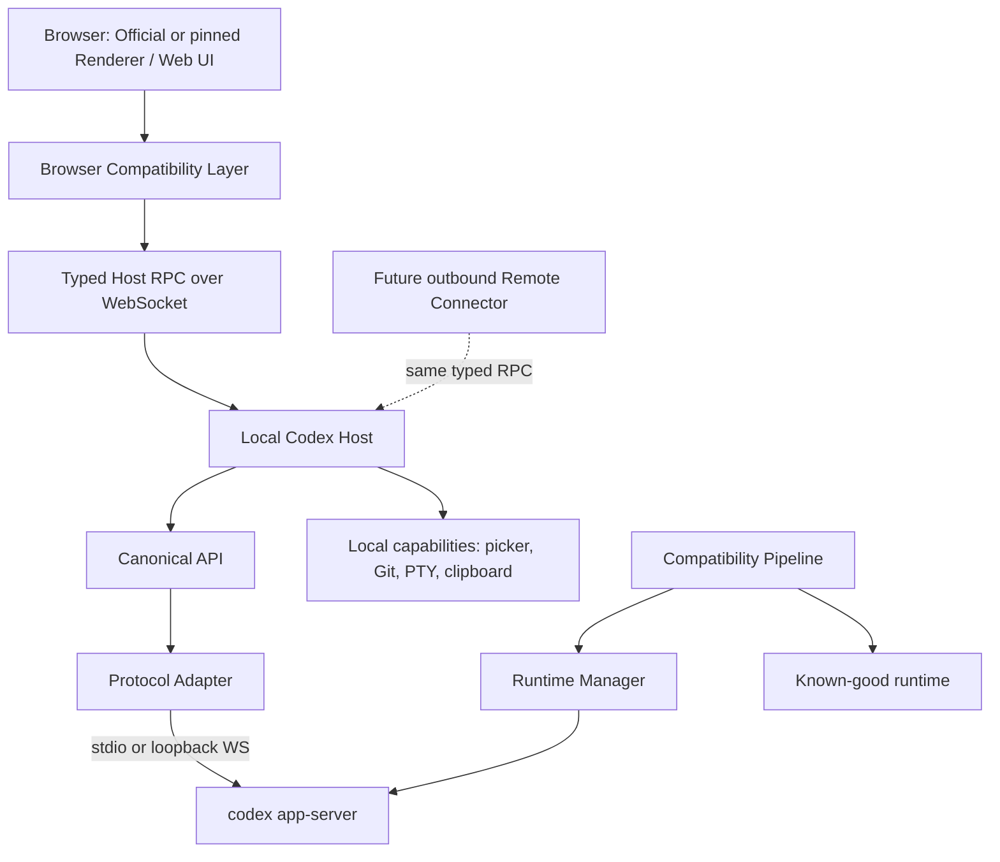

# Codex Web Runtime 自动适配架构设计

> **执行入口**：本文件说明架构、边界和技术决策；可直接进入开发排期的工作包、契约、命令、上线门与回滚步骤见 [Codex Web Runtime 可执行技术方案](./codex-web-runtime-execution-plan.md)。两份文档必须一起更新：设计变更先更新本文件，实施状态和验收证据更新执行方案。

本设计建立在当前可工作的浏览器 PoC 上，先隔离、测试和度量，再逐步迁移。当前实现不删除、不大改；新链路必须通过 compatibility gate 后才能成为 active runtime。

# 1. Current State

当前系统直接托管 Codex Desktop 26.803.81509 的官方 Renderer。服务端在响应时注入 `public/codex-browser-host.js`，并对两个官方 minified bundle 做内存字符串替换。browser host 模拟 `electronBridge`，经 `/api/codex-relay` 把语义消息交给 `server/codex-browser-service.mjs`，后者通过 stdio 连接 `codex.exe app-server`。

```text
Official Renderer
  -> Desktop-compatible browser host
  -> authenticated local Relay HTTP
  -> CodexBrowserService
  -> app-server stdio
  -> Codex Core and the user's existing Codex state
```

本机验证样本：

- Desktop `26.803.81509`, build `6415`, Electron `42.3.0`。
- app-server `0.147.0-alpha.6.6`。
- 实际生成 361 个 JSON Schema 文件和 723 个 TypeScript 文件。
- schema envelope：133 client requests、11 server requests、70 server notifications、1 client notification。
- app-server loopback WebSocket initialize 通过；`thread/list`、`model/list`、`skills/list`、`mcpServerStatus/list`、`plugin/list` 全部实测通过。

详细证据见 `docs/current-runtime-analysis.md` 与 `docs/electron-surface.md`。

# 2. Existing Technical Debt

| 技术债 | 影响 | 优先级 |
| --- | --- | --- |
| 固定 `app-initial-KpqQCW_k.js` / `app-main-CCNMdQcy.js` | 任意新 build hash 即绕过 patch | P0 |
| 精确 minified 函数/表达式替换 | 变量、打包顺序、控制流改变即失效 | P0 |
| browser host 固定 Desktop version/build/user agent | capability gate 与诊断失真 | P0 |
| `codexWindowType = "electron"` | Web runtime 仍依赖 Desktop 分支语义 | P1 |
| 手工维护 Desktop service stub | 新 service/method 无法自动发现 | P1 |
| 150 ms HTTP event polling | streaming 时延、请求放大、backpressure 不清晰 | P1 |
| app-server raw schema 直接向 Renderer 传播 | Renderer 与某版协议耦合 | P1 |
| provision 固定 ASAR hash、输出名和本机候选路径 | 更新后提取失败 | P2 |
| native/worker 能力静默 no-op | 页面可开但流程可能假成功 | P1 |
| 没有 active/known-good 双槽和升级 gate | 新 runtime 失败会直接影响用户 | P0 |

最危险的债务是“返回 200 但 patch 未命中”。所有临时 transform 都必须变成 fail-closed：记录预期 AST assertion，命中数不符就拒绝候选 runtime，不影响 known-good。

# 3. Target Architecture



边界原则：

- Browser 只依赖 HTML/CSS/JavaScript、Fetch/WebSocket、IndexedDB 和标准 Web APIs。
- Browser 不依赖 Electron executable、main process、preload、`ipcRenderer`、NodeIntegration。
- Local Host 是能力窄化器，不是第二套 Codex；Codex domain semantics 优先来自 app-server。
- Web UI 只依赖 Canonical API 和 capability matrix，不直接判断 Codex version。
- candidate runtime 必须在隔离目录完成生成、测试和评分；只有原子 activation 才能替换 active。

# 4. Electron Removal Plan

Electron 移除不是删除一个 executable，而是拆掉 Renderer 对 Desktop contract 的隐式依赖。

1. **进程层**：保持当前 Node server 直接启动 `codex.exe app-server`；浏览器路径禁止启动 `ChatGPT.exe`。本层已基本完成。
2. **传输层**：把 `sendMessageFromView`/event polling 收敛为 typed Host WebSocket；Host 内部可用 stdio 或 app-server loopback WebSocket。
3. **协议层**：Renderer 不再直接接触某版 raw JSON-RPC，全部经过 App Server Adapter 和 Canonical API。
4. **bridge 层**：从 preload AST 生成兼容 facade；native capability 显式 supported/unsupported，禁止假成功 no-op。
5. **启动层**：用 pre-bootstrap、import map/loader 和 service registry 满足启动环境；对仍需修改 bundle 的 build，仅在隔离 canary 使用结构化 AST transform。
6. **Renderer 层**：逐步把关键页面迁到 Web-native renderer；官方 Renderer 保留为 pinned compatibility surface 和对照样本。

完成判据不是“仓库里没有 Electron 文件”，而是 P0 浏览器测试运行时进程树无 Electron，浏览器全局无真实 Electron/Node 对象，且 capability denial 可解释、可测试。

# 5. Browser Compatibility Layer

Compatibility Layer 分三层：

```text
pre-bootstrap
  -> install runtime manifest, capability table, telemetry guards
official-renderer facade
  -> map legacy electronBridge calls to stable browser/host APIs
canonical client
  -> request/event/stream/cancel/reconnect contract
```

设计要求：

- bootstrap 必须在官方 module graph 前执行。
- facade 由 analyzer manifest 生成，但只有 allowlisted recipe 可以生成实现；未知 API 生成明确 unsupported error。
- theme、session id、timing、Web Worker 使用 Browser API。
- thread/turn/model/MCP/skills/plugins/fs/process 优先走 Canonical API。
- file picker、可信本机 path、OS drag、clipboard、notification、open external 走 Host RPC capability。
- no-op 只允许 telemetry/test-only 能力，并在 manifest 中标记 `degraded`。
- Offline assets 使用 content-addressed snapshot；运行数据不复制到浏览器长期存储，IndexedDB 只存 UI cache 和 non-secret resume cursor。

# 6. Codex Host

Local Codex Host 运行在用户机器，职责严格限定为：

- Discover：定位 Codex CLI/Desktop package、manifest、resources 和用户选择的 workspace。
- Runtime：启动/停止/健康检查 app-server，维护单用户或多 workspace session。
- Adapter：加载与当前 schema hash 匹配的协议 adapter。
- Local capabilities：受限 FS handle、Git、PTY、file dialog、clipboard、open external、notification。
- Security：origin 校验、capability grant、session/lease、audit、rate/size limits。
- Compatibility：运行候选 runtime probe，管理 active/known-good 双槽。

Host RPC 基础 envelope：

```ts
type RpcRequest = {
  v: 1;
  id: string;
  sessionId: string;
  capability: string;
  method: string;
  params: unknown;
  deadlineMs?: number;
};

type RpcResponse = {
  v: 1;
  id: string;
  ok: boolean;
  result?: unknown;
  error?: { code: string; message: string; retryable: boolean; details?: unknown };
};

type RpcEvent = {
  v: 1;
  event: string;
  sessionId: string;
  sequence: number;
  payload: unknown;
};
```

扩展规则：

- streaming 使用 `stream.open/chunk/ack/close`，每个 stream 有 byte window 和 sequence。
- cancellation 使用 `rpc.cancel` 或 `AbortSignal` 映射；不能只在 UI 丢弃响应。
- reconnect 用 session id、lease epoch 和 last acknowledged sequence 恢复；超出 retained window 时发 snapshot-required。
- binary/large file 走独立 upload/download handle，不把大型 base64 塞进 JSON。
- terminal stream 有独立 rate limit、resize/close，并绑定 workspace grant。
- Browser 永远没有 `shell.exec(anyString)`；命令只能通过 app-server approval 或明确的 typed allowlist。

# 7. App Server Adapter

Adapter 对上实现 Canonical API，对下连接某一 app-server schema。

```text
Canonical request
  -> capability guard
  -> request transform
  -> raw app-server request
  -> raw result/event/server request
  -> response/event transform
  -> canonical result
```

模块：

- `transport`: stdio、loopback WebSocket、framing、timeouts、reconnect。
- `schema-registry`: schema hash、generated types、method set、field metadata。
- `request-map`: canonical method 到 raw method/params。
- `event-map`: raw notifications/server requests 到 canonical events/approvals。
- `error-map`: raw code/message 到稳定错误分类。
- `capability-probe`: 对无副作用方法做 runtime 验证。

本机 WebSocket 实测证明 transport 可用，但生产 Browser 不应直接连接裸 app-server。Host 必须执行 origin/auth/capability、协议归一化和 secret redaction。内部 transport 默认继续 stdio，待 parity test 后再选择 WebSocket。

旧 Renderer连接新 app-server 的判断：**可能存在较长兼容窗口，但当前只有一个版本样本，不能宣称长期兼容**。只有把 old-renderer/new-server 作为 N x M 矩阵运行 P0 tests，才能建立可用区间。架构上应通过 adapter 支撑，不应让旧 Renderer直接依赖 raw 新协议。

# 8. Canonical Protocol

Canonical Protocol 只覆盖 UI 实际使用的稳定语义。它不是重写完整 Codex protocol，也不镜像所有 experimental fields。

```ts
type Id = string;
type CapabilityState = 'supported' | 'degraded' | 'unsupported';

interface CanonicalDevice {
  id: Id; name: string; kind: 'local' | 'remote'; online: boolean;
  capabilities: Record<string, CapabilityState>;
}
interface CanonicalProject {
  id: Id; name: string; cwd?: string; deviceId: Id; lastOpenedAt?: number;
}
interface CanonicalThread {
  id: Id; title?: string; cwd?: string;
  status: 'idle' | 'running' | 'waiting' | 'failed' | 'archived';
  createdAt?: number; updatedAt?: number;
}
interface CanonicalTurn {
  id: Id; threadId: Id; status: 'queued' | 'running' | 'completed' | 'failed' | 'interrupted';
  items: CanonicalMessage[]; startedAt?: number; completedAt?: number;
}
interface CanonicalMessage {
  id: Id; role: 'user' | 'assistant' | 'system' | 'tool';
  content: Array<{ type: 'text' | 'image' | 'file' | 'reasoning'; value: unknown }>;
}
interface CanonicalToolCall {
  id: Id; turnId: Id; tool: string; arguments: unknown;
  status: 'pending' | 'running' | 'completed' | 'failed'; result?: unknown;
}
interface CanonicalApproval {
  id: Id; threadId: Id; kind: 'command' | 'file-change' | 'permission' | 'tool';
  summary: string; choices: string[]; expiresAt?: number;
}
interface CanonicalModel {
  id: Id; label: string; hidden?: boolean; reasoning?: string[]; default?: boolean;
}
interface CanonicalMcpServer {
  id: Id; name: string; status: string; auth?: string; tools?: Array<{ name: string; title?: string }>;
}
interface CanonicalSkill { id: Id; name: string; description?: string; source?: string; enabled: boolean; }
interface CanonicalPlugin { id: Id; name: string; version?: string; installed: boolean; source?: string; }
interface CanonicalFile { path: string; kind: 'file' | 'directory'; size?: number; modifiedAt?: number; handle?: Id; }
interface CanonicalGit { root: string; branch?: string; dirty: boolean; changes?: Array<{ path: string; status: string }>; }
interface CanonicalTerminal { id: Id; cwd: string; cols: number; rows: number; status: 'running' | 'exited'; }
interface CanonicalSettings { model?: string; approvalPolicy?: string; sandboxMode?: string; values: Record<string, unknown>; }
```

Canonical methods 采用任务语义，例如 `threads.list`、`threads.resume`、`turns.start`、`approvals.respond`、`models.list`。字段 rename 只改 adapter；raw experimental payload 只能放入带版本的 `extensions`，不得渗透 UI 核心状态。

# 9. Renderer Strategy

| 方向 | 优点 | 缺点 | 当前适配度 |
| --- | --- | --- | --- |
| A. Follow Upstream Renderer | 最新 UI/feature，视觉最接近 Desktop | 私有 contract、hash/minify、启动逻辑频繁变化，自动化上限最低 | 作为 canary 输入，不作为唯一生产路径 |
| B. Pinned Renderer | 稳定、可完整回归、可与新版 server 解耦 | UI 新功能延迟，需要 adapter 维持兼容 | 当前首选生产路径 |
| C. Own Web Renderer | 真正 Web-native、契约可控、安全边界清晰 | 重写成本高，短期 UI/feature parity 风险最大 | 长期覆盖核心工作流 |

推荐混合策略：

- **短期**：B，保留当前已验证 Renderer snapshot，先抽出协议 adapter 和测试。
- **中期**：B + A，自动提取 upstream 为 candidate，跑 analyzer 和 P0 canary；通过才可选择升级。
- **长期**：C 覆盖 Projects/Threads/Turn/Approval/Models/MCP/Skills/File diff 等核心语义；upstream Renderer 继续作为兼容/对照或新功能试验面。

这比永久跟随 minified upstream 更符合“半年后仍能自动更新”的目标，因为 server protocol 有 schema，而 private Renderer lifecycle 没有稳定 schema。

# 10. Version Detection

发现顺序不能依赖固定路径：

1. Windows package discovery：AppX/MSIX package identity 和 manifest。
2. 解析 install location，寻找 `resources/app.asar`、unpacked resources、webview entry、preload、`codex.exe`。
3. CLI discovery：显式配置、package resources、`PATH`；校验实际 `--version`。
4. 提取 package version/build，不用它决定 adapter，只用于诊断。

Fingerprint：

```json
{
  "desktopVersion": "26.803.81509",
  "desktopBuild": "6415",
  "codexVersion": "0.147.0-alpha.6.6",
  "rendererHash": "428f31...cd95",
  "indexHash": "3dddb9...7e94",
  "preloadHash": "384839...77e",
  "appServerHash": "592958...9b3",
  "schemaHash": "4577be...ca77"
}
```

任何 hash 变化触发 compatibility pipeline。Desktop version 相同但资源 hash 不同也必须视为新 candidate；version 变化但 schema/Renderer hash 未变则可复用已验证 artifact。

# 11. Schema Compatibility

启动 candidate app-server 后实际运行：

```text
codex app-server generate-json-schema --experimental <dir>
codex app-server generate-ts --experimental <dir>
```

然后：

```text
old schema + new schema
  -> method/notification set diff
  -> request/response structural diff
  -> compatibility classification
  -> adapter action list
```

分类规则：

| 变化 | 默认判断 | 自动动作 |
| --- | --- | --- |
| method added | non-breaking | capability 增加，UI 默认不启用 |
| method removed | breaking | candidate blocked，要求 adapter/fallback |
| optional field added | non-breaking | adapter 忽略或透传已允许字段 |
| required field added | breaking | 生成 adapter TODO 和 fixture |
| field removed | breaking | 查 canonical mapping 使用点 |
| type changed | breaking | 拒绝自动 activation |
| enum added | non-breaking/review | parser 保留 unknown 分支 |
| enum removed | breaking | 检查 UI/default mapping |
| oneOf/anyOf 变化 | review | 生成合成 fixture 跑 parser |

`scripts/diff-codex-app-server-schema.mjs` 已实现基础分类，并用同一 361-file schema 自比较验证 0 change。下一步要解析 `$ref` 后比较 request/response method graph，并为 rename 候选提供相似度提示。自动提示不是自动语义 patch；`threadName -> name` 必须经 fixture/test 确认。

Schema 能支撑 app-server 大部分版本适配，但不能描述 Electron preload、Renderer service lifecycle、文件权限和视觉行为，因此不是完整 compatibility oracle。

# 12. Preload Analyzer

Analyzer pipeline：

```text
preload entry
  -> parse AST/module graph
  -> find require/import electron symbols
  -> resolve contextBridge exposed globals
  -> trace ipcRenderer/webUtils member calls
  -> extract static channels and dynamic expressions
  -> correlate main-process handlers
  -> emit electron-surface.json
```

关键实现约束：

- 用 symbol/declaration resolution，不依赖 minified 变量名。
- 支持 property/element access、alias、object literal method、re-export。
- main bundle 中匹配 `ipcMain.handle/on` 与 channel constants，提取参数和 result shape。
- computed/dynamic channel 标记 unresolved，不做文本猜测。
- source map 存在时用于 module/原函数定位；不存在时仍能 AST 工作。
- runtime Proxy 记录静态分析遗漏的方法、事件、参数 shape 和 timing。
- analyzer 自身用变换变量名、格式化和 bundle chunk 的 mutation fixtures 测试。

本轮工具已识别 preload 的 22 个 bridge methods、明确 IPC channels 以及 Renderer 的 19 个静态调用方法，证明路径可行；尚未自动解析 Electron main handler 和动态 worker channels。

# 13. Automatic Shim Generator

输入：

- `electron-surface.json`
- canonical capability matrix
- browser replacement recipes
- host RPC allowlist/schema
- known-good observed surface

输出：

- `generated/legacy-electron-bridge.ts`
- `generated/capabilities.json`
- `generated/unresolved.json`
- contract tests 和 synthetic preload fixtures

生成规则：

```text
known API + browser recipe -> Browser implementation
known API + app-server mapping -> Canonical client call
known API + host allowlist -> typed Host RPC
telemetry-only API -> declared degraded/no-op
unknown or ambiguous API -> unsupported + candidate test failure
```

Generator 只生成 glue，不推断业务语义。比如识别出 `ipcRenderer.invoke("open-project")` 并不代表能自动知道路径授权、返回对象、取消语义；缺 recipe 时必须落入 unresolved。

目标是 `Original Renderer + pre-bootstrap + generated facade`。如某 build 的 startup 仍硬编码 Desktop service connect，允许 candidate-only AST transform，但 transform 必须基于结构和 assertion，产物 content-addressed，并被标记为较低 compatibility tier；不能继续在 HTTP 请求中临时字符串替换。

# 14. Capability Negotiation

禁止把版本号当主判断：

```ts
if (version === 'x.x.x') { /* forbidden as the primary switch */ }
```

能力来源按可信度排序：

1. initialize response 中的显式 server capabilities。
2. generated schema 的 method/field set。
3. 无副作用 runtime probe。
4. preload/Renderer static surface。
5. canary runtime observations 和 E2E result。

能力记录：

```ts
interface CapabilityEvidence {
  name: string;
  state: 'supported' | 'degraded' | 'unsupported' | 'unknown';
  source: 'initialize' | 'schema' | 'probe' | 'static' | 'e2e';
  schemaHash: string;
  verifiedAt: number;
  details?: Record<string, unknown>;
}
```

启动选择按 `required capability set` 匹配 adapter，不按 version equality。version 仅用于日志、support bundle 和排序。核心 matrix 至少包含 thread start/resume/list/read、turn start/steer/interrupt、approvals、models、MCP、skills、plugins、filesystem、terminal、settings、account。

# 15. Compatibility Pipeline

状态机：

```text
DISCOVER -> EXTRACT -> ANALYZE -> GENERATE -> TEST -> ACTIVATE
     |          |          |          |         |
     +----------+----------+----------+---------+-> QUARANTINE on failure
```

详细步骤：

1. Discover installed Desktop/CLI without fixed path。
2. 读取版本与 package manifest，计算 binary/package hashes。
3. Extract Renderer/index/assets/preload 到 candidate content-addressed directory。
4. 实际生成 app-server TS/JSON Schema。
5. 计算完整 fingerprint，与 active/known-good 比较。
6. 跑 schema diff 和 capability matrix。
7. 跑 preload/main AST analyzer 和 surface diff。
8. 生成 adapter/facade；unresolved 进入 blocking list。
9. 用隔离 SQLite/cache/config overlay 启动临时 app-server。
10. 运行 protocol/Host RPC tests。
11. 在隔离 browser origin 启动 candidate Renderer。
12. 运行 P0 Playwright flows 和 runtime instrumentation。
13. 计算 compatibility score，并验证无 secret/data pollution。
14. 生成 signed compatibility manifest。
15. 达到 gate 后原子切换 active pointer；否则 quarantine，继续 known-good。

`PATCH/SHIM` 不再是单一强制阶段：优先 `GENERATE SHIM`；需要 AST transform 时单独标记 `transformed=true` 并降低自动 activation 权重。

# 16. Testing Strategy

测试分层：

- **Schema tests**：method/field/required/type/enum/request/response/notification diff。
- **Protocol contract tests**：canonical fixtures 对不同 raw schema adapter 的双向映射。
- **Host RPC tests**：auth、origin、capability、cancel、resume、backpressure、binary limits。
- **Analyzer tests**：变量重命名、chunk 重排、source map 有/无、dynamic unresolved。
- **Browser E2E**：真实 Chrome/Edge；Safari/WebKit 作为 compatibility tier。
- **Cross-version matrix**：Renderer R(N-1/N) x app-server S(N-1/N/N+1)。

P0 必测：

```text
page load
Projects visible
history Threads visible
open Thread
resume Thread
new Thread
switch Project
send message
streaming response
tool call
approval request/response
file modification and diff
model selection
MCP inventory/use
Skills inventory/use
```

测试必须使用 disposable workspace 和 isolated runtime state；不拿真实历史做写操作。只读 probe 可读取现有状态时也只记录 shape/count，不记录标题、prompt、path、token。

Compatibility Score 不是简单平均：

```text
P0 core flow failure             -> incompatible
security/origin/capability fail  -> incompatible
schema breaking unresolved       -> incompatible
P1 native integration fail       -> score deduction + degraded
telemetry/cosmetic fail          -> score deduction only
```

报告示例：

```text
Renderer  PASS    App Server PASS    Threads PASS
Streaming PASS    Approvals  PASS    Models  PASS
MCP       PASS    Skills     PASS    Native Drag DEGRADED
Compatibility: 96%, core gate: PASS
```

# 17. Rollback Strategy

每个 compatible runtime 保存不可变 bundle：

```text
fingerprint.json
renderer snapshot
adapter build
generated shim
schema and types
capability matrix
test report
compatibility manifest
```

维护 `active`、`candidate`、`known-good` 三个指针。activation 只更新指针，不覆盖旧文件；服务启动失败、P0 health check 失败或运行时错误预算超限时自动回到 known-good。用户数据、Codex config、Projects/Threads 不随 runtime slot 复制或回滚，避免历史分叉。

新 app-server 与旧 Renderer 的混用只有在 cross-version gate 通过时允许；否则回滚整个经过验证的 Renderer + adapter 组合。UI 明确显示 update detected/candidate quarantined/core remains on known-good，不让升级失败变成白屏。

# 18. Security

本地不等于可信。最低边界：

- Host 默认只绑定 `127.0.0.1`/`::1`；非 loopback 必须启用 signed bearer/capability-token 模式。
- 校验精确 origin，开发端口也必须由启动时 nonce 注册；任意网页不能连接 Host。
- 浏览器先通过 same-site bootstrap 获取一次性 session ticket，再换短期 connection capability。
- 每个 RPC 同时校验 session、lease、method capability、workspace scope、size/rate/deadline。
- FS 使用 canonicalized root grant，防 symlink/junction escape；file handle 不暴露不必要的绝对路径。
- Shell/PTY 不提供任意 Web API；复用 app-server approval，额外 host command 必须 typed allowlist。
- WebSocket 限制 message/frame/stream window；拒绝未 ack 的无限输出。
- token、Codex credentials、prompt、文件正文不进入 compatibility report、telemetry 或 browser persistent cache。
- CSP 禁止任意远端 script，Renderer snapshot 按 hash 校验；generated artifact 带 manifest/hash。
- connector/cloud relay 只见密文或最小路由元数据；本地 secret 不上传。
- 审计日志记录 method、capability、result code、byte count，不记录敏感 payload。

app-server 原生提供非 loopback WebSocket auth 选项，但 Browser 仍应连接 Host facade，而不是直接暴露 raw app-server。

# 19. Remote-ready Architecture

未来公网能力复用同一 Host RPC，不创建云端 Windows VM，也不把用户 Codex 状态搬到服务器：

```text
Remote Browser
  -> HTTPS/WSS Relay (routing, auth, bounded buffering)
  -> outbound Local Connector
  -> Local Codex Host
  -> local app-server / workspace / Git / filesystem
```

Local Connector 主动出站，避免入站端口；用 device key + owner account 配对，短期 session capability 与 lease 控制单一 active controller。Relay 不理解 canonical payload 时仍可按 sequence/stream/window 转发；高风险 approval 在本地或绑定设备重新确认。

协议从第一天包含 `deviceId`、`sessionId`、`sequence`、resume cursor、capability 和 transport-independent error，因此 local/remote 只替换 transport，不分叉 UI 和 domain protocol。当前已有 device gateway/relay 代码可以作为未来承载层，但本轮不扩建公网 Relay。

# 20. Migration Plan

## 推荐目录结构

先遵循当前仓库边界，不立即改成大 monorepo：

```text
server/
  codex-runtime/
    runtime-manager.mjs
    app-server-transport.mjs
    canonical-adapter.mjs
    host-rpc.mjs
    capability-registry.mjs
    runtime-slots.mjs
public/
  codex-runtime/
    bootstrap.js
    canonical-client.js
    generated-legacy-bridge.js
scripts/
  codex-compat/
    discover.ps1
    extract.mjs
    fingerprint.mjs
    schema-diff.mjs
    preload-analyzer.mjs
    generate-shim.mjs
    probe.mjs
tests/
  codex-compat/
    protocol/
    host-rpc/
    fixtures/
    e2e/
output/codex-runtimes/
  candidates/<fingerprint>/
  known-good/<fingerprint>/
```

只有当这些模块稳定并被其他产品复用时，再提取为 `packages/web-runtime`、`packages/codex-host`、`packages/codex-protocol`、`packages/compatibility` 和 `packages/connector`。

## Phase 0 - 基线、fingerprint 与回归门

| 项目 | 内容 |
| --- | --- |
| 目标 | 冻结当前 known-good 行为，所有更新先可检测、可比较、可回滚 |
| 修改模块 | 只给 `server/app.mjs` 外围增加可观测 assertion；不删除现有 patch |
| 新增模块 | fingerprint、schema dump/diff、read-only probe、P0 Playwright baseline、runtime manifest |
| 风险 | 测试误写用户状态、fingerprint 不稳定、fixture 泄露内容 |
| 验证 | disposable workspace；hash 重跑稳定；当前 UI/Threads/Projects/streaming 基线通过 |
| 完成标准 | active runtime 有完整 fingerprint/test report；任意 patch 未命中会 fail-closed；known-good 可一键启动 |

## Phase 1 - 抽离 app-server 通信

| 项目 | 内容 |
| --- | --- |
| 目标 | UI 与 raw app-server schema 之间建立 transport + canonical adapter |
| 修改模块 | `server/codex-browser-service.mjs` 内部拆 transport；Relay 只依赖 canonical host interface |
| 新增模块 | stdio/WS transport、schema registry、canonical types、request/event/error maps |
| 风险 | notification 顺序、server request/approval、cancel/reconnect 语义回归 |
| 验证 | raw traffic replay、adapter contract tests、stdio/WS parity、现有 E2E 全通过 |
| 完成标准 | 现有 Renderer 不感知改动；五类实测 API 和 P0 flow 经 adapter 通过；无 version equality 主分支 |

## Phase 2 - Electron API shim 与 Host RPC

| 项目 | 内容 |
| --- | --- |
| 目标 | 用 typed Browser/Host capability 实现当前 preload surface，移除 HTTP polling |
| 修改模块 | `public/codex-browser-host.js` 变薄 facade；Relay session transport 支持 WebSocket |
| 新增模块 | Host RPC、capability registry、stream/ack/resume、generated facade、native recipes |
| 风险 | native file/worker/clipboard 功能退化，origin 配置错误，高频 stream 堵塞 |
| 验证 | Electron process absence、origin attack tests、backpressure soak、P0/P1 E2E |
| 完成标准 | 核心路径无真实 Electron/IPC；每个 bridge method 有 A-E 分类和测试；未知能力明确失败 |

## Phase 3 - Renderer/Preload 自动发现与分析

| 项目 | 内容 |
| --- | --- |
| 目标 | Desktop 更新后自动发现 package、提取 Renderer、分析 preload/main、生成 candidate shim |
| 修改模块 | 替代 provision 脚本中的固定 hash/path，但保留旧命令作为 rollback |
| 新增模块 | package discovery、content-addressed extractor、module graph、preload/main analyzer、runtime instrumentation |
| 风险 | MSIX 权限、无 source map、动态 channel、analyzer 误判 |
| 验证 | 两个真实 build + 变量重命名/chunk mutation fixtures；observed surface 与 static surface 对账 |
| 完成标准 | 不依赖固定 asset hash/变量名/minified 字符串；unresolved 会 quarantine candidate |

## Phase 4 - 自动适配与原子 activation

| 项目 | 内容 |
| --- | --- |
| 目标 | fingerprint 变化自动触发完整 pipeline，通过后原子上线，失败继续 known-good |
| 修改模块 | 启动流程接入 runtime manager；管理页显示 candidate/score/fallback reason |
| 新增模块 | pipeline state machine、compatibility scorer、N x M matrix runner、slot manager、signed manifest |
| 风险 | 假阳性 activation、磁盘增长、旧 Renderer/新 server 隐性语义偏差 |
| 验证 | 故障注入、断电/进程崩溃、breaking schema、Renderer 白屏、rollback timing |
| 完成标准 | 更新失败零现有 UI/历史/Projects/配置回归；自动 rollback；80% 以上常见结构变化自动分类，P0 gate 决定上线 |

## 核心判断：10 个问题的直接答案

1. **离完全脱离 Electron 还有多远？** 对已证明的运行路径，Electron executable/main/preload 已移除约 70%-80%；对长期可维护产品，canonical adapter、typed Host RPC、native parity、自动 pipeline 和 rollback 尚未完成，整体工程约在 40%-50%。
2. **最难移除的 Electron dependency？** Desktop service startup/client coordination、MessagePort/worker、可信本机 file path/drag/dialog/clipboard，以及 Renderer 对 `codexWindowType` 和隐藏 service object 的条件分支。
3. **Renderer 能否在纯浏览器完整运行？** 当前 build 的核心 Threads/Models/Skills/MCP/Plugins 流程已有直接证据；“全部 Desktop 功能完整”尚无证据，native/worker-adjacent 能力仍有缺口。
4. **能否完全不修改官方 Renderer bundle？** 长期目标应做到核心路径零修改；但当前 build 已证明两处 startup/service 假设需要处理。pre-bootstrap/facade 可能消除多数 patch，是否达到 100% 必须由新 canary 证明，当前不能承诺。
5. **preload 能否 AST 自动分析？** 大部分可以。本轮已在变量名压缩情况下抽取 globals、22 methods 和 IPC surface；动态 channel、反射和 main-handler 语义仍需 runtime instrumentation。
6. **app-server schema 能否支撑自动适配？** 能支撑协议层的主要部分，且 TS/JSON Schema 已实测生成；它不能覆盖私有 Renderer/Electron contract 和行为语义。
7. **能否做到 80% 以上更新自动兼容？** 对 schema 结构变化的自动发现/分类和 pinned Renderer + adapter 路线，可把目标设为 80% 以上；对“每次自动跟随最新 minified upstream Renderer”，没有足够依据保证 80%。
8. **哪些变化必然需要人工？** method/field 的语义改变或删除、启动生命周期重构、新 native 权限/API、无法推断的动态 IPC、认证/安全模型变化、P0 视觉或交互行为改变。
9. **Follow Upstream 还是 Pinned Renderer？** 当前生产路径选 Pinned Renderer；Follow Upstream 作为自动 candidate/canary，不直接替换 active。
10. **半年后仍自动跟随更新，现在先改什么？** 先完成 Phase 0：冻结 known-good，建立 fingerprint、schema fixture/diff、P0 compatibility tests 和 fail-closed patch assertion；随后第一项代码结构改动是把 app-server transport/adapter 从 `server/codex-browser-service.mjs` 抽离。不要先重写 UI，也不要先继续增加 bundle 字符串 patch。

## 最终工程决策

当前 PoC 应继续作为 known-good，不做爆炸式重构。下一实施轮只进入 Phase 0：把本轮三个 probe 脚本产品化、增加第二版本样本和 P0 baseline、让当前 patch 命中失败可检测。Phase 0 的证据通过审查后，再进入 app-server adapter 抽离；这条顺序同时满足零功能回归、零现有 UI 回归、零历史/Projects 丢失和零 Codex 配置污染。

## Phase 0 实施状态

本轮已完成 Phase 0 的第一批可运行基础设施：

- `server/codex-runtime-compatibility.mjs`：动态发现 patch asset、计算 fingerprint、读取 baseline、执行 fail-closed transform。
- `scripts/record-codex-runtime-baseline.mjs`：记录当前 known-good manifest。
- `output/codex-runtimes/known-good.json`：当前 Desktop/app-server 组合的本地 baseline。
- `server/codex-runtime-compatibility.test.mjs`：重命名 asset、baseline match/mismatch、anchor 消失三类测试。
- `/api/codex-browser/status`：返回 runtime state、checks、fingerprint、baseline state。
- `/codex/`：runtime 不兼容时返回 503，不把未经验证的 Renderer 交给浏览器。

当前 baseline 实测为 `match`；资源 transform、现有服务健康检查和真实浏览器加载均已通过。Phase 0 尚未完成的部分是第二个真实 Desktop/app-server 版本矩阵，以及 provision 脚本的 AppX/manifest discovery；这两项进入 Phase 3，不在本轮假装已经完成。

## Phase 1 实施状态

本轮已完成 Phase 1 的兼容抽离第一步，暂不切换 Renderer 协议：

- `server/codex-app-server-transport.mjs` 负责 app-server 进程启动、环境隔离、stdio JSONL framing、initialize、内部 request timeout、stderr tail、连接生命周期和 close。
- `server/codex-canonical-adapter.mjs` 负责 canonical method 到 raw app-server method 的映射、入站 response/server-request/notification 分类和声明能力矩阵。
- `server/codex-browser-service.mjs` 只保留 Relay event buffer 与 legacy `mcp-*` envelope 兼容；它通过 transport/adapter 转发，不再拥有进程和 framing 实现。
- 没有 schema/probe evidence 时 capability 状态明确为 `unknown`；不会把静态 method map 伪装为 runtime `supported`。
- `codex-app-server-transport.test.mjs`、`codex-canonical-adapter.test.mjs` 与原有 browser-service tests 已通过。

本轮仍保留 stdio 作为稳定生产 transport，canonical request 尚未成为官方 Renderer 的默认入口；下一步应将本版本生成的 schema method set 注册到 adapter，再增加 raw traffic replay 和 stdio/WebSocket parity，之后才切换浏览器 Host RPC。

## Phase 1 协议证据与双通道验证

本轮已完成 Phase 1 的第二步，补齐 schema registry 与 transport parity：

- `server/codex-protocol-evidence.mjs` 自动发现最新完整 probe 目录，从生成的 `ClientRequest`、`ServerRequest`、`ClientNotification`、`ServerNotification` schema 提取有方向的方法集，并合并 live probe 结果与 schema SHA-256。
- adapter 只有在初始化返回的 app-server user agent 版本与 evidence `protocolVersion` 完全匹配时才激活能力；启动前为 `pending-runtime`，版本不一致为 `mismatch`，两者都保持 `unknown`。
- `/api/codex-browser/status` 现在同时给出 capability state、各能力所需方法、live verification 覆盖率、schema/probe 路径和实际/期望版本。
- `scripts/verify-codex-transport-parity.mjs` 使用隔离的 SQLite home 依次启动 stdio 与 loopback WebSocket app-server，对相同只读请求比较结构契约，不把线程正文或账号内容写入报告。
- transport 初始化超时或进程异常退出时会终止未完成的子进程、保留 stderr 摘要并允许下一次干净重试；parity 工具对瞬态启动失败执行有限重试。
- `XHS_CODEX_PROTOCOL_EVIDENCE_ROOT` 可覆盖证据目录；目录缺失或内容不完整时服务继续启动，但能力矩阵降级为 `unknown`。

当前仍不把 canonical request 强制替换 Renderer 的 legacy envelope。进入 Phase 2 前的剩余门槛是：双通道 parity 实测通过、浏览器 P0 回归通过，然后为 preload surface 建立 typed Host RPC 与 stream/ack/resume。

## Phase 2 实施状态：Host RPC 事件流

本轮完成 Phase 2 的第一条生产路径，先替换高频事件轮询，不一次性改动已验证的消息发送语义：

- `server/codex-relay-service.mjs` 新增单次 stream ticket，绑定 Relay session 与 browser instance；内部维护 stream cursor、acked cursor、resume 和 idle cleanup。
- `server/codex-host-rpc-service.mjs` 提供 `codex-host-rpc.v1` WebSocket，使用 `hello/event/ack/resume/result/error/ping/pong` 类型化 envelope。
- ticket 通过已认证的 HTTP POST 签发，WebSocket 使用短期单次 ticket subprotocol；生产环境校验配置 origin，本地环境只接受 loopback origin。
- 服务端按 `bufferedAmount` 执行背压暂停，连接使用 ping/pong 检测，断开时关闭对应 Relay stream。
- `public/codex-browser-host.js` 优先使用 WebSocket 接收事件，按 sequence 去重并 ack；断线后从最后 cursor 重签 ticket，恢复期间使用 1 秒 HTTP polling 回退，连接恢复后自动停止 polling。
- 现有 `sendMessageFromView` 继续使用 Relay HTTP message endpoint，因此 `fetch` 等同步 host recipe 与 legacy `mcp-*` envelope 不发生行为切换。
- Vite `/api` proxy 已启用 WebSocket upgrade，开发环境和生产同源路径使用同一个 stream URL。

下一切片是把 message command 也纳入 Host RPC request/result，同时抽取 `fetch/dialog/clipboard/file/worker` 的 typed capability recipes；该切换必须在本轮事件流浏览器回归通过后进行。

## Phase 2 implementation status: Host RPC commands

The second Phase 2 production slice now moves browser-to-host commands onto the same `codex-host-rpc.v1` WebSocket used by the event stream:

- `server/codex-host-command-service.mjs` is the single command execution path for WebSocket, Relay HTTP, and the legacy browser endpoint. It owns observed-message accounting, synchronous host recipes, and bounded idempotency results.
- Browser commands use the typed `request/result/error` envelope with method `host.message.send`. The authenticated event stream binds each request to its Relay session and browser instance; control-sensitive messages still require the active lease epoch.
- Every browser command carries a stable `commandId`. A WebSocket disconnect or timeout may retry the command over HTTP with the same id, and the shared relay-session cache returns the original promise/result instead of executing the adapter twice.
- Browser unload releases its control lease with a keepalive request. If a newer controller later releases or expires, a previously displaced authenticated browser can reacquire the lease on its normal renewal loop; it does not steal from a controller that is still active.
- The Host RPC hello envelope advertises the recipe registry. `fetch`, persisted atoms, shared objects, the browser context menu, and the core `git` worker surface are implemented. File paths remain secure-null and OS file drag remains explicitly unavailable in the browser.
- HTTP event polling remains a reconnect-only fallback. HTTP command delivery remains a transport fallback, not a separate behavior implementation.

The remaining Phase 2 native-recipe work is managed worktree lifecycle/handoff, OS file drag, and any future preload methods discovered in later runtime builds. Read-only advanced review and review patch mutations are now implemented. Current dialog and clipboard entries are classified as absent from this preload rather than as invented compatibility requirements.

## Phase 2 implementation status: native bridge recipes

The next Phase 2 slice is implemented against the current packaged preload and main-process contracts rather than a speculative desktop API list:

- The current preload exposes `showContextMenu`, `getPathForFile`, `startFileDrag`, and dynamic worker send/subscribe methods. It does not expose standalone dialog or clipboard methods, so the capability registry reports those as `not-in-current-preload` instead of claiming missing implementations.
- `showContextMenu` now uses an accessible browser-native DOM menu with separators, checkbox state, nested submenus, disabled items, viewport collision handling, outside-click dismissal, and keyboard navigation. It preserves the desktop return contract `{ id }`.
- `getPathForFile` returns `null` for browser `File` objects. A browser file name is not a trusted absolute path; existing Renderer upload/copy fallbacks remain responsible for transferring selected files. `startFileDrag` returns `false` because browsers cannot synchronously initiate an operating-system file drag equivalent to Electron.
- The observed dynamic preload worker surface is limited to the `git` worker. Browser requests retain the desktop `worker-request`, `worker-request-cancel`, `worker-response`, and `worker-event` envelopes and use `host.worker.send` over the existing Host RPC stream, with the same Relay HTTP path as transport fallback.
- `server/codex-git-worker-service.mjs` provides a bounded Git CLI compatibility worker for the current workspace and Git-registered worktrees. It covers repository metadata, branches, status, origins, config, worktrees, commits, submodule paths, branch diff statistics, review summaries, and the current Renderer live-query envelope. Unknown methods return a typed worker error instead of hanging.
- Advanced read-only review follows the packaged worker contract: `review-diff` returns per-path `diff/diffBytes`, `review-patch` returns `unifiedDiff/unifiedDiffBytes`, `review-search` returns capped hunk-aware matches, and `commit-message-diff` distinguishes staged-only from all tracked changes. Untracked files are included in review patches and searches but remain excluded from commit-message generation, matching the observed Renderer behavior.
- Review summaries expose `changeKind` and stable snapshot generations. A superseded generation returns `stale-snapshot`, while file pathspecs, revisions, output size, and concurrent diff reads remain bounded.
- Git review mutations implement the packaged `apply-patch`, `apply-review-section-changes`, and `apply-changes` result contracts. Patches can target the worktree, index, or both; section actions support stage, unstage, and revert; source-tree changes can be applied to an allowed destination checkout. Review-file revisions are revalidated immediately before section writes and stale selections return `stale-review` without changing the repository.
- Managed Git worktree recipes now run through the same browser `git` worker: `create-worktree` creates a detached or named-branch worktree below the configured worktree root, `worktree-status` reports branch/revision/dirty state, and `remove-worktree` plus `prune-worktrees` clean up only managed paths. IDs, refs, roots, and Git failures return structured errors.
- Mutation inputs retain the worker envelope size limit and additionally validate patch paths, repository roots, target modes, actions, and revisions. Atomic operations fail as a unit; non-atomic three-way applications report partial results and conflict metadata.
- Renderer-sized subscription ids, generation/recovery fields, and live-query trace propagation follow the observed packaged contract. Metadata probes for historical sidebar projects outside the active workspace resolve to `null` without granting filesystem access or entering the Renderer retry loop.
- Worker commands require the active Relay control lease. Worker ids, message sizes, request ids, method names, config keys, revisions, command output, deadlines, and canonical filesystem paths are validated. Arbitrary commands and paths outside the active workspace or its registered worktrees are not exposed.
- The packaged official `worker.js` was tested under the server Node runtime, but it does not finish initialization there because it is built for the packaged Electron/Node ABI and native dependency set. The packaged launcher also disables `ELECTRON_RUN_AS_NODE`; therefore this slice preserves its wire contract while using Git itself as the proven execution engine.

Remaining native parity work is explicit: OS file drag still needs a signed local connector or a browser download interaction; worktree restore snapshots, thread handoff, and repository overwrite flows need additional typed recipes before they can be reported as implemented. Worktree create/status/delete/prune, advanced review, snapshot generation, patch application, section stage/unstage/revert, and source-tree application are implemented.
