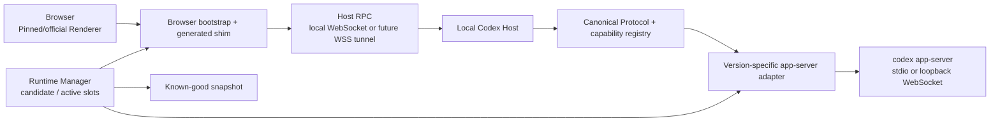

# Codex Web Runtime 可执行技术方案

## 0. 文档定位

本文件把 [Codex Web Runtime 自动适配架构设计](./codex-web-runtime-design.md) 收敛为可拆分、可测试、可回滚的实施计划。它不是一次性替换当前 `/codex/` 的重写方案：现有可工作的浏览器运行面继续作为 `known-good`，每个新能力只在独立 candidate runtime 中验证，通过 P0 门后才允许原子切换。

本计划的范围是本项目的 Codex Web Runtime：浏览器中的官方或 pinned Renderer、浏览器兼容层、Local Codex Host、`codex app-server` 适配、版本兼容流水线和为未来公网 Connector 预留的 transport contract。Mirror、设备网关和 TURN 的现有实现继续可用，但不能被当成 Web Runtime 自动适配已经完成的证据。

### 0.1 不变约束

- 浏览器核心路径只使用 HTML、CSS、JavaScript、Fetch、WebSocket、IndexedDB 与标准 Web API；不得要求 Electron executable、Electron main process、`ipcRenderer`、`contextBridge` 或 NodeIntegration。
- Codex domain semantics 优先来自 `codex app-server`。Local Host 只负责启动、协议适配、浏览器无法完成的窄化本机能力和安全边界。
- Renderer 不直接依赖某一版 raw app-server JSON-RPC。浏览器与 Host 都只依赖 Canonical Protocol 与 capability matrix。
- 不把官方 minified bundle 的固定 hash、变量名、字符串片段或本机安装目录作为长期接口。既有 patch 只能作为 active known-good 的临时兼容措施。
- Candidate 任一 P0 流程失败时必须隔离，不得覆盖 active runtime、用户 Threads、Projects、登录状态、配置或工作区。
- 本轮公共网络只保留 transport-neutral contract；公网 Relay/Connector 的上线另走独立发布门。

### 0.2 当前基线与缺口

下表只记录仓库中已经存在的入口，不把“有代码”误写成“全功能已验证”。每次实施开始前应先运行表内验证命令，结果写入 candidate 的 `test-report.json`。

| 能力 | 当前入口 | 状态 | 仍需完成的工作 |
| --- | --- | --- | --- |
| Runtime fingerprint 与 fail-closed transform | `server/codex-runtime-compatibility.mjs`、`scripts/record-codex-runtime-baseline.mjs` | 已有单一 known-good 基线 | 多安装来源发现、candidate slot、两版本矩阵、原子 activation |
| app-server stdio transport | `server/codex-app-server-transport.mjs` | 已抽出进程与 JSONL framing | 所有 Canonical method 的 replay、取消/approval 语义校验 |
| Canonical adapter | `server/codex-canonical-adapter.mjs` | 已有第一层 method/event 映射 | 稳定实体 schema、版本无关 capability negotiation、adapter fixture matrix |
| protocol evidence 与 schema parity | `server/codex-protocol-evidence.mjs`、`scripts/probe-codex-app-server.mjs`、`scripts/verify-codex-transport-parity.mjs` | 已有 schema/probe 读取与双通道比对入口 | schema differ 分类、报告归档、基于能力而非版本号选择 adapter |
| Host RPC 事件与命令 | `server/codex-host-rpc-service.mjs`、`server/codex-host-command-service.mjs`、`public/codex-browser-host.js` | 已有 WebSocket、ack、resume 与部分 recipe | 生成型 facade、完整 cancellation/reconnect soak、每个 bridge method 的可测状态 |
| Git/部分 native bridge | `server/codex-git-worker-service.mjs` | 当前工作区与受管 worktree 有受限实现 | file picker token、OS drag 处置、未观测 worker 与 desktop-only 流程 |
| 官方 Renderer evidence | `scripts/probe-codex-web-runtime.mjs`、`docs/electron-surface.md` | 已有单 build 静态分析 | package discovery、preload/main AST 独立产物、runtime instrumentation、surface diff |
| Local/remote transport 基础 | Relay、device gateway、connector、Mirror 模块 | 已有独立产品能力 | 把 Web Runtime Host RPC 变为 local WS/WSS tunnel 的同一接口；不在本计划中上线公网 Relay |

## 1. 目标运行面与发布策略

### 1.1 目标数据流



### 1.2 选择的 Renderer 策略

生产默认采用 **Architecture B：Pinned Renderer + Latest Codex Backend**。当前已验证 Renderer 继续提供官方界面；app-server 变化由 adapter 和 capability matrix 隔离。最新版 Desktop Renderer 只能作为自动发现的 candidate/canary，不能在下载或发现后自动替换 active runtime。

Architecture A（持续跟随 upstream Renderer）是候选采样源，用于发现 UI 与 preload surface 的变化。Architecture C（自有 Renderer）只在核心 Canonical API 稳定且需要摆脱官方 Renderer 私有启动契约时逐页实施；它不是当前迁移的前置条件。

### 1.3 Runtime slot 状态机

```text
discovered -> extracted -> analyzed -> generated -> tested
  -> eligible -> active
  -> quarantined

active --new candidate passes atomic gate--> previous-known-good
active --candidate fails-------------------> active
previous-known-good --rollback-------------> active
```

- `discovered` 到 `tested` 一律写入 `output/codex-runtimes/candidates/<fingerprint>/`。
- `eligible` 只表示可以由显式 activation 操作切换，不能改变 `/codex/` 入口。
- `active` 必须是一个原子指针或单文件 manifest replacement；永远只指向完整验证过的 runtime。
- `quarantined` 必须保存失败类别、脱敏日志摘要、manifest 和测试报告，便于复现，不得托管给普通浏览器访问。

## 2. 稳定接口契约

### 2.1 Runtime manifest

每个 candidate 和 known-good 都有下列最小 manifest。内容哈希是字节级 SHA-256；路径使用 runtime 根目录相对 POSIX 路径，避免把用户目录写入报告。

```json
{
  "format": 1,
  "fingerprint": "sha256:...",
  "createdAt": "2026-08-18T00:00:00.000Z",
  "source": {
    "kind": "desktop-package",
    "desktopVersion": "...",
    "appServerVersion": "..."
  },
  "renderer": {
    "entryHtml": "renderer/index.html",
    "assetHash": "sha256:...",
    "preloadHash": "sha256:..."
  },
  "protocol": {
    "schemaHash": "sha256:...",
    "capabilitiesHash": "sha256:..."
  },
  "shim": {
    "manifestHash": "sha256:...",
    "entry": "generated/browser-shim.js"
  },
  "tests": {
    "report": "test-report.json",
    "score": 0,
    "p0Passed": false
  }
}
```

禁止在 manifest、fingerprint、schema diff、instrumentation trace 和 test report 中写入 prompt、Thread 正文、账号、cookie、access token、绝对用户路径或文件正文。

### 2.2 Canonical Protocol 最小模型

Canonical Protocol 的目的是稳定边界，而不是复制完整 app-server schema。所有对象保留 `raw` 以外的明确字段；只能在 adapter 内部保留 version-specific raw payload，不能传到 Browser UI。

```ts
type CapabilityState = 'verified' | 'declared' | 'degraded' | 'unsupported' | 'unknown';

interface CanonicalCapability {
  id: string;
  state: CapabilityState;
  requiredMethods: string[];
  source: 'runtime-probe' | 'schema' | 'host' | 'browser';
  reason?: string;
}

interface CanonicalProject {
  id: string;
  name: string;
  root?: string;
  updatedAt?: string;
}

interface CanonicalThread {
  id: string;
  projectId?: string;
  title?: string;
  cwd?: string;
  status: 'idle' | 'running' | 'waiting-approval' | 'failed' | 'completed';
  createdAt?: string;
  updatedAt?: string;
}

interface CanonicalTurn {
  id: string;
  threadId: string;
  status: CanonicalThread['status'];
}
```

首期正式覆盖 15 个实体：`Device`、`Project`、`Thread`、`Turn`、`Message`、`ToolCall`、`Approval`、`Model`、`McpServer`、`Skill`、`Plugin`、`File`、`Git`、`Terminal`、`Settings`。每个实体必须在 `server/codex-runtime/canonical-schema.mjs` 定义序列化 shape，在 `server/codex-runtime/canonical-adapter.mjs` 定义 raw mapping，在 `tests/codex-runtime/fixtures/` 提供至少 success、unsupported、error 三类 fixture。

### 2.3 Host RPC v1

现有 `codex-host-rpc.v1` 继续作为唯一 Browser-to-Host contract。后续实现只能扩展显式字段，不能为单个 Renderer 私有需求新增无类型 escape hatch。

```json
{
  "type": "request",
  "id": "uuid",
  "sessionId": "opaque-session-id",
  "method": "thread.resume",
  "params": {},
  "deadlineMs": 30000,
  "idempotencyKey": "uuid"
}
```

事件统一为 `{ "type": "event", "sequence": 42, "topic": "turn.delta", "payload": {} }`。客户端使用 `ack(sequence)`；断线时用 `resume(cursor)`；取消使用 `cancel(requestId)`；任何失败使用稳定的 `{ code, category, retryable, message }`，不得透出 stderr、token 或本机路径。

方法按以下 allowlist 分组：

| 分组 | 方法范围 | 实施规则 |
| --- | --- | --- |
| Codex domain | thread、turn、model、MCP、skill、plugin、approval | 通过 Canonical adapter 调用 app-server |
| Workspace | file、git、terminal、worktree | 仅 active workspace 或注册 worktree；每个 method 单独校验 |
| Browser native | picker、clipboard、notification、openExternal、contextMenu | Browser API 优先；Host recipe 必须显式声明状态 |
| Runtime | capabilities、runtime status、diagnostics | 只读；不暴露原始 app-server protocol 或 bundle 路径 |

无匹配 method、workspace 外路径、失效 control lease、过期 ticket、未知 capability 一律返回可测试的拒绝错误，不得静默成功。

### 2.4 能力协商

adapter 选择基于 `CapabilityState`，不以 `if (version === ...)` 作为业务分支。运行时为每个 capability 保存：schema 是否声明、live probe 是否验证、当前 shim/Host 是否实现、是否经 P0 flow 实测。页面只能在 `verified` 或明确允许的 `degraded` 状态启用操作；`declared`、`unknown` 只能显示信息，不可假定可用。

## 3. 工作包与依赖

工作包以一个可审查的提交为粒度。一个工作包只允许新增一个方向的行为，并必须同时提交单元测试、fixture、可运行命令和文档状态更新。

| ID | 目标与交付物 | 主要新增或修改位置 | 前置 | 验收与退出条件 |
| --- | --- | --- | --- | --- |
| WRT-000 | 冻结当前 active runtime 的可复现证据 | `output/codex-runtimes/known-good.json`、`scripts/record-codex-runtime-baseline.mjs` | 无 | `npm run codex:runtime:baseline` 生成稳定 manifest；`npm run verify:codex-desktop` 与 `/api/codex-browser/status` 成功 |
| WRT-001 | 建立运行时目录/manifest/slot repository | `server/codex-runtime/runtime-catalog.mjs`、`runtime-slots.mjs`、测试 | WRT-000 | candidate/known-good/active 指针可读写；崩溃中断后 active 保持不变 |
| WRT-002 | P0 基线测试与报告归档 | `tests/codex-runtime/e2e/`、`scripts/codex-compat/run-p0.mjs` | WRT-000 | 页面、Projects、Threads、resume、stream、approval、models、MCP、Skills 都生成无敏感内容的 JSON 报告 |
| WRT-010 | Canonical schema 与 error/event map | `server/codex-runtime/canonical-schema.mjs`、`canonical-adapter.mjs` | WRT-000 | 15 个实体最小 shape 有 success/unsupported/error fixtures；Browser 无 raw envelope 依赖 |
| WRT-011 | app-server replay 与 transport parity gate | 扩展 `scripts/verify-codex-transport-parity.mjs`、adapter tests | WRT-010 | stdio/loopback WS 对只读基线等价；turn、approval、cancel 有独立 mock/replay 测试 |
| WRT-020 | 生成型 browser shim manifest 与 facade | `server/codex-runtime/shim-generator.mjs`、`public/codex-runtime/` | WRT-010 | 每个 preload method 有 A-E 分类；未知方法明确 unsupported；不增加 bundle string patch |
| WRT-021 | Host RPC 可靠性与 native recipe 状态 | 扩展 `server/codex-host-rpc-service.mjs`、`codex-host-command-service.mjs`、测试 | WRT-020 | reconnect、resume、ack、cancel、backpressure、lease、origin、idempotency 都有自动测试；native feature 显示 verified/degraded/unsupported |
| WRT-030 | Desktop/package discovery | `scripts/codex-compat/discover-runtime.mjs`、`server/codex-runtime/package-discovery.mjs` | WRT-001 | 不写死 WindowsApps/ASAR/hash；输出候选来源与可读性诊断；至少 two fixture layouts 通过 |
| WRT-031 | Renderer/preload AST analyzer | `scripts/codex-compat/analyze-preload.mjs`、`preload-analyzer.mjs` | WRT-030 | alias/minified-variable fixture 仍提取 global、invoke/send/on/sync/postMessage；动态 channel 标 unresolved |
| WRT-032 | Canary runtime instrumentation | `public/codex-runtime/instrumentation.js`、trace sanitizer、测试 | WRT-020 | 只记录 method、类型、shape、长度和时间；不记录文本/凭据；static 与 observed surface 可 diff |
| WRT-040 | Candidate pipeline orchestrator | `server/codex-runtime/compatibility-pipeline.mjs`、`scripts/codex-compat/candidate.mjs` | WRT-001, WRT-011, WRT-031 | 按 discover/extract/analyze/generate/test 顺序可恢复执行；每阶段产物可定位 |
| WRT-041 | Schema/surface differ 与 compatibility scorer | `server/codex-runtime/schema-diff.mjs`、`compatibility-score.mjs` | WRT-040 | 字段新增、required 新增、删除、类型/enum/notification 改动分类正确；P0 失败无法被高分覆盖 |
| WRT-042 | 原子 activation、fallback、管理状态 | `runtime-slots.mjs`、`server/app.mjs`、状态 API、测试 | WRT-040, WRT-041 | candidate 只在 P0 全过且分数门达标时激活；故障注入后仍可启动 known-good |
| WRT-050 | Remote-ready transport adapter | `server/codex-runtime/host-transport.mjs`、connector contract tests | WRT-021 | local WS 与 mock WSS tunnel 使用同一 envelope、cursor、lease、error；不在此工作包部署公网 Relay |

## 4. 分阶段实施与每阶段门禁

### Phase 0：证据、fingerprint 与回归门

**目标**：把当前 PoC 从“可打开”变成“可检测、可比较、可回滚”。

**实施顺序**：WRT-000 -> WRT-001 -> WRT-002。

**代码边界**：复用 `server/codex-runtime-compatibility.mjs`、`scripts/record-codex-runtime-baseline.mjs`、`scripts/probe-codex-web-runtime.mjs`；新增 slot repository 与 P0 runner，禁止删除现有 `server/app.mjs` legacy fallback。

**验证命令**：

```powershell
npm run codex:runtime:baseline
npm run probe:codex:web-runtime
npm run verify:codex-desktop
npm run lint
npm run typecheck
npm test
```

**完成标准**：active runtime 有 manifest、fingerprint、脱敏 P0 report；重复 fingerprint 不变；patch 或资源锚点失配时 `/codex/` fail-closed；candidate 失败不会改变 active 指针。

**回滚**：不切换 active；删除 candidate 目录即可。若 active manifest 已损坏，使用上一份 `known-good` manifest 原子恢复，不重新提取官方包。

### Phase 1：app-server 通信与 Canonical Protocol

**目标**：所有 Web Runtime domain 行为通过 stable Canonical Protocol，而不是直接穿透某一版 raw JSON-RPC。

**实施顺序**：WRT-010 -> WRT-011。

**代码边界**：保留 `server/codex-app-server-transport.mjs` 为进程与 framing 所有者，保留 `server/codex-canonical-adapter.mjs` 的兼容 API；把新增类型、schema、method/event/error maps 收敛到 `server/codex-runtime/`。不得让 Renderer 或 `public/codex-browser-host.js` 导入 app-server schema 文件。

**验证重点**：

- protocol evidence 的 app-server version 与 runtime initialize 版本不一致时 capability 必须为 `unknown`；
- 同一只读请求在 stdio 与 loopback WebSocket 的结构契约相等；
- `thread.resume`、turn streaming、approval、cancel 的 event ordering 有 fixture/replay；
- adapter 不可用时仅 candidate 降级或隔离，active runtime 不被覆盖。

**完成标准**：首期 15 个 Canonical 实体可由契约测试覆盖；P0 domain flows 不读取 raw app-server payload；能力启用没有 version equality 主分支。

### Phase 2：Browser shim 与 Typed Host RPC

**目标**：用可生成、可审计的 facade 替换静态手工 Desktop stub；让浏览器用单一 RPC contract 完成事件、命令和必要 native 能力。

**实施顺序**：WRT-020 -> WRT-021。

**代码边界**：继续兼容当前 `public/codex-browser-host.js` 作为 facade loader；generated shim 放入 `public/codex-runtime/generated/`，由 active manifest 决定加载，不直接改官方 Renderer bundle。现有 HTTP 路径只保留为 reconnect/command fallback，不能出现第二套业务逻辑。

**验证重点**：origin allowlist、单次 ticket、control lease、request idempotency、resume cursor、慢消费者、浏览器关闭后 lease 释放、未知 preload API、file path/browser File 语义、Git worker workspace 边界。

**完成标准**：每个已观测 preload method 都有 `verified`、`degraded`、`unsupported` 或 `unknown` 分类与自动测试；不再新增 minified string replacement；所有 P0 操作在浏览器中无真实 Electron 进程支持即可工作。

### Phase 3：自动发现、分析与 candidate 生成

**目标**：Codex 更新后，不依赖固定安装路径、asset hash 或变量名，自动建立可分析 candidate。

**实施顺序**：WRT-030 -> WRT-031 -> WRT-032 -> WRT-040。

**发现规则**：依次检查显式配置 `XHS_CODEX_DESKTOP_RUNTIME_DIR`、系统 package manifest、用户安装位置和 portable runtime。发现层只返回元数据和可读性，提取层才把需要的 HTML/JS/CSS/preload 复制到 content-addressed candidate 目录。不可读 package 必须报告 `access-denied`，不能以管理员权限或猜测路径绕过。

**分析规则**：AST analyzer 识别 Electron import/require、alias、`contextBridge.exposeInMainWorld`、`ipcRenderer` invoke/send/on/once/sendSync/postMessage、`webUtils.getPathForFile` 与静态 channel。无法静态解析的 computed property/channel 保留 unresolved 并由 instrumentation 观察，不生成推断性 stub。

**完成标准**：两个 fixture layout 与至少两个真实 runtime 样本可以完成 candidate manifest；变量重命名与 chunk 名变化不影响 analyzer；未解析的 startup/service 依赖令 candidate quarantine，而不是让生产页面白屏。

### Phase 4：自动兼容、原子 activation 与长期维护

**目标**：完成 `DISCOVER -> EXTRACT -> ANALYZE -> GENERATE -> TEST -> ACTIVATE`，让更新失败时自动保留 known-good。

**实施顺序**：WRT-041 -> WRT-042 -> WRT-050。

**Compatibility Score**：分数用于候选排序，不替代硬门。P0 任一项失败即 `quarantined`；全部 P0 通过后再按下表计算。

| 项目 | 权重 | 硬门 |
| --- | ---: | --- |
| Renderer 加载与 bootstrap | 10 | 是 |
| Projects/历史 Threads/工作区切换 | 15 | 是 |
| 新建、打开、resume Thread | 15 | 是 |
| 发送、流式响应、tool event | 20 | 是 |
| Approval 与取消 | 10 | 是 |
| Models、MCP、Skills、Plugins | 10 | 是 |
| Files、Git、Terminal 的已声明能力 | 10 | 否，按 capability 状态计分 |
| reconnect、backpressure、错误可解释性 | 10 | 否 |

`score >= 92` 且 P0 全通过才允许 `eligible`；`80-91` 仅可保存为 canary，要求人工审查；低于 80 或任一 P0 失败必定 `quarantined`。

**完成标准**：candidate activation 是单次原子写；崩溃、schema breaking change、Renderer 白屏、shim 生成失败和测试超时均可恢复 active known-good；管理状态 API 明确展示 active/candidate/fallback reason，绝不把 candidate 当作 active 返回。

## 5. 目录、命令与产物

### 5.1 增量目录结构

不立刻迁移为 monorepo，按现有 `server/` 与 `scripts/` 边界新增以下目录：

```text
server/codex-runtime/
  runtime-catalog.mjs
  runtime-slots.mjs
  canonical-schema.mjs
  canonical-adapter.mjs
  capability-registry.mjs
  package-discovery.mjs
  preload-analyzer.mjs
  shim-generator.mjs
  schema-diff.mjs
  compatibility-score.mjs
  compatibility-pipeline.mjs
  host-transport.mjs
scripts/codex-compat/
  discover-runtime.mjs
  extract-runtime.mjs
  analyze-preload.mjs
  instrument-runtime.mjs
  build-candidate.mjs
  run-p0.mjs
  activate-runtime.mjs
  rollback-runtime.mjs
public/codex-runtime/
  bootstrap.js
  canonical-client.js
  instrumentation.js
  generated/
tests/codex-runtime/
  fixtures/
  protocol/
  compatibility/
  e2e/
output/codex-runtimes/
  candidates/<fingerprint>/
  known-good/<fingerprint>/
  active.json
```

旧的扁平模块在对应 Phase 完成前保持为兼容 façade：例如 `server/codex-canonical-adapter.mjs` 可转发至新实现，但不能在同一提交中删除已被 `server/index.mjs` 引用的生产入口。

### 5.2 拟新增 npm 命令

以下命令在对应工作包落地时加入 `package.json`，名称固定，便于 CI 和运维脚本引用：

```json
{
  "codex:compat:discover": "node scripts/codex-compat/discover-runtime.mjs",
  "codex:compat:extract": "node scripts/codex-compat/extract-runtime.mjs",
  "codex:compat:analyze": "node scripts/codex-compat/analyze-preload.mjs",
  "codex:compat:candidate": "node scripts/codex-compat/build-candidate.mjs",
  "codex:compat:test": "node scripts/codex-compat/run-p0.mjs",
  "codex:compat:activate": "node scripts/codex-compat/activate-runtime.mjs",
  "codex:compat:rollback": "node scripts/codex-compat/rollback-runtime.mjs"
}
```

现有可立即使用的命令如下。它们是当前证据入口，不等同于整个 pipeline 已完成：

```powershell
npm run probe:codex:web-runtime
npm run probe:codex:app-server
npm run verify:codex:transport-parity
npm run verify:codex-desktop
npm run verify:codex:mirror
npm run verify:codex:mirror-remote
npm run codex:runtime:baseline
npm run lint
npm run typecheck
npm test
npm run build
```

Mirror 与远程连通性验证使用 `verify:codex:mirror` / `verify:codex:mirror-remote`；它们不能代替 `codex:compat:test` 的 Renderer/app-server compatibility P0 suite。

### 5.3 配置与数据位置

现有配置入口保持不变：

| 配置 | 现有读取位置 | 用途 |
| --- | --- | --- |
| `XHS_CODEX_DESKTOP_RUNTIME_DIR` | `server/config.mjs` | 显式指定当前 Desktop runtime 根目录；也作为自动发现第一优先级 |
| `XHS_CODEX_RUNTIME_BASELINE_PATH` | `server/config.mjs` | 当前 known-good baseline manifest |
| `XHS_CODEX_PROTOCOL_EVIDENCE_ROOT` | `server/config.mjs` | app-server schema/probe evidence 根目录 |
| `XHS_CODEX_SQLITE_HOME` | `server/config.mjs` | browser transport 的隔离 SQLite home |
| `XHS_CODEX_WORKTREE_ROOT` | `server/config.mjs` | 受管 Git worktree 根目录 |
| `XHS_CODEX_CONNECT_ALLOWED_ORIGINS` | `server/config.mjs` | Connector/Host 的浏览器 origin allowlist |
| `XHS_CODEX_TURN_URLS_JSON`、`XHS_CODEX_TURN_SHARED_SECRET` | `server/config.mjs` | Mirror 的 TURN 配置；不属于 Runtime candidate manifest |

`output/codex-runtimes/` 可保留 renderer/shim/schema 元数据，但不得包含用户的 Codex 登录状态、SQLite 用户数据、workspace 文件副本、MCP secret、TURN shared secret 或完整 app-server traffic。运行时测试用临时 `XHS_CODEX_SQLITE_HOME`，结束后清理。

## 6. 测试、发布与回滚 runbook

### 6.1 Candidate 创建 runbook

1. 读取 current active manifest；若不存在，先记录 known-good baseline，停止后续 candidate 操作。
2. Discover 安装来源，输出 source descriptor；发现多个来源时不自动选择，按显式配置优先，其余标记为 candidate source。
3. Extract 到新的 content-addressed candidate 目录，生成 renderer/preload/schema hash。
4. 运行 app-server schema dump、schema diff 与 preload AST analysis；所有 unresolved 均写入 manifest。
5. 生成 shim manifest 与 facade；生成失败直接 `quarantined`。
6. 在独立 SQLite home、临时 app-server 和 disposable workspace 中运行 protocol、Host RPC、P0 browser E2E。
7. 计算 compatibility score；满足 P0 + score 才标记 `eligible`。
8. 仅在显式 activation 命令或受控自动更新策略下，以原子写替换 `active.json`。

### 6.2 P0 浏览器用例

P0 的每一项都必须断言界面状态与协议结果，且使用隔离项目/测试 thread，避免为了验证读取或修改用户历史数据。

| P0-项 | 浏览器断言 | Host/Protocol 断言 |
| --- | --- | --- |
| 页面加载 | `/codex/` 无白屏、bootstrap 成功、runtime badge 为 active | runtime manifest 与 shim hash 一致 |
| Projects 与工作区 | 当前工作区显示、切换无崩溃 | project capability 为 `verified` |
| Threads 与历史 | list/open/resume 可操作 | thread list/resume event map 通过 |
| Turn | 发送测试消息、出现 streaming 增量与完成状态 | sequence 单调、ack/resume 无重复 |
| Tool/Approval | tool event 与 approval 可见且可操作 | approval 不跨 session/lease |
| 模型与扩展 | models、MCP、Skills、Plugins 正确显示 capability 状态 | schema/live probe 版本一致 |
| 文件与 Git | 只在 disposable workspace 中读取/修改 | workspace allowlist 与 path traversal tests 通过 |

### 6.3 CI 阶段

| 阶段 | 触发 | 必跑项 | 允许写入 |
| --- | --- | --- | --- |
| Unit | 每次提交 | lint、typecheck、Node tests、schema/analyzer fixtures | 临时目录 |
| Candidate | runtime source 或 shim 变化 | discover/extract/analyze/protocol parity/P0 | `output/codex-runtimes/candidates/` |
| Activation | candidate eligible | atomic switch、active smoke、rollback fault injection | active pointer，仅一次 |
| Nightly canary | 检测到新版 Desktop/CLI | 全矩阵、surface/schema diff、score trend | candidate/quarantine，不改 active |

### 6.4 回滚规则

- activation 后 P0 smoke 失败、状态 API 不可读、Host RPC 鉴权异常、或 bundle/shim hash 不一致：立即将 `active.json` 指向上一份 known-good，并停止 candidate app-server。
- schema breaking change、preload unresolved 新增、score 降低但 P0 未运行完整：标记 `quarantined`，不尝试自动补丁。
- 浏览器运行期无法恢复 stream：允许切换到现有 HTTP fallback；它只恢复当前连接，不得绕开 lease、ticket、origin 或 workspace 验证。
- rollback 记录 runtime fingerprint、失败阶段、错误类别和时间；记录中不含敏感 payload。

## 7. 安全边界

Browser、Local Host、app-server 和未来 Relay 是四个独立信任边界。每个任务实现时必须维护下表约束。

| 边界 | 强制控制 |
| --- | --- |
| Browser -> Local Host | loopback 默认监听；production 必须校验允许 origin；短期单次 ticket；WebSocket 子协议/握手不能接受任意网页连接 |
| Browser command -> workspace | typed allowlist、active control lease、idempotency key、canonical path 校验、受管 worktree root；禁止任意 shell/路径 passthrough |
| Host -> app-server | 独立 SQLite home、超时、进程清理、stderr 脱敏摘要；raw protocol 不能直接回传 Browser |
| Candidate -> active | content-addressed assets、hash 校验、P0 hard gate、原子 pointer；candidate 永不覆盖 user data |
| Future WSS relay | Local Connector 仅主动出站；device/session capability、sequence/resume/lease 不随 transport 改变；高风险 approval 在本机或绑定设备确认 |

## 8. 首个实施迭代

下一次代码实施应只完成 **WRT-001 + WRT-002 的第一切片**，而不是开始写自动 shim 或重写 Renderer：

1. 新增 `server/codex-runtime/runtime-slots.mjs`，实现 candidate、known-good、active manifest 的只读/原子写 API。
2. 新增对应单元测试：首次初始化、正常 activation、写入中断、hash 不一致、quarantine、rollback。
3. 新增 `scripts/codex-compat/run-p0.mjs` 的 report skeleton，先调用已有 runtime/app-server/transport verification，输出固定 `test-report.json` 格式；浏览器 P0 用例逐条迁入，不复制用户数据。
4. 为 `package.json` 增加 `codex:compat:test`，并保持全部旧脚本不变。
5. 运行 `npm run lint`、`npm run typecheck`、`npm test`、现有 Codex verification，并用一个故障 fixture 证明 candidate 不能覆盖 active。

这个切片完成后，才进入 WRT-010 的 Canonical schema。原因是没有 runtime slots 与 P0 evidence，任何协议/Renderer 改动都无法可靠证明“不回归”。

## 9. Definition of Done

“Codex Web Runtime 可执行”在本项目中表示：

- 用户可以在普通浏览器使用 active Codex UI，核心 P0 流程不依赖运行中的 Electron main/preload；
- 用户自己的本机 Codex/app-server、Projects、Threads、工作区、Git、MCP、Skills 和登录状态由 Local Host 合法适配，不复制到 browser artifact；
- 每个 active runtime 有可复现 fingerprint、protocol evidence、shim manifest、P0 report、capability matrix 与上一版本回滚点；
- Codex 更新后先产生 candidate，自动发现 schema/surface 差异、运行 compatibility suite，并只在硬门通过时原子激活；
- 任何更新失败仍持续提供 known-good runtime，且用户能从状态 API 看见“为何未升级”；
- Local WebSocket 与未来 WSS Connector 共用 Host RPC envelope、session、lease、resume 和 error contract；
- 远程能力、Mirror 控制、TURN、设备配对有独立部署/安全验收，不以它们替代 Runtime compatibility 结论。
