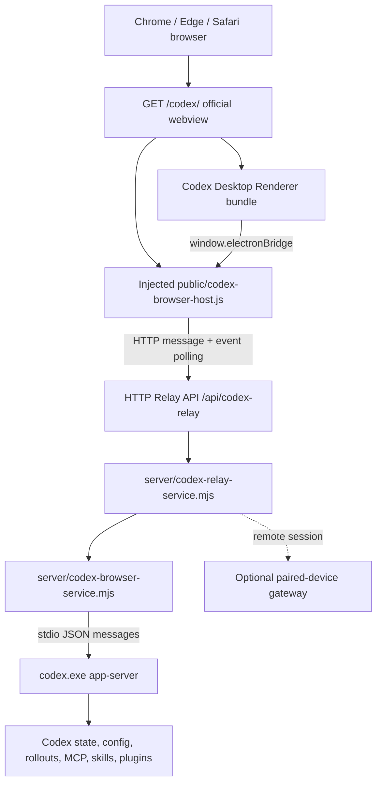

# Codex Web 当前运行时分析

## 结论摘要

当前 `/codex/` 已经不是“仿 Codex UI”，而是直接托管 Codex Desktop 26.803.81509 的官方 `webview` Renderer，并用浏览器脚本模拟其 preload 契约，再把 Renderer 的消息转发给本机 `codex.exe app-server`。浏览器核心路径不启动 Electron main process，也不需要 `electron.exe` 才能显示和执行已验证的 Threads、Models、Skills、MCP、Plugins 流程。

它仍不是长期可维护的纯 Web Runtime，主要原因不是页面还运行在 Electron，而是启动链仍绑定某一版 Desktop 的私有 Renderer 契约：服务端按两个带 hash 的资源名选择文件，并对 minified JavaScript 做精确字符串替换；浏览器桥接还伪装 `codexWindowType = "electron"`。因此当前是有效 PoC，而不是自动适配层。

## 样本与证据范围

本报告只陈述 2026-08-18 在当前工作区实际检查或执行得到的结果。

| 项目 | 实测值 |
| --- | --- |
| Desktop | `26.803.81509`, build `6415` |
| Desktop package identity | `OpenAI.Codex` |
| Electron | `42.3.0` |
| app-server | `codex-cli 0.147.0-alpha.6.6` |
| source ASAR SHA-256 | `55d9fb967596c3cf766b34bc3378d039736eb383c79b89918393df26c646e983` |
| unpacked Renderer | `output/app-unpacked-55d9fb967596/webview` |
| unpacked tree | 5,752 files, 238,506,177 bytes |
| provisioned full runtime | 10,442 files, 1,930,684,409 bytes |
| generated JSON Schema | 361 files, 3,430,078 bytes |
| generated TypeScript | 723 files, 425,148 bytes |

可重复证据：

- `output/codex-web-runtime-probe/0.147.0-alpha.6.6/runtime-report.json`
- `output/codex-web-runtime-probe/0.147.0-alpha.6.6/live-probe.json`
- `output/codex-web-runtime-probe/0.147.0-alpha.6.6/schema-self-diff.json`
- `scripts/probe-codex-web-runtime.mjs`
- `scripts/probe-codex-app-server.mjs`
- `scripts/diff-codex-app-server-schema.mjs`

## 当前架构



当前完整数据流为：

```text
Browser
  -> GET /codex/
  -> official Codex webview assets
  -> browser-host installs Desktop-shaped globals
  -> Renderer calls electronBridge.sendMessageFromView
  -> POST /api/codex-relay/sessions/:id/messages
  -> CodexRelayService
  -> CodexBrowserService.send
  -> newline-delimited app-server messages over stdio
  -> codex.exe app-server
  -> response/request/notification
  -> CodexBrowserService event buffer
  -> GET /api/codex-relay/sessions/:id/events?after=N
  -> window MessageEvent
  -> official Renderer state stores and UI
```

## HTTP 启动与 `/codex/` 提供者

- `server/index.mjs` 创建 `http.createServer(createApp(...))`，同时构建 `codexBrowser`、`codexRelay` 等服务。
- `server/app.mjs:2238` 匹配 `/codex` 与 `/codex/*`；`/codex` 重定向到 `/codex/`。
- `server/app.mjs:7123` 的 `serveCodexWebview` 从配置的 webview root 提供页面与静态资源。
- `index.html` 并非复制到 `public` 后直接静态托管。服务端读取原始 HTML，在第一个 module script 之前注入 `/codex/browser-host.js`，再返回内存中的结果。
- 静态资源仍来自解包后的官方 `webview`；`browser-host.js` 单独来自仓库 `public` 目录。

## 启动流程

1. 浏览器访问 `/codex/`。
2. 服务端读取官方 `webview/index.html`，在 Renderer module 之前注入 browser host。
3. browser host 立即创建 semantic Relay session，获取短期 ticket 并连接 session。
4. browser host 暴露 `window.codexWindowType`、`window.electronBridge` 与 Sentry no-op transport。
5. 官方 Renderer 启动并读取这些 Desktop-shaped globals。
6. Renderer 的 app-server 消息进入 Relay API；Relay service 校验 session、connection token 与 lease。
7. `CodexBrowserService` 首次用到时启动 `codex.exe -c features.code_mode_host=true app-server`；app-server 的 analytics 保持其默认关闭状态，避免嵌入式产品运行面产生不必要的高频反馈日志写入。
8. 后端发送 `initialize`，等待结果后发送 `initialized`。
9. 后续协议请求、响应、server request 和 notification 在 Renderer 与 app-server 之间双向转发。
10. 浏览器每 150 ms 拉取新 host events，每 10 s 续租 Relay lease。

## Renderer 来源与修改方式

Renderer 是 Desktop 包内的官方产物，不是本仓库重写：

- HTML: `output/app-unpacked-55d9fb967596/webview/index.html`
- 主入口包含 `index-DOEihqVv.js`、`app-initial-KpqQCW_k.js` 及官方 CSS/asset graph。
- 当前 tree fingerprint: `428f31a516f6f8be5ac1736e157c7f419dde45435051e85f674dc9a97377cd95`。

对官方资源的当前变化：

| 对象 | 当前处理 | 是否落盘修改 |
| --- | --- | --- |
| `index.html` | module script 前注入 browser host | 否，响应时替换 |
| `app-initial-KpqQCW_k.js` | 替换 Desktop service connect 函数，注入最小 service object | 否，响应时替换 |
| `app-main-CCNMdQcy.js` | 放宽 startup/service 初始化和 null 检查 | 否，响应时替换 |
| preload | 浏览器不加载官方 preload；由 browser host 重建其 global contract | 否 |
| 其他 assets | 原样提供 | 否 |

“不落盘”降低了源文件损坏风险，但不降低精确字符串 patch 的版本脆弱性。

## IPC 与 app-server 链路

### Desktop 原链路

官方 preload 使用 `require("electron")`，通过 `contextBridge.exposeInMainWorld` 暴露 `codexWindowType` 和 `electronBridge`。其实现使用 `ipcRenderer.sendSync/send/invoke/on/removeListener/postMessage` 以及 `webUtils.getPathForFile`。

### 浏览器当前链路

浏览器不会执行 preload，因此没有真实 `ipcRenderer` 或 `contextBridge`。`public/codex-browser-host.js` 构造同名对象；其中关键的 `sendMessageFromView` 变成 authenticated HTTP Relay 调用，事件则通过轮询后派发 `window` message。主题由 `matchMedia` 替代，Sentry/native/worker 部分能力使用 no-op 或静态值。

### app-server 当前链路

`server/codex-browser-service.mjs` 当前使用 stdio 启动 app-server，按行解析 JSON。独立探针还实测了 app-server 自带 WebSocket transport：在 `ws://127.0.0.1:<ephemeral-port>` 上成功完成 initialize，并成功调用：

- `thread/list`
- `model/list`
- `skills/list`
- `mcpServerStatus/list`
- `plugin/list`

因此下一阶段可以把 150 ms HTTP event polling 收敛为单一 WebSocket Host RPC，但这不要求立即替换稳定链路。

## 数据来源

Projects、Threads、历史、Models 不是从网页伪造，也不来自独立的前端业务库：

| UI 数据 | 主要协议来源 | 当前 schema 中存在 |
| --- | --- | --- |
| Projects / workspace grouping | thread `cwd`、thread/project assignment、host shared objects | 部分；Desktop 私有分组仍在 bridge/service 层 |
| Threads / Recents | `thread/list`, `thread/read`, `thread/search` | 是 |
| 历史 turns/items | `thread/read`, `thread/turns/list`, `thread/items/list` | 是 |
| Thread resume | `thread/resume` | 是 |
| Models | `model/list`, `modelProvider/capabilities/read` | 是 |
| Skills | `skills/list` | 是 |
| MCP | `mcpServerStatus/list`, resource/tool/OAuth methods | 是 |
| Plugins | `plugin/list/read/search/install/...` | 是 |
| Terminal | `process/spawn/writeStdin/resizePty/kill` | 是 |
| Files | `fs/readFile/writeFile/readDirectory/watch/...` | 是 |

本版本生成的 envelope 包含 133 个 client requests、11 个 server requests、70 个 server notifications、1 个 client notification。Git 没有独立完整 namespace；当前 schema 只见 `gitDiffToRemote` 相关字段/流程和 thread shell/process 能力，不能据此宣称“Git API 已完整覆盖”。

## Electron 依赖判断

| 项目 | Desktop 原生实现 | `/codex/` 当前需要 |
| --- | --- | --- |
| Electron executable | 是 | 否 |
| Electron main process | 是 | 否 |
| preload execution | 是 | 否 |
| `ipcRenderer` / `contextBridge` | 是 | 否；以 Web shim 模拟契约 |
| NodeIntegration | Renderer 证据未显示为浏览器核心必需 | 否 |
| `window.electronBridge` | 是 | 是，仍是私有契约依赖 |
| `window.codexWindowType` | 是 | 是，当前伪装为 `electron` |
| native file drag / path extraction | Electron 提供 | 当前降级/no-op，完整能力未验证 |
| MessagePort app host / worker | Electron IPC 提供 | 当前降级/no-op，完整能力未验证 |
| local Codex process | main/host 启动 | 仍需要，但由 Node Local Host 启动，不需要 Electron |

所以应区分两件事：运行时已基本移除 Electron executable；Renderer 的 Electron-shaped contract 尚未移除。

## 全部当前 patch 点

Phase 0 已把生产请求路径切换为 `server/codex-runtime-compatibility.mjs` 的动态发现结果：服务启动时扫描资源内容，按启动 anchor 找到唯一的 `app-initial` 与 `app-main` 候选，再用候选绝对路径应用 transform。下面的固定文件名仍保留在 `server/app.mjs` 中，但只作为未注入 compatibility service 的测试/legacy fallback；当前 `server/index.mjs` 生产路径不会依赖它们。

1. HTML module 前注入 `browser-host.js`。
2. 动态扫描 JavaScript 内容，要求唯一匹配 `app-initial` startup anchor。
3. 动态扫描 JavaScript 内容，要求唯一匹配 `app-main` startup anchors。
4. 精确替换 `await V(),await ne(),u(),`。
5. 精确替换 startup `whenReady()` 表达式。
6. 全局替换 `l.startup` 为 `l?.startup`。
7. 当任意 anchor、webview、preload、app-server 或 known-good fingerprint 失败时，`/api/codex-browser/status` 返回 503，`/codex/` 不再返回未适配页面。
8. browser host 仍固定声明 Desktop user agent、window type 和部分 capability；Renderer appInfo 的 version/build 已改为由 runtime package 动态生成。
9. provision 脚本仍固定期望 ASAR SHA-256、输出目录 hash prefix，并包含一条固定本机候选路径；这是下一阶段 discovery 工作的遗留点。
10. browser host 的 app-server event transport 仍为 150 ms HTTP polling，Phase 1 再替换为 typed WebSocket Host RPC。

## 版本敏感点与风险排序

| 风险 | 敏感点 | 更新后的典型失效 |
| --- | --- | --- |
| 极高 | minified 函数与字符串 anchor | 替换命中 0 次但资源仍返回，Renderer 启动失败或卡住 |
| 极高 | 带 hash 的两个固定 asset 文件名 | 新 build 文件名变化，patch 分支完全不执行 |
| 高 | 私有 service object 形状 | Renderer 新增必需 service，访问 `undefined` |
| 高 | `electronBridge` 方法与返回值语义 | UI 可加载，但某个用户流程在运行时失败 |
| 高 | Renderer 与 app-server 私有消息包装 | schema 仍兼容但 Desktop coordination 语义变化 |
| 中 | browser host 固定版本/build/user agent | capability gate 走错分支或观测数据失真 |
| 中 | 轮询传输与 event buffer | 高频 streaming/backpressure 时延迟或丢失 |
| 中 | provision 固定 ASAR/hash/本机路径 | Desktop 自动更新后无法发现或提取新 build |
| 低 | 静态 theme/Sentry/device flags | 非核心界面或诊断能力退化 |

最容易随 Codex 更新失效的地方是 `server/app.mjs:7160-7184`，其次是 browser host 的 bridge 方法形状和 Desktop services stub。schema 变化反而更容易自动识别，因为 app-server 官方命令可以生成结构化 TS/JSON Schema。

## 已验证事实与待验证假设

### 已验证

- 官方 Renderer 可以在当前 Chrome 路径中启动并使用当前桥接。
- 浏览器核心路径不需要 Electron main process。
- app-server 同时支持 stdio、Unix socket 和 WebSocket listen。
- loopback WebSocket 下 initialize 与五类只读 API 实测通过。
- app-server 可以实际生成 TS 和 JSON Schema。
- preload AST 可以在不依赖 minified 变量名的情况下识别 Electron alias、global、bridge 方法与 IPC channel。

### 尚未由单版本样本证明

- 当前 Renderer 能否长期连接未来 app-server。
- Safari 下所有核心和 native-adjacent 流程是否完整工作。
- 完全零 bundle transform 是否能覆盖 Desktop startup 私有 service 初始化。
- 旧 Renderer + 新 app-server 的兼容窗口有多长。
- native file drag、file dialog、clipboard、worker/app-host MessagePort 的完整浏览器等价实现。

这些问题需要保留当前 known-good runtime，同时引入第二个真实版本做交叉兼容矩阵，不能只靠 schema 自比较得出结论。
