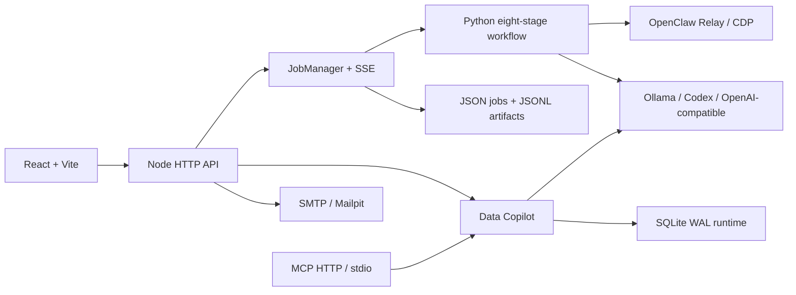

# 主项目架构深挖

## 分层图

## 边界职责

### React/Vite

负责配置、状态展示、任务旅程、日志/产物、草稿编辑、批量投递确认和 Data Copilot 交互。前端通过 API 和 SSE 消费快照，不直接修改服务端状态枚举。

### Node API

负责身份、profile、Relay 探测、AI provider、任务生命周期、并发、取消、恢复、审计、邮件闸门和 MCP/Copilot 组合。server/index.mjs 是组合根，server/app.mjs 是手写 HTTP 路由分发。

### Python workflow

负责浏览器采集、正文补全、OCR、字段抽取、关系扩展、应用分析和报告阶段。与 Node 通过 JSON、状态、checkpoint、事件和产物目录协作。

### 外部边界

Relay/CDP、模型、SMTP 和浏览器都可能断开、超时或返回挑战。系统把它们作为可探测、可暂停、可恢复边界，不把外部成功当成本地事务已经完成。

### 持久化

任务和产物使用用户可见的 JSON、JSONL 和目录结构，方便复制、审阅和恢复。Data Copilot/MCP runtime 需要事务、唯一约束、租约和执行记录，因此使用 SQLite WAL。两套存储通过 owner、revision、snapshot 和 manifest hash 建立关联。

## 组合根

server/index.mjs 初始化：

- auth/profile/AI/Relay/SMTP stores
- JobManager、worker、cleanup 和 graceful shutdown
- Data Copilot service、runtime-v3、tool broker
- MCP access、HTTP listener 和 stdio bridge
- Codex browser/native relay/device gateway/XHS context（部分属于当前工作区扩展）

面试回答要点：组合根的价值是让依赖和生命周期集中，测试时可替换 store/provider；代价是启动文件较大，下一步可按 bounded context 进一步拆分。

## 请求到产物链路

1. 前端提交配置，Node 做 schema 和 preflight。
2. JobManager 创建 job/attempt 目录和初始 revision。
3. Python worker 获得清晰的输入文件、输出目录和 checkpoint 路径。
4. worker 在每个阶段写状态和事件，Node 将事件转为 SSE。
5. 产物通过 manifest 与来源、版本、校验摘要关联。
6. UI 展示 snapshot；恢复时从最后一致的 checkpoint 继续。

## 取舍题

### 为什么 Node + Python

Node 适合本地服务、SSE、生命周期和权限边界；Python 适合 Playwright、OCR、表格/PDF 和数据分析生态。跨语言的风险通过 JSON schema、事件和 checkpoint 契约控制。

### 为什么原生 HTTP

初期目标是少依赖、本地打包和一键启动。原生 http 减少运行时依赖，但 app.mjs 已变大，下一步要拆认证、任务、投递、Copilot、MCP 路由。

### 为什么 JSON + SQLite

用户需要看见和拷贝任务产物，JSON/文件更适合；durable execution 和 grant 需要 WAL、事务与唯一键，SQLite 更适合。代价是双持久化，要靠清晰 ownership 和一致性检查。

### 为什么 MCP 独立 listener

普通 Web API 倾向浏览器会话和 CSRF 语义；MCP 需要 Bearer grant、session、Origin/DNS rebinding 防护和外部客户端限流。独立 listener 可以把认证和生命周期边界讲清楚。

## 架构债务

- app.mjs、job-manager.mjs、App.tsx 仍然偏大。
- Node JSON 与 SQLite 的双写/恢复边界需要更多 contract test。
- 外部 Relay、模型和 SMTP 的完整故障注入仍可加强。
- 部分 Codex runtime 文件还未形成清晰 package boundary。
