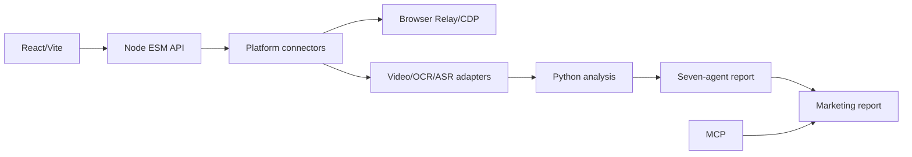

# KOLFORGE / MKT大师：项目卡

## 定位

KOLFORGE 是一个多平台 KOL 发现、内容证据分析和建联工作台。它把候选人发现、账号验证、内容分析、个性化消息和执行报告组织为可恢复的本地流程。

## 证据状态

- [当前已核验] 本地目录 MKT大师；package 名为 reachdesk-kol-workbench，version 0.1.0。
- [当前已核验] React/Vite 前端、Node ESM 服务和 Python 分析脚本。
- [当前已核验] package scripts 覆盖 server test、营销报告、MCP、session forensics 和 portable。
- [仓库文档声称] README 描述默认每平台 15,000 去重候选、最大 20,000、最多 16 条 query route、每 creator 最多 120 条公开内容。
- [待补证] Git 历史、真实运行规模、端口漂移、质量指标、个人贡献和数据合规。

## 六步业务流程

1. 明确品牌、产品、地域、平台和目标人群。
2. 为抖音、小红书、Bilibili 等平台生成发现路线。
3. 通过 Relay/CDP 或合规 HTTP 数据源收集候选。
4. 归一化账号，跨路线去重，补足主页和公开内容证据。
5. 对视频/文本/评论进行多模态分析，生成 creator 画像和合作理由。
6. 生成个性化建联消息、执行报告和可验证产物。

## 技术链路

## 适配器边界

README 描述的多平台视频证据适配器包括 video-batch-download、bilicli、video-copy-analyzer 和可选 302_video_summary。适配器只接收规范化任务和临时文件，不接收浏览器 Cookie 或 Relay session；凭证只在服务端子进程边界内使用。

这个设计适合面试追问：

- 如何统一平台差异？
- 如何处理视频下载失败、字幕缺失和 OCR 噪声？
- 如何保证同一 creator 跨 query route 不重复？
- 如何在并发和平台限流之间取舍？

## 去重与恢复

- 账号层：平台、canonical id、handle、profile URL 和归一化名称。
- 内容层：content id、规范 URL、发布时间和摘要 hash。
- 请求层：query route、cursor、checkpoint 和 attempt。
- 报告层：evidence id、creator id、source artifact 和版本。

受限并发、超时、重试和 checkpoint 防止单个平台失败拖垮全局任务。

## 多模态证据

一条视频证据可能包含：

- 元数据：作者、发布时间、互动数、链接。
- 文案：标题、描述和字幕。
- 音频：ASR 转录及时间戳。
- 画面：OCR、镜头/商品/人物标签。
- 评论：受众用词、争议和购买意图。

归一化后进入七代理分析矩阵，再绑定到报告观点。模型结论必须指向可检查 evidence，避免只输出“适合合作”的空泛判断。

## Session Forensics

目录包含一个会话取证编译器，将 Codex/Agent session 的 JSON/JSONL 解析为工具调用、文件改动、触发逻辑、证据和可复用流程。它适合讲“如何把一次性 agent 操作变成可审计资产”。

## 本地运行

README 记录：

- npm install
- 复制 .env.example 为 .env
- npm run dev:all
- 前端 127.0.0.1:4173
- API/health 文档端口 8787
- npm run build
- npm start

本地环境中还出现 8798，应在面试前跑一次启动命令并统一文档。

## 风险与下一步

- 没有 Git commit/remote，来源和演进难以审计。
- 运行产物、临时数据和源码混在未跟踪目录。
- README 的规模参数需要实际日志支撑。
- 平台规则和登录态处理需要明确合规边界。
- 多代理报告需要黄金数据集和 reviewer agreement。
